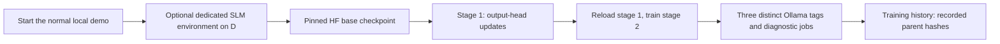
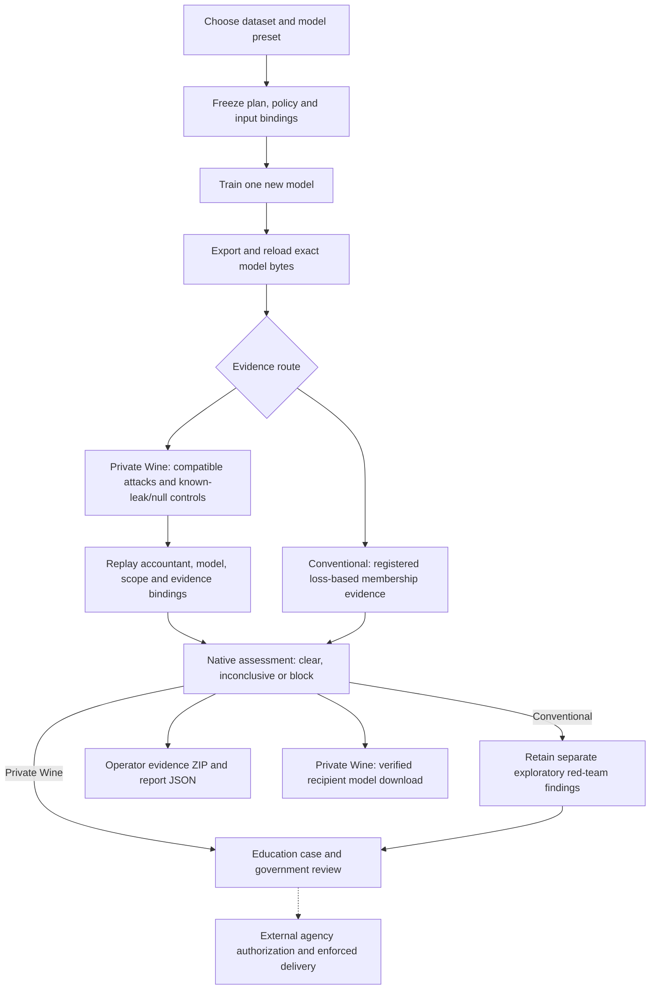

# Model Release Assurance

Model Release Assurance (MRA) helps government teams evaluate a model before
sharing it with another agency, a partner or the public. It brings together
public-data training, red-team checks, evidence review and controlled-delivery
exercises in a sector-neutral framework.

**Status: alpha 0.8.0.** Local workflows and public-fixture production controls
are implemented. An agency deployment still needs approved data and policies,
qualified infrastructure and independent acceptance. Reports and local reviews
do not authorize a release.

Start with the [government audit guide](docs/government-audit-guide.md).
The [production roadmap](docs/production-private-cloud-plan.md) explains the
path to an agency private-cloud service.

## Run the GitHub demo locally

### Windows: download and double-click

[Download Try-Demo.zip](https://github.com/elmontu/AI_ModeL_Check/raw/refs/heads/main/demo/Try-Demo.zip),
extract the ZIP, and double-click `Try-Demo.cmd` on **Windows x64**.
No Git, preinstalled Python or administrator installation is required.

The [plain launcher](https://github.com/elmontu/AI_ModeL_Check/raw/refs/heads/main/Try-Demo.cmd)
is also available. If your browser displays it, use **Save as** and keep the
filename `Try-Demo.cmd`, not `.txt`.

First use needs internet access. The launcher prepares a managed Python runtime,
a fixed repository snapshot and a validated console environment. It also prepares
and verifies local copies of all four required public datasets: **Wine, Digits,
Breast Cancer and Diabetes**, bundled in the scikit-learn package. The console and
separate worker then start; open [the demo](http://127.0.0.1:8765/) if the browser
does not open automatically. Keep the launcher window open; **Ctrl+C** stops both
services. If Windows asks `Terminate batch job (Y/N)?`, confirm with `Y`.
Later launches of the same version validate and reuse the installation; the
public-data examples can run offline after setup. A newer source version uses
a separate console-data folder and preserves previous records in their original
folder.

The default installation is `D:/MRA-Demo/<Windows username>` when D: is available,
otherwise `%LOCALAPPDATA%/MRA-Demo/<Windows username>`. Runtime, prepared data and
new evidence stay under that home. OneDrive locations are refused. See the
[Windows launcher options](docs/local-demo.md#windows-download-and-start) for a
different home or port, setup-only mode and optional existing research inputs.

### Existing checkout or Linux/macOS

With Git and Python 3.11 or newer, clone outside synchronized storage and run one
command from the checkout:

```console
git clone https://github.com/elmontu/AI_ModeL_Check.git
cd AI_ModeL_Check
```

```powershell
# Windows PowerShell, using an existing Python
python scripts/start_demo.py
```

```bash
# Linux/macOS
python3 scripts/start_demo.py
```

This source-checkout route keeps its environment and evidence in
`.local/demo-venv` and `.local/demo-data`. To use the existing optional public
research samples on D:, add `--research-data-root D:/model_audit_data`. The
standalone Windows launcher accepts the same existing sources through
`MRA_DEMO_RESEARCH_DATA_ROOT`; it does not download the large research collection.

**Dataset overview** is the main console view. Its default **Graph** connects
each dataset to every saved training run or attempt
and that run's recorded training assessment. Multiple models stay separate by
job ID; unfinished attempts do not imply a trained model exists. Dataset nodes
have no verdict, and result nodes show the original training assessment rather
than a later case assessment. **Cards** retains the catalog view.
**Training history**, beside Graph and Cards, lists each dataset's retained
training runs and attempts. Choose a **Dataset training history** filter and
select **Refresh history** after new work. Dated entries appear oldest first;
matching timestamps have no known order, and undated entries appear last.
Each fit is independent; retrying creates a new job. **Train next model** opens
the existing wizard without starting training. The Fine-tuned MLP preset records
its own base checkpoint and warm-start derivative within one job.
See [the training history walkthrough](docs/local-demo.md#read-training-history).

Filter these views by **Local research** or **Bundled examples** source. In Graph,
use **Find a dataset or model** to search by dataset, model family or short job ID,
and **Training runs** to filter run state. Use **Zoom graph in** (+),
**Zoom graph out** (−) and **Reset view**. Click a node, or use Tab and Enter, to
open its dataset or run details. A selected run offers **Inspect model run**,
**Red-team results** and, when its saved case exists, **Review model case**.
Starting training from dataset details preselects the dataset.
**Model cases** and **Run history** remain available, including manually created
cases. This read-only graph does not verify current source bytes or authorize a
release; a model verdict does not clear its dataset. The downloadable Windows
launcher includes this graph.

Open **Red-team tools** in the navigation or **Red-team results** for a selected
graph run or dataset card. Select a dataset and recorded training run to see named tools, execution
states, recorded measurements and coverage gaps. **Train and run checks** opens
the training wizard with that dataset selected; compatible checks run
automatically on the new model. **Running guide** opens a separate console tab
with the full setup and operating walkthrough, result meanings and troubleshooting.

With the research root configured, Dataset overview also offers ACS census, BTS
aviation, HMDA lending and NYC TLC mobility for training. Each uses at most
**4,096 rows** from its retained 27,000-row
prepared matrix, with public covariates and utility labels only. Withheld fields
and record keys are excluded. These historical samples are separate from the
larger raw collection and do not become fresh audit evidence. Source validation
failures are retained; no source is downloaded or replaced with bundled data.
See [the D-drive walkthrough](docs/local-demo.md#use-existing-public-research-data-on-d).

### Optional language-model training history

After the normal demo is running, a separate Windows source-checkout route on
D: demonstrates actual continuation of
`Qwen/Qwen2.5-1.5B-Instruct`. It resolves and records an immutable Hugging Face
revision, keeps the backbone frozen, and performs six rank-8 output-head LoRA
updates at each of two stages on a **synthetic agency FAQ**. Stage 2 reloads
stage 1's native checkpoint. This does not reuse or establish equivalence to the
previously installed Ollama GGUF.



Follow [the optional SLM training setup](docs/local-demo.md#optional-real-slm-fine-tuning-history)
or **Running guide → Training history** for the commands. This needs additional
large downloads, native checkpoints, serving copies and a dedicated optional
venv; plan roughly **30 GB RAM and 50 GB free D: storage** for this CPU route,
with more disk needed as chains are retained. The normal one-command launcher
does not install them. All model caches
and retained training outputs use the checkout's D-drive `.local` directory.
The three serving tags receive separate nine-probe/two-control synthetic
checks. Recorded lineage, losses and generations demonstrate execution and
continuation; they do not establish quality, safety, privacy or release
clearance.

### Model pipeline

After the launcher starts, the selected preset determines its evidence route:

Open the [private Wine pipeline view](http://127.0.0.1:8765/#pipeline-flow)
in the running local demo to inspect a saved run at each stage. Its
[pipeline guide](http://127.0.0.1:8765/guide#guide-pipeline-flow) stays open
beside the console.



The conventional presets retain their registered attack-floor assessment and
separate exploratory measurements. They do not acquire a DP guarantee from
successful checks. The private Wine recipe verifies its geometric-DP accountant
before native assessment; its clear result covers **one model-only package and
add/remove-record membership**, with the recorded local policy waiver. Existing
models and their policies keep their original results.

For private Wine, the recipient artifact is **`recipient-package.json`**. The
operator evidence ZIP contains source, utility and audit diagnostics **outside
that assessed recipient interface**; it is not a substitute recipient package.
The verified model download rechecks retained evidence. Government review is
separate, and agency authorization and enforced delivery are external steps;
the console performs neither automatically. See the
[detailed pipeline](docs/local-demo.md#model-pipeline-and-evidence-boundaries) and
[private recipe and replay](docs/private-model-clearance.md).

Start with **Wine classification** and **Logistic regression** for a small CPU
example. The demo records findings and gaps; it does not grant model clearance
or release approval. Use the bundled or configured public research data only. The
[step-by-step demo guide](docs/local-demo.md) explains the walkthrough and launcher
options. Public-use licensing remains pending; see
[support and licensing](#support-and-licensing) before reuse or redistribution.

### Train a real model with clearance evidence

Under **More guided workflows**, select **Open private-training wizard** in
**Train with clearance evidence**. It selects Wine and the **Private categorical
model** preset. Review the scope, then select **Start training**.

The fixed geometric-noise mechanism trains a real model. Its accountant and
exported parameters are replayed before the native assessment accepts a
membership ceiling. The target FPR stays **0.10** and tolerance **0.20**. A clear
result applies to the exact model-only recipient package, one training release
and add/remove-record membership. Utility, other threats, earlier model releases
and agency authorization remain separate.

Use **Download verified recipient model** for the assessed JSON package; the
endpoint rechecks its evidence. The evidence ZIP is an operator audit bundle,
which is outside the assessed recipient interface. The prospective local policy
records an explicit institutional attack-battery waiver and does not claim
agency qualification. See the [recipe and replay guide](docs/private-model-clearance.md).

## Quick start

For manual setup instead of the one-command launcher above, use the following
commands.

Use **Python 3.11 or newer**, and run these commands from a source checkout.
The installer creates a new environment with the console, training tools and
local API dependencies.

**Windows PowerShell**

```powershell
python scripts/setup_pipeline.py --profile console
& .\.venv-pipeline\Scripts\python.exe -m model_release_assurance.console local --data .local/console-data --port 8765
```

**Linux/macOS**

```bash
python3 scripts/setup_pipeline.py --profile console
./.venv-pipeline/bin/python -m model_release_assurance.console local --data .local/console-data --port 8765
```

Open [the local console](http://127.0.0.1:8765/). The launcher starts the API and
a separate worker; Ctrl+C stops both. The local services are intended for
trusted testers.

Setup requires package access or a prepared wheel directory supplied with
`--wheelhouse PATH`. The bundled training examples then run offline. Setup
refuses to overwrite an existing environment: reuse its Python executable or
choose a new location with `--venv PATH`.

### First review

1. In **Dataset overview**, open **Wine classification** and start training
   from its details. The wizard preselects the dataset; choose **Logistic
   regression**, then **Next** and **Start training**.
2. Open **Red-team tools**, select Wine and the completed training run, then
   inspect tool cards, recorded measurements and coverage gaps. The run details
   also retain **Red-team coverage** and the separate scientific result.
3. In the run details, select **Open trained model case**, then **Check inputs**
   to inspect preflight.
   Open **Government audit review** and record evidence, rationale and gaps
   against its twelve controls.
4. Use **Download evidence ZIP**, **Download result JSON** and **Download review
   JSON** to retain the separate run evidence and review. Changing a binding or
   cited file makes affected review entries stale.

Education mode supports trusted local exercises with optional institutional
documents. Scientific and evidence-integrity checks still apply. See the
[console guide](docs/local-console.md) and
[pipeline quickstart](docs/pipeline-quickstart.md) for the full workflow.

## What is implemented

| Workflow | Current capability | Scope |
| --- | --- | --- |
| Training and case review | Eleven CPU training presets, including one model-only private-training recipe, four bundled datasets, four optional existing public research profiles, lineage records, adversarial jobs and a twelve-control review | Supported model/data pairs; local operator review; historical research samples are not fresh audits |
| Assessment | Versioned contracts, scoped evidence, optimization, signed records and lifecycle replay | Non-authorizing recommendations |
| Export screening | Reloaded public model packages, a frozen membership screen, positive/null controls and reviewer receipts | Declared attacks and exact candidate bytes |
| Synthetic export lab | Public synthetic training, accounting exercises, atomic commitment and exact-byte delivery | Fixed fixtures |
| Temporal release workflow | Required screening, policy review, atomic charge/receipt commitment and current delivery checks | Separately verified study and initialized operator registry |
| Production engineering | Local identity, storage, trust, jobs, evidence, registration, review, delivery, monitoring, recovery and pilot-planning controls | Public fixtures; agency deployment qualification pending |

Review contexts include original models, fine-tuning, adapters, merges,
ensembles and distillation. A registered case type does not imply a trainer,
attack adapter or privacy guarantee for every model family. Console models are
not automatically admitted to a temporal or production registry.

### Red-team coverage

| Area | Available now | Limit |
| --- | --- | --- |
| Tabular classification | Eleven integrated tools, visible per recorded run in the console's Red-team tools workspace | Supported tools run after training; unsupported tools and coverage gaps remain visible |
| Regression | Three integrated membership, extraction and robustness screens in the same workspace | Scoped diagnostic evidence |
| Local language models | Nine synthetic probes and two controls through an installed Ollama model; launch from Red-team tools | Optional model setup is separate; no real tool execution or general training-record extraction claim |
| Public export pilot | One loss-based membership screen on an offline GaussianNB package | One public fixture |
| SACRO-ML | Separate pinned 2.0.1 adapter for seven public classifier profiles | Separate runtime; Diabetes regression unsupported; not a console integration |
| ART | Separate pinned 1.20.1 retained-loss membership comparison across eight public profiles | Includes continuous regression; trusted loss oracle; no live target-query or console integration |
| garak | Separate pinned 0.17.0 prompt-injection component on one local Ollama model | Four templates, three synthetic wrappers; literal scoring; no live retrieval, tools or console integration |
| PyRIT | Separate pinned 1.1.0 scripted and bounded adaptive multi-turn components | Two public synthetic objectives, three-turn limit and literal scorer; adaptive roles share one local model; human review and live RAG/tools remain pending |

The console displays recorded tool evidence; it does not rerun individual tools
or launch the separate adapters, public export screen or multi-shadow experiments.
Starting **Train and run checks** creates a new training run. A completed tool is
an execution result, not a safety verdict. Discovery lists available and
unsupported tools; it does not establish that every dependency is installed.
See [tool coverage](docs/framework-capability-gaps.md),
[export screening](docs/red-team-export-review.md),
[scoped SACRO-ML](docs/production-prd14-sacro-adapter.md),
[ART retained-loss comparison](docs/production-prd25-art-adapter.md) and
[scoped garak](docs/production-prd26-garak-adapter.md) and
[PyRIT multi-turn orchestration](docs/production-prd26-pyrit-adapter.md) and
[bounded adaptive attacker](docs/production-prd26-pyrit-adaptive-adapter.md).

For an optional small pretrained language model, install
[Ollama for Windows](https://ollama.com/download/windows) separately. The selected
[Qwen2.5:1.5b model](https://ollama.com/library/qwen2.5:1.5b) is about **986 MB**.
From a source checkout on D:, prepare it with:

```powershell
powershell -ExecutionPolicy Bypass -File scripts/start_slm.ps1 -SetupOnly
```

The helper uses `.local/slm-models` on D: by default. Omit `-SetupOnly` to open
local CLI chat; `ollama run qwen2.5:1.5b` also opens chat once that server is running.
It leaves its local server available for console tests. Quit an existing Ollama
server yourself if the helper refuses its listener; it does not kill unknown services.
Standalone users can [save the helper](https://github.com/elmontu/AI_ModeL_Check/raw/refs/heads/main/scripts/start_slm.ps1)
in `D:/MRA-Demo/<Windows username>/scripts/` and pass
`-ModelRoot "D:/MRA-Demo/<Windows username>/slm-models"`.
**Try-Demo.zip does not include Ollama or download the SLM.** See the
[optional SLM steps](docs/local-demo.md#optional-small-local-language-model).

In **Red-team tools**, select **Test an installed language model**, choose
`qwen2.5:1.5b` under **Installed Ollama model**, then **Run local tests**. These
synthetic inference diagnostics do not retrain the model, create a dataset graph
branch or establish native clearance or agency approval. Inspect both controls,
failed probes and observed violations in **Run history**.

Run the public export-screening example from the console environment:

```powershell
& .\.venv-pipeline\Scripts\python.exe -m model_release_assurance.export_red_team demo --output .local/red-team-pilot-v1
```

On Linux/macOS use `./.venv-pipeline/bin/python`. Choose a new output directory;
existing results are never overwritten. Failed attacks do not establish an
upper bound on privacy risk, and successful controls do not clear a model.

## Export and delivery exercises

Start the [synthetic export lab](docs/model-export-poc.md) in a second terminal:

```powershell
& .\.venv-pipeline\Scripts\python.exe -m model_release_assurance.export_poc serve --data .local/model-export-poc --port 8767
```

Open [the synthetic exercise](http://127.0.0.1:8767/synthetic). It compares
identical-model reuse, retained-state extension, independent randomized response
and a central-DP count baseline.

The root page hosts the separate
[enforced release workflow](docs/enforced-release-workflow.md). Temporal views
require an existing verified study and initialized operator registry:

```powershell
& .\.venv-pipeline\Scripts\python.exe -m model_release_assurance.export_poc serve --data .local/model-export-poc --repository "PATH_TO_RETAINED_RESEARCH_WORKSPACE" --temporal-run "PATH_TO_VERIFIED_RUN" --temporal-operator "PATH_TO_INITIALIZED_OPERATOR" --port 8767
```

Replace the placeholders with existing directories. The supplied research
workspace must contain the retained ACS temporal verification receipts; those
full study/model stores are not bundled in this government repository.
Missing inputs leave temporal views unavailable. The launcher does not create
a registry or restore privacy budget. See the
[temporal service guide](docs/temporal-release-assurance.md).

For command-line contract validation and assessment, use the installed
`mra` command. The [example catalog](examples/README.md) and
[implementation guide](docs/implementation-and-motivation-guide.md) explain
the required inputs, assessment commands and interpretation.

## Production roadmap

The target is an **agency private-cloud service** for government model assurance
over large private datasets. Provider and region remain open. The framework
supports broader government sectors; a major public-health agency is one
possible pilot.

PRD-01 through PRD-26 have reviewable local work. Each retains its own acceptance
gates and remains in progress for production qualification.

| Workstream | Local progress | Detailed records |
| --- | --- | --- |
| Scope and platform | Scope, threat model, source/build baseline, required CI and infrastructure blueprint | [PRD-01](docs/production-prd01-scope-and-ownership.md), [PRD-02](docs/production-prd02-threat-model.md), [PRD-03](docs/production-prd03-source-build-baseline.md), [PRD-04](docs/production-prd04-required-ci.md), [PRD-05](docs/production-prd05-infrastructure-scaffold.md) |
| Identity and operations | Scoped credentials, governed object references, key trust, build controls and durable jobs | [PRD-06](docs/production-prd06-identity-and-approvals.md), [PRD-07](docs/production-prd07-governed-storage.md), [PRD-08](docs/production-prd08-key-trust.md), [PRD-09](docs/production-prd09-build-controls.md), [PRD-10](docs/production-prd10-durable-jobs.md) |
| Models and evidence | Broader public benchmarks, authenticated replay, prospective registration and the separate SACRO-ML adapter | [PRD-11](docs/production-prd11-adapter-benchmarks.md), [PRD-12](docs/production-prd12-authenticated-evidence.md), [PRD-13](docs/production-prd13-model-registration.md), [PRD-14](docs/production-prd14-sacro-adapter.md) |
| Review and delivery | Fictional ledger charges, witness/recovery records, policy review and controlled public-fixture delivery | [PRD-15](docs/production-prd15-registry-transactions.md), [PRD-16](docs/production-prd16-witness-recovery.md), [PRD-17](docs/production-prd17-policy-review.md), [PRD-18](docs/production-prd18-controlled-delivery.md) |
| Assessment and pilot planning | End-to-end public profile, monitoring, capacity/recovery exercises, assessment packets and scoped pilot plans | [PRD-19](docs/production-prd19-end-to-end-profile.md), [PRD-20](docs/production-prd20-monitoring-incidents.md), [PRD-21](docs/production-prd21-capacity-recovery.md), [PRD-22](docs/production-prd22-independent-assessment.md), [PRD-23](docs/production-prd23-restricted-pilot.md) |

Public benchmarks include bundled datasets and prepared ACS, aviation, lending
and taxi samples. Catalog registration does not mean every dataset is available
or tested. Private agency data is not admitted by these rehearsals.

**Current: [PRD-26, bounded adaptive PyRIT attacker](docs/production-prd26-pyrit-adaptive-adapter.md).**
The separate adaptive component supports model-generated follow-ups using target
feedback through the real upstream attack loop. Attacker and target have distinct roles
and conversations while sharing one local model artifact. Frozen inputs,
three-turn limits, positive/null controls and independent replay are mandatory.
The earlier [scripted PyRIT](docs/production-prd26-pyrit-adapter.md) and
[garak](docs/production-prd26-garak-adapter.md) components retain their own scope
and evidence. Both live adaptive objectives stopped on the first target turn;
later-turn feedback was exercised in controlled upstream fixtures. These local
adapters grant no agency acceptance or release authority.

Remaining PRD-26 acceptance includes independently qualified adaptive attackers,
semantic/human review, approved agency endpoints, live interfaces and verified
worker isolation.

Production acceptance still requires agency appointments and release criteria,
real identity/key services, isolated workers and networks, independent custody,
private-cohort and scientific validation, a justified privacy accountant,
agency-scale recovery tests and operational ownership. Hosted CI, protected
release settings and licensing/ownership also remain pending.

No deployment obligation is waived. Use the
[industrial acceptance requirements](docs/system-audit-specification.md#industrial-track)
and the [full roadmap](docs/production-private-cloud-plan.md) to assess readiness.

## How to interpret results

Findings apply to the recorded candidate, population, interface, policy and
evidence. The signed decision record can recommend `RELEASE`,
`RELEASE-WITH-RISK`, `BLOCK` or `INCONCLUSIVE`; its gate always sets
`authorization_eligible=false`. See the
[decision and gate guide](docs/gap-remediation.md#four-verdict-record-and-gate).

A signature binds bytes to a key; it does not establish truthful collection or
independent agency custody. An attack measures its declared access and sample;
it does not prove whole-record privacy. Revoking service does not erase prior
disclosure. The Lean proofs cover a scoped abstract protocol; the Python and
Ed25519 implementation are outside that proof boundary.

## Verification and development

Use the console environment and install the hash-pinned build-verifier
dependency before running the required government profile:

```powershell
& .\.venv-pipeline\Scripts\python.exe -m pip install --require-hashes --only-binary=:all: --no-deps -r deploy/build/verification-runtime.requirements.txt
& .\.venv-pipeline\Scripts\python.exe -B scripts/run_required_tests.py --profile government --output .local/verification/government-v1
& .\.venv-pipeline\Scripts\python.exe -B scripts/generate_schema_manifest.py --check
& .\.venv-pipeline\Scripts\python.exe -B scripts/check_markdown_links.py
```

On Linux/macOS substitute `./.venv-pipeline/bin/python`. Use a new output path
for each required-profile run. The runner rejects missing suites, test failures
and skips, and retains a log, source hashes and a JSON receipt.

For the broader maintainer checks, activate the console environment and use
`make PYTHON=python check` or `make PYTHON=python verify` with Make available.
`verify` also requires the pinned Lean toolchain.
See [required CI](docs/production-prd04-required-ci.md),
[build controls](docs/production-prd09-build-controls.md) and
[test coverage](tests/README.md) for the full prerequisites.

The adaptive PyRIT milestone passed **2,466 required tests across 134 modules
with zero failures, errors or skips**, and all 518 recorded source hashes match.
Its 121 new tests, 37-schema check and 76-file Markdown link check passed. Source
and installed-wheel rehearsals each completed six campaigns with two real
attacker generations and two target responses, both stopping on their first
target turn under literal scoring. Five controlled upstream fixtures exercised
later-turn feedback and incomplete attacker failures with zero provider calls.
See [the adaptive record](docs/production-prd26-pyrit-adaptive-adapter.md) for
shared-model limits, retained diagnostics and pending human/agency acceptance.

The scripted PyRIT milestone passed **2,345 required tests across 127 modules with zero
failures, errors or skips**, with all 502 recorded source hashes still matching.
Checks verified 37 schemas and links in 75 Markdown files. Source and
installed-wheel PyRIT runs each completed six upstream campaigns, four real-model
turns and all controls and independent conversation/score replay. Each retained
two literal public-marker emissions; human/semantic review remains pending.
Actual upstream transport and truncation fixtures retained incomplete evidence
and undetermined scores. The [PyRIT record](docs/production-prd26-pyrit-adapter.md)
documents the partial runtime, D: storage hook and remaining agency acceptance.
Earlier [garak](docs/production-prd26-garak-adapter.md) and
[ART](docs/production-prd25-art-adapter.md) validation remain source-bound.
Hosted CI remains outside this phase at the user's request; the
[publication checkpoint](docs/government-academic-separation-plan-2026-10-01.md#government-publication-checkpoint)
retains earlier publication evidence.

## Documentation and research

| Need | Reference |
| --- | --- |
| GitHub demo on your computer | [Local public-data walkthrough](docs/local-demo.md) |
| Government review walkthrough | [Government audit guide](docs/government-audit-guide.md) |
| Lifecycle contracts and enforcement | [Release protocol](docs/model-release-assurance-protocol.md), [system audit specification](docs/system-audit-specification.md) |
| Supported model families and tools | [Model-family coverage](docs/model-family-coverage.md), [red-team tools](docs/sacro-ml-red-team.md), [MCP/RAG](docs/rag-mcp.md) |
| Current data contracts | [37-schema registry](schemas/README.md) |
| Mathematical and proof assumptions | [Mathematical foundations](docs/mathematical-foundations.md), [formal verification scope](docs/formal-verification.md) |
| Historical observations and executable tools | [Reproduction index](reproduction/README.md), [script catalog](scripts/README.md) |
| Contributions and releases | [Contribution guide](CONTRIBUTING.md), [release process](docs/releasing.md), [change history](CHANGELOG.md) |

The [1 October technical advisory](docs/advisory/technical-report-2026-10-01.md)
and [displayed-table digest](docs/advisory/displayed-tables-2026-10-01.md)
retain source-linked research observations, including adverse and incomplete
results. The dated 28 September archive was
[retired from this checkout](docs/government-academic-separation-plan-2026-10-01.md#retired-28-september-archive)
at the user's request and remains recoverable in Git history.

The [separate academic repository](https://github.com/elmontu/AI_Model_Academic)
has a curated local checkout at commit
`826b5e5fbda2cd50e6bb856a90be1b18619afc11`; its public GitHub publication is pending
in the project plan. Full raw study archives remain local. Research observations
and dated receipts retain their original source/runtime bindings.
The [fine-grained execution plan](docs/government-academic-separation-plan-2026-10-01.md)
tracks publication, evidence gaps and remaining work.

## Support and licensing

Use [SECURITY.md](SECURITY.md) for vulnerability reporting. Keep confidential
data, model artifacts and signing keys out of public issues and submissions.

No public-use licence has been selected. Repository visibility does not grant
permission to use, modify or redistribute the software. Python modules are not
stable public APIs unless explicitly documented.
