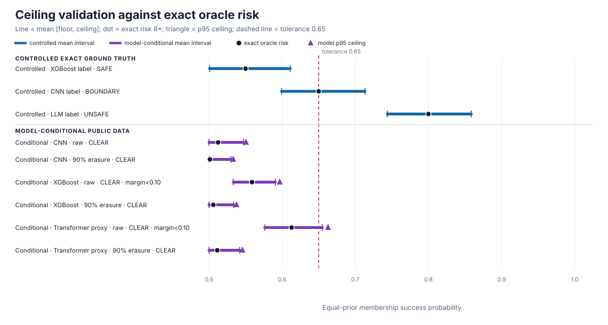

# Ceiling experiment results

The controlled study and the prospectively registered v3 model-backed study passed their scoped acceptance criteria. These experiments are not a universal proof and grant no release authorization.

## Claim boundary

| Evidence level | Result | Valid scope |
| --- | --- | --- |
| Mathematical or universal proof | Not established | Requires a separate formal-assumption and proof audit |
| Controlled exact-ground-truth evidence | Accepted | Complete preregistered synthetic finite-channel family |
| V3 role-aware model-conditional evidence | All registered criteria passed | Frozen artifacts, target pools, and source-bound one-query wrappers |

## Headline metrics

| Experiment | Soundness | Role-aware decision behavior | Execution |
| --- | --- | --- | --- |
| Controlled exact-ground-truth | 0/1200 observed undercoverage; simultaneous upper 1.56% | 400/400 correct decisions for each safe/boundary/unsafe role | 1200 analyzer + 3 Engine replays |
| V3 model-conditional public data | 0/1200 observed undercoverage; 6/6 families met the simultaneous upper target | 0/1200 wrong-direction decisions; 6/6 met its upper target; 4/4 margin-eligible families resolved; minimum eligible lower 97.10% | 1200 analyzer + 6 Engine replays; 18 simultaneous meta endpoints |

> Engine replays are integration evidence under experimental attack-battery waivers. The waivers are not deployment-valid.

## Controlled exact-ground-truth primary cells

| Scenario | Role | R* | Mean [L, U] | Width | Coverage | Correct decision lower |
| --- | --- | ---: | ---: | ---: | ---: | ---: |
| XGBoost label | SAFE | 0.5500 | [0.5008, 0.6110] | 0.1102 | 100.00% | 98.44% |
| CNN label | BOUNDARY | 0.6500 | [0.5992, 0.7133] | 0.1141 | 100.00% | 98.44% |
| LLM label | UNSAFE | 0.8000 | [0.7438, 0.8584] | 0.1146 | 100.00% | 98.44% |

## V3 role-aware model-conditional cells

Resolution is preregistered only for families with `|R* - 0.65| >= 0.10`. HOLD is conservative and is never counted as a wrong-direction decision.

All 6 v3 oracle risks were below the 0.65 tolerance; v3 therefore tests safe-side resolution and conservative HOLD, not model-backed BLOCK power. Unsafe-side BLOCK behavior is demonstrated only by the controlled R*=0.80 channel.

| Model / wrapper | R* | Margin / role | One-shot [L, U] | Decisions C/H/B | Undercoverage upper | Wrong-direction upper | Correct-direction lower | Registered targets |
| --- | ---: | --- | ---: | ---: | ---: | ---: | ---: | --- |
| CNN / MNIST — raw categorical NLL bins | 0.5125 | 0.1375 / CLEAR | [0.4859, 0.5456] | 200/0/0 | 2.90% | 2.90% | 97.10% | coverage PASS; direction PASS; resolution PASS |
| CNN / MNIST — 90% state-independent erasure | 0.5012 | 0.1487 / CLEAR | [0.4821, 0.5288] | 200/0/0 | 2.90% | 2.90% | 97.10% | coverage PASS; direction PASS; resolution PASS |
| XGBoost / Adult — raw categorical NLL bins | 0.5587 | 0.0912 / CLEAR | [0.5311, 0.5896] | 200/0/0 | 2.90% | 2.90% | 97.10% | coverage PASS; direction PASS; resolution N/A (margin < 0.10) |
| XGBoost / Adult — 90% state-independent erasure | 0.5059 | 0.1441 / CLEAR | [0.4906, 0.5367] | 200/0/0 | 2.90% | 2.90% | 97.10% | coverage PASS; direction PASS; resolution PASS |
| Compact Transformer / 20 Newsgroups (LLM proxy) — raw categorical NLL bins | 0.6129 | 0.0371 / CLEAR | [0.5784, 0.6581] | 31/169/0 | 2.90% | 2.90% | 9.18% | coverage PASS; direction PASS; resolution N/A (margin < 0.10) |
| Compact Transformer / 20 Newsgroups (LLM proxy) — 90% state-independent erasure | 0.5113 | 0.1387 / CLEAR | [0.4915, 0.5432] | 200/0/0 | 2.90% | 2.90% | 97.10% | coverage PASS; direction PASS; resolution PASS |

### Repeated-sample tightness

A ceiling of 1 would cover every risk but be useless. These values report how far the repeated upper bound remained above exact risk and how wide the interval remained.

| Model / wrapper | Mean U | Mean width U-L | Mean excess U-R* | P95 excess U-R* |
| --- | ---: | ---: | ---: | ---: |
| CNN / MNIST — raw categorical NLL bins | 0.5472 | 0.0607 | 0.0347 | 0.0382 |
| CNN / MNIST — 90% state-independent erasure | 0.5300 | 0.0457 | 0.0287 | 0.0318 |
| XGBoost / Adult — raw categorical NLL bins | 0.5908 | 0.0576 | 0.0320 | 0.0380 |
| XGBoost / Adult — 90% state-independent erasure | 0.5338 | 0.0463 | 0.0279 | 0.0317 |
| Compact Transformer / 20 Newsgroups (LLM proxy) — raw categorical NLL bins | 0.6550 | 0.0788 | 0.0422 | 0.0499 |
| Compact Transformer / 20 Newsgroups (LLM proxy) — 90% state-independent erasure | 0.5419 | 0.0517 | 0.0306 | 0.0345 |

## Exact erasure identity

The 90% state-independent erasure variant must satisfy `R_erased = 0.5 + 0.1 × (R_raw - 0.5)` exactly.

| Model | Raw R* | Erased R* | Exact identity |
| --- | ---: | ---: | --- |
| CNN / MNIST | 0.5125 | 0.5012 | PASS |
| XGBoost / Adult | 0.5587 | 0.5059 | PASS |
| Compact Transformer / 20 Newsgroups (LLM proxy) | 0.6129 | 0.5113 | PASS |

## Historical v2 predecessor — acceptance failed

V2 remains a separate failed result (`all_six_simultaneous_clear_rate_lowers_meet_minimum`). It is not relabelled as v3 evidence and no v2 outcome is reused by v3.

| Model / wrapper | V2 repeat CLEAR | V2 simultaneous CLEAR lower | V2 target |
| --- | ---: | ---: | --- |
| CNN / MNIST — raw categorical NLL bins | 200/200 | 97.30% | PASS |
| CNN / MNIST — 90% state-independent erasure | 200/200 | 97.30% | PASS |
| XGBoost / Adult — raw categorical NLL bins | 200/200 | 97.30% | PASS |
| XGBoost / Adult — 90% state-independent erasure | 200/200 | 97.30% | PASS |
| Compact Transformer / 20 Newsgroups (LLM proxy) — raw categorical NLL bins | 109/200 | 44.94% | FAIL |
| Compact Transformer / 20 Newsgroups (LLM proxy) — 90% state-independent erasure | 200/200 | 97.30% | PASS |

## How the metrics map to MRA

- Soundness failure is undercoverage: `U < R*`.
- Wrong direction is BLOCK below tolerance or CLEAR above tolerance; HOLD is conservative.
- Correct-direction resolution is evaluated only at the preregistered absolute margin of at least 0.10.
- Width `U - L` and excess `U - R*` measure tightness; neither replaces coverage.
- Results remain conditional on frozen finite populations and source-bound wrappers. The compact Transformer is an LLM proxy, not a generative endpoint.

No raw scores, count rows, seeds, model artifacts, local paths, or software-environment details are included.
