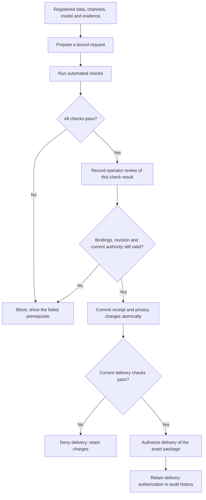

# Enforced release workflow

The local website uses a server-enforced release state machine. An enabled
button is a convenience; the API and SQLite transaction decide whether an
operation is allowed. The historical experiment remains a separate replay.

This workflow starts from a trusted, initialized model registry containing
model packages, training-data rosters, randomization-channel commitments,
evidence and a fixed privacy scope. The government implementation includes
the broker, workflow and tests, but no populated registry, ACS study artifacts
or revised manuscript. The website does not ingest new citizen records or run
a new training pipeline. For a runnable fresh-checkout exercise, start with
the [public synthetic export lab](model-export-poc.md).

## Choose the existing data locations

The launcher now accepts explicit research and operator directories. With the
[console dependencies installed](pipeline-quickstart.md), use the environment's
Python from the repository root:

```console
python -m model_release_assurance.export_poc serve --data .local/model-export-poc --repository PATH_TO_RETAINED_RESEARCH_WORKSPACE --temporal-run PATH_TO_VERIFIED_RUN --temporal-operator PATH_TO_INITIALIZED_OPERATOR --port 8767
```

Replace the three `PATH_TO_...` values with existing directories and quote paths
containing spaces. The research workspace must contain the retained ACS temporal
verification receipts; neither public repository includes that full workspace.
Open `http://127.0.0.1:8767/` for the governed release workflow.
The options have separate purposes:

| Option | Existing content selected |
| --- | --- |
| `--repository` | Existing research workspace containing the retained temporal reports and verification receipts |
| `--temporal-run` | Verified research run with `registration.json`, `results.json` and `completion.json` |
| `--temporal-operator` | Initialized operator inventory `workflow.json` and its `assurance.sqlite3` ledger |
| `--data` | Separate synthetic two-model history used at `/synthetic`; never the temporal ledger |

Missing explicit directories or required run/operator files stop startup before
a store is opened. This checks file presence only: the service still verifies bindings and
current authority before displaying usable evidence or permitting a release.
Selecting a directory does not attest its privacy mechanism, migrate a ledger,
train models or grant new budget. Existing receipts and inventories bind their
original paths; copying them to another path and changing the launcher options
does not repair those bindings. Use a valid existing registration or the
[optional verified-artifact import procedure](temporal-release-assurance.md#42-import-once-without-releasing-a-model)
for a genuinely new, separate research exercise. That procedure requires the
separately retained ACS importer, source artifacts and matching research runtime;
they are not included in this government publication.

Omitting these options checks the local optional paths
`.local/temporal-assurance/run-v1` and
`.local/temporal-assurance/operator-workflow-v1`. Historical workstation
locations must be selected explicitly. If those data are absent, the launcher prints the missing
location and the option needed to select existing data. The corresponding
dashboard area remains unavailable. The service never silently initializes a
temporal study or operator ledger. A fresh checkout can still use the public
synthetic exercise at `/synthetic` and the training console on port 8765; neither
creates or supplies an ACS temporal registry.

## Required sequence



| Stage | Required evidence or action | What it permits |
| --- | --- | --- |
| Registered provenance | Training roster, protected attribute version, registered training and scoring channels, fixed scope and exact package | Preparing an in-scope proposal |
| Prepared | Request ID bound to model, authority, artifact, evidence, affected units and current ledger revision | Running checks; no download |
| Checked | Current provenance, integrity, expiry, authority, charge plan and budget checks, persisted against the request | Reviewing that specific result |
| Reviewed | Explicit local operator acknowledgment and a recorded rationale bound to the check digest | Attempting commitment |
| Committed | Review and current prerequisites rechecked within the same transaction as receipt and charges | Requesting controlled delivery |
| Delivery authorized | Committed package, review, current authority, evidence and revocation checks pass | Returning the exact committed bytes |

There is no browser-supplied `passed` flag, authority override, budget reset or
path that substitutes a different model file. The server derives checks from
its registry. Calling the commit or download endpoint directly does not remove
the required stages.

## Service interface

All paths below share the `/api/temporal` prefix. Mutation requests require
same-origin JSON and the service remains bound to the local machine.

| Endpoint | Action |
| --- | --- |
| `GET /operator` | Read current registered provenance, stage results, permitted actions and audit events |
| `POST /prepare` | Bind `request_id`, `model_id` and `expected_revision` |
| `POST /checks` | Run and persist the server's checks for `request_id` |
| `POST /review` | Supply `request_id`, the returned `check_digest`, a rationale and `accept_scope: true` |
| `POST /commit` | Attempt atomic commitment for `request_id`; all prerequisites remain mandatory |
| `GET /downloads/{request_id}` | Reauthorize and return the exact committed package |
| `POST /revoke` | Stop future delivery for `request_id`; preserve its recorded spending |

The browser is one client of this interface. Automated clients must follow
the same ordering. The review endpoint records the trusted local operator's
decision; it cannot invent an independent approving authority.

## What invalidates a decision

Before commitment, another release can change the ledger revision. The old
proposal must then be replaced by a new request and reviewed against the new
accounting state. A check digest from another request or a superseded result
cannot authorize it. Changes to bound package, provenance or evidence also
invalidate the result.

Authority, evidence expiry, invalidation and revocation are checked again at
commitment and delivery. Passing yesterday's check is not continuing authority
to download today. Revocation never erases earlier copies or refunds committed
privacy expenditure. A later unrelated commitment does not itself invalidate
an already committed package's delivery authorization.

The privacy gate compares cumulative per-unit expenditure with the configured
cap. It is not a comparison between attack accuracy and epsilon. The current
mechanism contract protects one fixed-roster disability attribute; it does not
establish membership or whole-record privacy, acceptable absolute inference
risk, utility, or legal permissibility.

## Persistence and atomicity

Pipeline records live in additional tables in the existing operator SQLite
database. They are created on an explicit workflow mutation, not by opening
the page. The original registry and cumulative privacy ledger remain in place.
The gate and core operation share a database transaction, preventing a request
from slipping between a check and a concurrent commitment.

Review records and the audit trail survive process restarts. Repeated successful
commit requests retain the original receipt and charges. Delivery records mean
the broker authorized and began returning bytes; they cannot establish that a
browser saved a complete file. A failed or interrupted transfer does not undo
commitment.

## Enforcement boundary

This is enforcement at the controlled local HTTP service. The authority label
denotes the trusted local operator; it does not authenticate different staff or
implement separation of duties. A review acknowledgment records a decision and
its rationale, not proof that a reviewer understood the evidence.

The included core CLI operates existing registries for trusted administration.
The frozen study tools and data are maintained separately for research
reproducibility. Neither is the governed web release interface. A core-CLI
commitment without the new pipeline records is
not sufficient for web delivery. An administrator who can read model files,
modify the database or invoke the original broker can bypass this application.
An agency deployment would need protected storage, an isolated service account,
authenticated roles and control of every export path to extend this boundary.

The registry trusts the preserved training adapter's mechanism and lineage
claims. Rechecking commitments and membership relationships cannot prove that
an arbitrary training program never read raw sensitive values. No new DP
mechanism, hostile-administrator protection or machine-checked proof is claimed.

## Historical evidence

The added gates are a new implementation layer. The separately retained
historical temporal replay did not exercise its recorded-review stage, and
must not be presented as if it did. Included pipeline tests use separate
fixtures and receipts. See the [government verification record](../reproduction/government-audit-update-20260922/README.md)
for current checks. Historical source files, study registrations and
experimental results remain outside this publication and are not rewritten
to match the current implementation.
