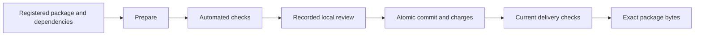

# Government model-release audit guide

Updated **22 September 2026**, informed by the separately maintained working draft
*Data Minimization and Dependency Accounting for Repeated Model Export*.
This government implementation update does not publish that revised manuscript
or its study archives. Academic files already in the published repository retain
their earlier revision; the review questions below stand as implementation guidance.
This is a practical guide to the local educational framework. It is jurisdiction
neutral; it does not determine legal authority or certify an agency deployment.

The audit question is whether the agency has sufficient, correctly scoped
evidence to give another party or the public a model trained on agency data.
Include pretrained parents, fine-tuning, adapters, merged models, ensembles,
distillation, preprocessing and every earlier version the recipient can retain.

## What changed after the academic work

The earlier console emphasized training, individual attack results and evidence
binding. The current paper adds three questions that must be addressed before
those results can support a release review:

1. **Is the protected input needed?** Compare omission against protected-input
   alternatives on the same task. Set the service requirement and acceptable
   utility margin before selecting a method. A small measured improvement is not
   evidence of an operational need, and an omission baseline does not itself
   prove that the remaining fields are private or harmless.
2. **What new protected information does the complete release depend on?**
   Include training, preprocessing, scoring, metadata and any selection or
   refusal decision visible to the recipient. The number of exported models is
   not the number of independent privacy charges.
3. **Does the delivered package match the checked decision?** Bind the artifact,
   evidence, current ledger and review, then recheck them at commit and delivery.
   File consistency and transaction ordering do not establish private training.

The active paper supports conditional fixed-roster attribute-DP claims and
bounded empirical comparisons. Its public ACS studies do not supply membership
privacy, whole-record privacy, a lifetime citizen-privacy guarantee or validated
longitudinal linkage. The earlier two-bit retained-state results are separate
supporting studies; they are not the current manuscript's headline contribution.

## Choose the right local workflow

| Your activity | Entry point | Result |
| --- | --- | --- |
| Learn training and adversarial evaluation | Console at port 8765; ten presets and four bundled datasets | Trained example, test reports and assessment case |
| Record the agency's review questions | Open a case, then **Government audit review** | Twelve controls with rationale, evidence references and outstanding gaps |
| Check a declared release against assurance contracts | Case preflight and assessment, or `mra assess` | Scoped, non-authorizing scientific recommendation |
| Exercise cumulative accounting and controlled delivery | Separate [enforced release workflow](enforced-release-workflow.md) | Local registered-package checks, review, commit and delivery history |
| Reproduce the paper's studies | [Reproduction inventory](../reproduction/README.md) | Version-bound study results under their individual assumptions |

These paths have different evidence requirements. A case checklist is not an
input that makes the temporal broker approve a package. The broker starts from
its own initialized registry; it does not import arbitrary console-trained
models or automatically inherit their test results.

## Start an educational audit

From the repository root, create a new runtime if needed:

```powershell
python scripts/setup_pipeline.py --profile console
& .\.venv-pipeline\Scripts\mra-console.exe local
```

On Linux/macOS, start `./.venv-pipeline/bin/mra-console local`. If a suitable
runtime already exists, use its executable. The installer refuses to overwrite
an existing virtual environment; choose a different `--venv` for a fresh setup.

Open [the console](http://127.0.0.1:8765). Train a bundled public-data example or
create a release case. Choose the actual recipient route: controlled API,
named-party files or public files. Select the correct derivative type and bind
the required candidate, lineage, request and reports in the case panel.

Open **Government audit review**. For each control:

1. Inspect the question and suggested evidence. Use the paper's assumptions only
   if they match this candidate and the intended recipient's access.
2. Choose **Evidence recorded**, **Gap identified**, or **Not applicable**.
3. Write the rationale. Evidence-recorded entries require at least one of the
   case's bound files. The server verifies those exact bytes; selecting a file
   does not establish that it answers the question.
4. Save the entry. Earlier entries remain in the local history. Download the
   review JSON to retain the current checklist, references and remaining gaps.

An unanswered control is **Not started**. A gap, changed case context or changed
cited evidence is **Needs work**. **Recorded** means a current review entry was
stored; it is not a pass/fail scientific result. A not-applicable entry needs a
reason and stays explicitly labelled as such.

Changing the case mode or bindings makes earlier entries stale. Changing cited
file contents causes an evidence-integrity finding. Reassess the change and
record a fresh entry against the new context. The service rejects a save based
on an out-of-date context and waits for queued/running case work before edits.

Education mode keeps agency scope, security and independent-review documents
optional. The checklist does not add login, certificate or deployment setup
requirements, and it does not change the existing assessment engine's verdict.
Both modes retain `authorization_eligible: false` and
`scientific_adequacy_verified: false` for this review record.

## The twelve controls

| Control | Evidence to examine | Typical unresolved issue |
| --- | --- | --- |
| Purpose, omission and utility | Defined service requirement; omission baseline; protected-input comparison; fixed selection/evaluation plan | Sensitive input added because a tiny observed gain was treated as necessity |
| Privacy adjacency | Protected attributes, versions, fixed/public fields, participation assumptions and recipient scope | A one-attribute guarantee presented as whole-record or membership protection |
| Complete recipient package and history | Exact model and preprocessing files; metadata; linked scores; previous exports and allowed combinations | Assessment covers an API while recipient receives weights and unlimited local queries |
| Training and scoring footprints | Channel identities, stable unit keys, affected sets and complete dependency inventory | Disjoint training rosters conceal overlapping scoring records |
| Cache reuse and attribute versions | Proof that reused protected values are identical; raw version and mechanism commitments | Fresh randomization or the same flip applied to changed raw data counted as free reuse |
| Protected information flow | Training/selection/review design showing which protected inputs each visible output uses | Uncharged raw labels determine which model, metric, refusal or release is published |
| Cumulative accounting | Bound policy cap, prior ledger, proposed new channel–unit pairs, expiry and nonrefundable charges | Repeated delivery double-charged, or revocation incorrectly used to refund disclosure |
| Derivative and component lineage | Parent hashes, training/fine-tuning inputs, component exports, overlap and previous releases | Assuming the parent's result automatically covers a fine-tuned or combined model |
| Joint attacks and uncertainty | Recipient-realistic attacks, controls, calibration/audit separation, budgets, unsupported cases and uncertainty | A failed finite attack treated as a ceiling on every attacker's risk |
| Exact-byte commit and delivery | Prepared request, persisted checks, bound review, atomic receipt and delivered-byte verification | Approval attached to different package bytes or a stale accounting state |
| Expiry, revocation and recovery | Live authority/evidence checks, interruption/restart tests, idempotency and retained charges | A past passing check treated as permanent authority; downloaded copies assumed erasable |
| Agency decision and remaining risks | Accountable decision, scope limits, unresolved threats and deployment-specific acceptance evidence | Local recorded acknowledgment presented as independent institutional approval |

These are review prompts with file-consistency checks. The software cannot judge
an uploaded document's scientific adequacy, prove truthful channel declarations,
authenticate agency officials or validate arbitrary private training code.

## Repeated exports, fine-tuning and combinations

For a unit `u`, the paper accounts for every distinct channel `c` on which the
recipient's transcript depends. Its sufficient bound adds the declared
`epsilon(c)` for the charged `(c, u)` pairs. A candidate pays for new pairs, after
including both training and scoring dependencies. The implemented temporal
workflow checks those pairs against its cap.

| Proposed operation | Review implication |
| --- | --- |
| Another model trained only from the same protected cache | May be post-processing under the same valid contract; verify identical cached values, fixed inputs and complete transcript assumptions |
| Fine-tuning on new raw records or fresh protected draws | Inventory new dependencies and affected units; the parent's charge is not a blanket exemption |
| Combining independently protected components | Include every component and all applicable channels for overlapping units; assess the joint recipient view |
| Reusing an old random flip with changed protected values | Not the identical released value; requires a separately justified mechanism contract |
| New linked scores | Bind scoring access, roster and channel, even when the model itself is unchanged |
| Raw-input scoring or raw-truth publication | Falls outside a protected-cache-only information-flow claim unless separately justified |
| Revoking access after commitment | Can stop future service delivery; cannot recover previous copies or refund already committed disclosure |

The accounting contract is conditional. A realized ledger does not prove that
raw-data-dependent adaptive selection was private. Source code, mechanism
reasoning and independent evaluation must justify information flow. Epsilon is
not an observed attack accuracy, an absolute inference ceiling or a utility score.

Prefer the simplest accounting representation that preserves the required
dependency rule. Many descendants of one static cache do not alone require an
elaborate ledger. The paper's grouped and mask representations have different
time/storage tradeoffs, and fragmentation can remove grouping's benefit.

## The controlled-delivery exercise

See the [enforced workflow setup](enforced-release-workflow.md) for portable
paths to the temporal run and initialized operator registry. That service uses:



The temporal registry's current worked example protects a fixed-roster
disability attribute. The newer paper also studies recorded sex and a separate
two-attribute contract. Those results do not silently upgrade the web registry's
scope. Match the registered experiment and mechanism to each claim.

The local operator acknowledgment and government case checklist are separate
records. Neither supplies authenticated agency roles or separation of duties.
The controlled HTTP path can enforce sequencing; an administrator able to read
model files or modify the database is outside that enforcement boundary.

## Evidence package for a pre-POC report

Retain a candidate-specific bundle containing:

- Purpose and necessity comparison, including omission and service requirements.
- Candidate/package inventory, recipient access, parent lineage and prior copies.
- Privacy scope, adjacency, mechanism assumptions and complete channel/unit dependencies.
- Training/scoring provenance, utility evidence, attacks, controls and explicit gaps.
- Scientific assessment, checklist JSON and the rationale for unresolved or inapplicable controls.
- Where the temporal workflow applies, check/review records, receipts, delivered hashes,
  cumulative charges, expiry/revocation evidence and recovery test results.
- Exact implementation/runtime identities, test commands and results, known limitations,
  and a separately accountable agency decision before any real release.

Use the [integrated audit specification](system-audit-specification.md) for the
full candidate protocol and deployment obligations. The implementation's local
approval boundary remains narrower than an institutional release process.

## Verification and historical evidence

The [September 22 update report](government-audit-update-2026-09-22.md) records the
checks performed for this integration. The [September 10 training matrix](framework-e2e-validation-2026-09-10.md)
is retained as a separate source-bound baseline. No older study or registration
is restamped to make it appear to validate changed source code.

For targeted checks in an existing console runtime:

```powershell
& .\.venv-pipeline\Scripts\python.exe -m unittest discover -s tests -p test_government_audit.py -v
& .\.venv-pipeline\Scripts\python.exe -m unittest discover -s tests -p test_government_launcher.py -v
& .\.venv-pipeline\Scripts\python.exe -m unittest discover -s tests -p 'test_temporal_pipeline*.py' -v
```

These checks exercise local implementation behavior. A passing test suite does
not establish coverage of every adversary, prove mechanism information flow or
replace an agency's review of the actual deployment.
