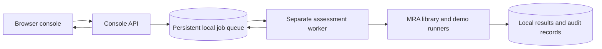

# Local microservice test console

For the rationale, implemented capabilities and a complete learning walkthrough,
start with the [implementation and motivation guide](implementation-and-motivation-guide.md).

The pre-POC has two separately running services: a FastAPI HTTP service that

serves the browser console, and a worker that executes allowlisted jobs. They

share a local SQLite queue and case/artifact directory. This is a single-host

setup for trusted testers, not a multi-tenant production system.



## Educational defaults

New console cases default to **Education** mode. Agency scope, security report

and independent review are optional for exercises; their omissions appear in

preflight and result JSON. Candidate, lineage, request, evaluation plan and

utility report remain required. Hash verification, parent lineage, recipient

access scope and scientific Engine checks are unchanged.

Choose **Review** when creating a case, or switch modes in the case panel, to

require all eight documents. Existing cases and CLI-created cases retain Review

mode by default. For a CLI exercise use `mra-workflow init CASE --mode education`.

A mode switch preserves bindings and prior runs. Console edits wait until the

case has no queued or running job. Neither mode grants release authorization.

No accounts, certificates, institutional signing setup or deployment hardening

are required to run local exercises with synthetic/public test data.

## Start without Docker

Create a fresh console environment using the existing setup script:

```console

python scripts/setup_pipeline.py --profile console

```

Then run its executable from the repository root:

```powershell

# Windows; no activation needed

& .\.venv-pipeline\Scripts\mra-console.exe local

```

```sh

# Linux/macOS

./.venv-pipeline/bin/mra-console local

```

Open [the console](http://127.0.0.1:8765). Ctrl+C stops the local launcher and its

API/worker children. Use `--port 8766` if another application uses the default.

The default case/queue location is `.local/console-data`; override with

`--data PROTECTED_LOCAL_DIRECTORY`. Do not point SQLite at a network share or

run this service against live agency data without the appropriate environment

review. Case documents and audit content may be confidential.

To upgrade an existing project environment rather than create another one,

use that environment's Python to run:

```console

python -m pip install -r requirements-console.txt

python -m pip install --no-deps --no-build-isolation -e .

python -m model_release_assurance.console local

```

Core and experiment dependencies must already be installed for the demos.

The `console` setup profile includes them. The console UI and its API reference

use only bundled assets; the two supplied demos use local/public fixtures and

the packaged scikit-learn dataset, without a dataset download.

## Start with Docker Compose

With the Docker daemon running, from the repository root:

```console

docker compose up --build

```

The browser URL is the same. Compose builds the local source image, publishes

only `127.0.0.1:8765`, starts the API and waits for its health check before

starting the worker. This uses Docker's documented

[health-dependent startup](https://docs.docker.com/compose/how-tos/startup-order/).

Both services run as a non-root user, with ordinary writable container root

filesystems and normal outbound networking. A named volume retains queue,

cases and results. Optional hardening restores read-only roots, dropped

capabilities, no-new-privileges and an offline worker:

```console

docker compose -f compose.yaml -f compose.hardened.yaml up --build

```

These settings do not establish accreditation or hostile model isolation. This image runs only the built-in demos and existing

assessment workflow; it is not a general untrusted model executor.

Use `docker compose down` to stop while retaining the named volume. Do not add

`--volumes` unless the retained local evidence is intentionally being deleted.

Image builds require access to base-image/package sources. The Dockerfile is a

development recipe with version ranges; freeze image/dependency digests before

a registered experiment. The Docker context excludes local environments,

private outputs and caches and includes only required source and example trees.

## What testers can do

1. **Run scenarios:** execute the existing eight fictional reference cases,

   including missing evidence, leakage, tampering and simulated lifecycle

   changes. Simulation labels are preserved; SIMULATED_ACTIVE is not deployment.

2. **Open training wizard:** name the case, review the bundled public dataset and
   small CPU preset, then start real XGBoost training, export,

   membership evidence and the assessment prefix. Expected disposition is

   inconclusive or block, never automatic release. Stage updates appear in run
   details. On success, **Open trained model case** opens an Education case with
   candidate, lineage, request, evaluation plan and utility report already bound.

3. **Create release cases:** choose trained, fine-tuned, adapter, merged,

   ensemble or distilled, plus API/named-party/public release route.

4. **Check inputs and assess:** inspect missing slots, enqueue preflight or

   invoke the existing Engine workflow. Workers preserve failed attempts.

5. **Inspect and download results:** view execution state separately from the

   scientific result and download the returned JSON. Logs and full artifacts

   stay in the configured local data directory.

In Education mode, select an input slot and paste an absolute local file path

in the case panel, then select **Bind local file**. The service reads and hashes

the specified file with the local process's permissions. This is intended for

trusted testers on the same computer; it does not upload files or execute model

code. Review cases use the [workflow CLI](pipeline-quickstart.md). The case detail panel shows its relative

directory. For example, replace CASE_ID with the displayed identifier:

```console

mra-workflow bind .local/console-data/cases/CASE_ID candidate PATH_TO_BUNDLE

mra-workflow bind .local/console-data/cases/CASE_ID request PATH_TO_REQUEST

```

Complete the other slots and lineage with the same CLI. Do not change inputs

while a job for that case is queued/running. To operate on a container case,

the paths must exist in the container's approved data volume; host absolute

paths do not become valid container paths. Use local mode for the simplest

operator-managed case testing. No dedicated browser-based upload/intake or

fine-tuning trainer is implied by the candidate profile dropdown.

## Queue, failure and API behavior

Job states are `queued`, `running`, `completed`, `failed`. SQLite transactions

claim a queued job once; a partial unique index prevents overlapping active

jobs for the same case. Up to 20 jobs may be active and 500 cases may be created.

The list endpoint shows the latest 100 jobs; older jobs remain retrievable by ID.

Workers publish heartbeats every five seconds. After 90 seconds without a

heartbeat, abandoned jobs are marked failed and are **not** automatically

retried. A late worker cannot mark a recovered job completed. This does not

guarantee that an orphaned child process stopped: review its processes and

partial artifacts before resubmitting. Built-in demo subprocesses have a

10-minute timeout. The generic assessment call has no hard time limit or

resource sandbox; use bounded trusted evidence only. Worker heartbeat and

task completion are different health signals.

Use one worker for this pre-POC. Queue claims are tested under contention, but

horizontal scaling, NFS locking, distributed leases and multi-host execution

are not validated. SQLite console jobs are not the MRAP authoritative registry

or a tamper-resistant audit ledger. The lower-level assessment maintains its

existing audit boundaries.

[API reference](http://127.0.0.1:8765/api/docs) and

[OpenAPI JSON](http://127.0.0.1:8765/api/openapi.json) are served locally. Mutating

requests require ordinary JSON, with no custom header; cross-origin browser mutations

and unexpected hostnames are refused. This protects against accidental browser

drive-by requests; it is not authentication. Anyone with local access is a

trusted tester. There are no individual accounts, tenant isolation, TLS or

institutional signing/authorization endpoints. Keep loopback binding; do not

publish this service to the LAN or Internet as a shared agency system.

## Verification

Install the console profile, then run:

```console

python -m unittest discover -s tests -p test_console.py -v

python -m unittest discover -s tests -p test_pipeline_workflow.py -v

docker compose config --quiet

```

Tests cover API validation, static assets, host/origin/body boundaries,

concurrent claims, persistence, duplicate-case jobs, stale workers, late result

rejection, allowlisted operations and non-authorizing failures. Container

configuration validation is separate from building and running the containers.

### Initial local validation on 8 September 2026

The native API and worker were installed and run on Windows. Browser tests

completed all eight reference scenarios, completed the real training demo with

an inconclusive result, created an adapter/public-weights case, and displayed

all eight missing preflight inputs. A service restart retained the case and

three completed jobs. Browser error/warning logs were empty during those flows;

the bundled offline API-reference page was also opened successfully.

The full Python suite ran **688 tests, OK with 18 skips**, in 145.931 seconds.

Skips concern optional model runtimes and environment capabilities. All 12 new

console tests ran, including the HTTP cases. The existing 37-schema manifest,

local Markdown links, dependency consistency and wheel build passed. The wheel

contains the four console assets. Logs are retained locally in

`output/console-validation-20260908/unittest.log`, and the built wheel is under

that directory's `wheels/` subdirectory.

Compose configuration validates. Container build/start was **not executed**:

the Docker daemon was unavailable on this machine. Windows/Linux CI jobs are

configured to exercise console installation and API tests, but remote CI was

not run in this session. No agency-data evaluation, production accreditation

or new model-release approval is claimed.

### Education-mode validation

After the educational defaults were added, the full suite ran **691 tests in
154.208 seconds, OK with 18 skips**. The 31 console/workflow tests include
optional-document assessment, legacy Review defaults, tamper rejection, local
file binding and active-case edit protection. Logs are at
`output/education-validation-20260908/unittest.log`.

Browser verification created an Education case, bound the bundled demo-tree
artifact, and completed preflight showing four missing required inputs and
three optional-document notices. Base and hardened Compose configurations
validate; Docker image execution remains untested because the daemon is unavailable.

## Public-data training wizard

Open **Train → export → assess → Open training wizard**. The three steps cover
sample data, the training preset, and a final review. This version includes one
offline preset: the scikit-learn packaged Wisconsin Diagnostic Breast Cancer
dataset (569 samples, 30 features), with XGBoost, 32 boosting rounds, tree depth
3 and seed 3407. It trains a new tabular model; fine-tuning and combined-model
training are not wizard options yet.

The worker freezes the existing evaluation plan, trains and exports, collects
membership evidence, and records the assessment. Progress labels reflect output
milestones rather than an estimated percentage. Successful wizard runs create an
Education case whose five required slots are bound to real run artifacts; three
institutional documents remain optional. The original assessment request is
copied unchanged to its original path-resolution root, and lineage records the
public dataset and training configuration. Utility metrics remain descriptive.

Results include the case link and artifact directory relative to the configured
data root. Run directories and unsuccessful attempts are retained. Run **Check
inputs** or **Run assessment** on the generated case to continue learning.

API clients can use `POST /api/jobs` with:

```json
{"kind":"training","training":{"name":"Public data training","dataset":"sklearn-breast-cancer","preset":"xgboost-small"}}
```

The existing `{"kind":"training"}` API demo remains supported without creating
a case. Unsupported datasets/presets are rejected. Training options and milestone
status survive API restarts through additive SQLite columns; existing jobs remain
available. No model download, GPU, account or additional dataset setup is needed.

### Training-wizard verification

On 8 September 2026, browser testing completed all three wizard steps, trained
on the bundled 569-row public dataset, opened the generated case with five bound
required inputs, and successfully ran a fresh assessment. Both assessments were
inconclusive. The 15 console tests, 18 workflow tests and existing training-demo
integration test passed (34 tests total), including actual training, case binding,
reassessment, option persistence and unsupported-preset rejection.

## Expanded educational red-team tools

The initial expanded suite executed six tool groups on the exact public
model loaded from verified export members:

| Tool | Measurement | Important boundary |
| --- | --- | --- |
| Structural disclosure | Generalization gap, loss shift, output equivalence groups, complexity indicators | Screening indicators, not calibrated disclosure proof |
| Learned membership | Repeated random-forest attacks with shuffled-label baselines | Strong auxiliary knowledge; exploratory only |
| Score-based membership | Negative loss, maximum confidence and negative entropy | Separate calibration/evaluation halves; empirical FPR and TPR, not certified bounds |
| Model extraction | Label-query decision-tree surrogate agreement | Disjoint auxiliary query/evaluation sets; functional imitation, not weight recovery |
| Attribute inference | First transformed feature inferred by class-confidence maximization | Coarse bins; attacker knows remaining features and true class; majority baseline |
| Numeric robustness | Prediction flips and accuracy under two noise levels | Random perturbations, not optimized adversarial examples |

The score evaluator includes deliberately leaking and constant-score controls.
These validate the scorer only; end-to-end positive controls for all tools remain
a gap. Each tool reports completed or failed; completion never means a safety
pass. Aggregate results include seed, configuration and implementation hashes,
and bind the release bundle, dataset and split manifest. No per-record red-team
results are published by this suite. Failed tools make suite coverage incomplete.

Open a new training run's details for the coverage list; expand/download result
JSON for metrics, query counts, baselines and assumptions. The detailed artifact
is `evidence/red-team-report.json` under the training run. Existing runs are
preserved and do not retrospectively gain test coverage.

The suite supports dense numeric classifier views with 40–5000 records per
partition and at most 256 features. It is available programmatically through
`model_release_assurance.tabular_red_team.run_tabular_suite`, and from the source
checkout CLI:

```console
python scripts/run_training_release_demo.py --dataset-profile sklearn-breast-cancer --run-dir .local/red-team-example --red-team
```

LLM prompt injection/text extraction, poisoning/backdoors, full reconstruction,
derivative/component comparisons and complete-interface privacy ceilings remain
explicit coverage gaps. The registered single membership test still supplies the
existing assessment; this broader suite is exploratory, not an automatically
admitted AttackBatteryWorkerOutput. No scientific threshold or release gate was
relaxed to make the added tests appear successful.

### Version 2: stronger attacks and controlled retraining

New wizard runs now execute **11 tool groups**. Each tool expands in the console
to show its metrics, budgets, assumptions and baseline comparisons. The five
additional groups are:

| Group | Execution |
| --- | --- |
| Label-only membership | Correctness attack with separate calibration and audit halves |
| Adaptive adversarial search | Greedy probability-query loss maximization, 24 steps at two standard-deviation budgets, at most 128 evaluation records; equal-iteration random-search loss baseline |
| Tree-leaf exposure | Singleton/low-occupancy leaves and unique complete leaf signatures |
| Label poisoning | Matched clean retraining and 5%/15% label-flip experiments, two seeded selection repeats |
| Trigger backdoor | Matched clean retraining and 5%/15% numeric-trigger poisoning, two seeded selection repeats; target-class success on originally non-target labels versus the clean model's trigger response |

Poisoning/backdoor tests train temporary copies using the frozen training
configuration (maximum 64 trees, depth 6); they leave the candidate and data
unchanged and persist aggregate metrics only. They measure hypothetical training
compromise, not whether the exported candidate contains an existing backdoor.
The trigger uses an out-of-range value on the first transformed feature. Adaptive
perturbations are bounded numerically but are not guaranteed to represent valid
real-world records. Results are descriptive; no universal pass/fail cutoff is
invented. Unsupported model families are reported explicitly and coverage is
incomplete when any tool fails or is unsupported.

The report format is `educational-tabular-red-team/2`. Full-record reconstruction,
LLM attacks, clean-label/targeted/supply-chain poisoning, component comparisons,
and complete-interface privacy guarantees remain outside this preset.

Validation includes all 11 tools on actual public-data training, reassessment,
deterministic query attacks, and byte-for-byte confirmation that controlled
poisoning does not change the original model or input arrays.

## Current training and language workflows

The wizard offers ten presets: XGBoost, logistic regression, random forest,
MLP, fine-tuned MLP, CNN, ridge regression, forest regression, SVM and voting
ensemble. Four datasets are bundled: breast cancer, wine, digits and diabetes.
The picker disables incompatible pairs. CNN uses digits; regression uses diabetes.

Every preset now saves a registered membership assessment and creates an
Education case with complete required bindings. Historical runs remain unchanged.
Other red-team tools are exploratory; unsupported adapters remain visible.
See [the current coverage inventory](framework-capability-gaps.md), which supersedes
the historical tool-version gap lists above.

```console
python -m model_release_assurance.public_models --preset cnn --dataset sklearn-digits --output .local/cnn-digits
python -m model_release_assurance.public_models --preset ridge --dataset sklearn-diabetes --output .local/ridge-diabetes
python -m model_release_assurance.public_models --preset mlp-finetuned --dataset sklearn-wine --output .local/finetuned-wine
```

Output directories must be new. Fine-tuning saves the base and derivative;
ensembles save components and joint-access probes. All training presets use CPU
and the console dependency profile, without downloading datasets or model weights.

For language tests, run Ollama locally with an already installed model, then
select **Test an installed language model**. The native console uses its fixed
loopback endpoint on port 11434 and queues a separate worker job. Model setup is
optional; training and assessment do not depend on Ollama. The adapter uses the
[Ollama chat API](https://docs.ollama.com/api/chat). Host Ollama is unavailable
through container loopback; use the native launcher for this feature.

```console
python -m model_release_assurance.language_red_team --model YOUR_INSTALLED_MODEL --output .local/language-example
```

Language results retain nine synthetic attack responses, two control results,
model digests and detector limitations. Tool schemas are inert and the document
contexts are synthetic. No tools execute and no government records are sent.
Inspect observed violations and controls; absence of a detector match is not
proof of model safety. These reports do not authorize release.

Current validation: 745 main-suite tests, 43 academic tests, and 66 optional-runtime tests passed. The [detailed verification report](framework-e2e-validation-2026-09-10.md) records the complete option/adversary matrix and remaining platform limits.

## Evidence, retries and review-mode completion

Open any run and choose **Browse evidence and diagnostics**. Individual files
show their size and SHA-256. **Download evidence ZIP** exports generated artifacts
and a manifest; archives are limited to 64 MiB. Assessments include their preflight,
audit and scientific reports. Failed attempts retain diagnostics and partial
artifacts. External case input bindings remain at their source paths.

Queued jobs can be cancelled. Failed or cancelled jobs can be retried as a new
run with the same options and a link to the earlier attempt. Running jobs cannot
be cancelled through this console. History is retained; recovery never silently
re-executes an interrupted job.

File binding is available in both Education and Review modes. Review requires
all eight input slots; adding documents completes the inventory, not their
substantive review or approval. Bound paths, hashes and supporting replay evidence
are visible in the case. New public-model runs retain model and preprocessing
bundles, frozen splits, recipes, source/runtime snapshots and raw membership
scores. Preflight checks their bindings and replays counts without loading model
code. Legacy runs retain their original, weaker evidence scope.

## Run the complete local option matrix

Use the console environment's Python from the repository root:

```console
python scripts/validate_framework_e2e.py --output output/my-framework-validation
```

The runner exercises every model/dataset selection, including expected rejection
of incompatible pairs, all case kind/route/mode intake combinations, actual
training, every configured adversary, hashed downloads, ZIP exports, reassessment,
review-mode binding, candidate tamper rejection, cancellation and retry. It saves
per-option Markdown and JSON results plus raw job artifacts in a separate store.
No existing console cases are modified. Output directories must be new.

To also test installed local language models, append one or more model selectors:

```console
python scripts/validate_framework_e2e.py --output output/my-language-validation --language-model YOUR_INSTALLED_MODEL
```

A deliberately leaking fixture, constant-score controls, malformed responses,
timeouts, model substitution and truncated leaks have additional automated
regression tests. The matrix reports unsupported tools explicitly; PASS describes
execution behavior, not universal adversarial coverage or model safety.
