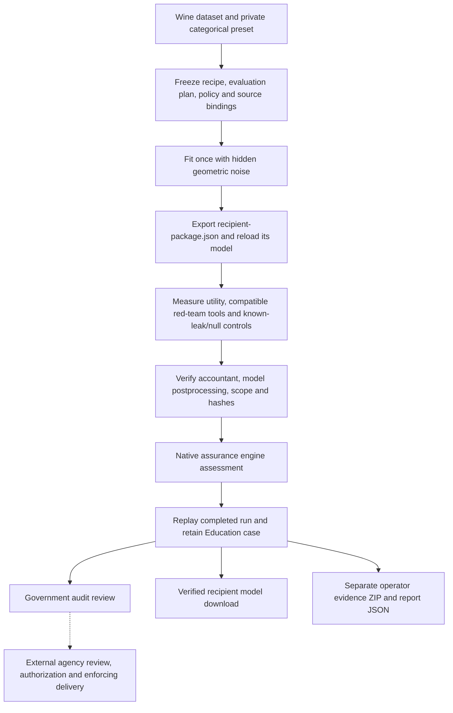

# GitHub demo on your computer

This walkthrough trains a small public-data model, exports it, inspects red-team
findings and records an educational government audit. On Windows, download and
extract the launcher ZIP, then double-click its script. An existing source checkout remains available for
advanced use and Linux/macOS.

Use the bundled or configured public research data only. This walkthrough uses
public data and does not qualify private agency data, authorize model release or
qualify a production deployment. No public-use
licence has been selected; repository visibility and this walkthrough do not
grant general permission to reuse or redistribute the software. See
[the repository licensing notice](../README.md#support-and-licensing).

## Windows: download and start

1. [Download Try-Demo.zip](https://github.com/elmontu/AI_ModeL_Check/raw/refs/heads/main/demo/Try-Demo.zip)
   on your Windows x64 computer. Use **Extract All** to unpack the ZIP.
2. Double-click `Try-Demo.cmd` in the extracted folder. Git, preinstalled Python and an administrator
   installation are not required. First use needs internet access for the managed
   runtime, repository snapshot and console packages.
3. Wait for setup and dataset checks to finish. The launcher starts the web
   service and separate worker, then opens [the console](http://127.0.0.1:8765/).
   Keep its window open while using the demo. Press **Ctrl+C** to stop both services.
   If Windows asks `Terminate batch job (Y/N)?`, confirm with `Y`.

You can alternatively [download the plain launcher](https://github.com/elmontu/AI_ModeL_Check/raw/refs/heads/main/Try-Demo.cmd).
If the browser displays its contents, choose **Save as** and retain the filename
`Try-Demo.cmd` rather than `.txt`.

The standalone launcher currently uses the official portable CPython NuGet
package **3.13.16** and the immutable application source snapshot **`76a6a02`**.
It validates installed packages against the application's dependency requirements;
this is not a claim that every dependency is frozen by a complete lockfile.

The **four required public datasets** arrive inside the scikit-learn **1.6.1**
wheel: Wine, Digits, Wisconsin Diagnostic Breast Cancer and Diabetes. Setup
validates them and exports local copies under the installation home. There is no
manual dataset download or preparation step. The public-data examples run offline
after successful setup; optional language models and large historical research
collections are separate inputs.

The default home is `D:/MRA-Demo/<Windows username>` when D: is available. Otherwise
it uses `%LOCALAPPDATA%/MRA-Demo/<Windows username>`. The managed runtime,
application, prepared datasets and console evidence remain under that home.
OneDrive locations are refused. Reopening the same launcher version validates
and reuses its installation and records. Each source version uses a separate
`demo-<revision>/console-data` folder. A new version starts with its own empty
console; earlier records stay in their original folder. Retain the earlier
launcher if you want to reopen that version and its records.

Set these environment variables before launching only when you need an override:

| Variable | Purpose |
| --- | --- |
| `MRA_DEMO_HOME` | Absolute installation home outside OneDrive |
| `MRA_DEMO_PORT` | Local console port; default 8765 |
| `MRA_DEMO_SETUP_ONLY=1` | Prepare and validate setup/data without starting services |
| `MRA_DEMO_NO_BROWSER=1` | Start services without automatically opening a browser |
| `MRA_DEMO_RESEARCH_DATA_ROOT` | Existing prepared public research root; optional |

For example, from PowerShell in the folder containing the extracted launcher:

```powershell
$env:MRA_DEMO_HOME = 'D:/MRA-Demo/MyDemo'
$env:MRA_DEMO_PORT = '8766'
& .\Try-Demo.cmd
```

Open the selected local port if browser opening is disabled. The research option
uses already existing ACS/BTS/HMDA/TLC prepared matrices; it does not fetch raw
corpora, replace missing sources or qualify private agency data. See
[existing research inputs](#use-existing-public-research-data-on-d).

## Clone and start

This is the advanced existing-checkout route and the Linux/macOS setup.

Use Python 3.11 or newer and Git. Choose a directory outside OneDrive or another
synchronized cloud-storage folder if you want evidence to stay on your computer:

```console
git clone https://github.com/elmontu/AI_ModeL_Check.git
cd AI_ModeL_Check
```

From the checkout, run one command:

**Windows PowerShell**

```powershell
python scripts/start_demo.py
```

**Linux/macOS**

```bash
python3 scripts/start_demo.py
```

On first use, the launcher runs the existing setup script with the console
profile to create `.local/demo-venv`. Subsequent launches validate and reuse the
launcher-managed environment rather than reinstall it. An unrelated or incomplete
environment is not silently reused. First installation requires package access
or a prepared wheel directory; the bundled public datasets need no subsequent
dataset download.

The launcher starts a local web service and a separate worker. Open
[the console](http://127.0.0.1:8765/). The services share a SQLite queue and case
artifacts under `.local/demo-data`. Local mode binds to loopback for trusted
testers on one computer; it is not a shared public service.

The [README pipeline diagram](../README.md#model-pipeline) shows the model
stages and their separate evidence routes. Manual installation is also
available in [Quick start](../README.md#quick-start).

## Model pipeline and evidence boundaries

Open the [private Wine pipeline view](http://127.0.0.1:8765/#pipeline-flow)
in the running local demo to inspect a saved run at each stage. Its
[pipeline guide](http://127.0.0.1:8765/guide#guide-pipeline-flow) stays open
beside the console.

Choose the dataset and preset first. Each attempt freezes its policy and plan
before fitting and retains the exact exported model, evidence and result. The
private Wine route runs these stages in order:



| Stage | What to inspect | Boundary |
| --- | --- | --- |
| Select and freeze | Dataset snapshot, training recipe, evaluation plan, policy and source identities | Freeze before fitting; a changed input belongs in a new attempt. |
| Train | Receipt for one real fit with OS-backed secret randomness | The private Wine mechanism starts at its accepted training records; public benchmark preparation is outside that guarantee. |
| Export and reload | Exact `recipient-package.json`, fixed schema and model derived from noisy counts | No raw records, raw training counts, private seed or noise realization in the recipient package. |
| Check and verify | Utility, compatible attacks, known-leak/null controls, independently replayed accountant, model and bindings | Unsupported tools remain gaps. These diagnostic controls do not establish institutional attack-battery qualification. |
| Assess and replay | Native assessment report, bounds, policy and completed-run verification | The private route uses a mechanism ceiling and an explicit local battery waiver; a scientific result is scoped to its declared interface. |
| Review and retain | Education case, twelve-control review, reports and operator evidence ZIP | Review entries record evidence and gaps; they do not issue agency approval. |
| Recipient delivery | **Download verified recipient model** rechecks retained private-run evidence | Only the model-only JSON is assessed for that recipient; agency authorization and production delivery remain separate external obligations. |

Conventional logistic, forest, neural, regression and XGBoost demonstrations
use a different evidence route: **freeze → train → export/reload → registered
membership assessment**, followed by separate compatible exploratory attacks
and retained utility/review evidence. Their attack-floor policies remain unchanged;
failed or weak attacks do not create a clearing ceiling, and no accountant or DP
claim is added to those earlier models. Exploratory results are not silently
admitted to the registered assessment.

A private Wine clear result covers one fit, one model-only recipient package and
add/remove-record membership under its recorded policy. It does not clear the
whole dataset, another model, person-level groups, utility, fairness, cumulative
prior releases or an agency deployment. A second noisy model release requires
composition; reassessing the same bytes is not a new fit.

**Keep the two downloads distinct.** `recipient-package.json` is the assessed
private model artifact. The evidence ZIP is an operator audit bundle containing
source, manifest, utility and attack diagnostics outside that recipient package.
Sharing the ZIP is a different disclosure, with no automatic transfer of the
model-only privacy claim. Keep the separate review JSON for audit as well.

See [private training and replay](private-model-clearance.md),
[the government review](government-audit-guide.md) and
[the private-cloud production plan](production-private-cloud-plan.md) for their
respective evidence and deployment obligations.

## Start from Dataset overview

**Dataset overview** is the main navigation entry. **Graph** is the default view:
dataset → each saved training run or
attempt → its recorded training assessment. All runs remain separate by job ID,
so several models trained on one dataset remain visible. An unfinished attempt
does not mean a trained model exists. Dataset nodes have no verdict. Result
nodes show the original training assessment, not a later assessment of its case.
The downloadable Windows launcher includes this graph.

Choose **Cards** for the catalog view. Both views share the **Source** filter:
**Local research** or **Bundled examples**. In Graph, **Find a dataset or model**
searches by dataset, model family or short job ID; **Training runs** filters run
state. Use **Zoom graph in** (+), **Zoom graph out** (−) and **Reset view**. Click
a node, or use Tab and Enter, to open the existing dataset or run details.
A selected run offers **Inspect model run**, **Red-team results** and, when its
saved case exists, **Review model case**. Open a dataset to inspect its source,
rows/features, all training runs and derived cases; **Train a model** preselects
that dataset in the wizard.

The graph reads catalog facts and retained observations; it starts no jobs and
grants no release authorization. Configured research sources are checked when
training starts; the overview does not rehash them or establish current
availability. A result applies to its recorded model and evidence, not to the
dataset as a whole. A listed dataset is not cleared, approved or scientifically
qualified.

**Model cases** is the secondary view for reviewing trained candidates and
manually created cases. **Run history** retains execution attempts. Earlier
cases, runs and their evidence remain available. For an existing candidate,
use **Create model case** and bind its files in Model cases instead of starting
a new dataset training run.

## Use the in-console running guide

Select **Running guide** in the console navigation to open the guide in a separate
tab. It covers installation, all dataset/model choices, training, red-team tools,
case review, evidence downloads, restarts and troubleshooting. Its result section
explains the saved inconclusive membership assessments and the separate synthetic
reference scenarios. Completed training and attacks are execution outcomes; the
guide and per-run explanations retain the recorded scientific verdicts.

## Inspect Red-team tools

Open **Red-team tools** in the navigation, or select **Red-team results** for a
graph run or dataset card. Choose the dataset and a recorded training run. The workspace shows
named tool cards with execution states, recorded measurements, expandable raw
details and coverage gaps. Failed and unsupported tools remain visible. Datasets
without a recorded run have no measured results yet.

Classifier runs list eleven integrated tools; regression runs list three.
Supported tools run automatically after training. **Train and run checks** opens
the dataset-preselected wizard and trains a new model before checking it; it does
not rerun an existing model or offer individual-tool selection. A completed tool
means execution finished, not that its model or dataset is safe.

The local language action opens the existing tests for an installed Ollama model:
nine synthetic probes and two controls, with inert tool requests. SACRO-ML, ART,
garak, PyRIT, public export screening and multi-shadow experiments remain separate
workflows. They are not launched by this workspace; see the
[coverage and adapter links](../README.md#red-team-coverage).

### Optional small local language model

Install [Ollama for Windows](https://ollama.com/download/windows) separately.
The [Qwen2.5:1.5b model](https://ollama.com/library/qwen2.5:1.5b) is a small
pretrained model with a download of about **986 MB**. This optional helper needs
an existing Ollama installation and D: storage; the main **Try-Demo.zip** setup
does not include Ollama or download language models.

From a source checkout on D:, prepare the model without entering chat:

```powershell
powershell -ExecutionPolicy Bypass -File scripts/start_slm.ps1 -SetupOnly
```

The default model cache is the checkout's `.local/slm-models`. `-ModelRoot` chooses
another D: directory. If another Ollama server owns `127.0.0.1:11434`, quit it
yourself before using the helper; it refuses an unknown listener and does not
kill it. The helper starts or reuses its own local server and leaves it available
after setup or chat exits.

For a standalone Windows installation, [download the same helper](https://github.com/elmontu/AI_ModeL_Check/raw/refs/heads/main/scripts/start_slm.ps1)
and save it as `D:/MRA-Demo/<Windows username>/scripts/start_slm.ps1`; create the
`scripts` folder under your demo home if needed. If your browser displays the
file, use **Save as** and retain `.ps1`, not `.txt`. Run it with an explicit D: cache:

```powershell
powershell -ExecutionPolicy Bypass -File "D:/MRA-Demo/$env:USERNAME/scripts/start_slm.ps1" -SetupOnly -ModelRoot "D:/MRA-Demo/$env:USERNAME/slm-models"
```

Here `$env:USERNAME` supplies your Windows username. Keeping the script in that
`scripts` folder also keeps its service logs and receipt under your demo home.
Omit `-SetupOnly` to open
local CLI chat. Once the local server is running, you can also use:

```console
ollama run qwen2.5:1.5b
```

In **Red-team tools**, select **Test an installed language model**, choose
`qwen2.5:1.5b` under **Installed Ollama model**, then select **Run local tests**.
Close and reopen this dialog if the model was installed after you opened it.
Review the language run in **Run history**, including both controls, observed
violations, failed probes and limitations; retain its result JSON and evidence ZIP.

These tests use pretrained inference and synthetic inputs. They do not retrain
or fine-tune the SLM, create a dataset-training graph branch or model case, or
establish a privacy ceiling, native clearance or agency approval. A completed
queue job may still report incomplete probe coverage. “No match detected” only
means the finite literal detector found no configured match; human review is
needed for semantic or partial leaks.

## Follow the public-data flow

1. In **Dataset overview**, open **Wine classification**. This bundled dataset
   has 178 samples, 13 features and three classes. Start training from its details
   to open the wizard with Wine preselected; name the case `Public Wine demo`.
2. Select **Next**. Choose **Logistic regression** under **Model family**. Select
   **Next**, inspect the summary and select **Start training**. Compatible tools
   run automatically after training and export; unsupported tools remain visible.
3. Open **Red-team tools**, select Wine and the recorded training run, then
   expand its tool cards to read measurements, budgets, baselines and assumptions.
   The run details also retain **Red-team coverage**. Read the scientific result
   separately from execution state. In the Wine/logistic example, ten checks
   finish and tree-leaf exposure is unsupported, so coverage remains incomplete.
   A completed run can be blocked or inconclusive; a completed attack does not
   establish safety.
4. In the run details, select **Open trained model case**. The generated case
   uses **Education** mode
   and binds the candidate, lineage, request, evaluation plan and utility report.
   Select **Check inputs** to inspect required bindings and optional institutional
   gaps. **Run assessment** can repeat the assessment on the current bindings.
5. Open **Government audit review**. Review the twelve controls, choose **Evidence
   recorded**, **Gap identified** or **Not applicable**, and save your rationale.
   Evidence-recorded entries require a current bound file; selecting one verifies
   its bytes, not whether its contents answer the question. Identify agency scope,
   security and independent-review gaps honestly. See the
   [government audit guide](government-audit-guide.md) for the controls.
6. From the run details, use **Download evidence ZIP** and **Download result
   JSON**. From the review, use **Download review JSON**. Retain them together:
   the ZIP contains run artifacts, while the review JSON contains the separate
   checklist and outstanding gaps. Download partial evidence for failed attempts
   as well. Changed bindings or cited bytes make affected review entries stale.

Use **Run scenarios** to explore the eight fictional reference cases. Use
**View support and gaps** to inspect supported model families and missing
integrations before trying other presets. Four bundled datasets and ten CPU
presets are listed, alongside four optional configured research profiles; only
compatible combinations can run.

Training/export evidence is scoped to the generated public fixture. The console
does not automatically register it in the separate temporal release broker.
That dashboard and its retained research inputs are separate workflows.

## Train a real model with clearance evidence

Under **More guided workflows**, select **Open private-training wizard** in
**Train with clearance evidence**. The wizard selects **Wine classification** and
**Private categorical model: Wine membership clearance**. Review its scope and
select **Start training** once. This creates a new model, retained run and
Education case; earlier models remain intact.

The worker freezes the fixed-bin recipe and policy, trains with secret OS
randomness, replays the accountant and exported parameters, exercises real model
attacks and independent known-leak/null controls, then submits evidence to the
native engine. A scientific clear result covers one model-only release and
add/remove-record membership. Target FPR remains 0.10 and tolerance remains 0.20.
Ordinary attack-floor policies remain unchanged.

Open **Scientific clearance within the recorded scope** to read the bound,
recipient files, policy waiver and limitations. **Download verified recipient
model** returns only the assessed JSON package after checking its evidence again.
Changed or missing bytes are refused. In **Open trained model case**, use **Check
inputs** before **Run assessment**; preflight replays the private evidence too.
Retain the assessment report and separate operator evidence ZIP for audit.

The public split and utility evaluation are teaching fixtures. This privacy
bound does not establish useful predictions, person-level protection, combined
release privacy or agency approval. Each new training run spends additional
privacy budget; repeated releases need composition. See the
[mechanism and recipient inference guide](private-model-clearance.md).

## Use existing public research data on D:

The default launcher needs no external dataset directory. To enable the four
already prepared public research profiles on this computer, stop the console and
restart it with an explicit data root. For the standalone Windows launcher,
run this from the folder containing the downloaded file:

```powershell
$env:MRA_DEMO_RESEARCH_DATA_ROOT = 'D:/model_audit_data'
& .\Try-Demo.cmd
```

For an existing source checkout:

```powershell
python scripts/start_demo.py --research-data-root D:/model_audit_data
```

On Linux/macOS use `python3` and the existing absolute local source root. This
option configures read-only research inputs. New cases and results stay separately
under the standalone installation home, or `.local/demo-data` for the checkout
route. To restart the same configured session, retain the same environment setting
or repeat the checkout option. It does not relocate, overwrite or download source data.

In **Dataset overview**, open a research profile below and start training from
its details. Its training action and wizard choice become enabled when the root
is configured. Start with **Logistic regression** or **Random forest**. Regression
and the digits-only CNN preset do not apply to these binary classification profiles.
The dataset details retain the last training provenance; that historical
observation does not verify the source's current bytes.

| Dataset profile | Dataset ID | Public covariates | Historical utility target |
| --- | --- | ---: | --- |
| ACS census and income (local research) | `research-acs` | 8 | Income classification |
| BTS aviation (local research) | `research-bts` | 7 | Departure disruption |
| HMDA mortgage lending (local research) | `research-hmda` | 7 | Loan origination |
| NYC TLC taxi mobility (local research) | `research-tlc` | 4 | Trip duration over 30 minutes |

Each fixed source directory is:

```text
D:/model_audit_data/experiments/mixed-model-export-20260929-v1/<corpus>/data/
```

Replace `<corpus>` with `acs`, `bts`, `hmda` or `tlc`. The loader expects the existing
`data.npz` and `manifest.json`; this is not an arbitrary CSV/NPZ upload interface.
It checks the retained manifest and source bytes, uses the public covariates `B`
and utility labels `y`, and omits withheld attributes `z`, record keys and other
research metadata from the returned training matrix.

Three sizes have different meanings: the much larger raw public-source collection,
the retained **27,000-row prepared matrix** for each profile, and the fixed-seed
sample of at most **4,096 rows** used by this console run. Enabling these choices
does not train on the entire raw collection. Historical training data is reused;
person-level disjointness, fresh audit status and independent qualification are
not established. The [PRD-11 source record](production-prd11-adapter-benchmarks.md)
documents the existing prepared data and its limitations.

Configuration enables selection; it does not prove every source is present or
valid. A missing, changed or rejected source fails the run and retains the error.
There is no automatic dataset download or fallback to a bundled dataset. Without
a configured research root, research choices stay disabled while the original
four bundled datasets continue to work. The console also accepts the trusted
local `MRA_DEMO_RESEARCH_DATA_ROOT` environment variable; the launcher option
above is the explicit way to configure this session. Inspect actual utility,
red-team outcomes and unsupported coverage rather than expecting a successful
or safe result.

## Launcher options and retained evidence

The standalone Windows environment variables are listed in
[Windows setup](#windows-download-and-start). The commands below apply to an
existing source checkout.

Use `python scripts/start_demo.py --help` to see the available options. On
Linux/macOS, use `python3` instead. For example:

```console
python scripts/start_demo.py --install-only
python scripts/start_demo.py --port 8766
python scripts/start_demo.py --data PATH_TO_LOCAL_EVIDENCE
python scripts/start_demo.py --venv PATH_TO_NEW_DEMO_ENVIRONMENT
python scripts/start_demo.py --wheelhouse PATH_TO_PREPARED_WHEELS
python scripts/start_demo.py --research-data-root D:/model_audit_data
```

`--install-only` prepares or validates the environment without starting services.
`--port` chooses another local port. `--data` changes where cases and results
are stored, and `--venv` selects the launcher-managed environment. `--wheelhouse`
uses prepared installation packages. `--research-data-root` enables only the
four fixed prepared public research profiles described above. Follow the
[setup guide](pipeline-quickstart.md) for their prerequisites.

Press Ctrl+C in the launcher terminal to stop the web service and worker.
If Windows asks `Terminate batch job (Y/N)?`, confirm with `Y`.
Evidence stays in the selected data directory. For the standalone Windows route,
reopen `Try-Demo.cmd` with the same installation home. For a source checkout,
restart with the same command and `--data` value to retain earlier cases and runs.
Use the download buttons to copy the evidence you want to share; do not publish confidential
inputs or signing material to GitHub.

## Maintainer packaging

From a source checkout, refresh the embedded dataset helper and its hash, then
build the reproducible ZIP containing only `Try-Demo.cmd`:

```console
python scripts/build_demo_launcher.py
python scripts/build_demo_launcher.py --check
```

Use `python3` on Linux/macOS. The check validates both the launcher and ZIP without
writing them, keeping the embedded helper and distribution in sync. It does not
change the launcher's immutable application source snapshot.

## Scope and troubleshooting

- If the launcher rejects an environment, retain the error and choose a fresh
  `--venv` path. It does not silently accept an unrelated or incomplete setup.
- If port 8765 is occupied, use `--port 8766` and open the selected port locally.
- A queued job needs the launcher worker. Run details distinguish queued,
  running, completed and failed jobs. Failed attempts retain evidence; retrying
  creates a new attempt rather than rewriting the original.
- Optional language-model tests require local Ollama and an installed model.
  Use the [separate optional SLM helper](#optional-small-local-language-model)
  for Qwen2.5:1.5b; the main demo launcher does not install language models. The separate
  [garak](production-prd26-garak-adapter.md),
  [scripted PyRIT](production-prd26-pyrit-adapter.md) and
  [adaptive PyRIT](production-prd26-pyrit-adaptive-adapter.md) components need
  their documented runtimes and fixtures; they are not this console walkthrough.

See the [console guide](local-console.md) for service boundaries and the
[production roadmap](production-private-cloud-plan.md) for unresolved agency
acceptance. Demo results and recorded reviews grant no clearance or release
approval.
