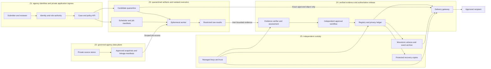

# PRD-02: public-health threat model and cloud decisions

**Record:** PRD-02 / revision 0.1 / 1 October 2026.
**State:** `in_progress` — technical draft; agency review is not recorded.
**Parent:** [production roadmap](production-private-cloud-plan.md).
**Dependency:** [PRD-01 scope and ownership](production-prd01-scope-and-ownership.md)
remains incomplete. This draft does not turn its unknowns into approvals.

The user confirmed agency private cloud for a CDC/MOH-type public-health agency
with large private datasets, and explicitly chose to **keep provider and region
open for now**. Those choices permit provider-neutral design. They do not select
an agency, jurisdiction, official classification, dataset, recipient, privacy
tolerance or production platform. No resources are provisioned by this record.

The later [PRD-11 expansion](production-prd11-adapter-benchmarks.md) broadens
public engineering benchmarks beyond healthcare. This threat model remains the
public-health example; another agency/domain needs its own reviewed threats and
data decisions before deployment. Provider and region remain open.

## 1. System and protection objectives

The proposed service audits an exact model package and governs its release to an
approved recipient while bulk private data stay in agency custody. The first
proposed profile is one agency, one tabular classifier family and full-artifact
delivery. The actual public-health programme/model and PRD-01 S01–S11 decisions
remain pending. Hospital administration is not the selected organizational scope.

Protect confidentiality of agency data and restricted model/evidence outputs;
integrity of policies, approvals, measurements and cumulative disclosure history;
and availability of correctly enforced review and delivery. Availability does not
permit serving under an unverifiable authority, history or required control.

Full-artifact recipients can retain, combine and inspect delivered bytes without
an enforceable local query cap. Membership, sensitive-attribute or reconstruction
risks must be evaluated for that access. Revocation cannot erase prior copies.
Operational screening, scientific privacy claims and agency authorization remain
separate decisions.

This design uses assets, flows, trust boundaries, abuse cases, mitigations and
counterexample tests, informed by the
[OWASP threat-modeling guidance](https://cheatsheetseries.owasp.org/cheatsheets/Threat_Modeling_Cheat_Sheet.html).
It is an engineering threat model, not a security audit or certification.

## 2. Assets and actors

| Asset | Sensitive content or invariant |
| --- | --- |
| A01: source and linkage data | Private records, entity/linkage keys, source authority, longitudinal and cross-programme relationships |
| A02: dataset and cohort snapshots | Immutable version, schema, query/transform plan, partition and contribution identities; correct permitted data scope |
| A03: candidate and recipient package | Model, fitted preprocessing, metadata, parents/components; exact version reviewed and actually delivered |
| A04: evidence | Frozen plan, controls, raw traces, scores, failures, signatures and reviewer summaries; potentially disclosive even when aggregated |
| A05: registry and history | Stable namespace/entity/channel identity, prior disclosures, budget, authorization, revocation, suspension, sequence and head |
| A06: policy and authority | Approved versions, requirements, exclusions, roles/delegations, trust state, keys and validity periods |
| A07: execution and build | Source, adapter/image/dependency digests, job leases, runtime isolation and measured resource use |
| A08: operational copies | Logs, metrics, caches, checkpoints, backups, support downloads and retained delivery receipts |

Consider outsiders; compromised user/workload identities; a dishonest submitter
or tester; malicious candidate code/dependencies; compromised workers; privileged
application, database, backup or cloud operators; and recipients combining current
and earlier disclosures. Accidental corruption, omission, partial failure and
misconfiguration are also threat sources.

Scope does not assume every insider is honest. However, ordinary isolation and
access controls do not prove resistance to arbitrary collusion among all data,
cloud, key and witness administrators. Independent custody and dual control
reduce concentrated authority; residual privileged-host and provider risk needs
an agency decision. No current code or this diagram demonstrates that protection.

## 3. Trust zones and data flows

Zones are logical trust boundaries, not a recommendation to implement each as a
container namespace. Their concrete accounts, networks, service identities,
key custody and administration must be selected and tested before deployment.
Monitoring receives separately classified/redacted events from each zone.

| Flow | Required identity and restriction | Denied alternative |
| --- | --- | --- |
| F01: user to API | Agency identity, current role and case/project scope; session/CSRF and input limits | Shared operator identity or UI-only authorization |
| F02: source to snapshot | Data-steward-approved immutable snapshot, transform/query and linkage versions | Mutable aliases silently resolving to different data |
| F03: candidate to quarantine | Scoped object reference, size/type limits, hash and lineage manifest | Arbitrary local paths, arbitrary remote URL fetches or API deserialization |
| F04: scheduler to worker | Approved image/configuration, job identity/lease and exact input manifest | User-selected executable or image tag with broad agency credentials |
| F05: snapshot to worker | Read-only, expiring grant to approved objects/cohort/query with bounded scans | Whole-store access, another programme's tables, or bulk copies through UI/API |
| F06: worker to raw evidence | Job-specific create grant; immutable results reconciled against the approved plan and authoritative scheduler attempt roster | Overwriting another job's results or removing failed runs |
| F07: raw evidence to verifier | Bounded inert contract, authenticated producer, raw-result hashes and independent metric replay where required | A signature alone accepted as scientific adequacy |
| F08: review to registry | Approved immutable eligibility versions, different authorized principals and guarded atomic admission | Submitter self-approval or stale review reused after policy changes |
| F09: registry to witness/recovery | Durable ordered events, identities, intents and independent acknowledgment | History expectations derived from the restored database itself |
| F10: package to recipient | Gateway admission bound to recipient, current eligibility, witnessed history and exact object version | Raw store URLs, console artifact bundles or direct administrative CLI delivery |
| F11: evidence to reviewer/auditor | Case-level entitlement plus explicit output classification and redaction policy | Recursive export of arbitrary worker files, logs or raw traces |
| F12: services to telemetry/backup | Approved fields, retention, destination and operator grants | Sensitive payloads in general logs, unapproved regions or developer test data |

Default-deny network and object permissions cover both inbound and outbound
flows. Workers cannot reach cloud metadata, instance credentials, general
internet, another job, registry mutations or release keys. Any approved exception
is destination/purpose/job-bound and reviewed. The workflow API cannot obtain
bulk-data grants. The gateway cannot query source records. Internal workers may
read candidates for testing; only the gateway delivers candidate bytes outside
that controlled execution/review boundary.

Treat storage grants, job outputs, evidence downloads, admin APIs and backup
restores as security interfaces. Private networking is not sufficient identity
or authorization, consistent with
[NIST SP 800-207](https://csrc.nist.gov/pubs/sp/800/207/final).

## 4. Threat register and counterexample tests

All entries are **open requirements**, not passing test results. P0 means the
applicable first-profile admission/control must be resolved before go-live.
P1 means operational qualification is needed before the claimed load or expanded
scope is accepted. These are provisional engineering priorities, not numerical
likelihood estimates. Agency security/scientific owners must review applicability
and residual risk after PRD-01 is resolved.

Use synthetic records, controlled fixtures and test principals. Never use real
private data to demonstrate an escape or exfiltration path.

| ID / priority | Scenario | Required control and falsifiable test | Implementation handoff |
| --- | --- | --- | --- |
| TM-01 / P0 | Stolen identity or cross-case access | Change case/project/object/recipient IDs; present a worker token to an approval route; replay expired/revoked credentials. Deny unauthorized metadata, evidence, bytes and ledger mutation on direct API calls. | PRD-05/06/08/18/22; security/backend |
| TM-02 / P0 | Self-approval or outcome-driven policy weakening | Remove a failed tool, change a threshold/recipient or reuse another principal's review. Deny unauthorized changes; authorized material changes require newly bound plans/evidence/review. Race approver revocation and policy changes against commit. | PRD-06/11/12/17/22; policy authority/backend |
| TM-03 / P0 | Signed but false, incomplete or replayed evidence | Substitute artifact, data, job, policy, image, implementation or raw-result identity; omit a failed attempt and submit only its successful retry; use a revoked signer or expired lease. Reconcile the approved plan and scheduler attempt history independently of worker claims; reject missing coverage and metric replay disagreement despite a valid signature. | PRD-08/09/11/12/14/19; ML/security |
| TM-04 / P0 | Snapshot substitution, arbitrary paths or overbroad reads | Swap data behind a familiar alias; change partitions/query/linkage versions; request another programme's cohort or a full extract. Use exact frozen versions or refuse; expired/wrong grants and unapproved reads fail before exposing data. | PRD-07/10/13; data steward/platform |
| TM-05 / P0 | Malicious model escapes its worker | Controlled fixtures attempt sentinel reads/writes, metadata/credential access, other-job access, egress and child-process survival. API never deserializes candidates; sandbox denies access, terminates the whole execution environment and rejects late outputs. | PRD-05/07/09/10/12/20/22; platform/security |
| TM-06 / P0 | Export bypass through evidence, objects or administration | Attempt candidate retrieval as recipient through store URLs, job ZIPs, logs, backups, core CLI and alternate endpoints. All unauthorized routes deny bytes; reviewer output uses an explicit classified roster. Internal approved worker access never grants recipient access. | PRD-06/07/10/18/20/22; gateway/security |
| TM-07 / P0 | Overspending, duplicate commits or ambiguous retry | Race nodes near the cap; duplicate idempotency keys with equal and divergent content; inject serialization failures/crashes at transaction and outbox boundaries. Independent replay finds no excess authorization, lost charge, duplicate effect or detached receipt. Interrupt a transfer after admission: spending is retained, never automatically refunded. | PRD-15/16/18/19/21; database/backend |
| TM-08 / P0 | Revocation/expiry races delivery | Pause a gateway across revocation, evidence invalidation and authority expiry; include retries/range requests. Admissions ordered after revocation fail; earlier streams obey the documented cancellation bound. Record admission revision and observed bytes. | PRD-06/08/15/17/18/20/21; gateway |
| TM-09 / P0 | Internally consistent rollback or new-ledger reset | Restore database, inventory, local audit and objects before a charge and separately before each negative transition. Independent identity/head/events detect rollback; missing events or unresolved intents quarantine delivery. New UUID/epoch cannot erase previous spending. | PRD-08/15/16/18/21/22; database/security |
| TM-10 / P0 | Stale leader, witness, key or clock fallback | Partition dependencies, replay old signed checkpoints, resume fenced leaders and inject clock uncertainty. Deny new admissions without fresh authoritative eligibility/history; preserve charges/revocations. Fail durable admission recording or required witness confirmation: zero recipient bytes may precede successful admission. No cached-approval escape hatch. | PRD-05/08/15/16/18/20/21; SRE/security |
| TM-11 / P0 | Approved software replaced at execution | Change image, dependency, mounted code, configuration or inherited environment after approval. Admission rejects changed content and forbidden mounts; self-declared isolation cannot replace required verified evidence. Test key rotation/revocation as well as image pins. | PRD-08/09/10/12/22/24; build/security |
| TM-12 / P0 | Another profile inherits approval | Change family, recipient, interface, modality or parent/component package. Unsupported combinations fail registration and delivery; a membership screen never substitutes for another required threat. Education and legacy modes cannot start in production. | PRD-11/13/17/18/19/25/26/27; architecture/backend |
| TM-13 / P0 | Linked records contaminate audit or contribution counts | Under an entity-disjoint plan, put aliases of one synthetic person in training and audit, or exceed declared contributions with repeated records. Reject the claim or require a justified new plan. Bind linkage version; unresolved matches are explicit. | PRD-07/11/13; data/scientific owners |
| TM-14 / P0 | Aggregate scores conceal missing populations | Drop a required region/time period/small group or change weights while retaining a strong average. Missing coverage or insufficient evidence blocks the claimed population acceptance; large row count is not proof of representation. | PRD-11/13/19/22; statistical/public-health reviewer |
| TM-15 / P0 | Cross-programme disclosure omitted | Present overlapping model/statistic/score releases to one synthetic recipient, then rename models/entities or omit a history source. Reconcile relevant history; unresolved overlap prevents the applicable accounting claim. | PRD-13/15/16/19; data/registry owners |
| TM-16 / P0 | Poisoning experiment misrepresented as clean candidate evidence | Keep clean and deliberately manipulated candidates distinct. A different-candidate or hypothetical retraining report cannot support the delivered model. Missing/failed attack-specific positive controls block that evidence; bounded detection never proves universal cleanliness. | PRD-11/12/13/14/25; ML/assessor |
| TM-17 / P0 | Evidence and telemetry disclose private information | Plant synthetic identifiers/secrets in metrics, filenames, traces, exceptions and model metadata. Restricted originals stay classified; reviewer/recipient exports and general telemetry exclude unapproved content. Verify access and aggregate disclosure review, not keyword filtering alone. | PRD-07/11/18/20/22; data/security |
| TM-18 / P1 | Huge scans, retries or campaigns exhaust capacity | Submit over-budget scans and duplicate/long-running jobs; saturate queue and storage. Enforce quotas, bounded retries and resource telemetry without exposing rows or allowing an unchecked release; late leases cannot publish accepted results. | PRD-10/20/21; platform/SRE |
| TM-19 / P0 | Backup, staging or support path escapes custody | Attempt restore into an unapproved environment/region, raw-data access through support, or production-data use in CI. Identity and destination restrictions block the path; retention/hold and recovery permissions are independently reviewed. | PRD-05/07/08/20/21/22; data/SRE |

Operational controls bind declared data, identities and observations. They do not
prove that entity linkage, samples, thresholds, mechanisms or population claims
are scientifically adequate. PRD-11/13 and independent domain review must justify
those premises. Review adaptive selection, repeated testing and observable
refusals as part of the recipient's transcript where the claimed privacy scope
requires it; a correct ledger alone is insufficient.

A worker needs only scoped data and output grants. Removing cloud credentials
does not prevent a malicious model from copying its permitted input records into
a permitted output. Treat all raw outputs as restricted and independently verify
the approved summary/package roster before any broader disclosure.

The present pilot's simple public-record split is not an accepted population or
linked-entity design. Likewise, trusted local serialization paths are not safe
intake of adversarial agency models. The
[scikit-learn persistence guidance](https://scikit-learn.org/stable/model_persistence.html#security-maintainability-limitations)
explains the execution risks of pickle-based formats; format conversion itself
must occur inside an approved isolated worker.

## 5. Provider-neutral architecture decisions

The following are reviewable proposals, not deployed controls. Only CD-01's
hosting direction and CD-02's deferral are confirmed user decisions. The other
rows need agency review against PRD-01 and evidence from their implementation
tasks. Account, project and subscription terminology must be mapped to the
selected platform's actual security boundaries.

| ID | Decision and reason | State; proposed decision owner; implementation |
| --- | --- | --- |
| CD-01 | Agency private cloud for the major public-health-agency service; stage only public/synthetic fixtures until private-data admission is approved | **Confirmed user direction**; service owner; all phases |
| CD-02 | Keep provider and region open. Record primary, recovery, key, log, support and backup locations plus provider/operator access before choosing a deployment target | **Deferred by user**; data owner/security/platform; prerequisite to PRD-05 deployment |
| CD-03 | Separate development, staging and production identities, networks, stores and keys. One agency first; programme/case grants still prevent cross-case access within that agency. Test data are public/synthetic unless separately approved | **Proposed**; security/platform; PRD-05/06/07 |
| CD-04 | Reuse an agency-approved compute platform if it proves the required isolation. Candidate loading and attack execution run in disposable, independently constrained workers; hostile-code profiles require an accepted VM or equivalent sandbox boundary. A shared kernel/container or a subprocess is not assumed sufficient | **Proposed**; platform/security; PRD-05/09/10 |
| CD-05 | Keep the control plane free of bulk records. Data-plane jobs receive immutable snapshot/query/transform/cohort references and short-lived, bounded grants. Linkage identities and partition rules are part of provenance; data locality and scan budgets are explicit | **Proposed**; data owner/platform; PRD-07/10/13 |
| CD-06 | Store quarantine candidates and raw results as restricted, immutable versions. A separately reviewed manifest selects releasable package/evidence objects. Digests prove byte identity, not safe content; retention and permitted destruction are policy decisions | **Proposed**; data owner/backend; PRD-07/12/18 |
| CD-07 | Use a transactional authoritative registry, with PostgreSQL as the current proposal. Define one guarded admission/charge/outbox path, stable request identities and explicit duplicate/failure semantics. Selecting a database alone does not establish atomicity or safe distributed delivery | **Proposed**; database/backend; PRD-15/18 |
| CD-08 | Keep the expected ledger identity/head and durable security-event history under separate custody from service/database restore administrators. Witness authorizations, charges, revocations, suspensions, eligibility invalidations and recovery epochs. Retain recoverable event/intents/WAL evidence, not just hashes | **Proposed**; security/database SRE; PRD-08/16/21 |
| CD-09 | Use agency SSO with MFA and current case-scoped authorization for people; short-lived, audience-bound workload identities for services. Enforce separation of submitter, assessor, reviewer and release authority in the service, including privilege/delegation changes | **Proposed**; security/backend; PRD-06/12/17 |
| CD-10 | Put signing/encryption keys in agency-managed key services with separate purposes, narrowly scoped grants and reviewed rotation/revocation. Avoid distributing master keys or long-lived credentials into workers. Key service outage must not enable an alternate signing/release path | **Proposed**; key custodian; PRD-08/12/16 |
| CD-11 | Default-deny worker egress, metadata access and lateral traffic. Explicitly allow only approved object/data/result endpoints needed by that job. External model APIs, telemetry collectors and package downloads remain disabled unless separately approved and qualified | **Proposed**; network/security; PRD-05/09/10/26 |
| CD-12 | Deliver exact approved bytes only through a controlled gateway, bound to recipient and fresh admission. Resume/range/retry requests must recheck eligibility. No reusable object URL may bypass this check; distinguish internal assessment access from recipient release | **Proposed**; backend/security; PRD-17/18 |
| CD-13 | Keep telemetry and recovery copies in approved private custody with field allowlists, role restrictions, retention and hold rules. Restore into isolated quarantine first and reconcile with independent history before reopening delivery | **Proposed**; data owner/SRE; PRD-20/21 |
| CD-14 | Measure the PRD-01 S11 workload before committing capacity, cost, availability or recovery targets. Bound each job's I/O, runtime, memory, storage and retries; compare audit coverage and utility as well as throughput | **Proposed**; service/data/platform; PRD-10/13/20/21 |

### What provider selection must demonstrate

Evaluate agency-approved options against the same requirements rather than
choose a vendor from the illustrative CDC/MOH scope. Before PRD-05 deployment,
the data owner and security/platform reviewers must record:

- Permitted primary and recovery locations for every data class, including
  object versions, backups, logs, keys, service metadata and support access.
- Private data/object endpoints, destination controls, workload identity,
  verified hostile-code isolation and auditable privileged access.
- Immutable/versioned object custody; key lifecycle; database transaction,
  fencing and recovery behavior; independently administered witness/event
  custody that the same restore operation cannot roll back.
- Large-dataset locality, restricted linkage handling, quota enforcement and
  measured feasibility/cost for the agreed S11 workload.
- Exit and recovery arrangements: portable schemas/manifests, retrievable
  history, reviewed migration, and continued validity of recipient and
  cumulative-disclosure records across a platform move.

A missing capability requires a reviewed compensating design and test, or rules
out that configuration. No provider's product name constitutes acceptance.
Deferral permits specification and public-fixture development; it does not
authorize deploying private data into an arbitrary region.

### Admission and recovery invariants

Before committing authorization, independently retain the intent with expected
ledger identity, predecessor and charge footprint, as required by the parent
protocol. Within the authoritative admission operation, guard the versions of candidate,
recipient, required evidence, policy, approvals, current roles/delegations, trust,
revocation and ledger state; re-evaluate current validity/expiry. Record the
accepted version set, request identity, budget effect where applicable and
delivery intent durably. Reconcile the committed event with the independent
witness before making bytes eligible for delivery. A committed but unacknowledged
intent remains quarantined; retries must not create another charge or falsely
declare an uncertain disclosure never happened.

The gateway needs a defined admission linearization point relative to
revocations and policy changes. Admissions after an effective negative transition
are denied immediately. The roadmap's 60-second target concerns stopping streams
that were admitted earlier; it is not a grace period for new downloads, nor a
guarantee of recalling delivered bytes.

The external checkpoint binds agency/portfolio namespace, ledger UUID, recovery
epoch, sequence and head. Recovery compares retained event/intents and custody
records against that expectation. A new database, UUID, epoch or key cannot
reset historical spending or remove negative transitions. Fence stale writers
and reconcile uncertain outcomes before reopening. If evidence cannot establish
a safe state, preserve the affected history and deny delivery until resolved.

## 6. Current implementation versus required production boundary

These are repository observations, not findings from a deployed agency system.
Preserve the existing implementation and its regression fixtures while adding
production services through the roadmap.

| Current surface | Existing scope and production gap | Handoff |
| --- | --- | --- |
| [Console API](../src/model_release_assurance/console/api.py) | Trusted local case bindings accept filesystem paths; loopback/same-origin checks are not agency identity or scoped data custody | PRD-06/07; replace production path intake with governed references |
| [Console worker](../src/model_release_assurance/console/worker.py) and [Compose](../compose.yaml) | Subprocess execution inherits environment; API and worker share a local volume. This is not adversarial workload isolation | PRD-05/09/10; job identity, clean environment, constrained sandbox and termination of the whole execution environment |
| [Artifact exports](../src/model_release_assurance/console/artifacts.py) | Local inventories and ZIPs have bounds, path checks and hashes, but recursively expose generated job/assessment files. Those safeguards do not classify content or enforce recipient release | PRD-07/18/20; restricted originals, reviewed manifests and authorization on every output route |
| [Export red-team contract](../src/model_release_assurance/export_red_team.py) | Exact bindings, controls, thresholds and freshness checks support the bounded local membership pilot. Operator-supplied reports do not establish independent job/image provenance, and this schema is not a universal contract for every attack family | PRD-11/12/14/25/26; typed evidence, producer authenticity, independent replay and family-specific qualification |
| [Temporal web service](../src/model_release_assurance/temporal_assurance/web.py) and [pipeline](../src/model_release_assurance/temporal_assurance/pipeline.py) | Existing screening/review/admission checks are regression requirements. Inventory/database identity checks live in the current trusted local process; they are not an independently anchored anti-rollback service | PRD-15/16/17/18; authoritative eligibility and witnessed durable history across restart/restore |
| [Core temporal store](../src/model_release_assurance/temporal_assurance/store.py) | Direct administrative prepare/commit/download operations exist independently of web screening. Production custody must make the approved gateway the only recipient delivery route | PRD-06/15/18; service grants, deployment restrictions and direct-call bypass tests |
| [Red-team tool discovery](../src/model_release_assurance/red_team_catalog.py) | Native fixture discovery and explicitly unintegrated external tools are useful starting points. Listing SACRO-ML, ART, garak or PyRIT is not an adapter integration or production qualification | PRD-11/14/25/26; staged adapters with independent controls |

The public breast-cancer fixture, local trusted registry and D: development
storage are engineering resources. They do not qualify an agency dataset,
authorize private-data intake, prove a full production mechanism, or select a
production storage destination.

## 7. Open decisions, review and acceptance

| Pending matter | Evidence needed and consequence |
| --- | --- |
| Agency, programme, data scope and recipient | PRD-01 S01–S04; determines jurisdiction/classification, mission harms, data access and recipient threat assumptions |
| Protected entities, linked contributions, utility/privacy criteria and prior disclosure | PRD-01 S05–S08 and PRD-11/13; determines scientifically meaningful populations, controls, mechanisms and cumulative accounting. No threshold or privacy guarantee is inferred |
| Exclusions, accountable authority and scale | PRD-01 S09–S11; identifies accepted limitations, named decision makers, workload envelope and realistic availability/recovery objectives |
| Provider, locations and administration | CD-02 remains explicitly deferred; selection evidence above is required before real PRD-05 deployment |
| Isolation and privileged-operator residual risk | Named security/data owners must accept a defined administrator/provider/collusion model and verify the worker boundary. Architecture alone cannot eliminate privileged-host access or output covert channels |
| Evidence disclosure, retention, holds and support | Data-owner-approved classification, minimum necessary fields, access, retention and destruction across source/model/evidence/log/backup copies; no fixed jurisdiction-specific period is assumed |

### Review record

All appointments and decisions below are **pending**. Roles identify required
review responsibilities; they do not claim anyone has signed.

| Reviewer responsibility | Required review |
| --- | --- |
| Service owner and agency sponsor | Mission, recipient, scope, availability/cost tradeoffs and explicit exclusions |
| Data owner/steward and statistical/public-health reviewer | Data/linkage/contribution scope, population coverage, cumulative disclosures, evidence classification and limitations of attack results |
| Security architect and key custodian | Threat register, role conflicts, provider/operator trust, identity, isolation, key/witness custody and residual risk |
| Platform/database SRE | Provider feasibility, environment boundaries, atomicity, fencing, witness outage and recovery protocol, measured workload assumptions |
| Independent assessor and release authority | End-to-end evidence credibility, review independence, permitted output roster and sole-gateway admission |

Each decision must identify a named approver, exact document/policy revision,
evidence reference, date, scope and unresolved conditions. Keep restricted names
and supporting evidence in approved agency custody; tracked documentation can
reference a non-sensitive decision identifier.

### Completion and implementation handoff

PRD-02 becomes `done` only after PRD-01 scope/ownership is agreed, the threat
model and cloud decisions receive accountable review, and provider/location and
residual-risk decisions needed for deployment are resolved. Respect the user's
current deferral: this record remains `in_progress`, with the technical draft
ready for review. No signatures, infrastructure or tests of deployed controls
are fabricated to close the task.

Threat rows are acceptance scenarios for later implementation tasks, not tests
that passed during drafting. Assign each row to its linked task owner; retain
the exact build/configuration, synthetic fixtures, expected/observed result and
review evidence when executed. Unmitigated P0 scenarios block the applicable
production gate. P1 capacity findings require explicit disposition and cannot
waive a confidentiality, integrity or authorization requirement.

PRD-03 source/build baseline work and PRD-04 CI follow-up can proceed in their
declared order independently of the agency decisions. PRD-05–18 can refine
interfaces and public-fixture prototypes against this draft; their deployment
and production completion gates retain the roadmap dependencies. Revisit this
model when a recipient/interface, data source/linkage, model family, external
adapter, provider, administrative domain or recovery design changes.

Validation of this document checks local links, documentation invariants and
task/threat/decision references. It provides no evidence that future network,
isolation, key, recovery, scientific or privacy controls are implemented.
