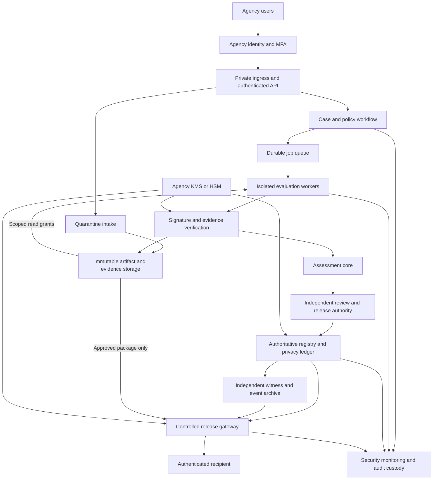

# Agency private-cloud production plan

**Planning baseline:** 1 October 2026. **Hosting:** agency private cloud, selected
by the user. **Framework scope:** sector-neutral government model assurance with
large private datasets. A major public-health agency (CDC/MOH-type) remains one
example pilot; the user requested broader research-dataset validation on D:.
Exact agency and jurisdiction remain unselected.
**State:** proposed delivery plan; no production infrastructure or
authorization service is deployed by this plan. Provider and region remain open
at the user's request. Exact agency, data classification, named owners and budget
remain to be assigned. Role names below
are proposed responsibilities, not recorded approvals.

Work stays in the government repository on D:, based on `0b99589` plus reviewed local changes.
The original research and separate academic repositories are outside this work.
The government implementation is published on GitHub; hosted CI and protected
release settings remain pending. See the
[publication checkpoint](government-academic-separation-plan-2026-10-01.md#government-publication-checkpoint).
Retired advisory files stay in Git history; production evidence custody will
be a new governed service.

## 1. Outcome and first production scope

Build a service in which an agency registers exact candidate packages,
commissions reproducible tests, reviews evidence with separate accountable
roles, and permits delivery only through an enforcing gateway. A successful
attack screen is one prerequisite; it is neither a privacy guarantee nor
institutional authority. The [protocol](model-release-assurance-protocol.md) and
[production exit gates](system-audit-specification.md#production-readiness-exit-gates)
remain applicable. This plan does not declare MRAP-L3/L4 conformance.

Start deployment with **one agency, one approved tabular model family,
one declared recipient group and full-artifact delivery**. Public health is one
proposed use case, while the implementation and engineering benchmarks are sector-neutral. The agency selects purpose, data,
mechanism, threats and tolerances. Begin with public/synthetic data and
assessment-only staging. Enable protected model delivery only after a justified
registration adapter and every applicable acceptance gate pass. The public
GaussianNB pilot cannot be relabelled as private training or used to invent budget.

Restricted prediction APIs, regression, vision, LLMs, RAG, agents, derivatives
and ensembles enter through separately approved capability profiles.
Unsupported profiles stay blocked. More tools or private-cloud hosting do not
remove that condition.

The service workflow is model audit and controlled release from a large agency
data custodian. The initial public-health example concerns a CDC/MOH-type agency,
not hospital administration; it no longer limits the framework to healthcare. Large-data custody is a design requirement, not a measured capability of
the local pilot. Keep bulk private data within the agency data plane and bind
scoped jobs to immutable snapshots/manifests. Longitudinal linkage, protected
entity contributions, representative audit cohorts and previous disclosures
must be resolved in [PRD-01](production-prd01-scope-and-ownership.md) and qualified
in PRD-13. PRD-07/10/21 must demonstrate bounded I/O, resource use and throughput
at an approved scale; a tabular first profile does not imply small source data.

## 2. Baseline and concrete gaps

The latest local implementation ran **1,025 tests: 1,007 passed, 18 skipped**;
37 schemas, 47-document link checks, JavaScript syntax and diff checks passed.
Skips cover optional experiment runtimes and platform capabilities. These are
local implementation results, not production acceptance.
The [red-team guide](red-team-export-review.md) records the implemented scope.

| Area | Present | Production work |
| --- | --- | --- |
| Model audit | Public examples, 25 discovery entries, local reviews | Agency profiles, representative data, utility requirements and independent scientific review |
| Export screening | Hashes, required report, controls, thresholds, repeated checks | Authentic workers, protected evidence and complete required coverage |
| Identity | Trusted local operator | Agency sign-in, MFA, workload identities, case-level permissions and independent approval |
| Intake | Trusted client filesystem paths | Immutable object IDs, quarantine, bounded safe formats and classified custody |
| Execution | Subprocesses; development API and worker share a data volume | Isolated workers, per-job grants, enforced quotas and network boundaries |
| State/release | Local SQLite; web-only gates | Authoritative registry, independent rollback detection and sole delivery gateway |
| Packaging/CI | Development containers, core locks, tests | Immutable approved images, adapter locks, provenance and required tests without relevant skips |
| Operations | Local tooling and audit history | Monitoring, support, incidents, restore, rotation, capacity and retention |

An identity proxy alone would leave alternate read/export paths. Production
must not point at a developer's `workflow.json`, SQLite database, D: drive or
OneDrive folder. Existing local records belong in a non-authorizing historical
collection; production candidates need authenticated registration, reviewed
lineage and prior-disclosure accounting.

## 3. Target architecture

Use agency-approved managed services where available. Prefer the agency's
supported container platform; supported VMs are acceptable if they meet the
same separation, availability and worker-isolation tests. Avoid introducing a
new Kubernetes operating burden solely for this application. Keep provider
infrastructure modules separate from application contracts.

| Component | Proposed responsibility |
| --- | --- |
| Private ingress | TLS, agency access, request limits, session/CSRF controls; no unauthenticated service routes |
| Workflow API | Case metadata and approved policy versions; no deserialization, arbitrary paths, release signing key or unrestricted downloads |
| PostgreSQL registry | One authoritative writer path for state, immutable events, guarded head updates, privacy charges and transactional outbox |
| Object storage | Content-addressed packages and evidence; encryption, immutable versions, retention locks and separate administrative custody |
| Scheduler | Approved image/config selection, bounded queue, immutable job manifests, leases and idempotent execution; no release authority |
| Workers | Ephemeral isolated jobs, read-only inputs, separate output grant, CPU/RAM/GPU/time/query limits, denied egress; no ledger write or release key |
| Gateway | Sole recipient delivery path; narrow artifact reads and current registry/witness decisions; no standing public object URLs |
| KMS/HSM and trust registry | Separate policy, worker, registry and gateway identities; enrollment, rotation, revocation and agency algorithm policy |
| Independent witness | Monotonic ledger identity/epoch/head and event custody outside the registry administrator's control |
| Monitoring/recovery | Agency SIEM, protected audit, replicated event/WAL recovery, encrypted tested backups and incident responders |

Workers may read quarantined candidates, but only the gateway may deliver
approved artifacts to recipients. Storage grants and network paths enforce
this distinction. Infrastructure administrators remain a separate threat:
use independent custody, dual control and monitoring, with explicit residual
risk; do not claim protection against arbitrary administrator collusion.

Private network membership is not authorization. This design is informed by
[NIST SP 800-207](https://csrc.nist.gov/pubs/sp/800/207/final). If Kubernetes is
selected, test actual admission, network and workload restrictions against its
[security checklist](https://kubernetes.io/docs/concepts/security/security-checklist/).
Ordinary containers and namespaces alone are not accepted as hostile-model isolation.

## 4. Identity, data and release invariants

| Role | Responsibility | Separation requirement |
| --- | --- | --- |
| Model owner | Submit candidate, purpose and lineage | Cannot approve own release or alter accepted results |
| Data steward | Approve data scope, access, retention and recipient conditions | Cannot mint a mechanism or scientific pass |
| Test operator | Launch approved plans | Cannot authorize delivery or substitute results |
| Independent assessor | Review controls, uncertainty and scientific adequacy | Distinct from the candidate submitter |
| Policy authority | Approve threat requirements, thresholds, exclusions and policy changes before execution | Distinct from submitter/test operator; any combination with assessor roles needs a documented conflict-of-interest decision |
| Release authority | Approve the exact reviewed release within delegated scope | Different principal from submitter; current eligibility checked |
| Platform/SRE | Operate and recover services | No routine approval or unilateral spending reset |
| Security/key custodian | Trust, incidents and key custody | Separate from routine application/database administration |
| Auditor | Read authorized evidence and history | No mutation, raw-data access or signing by default |

Apply case/agency/project authorization to every API, download, job, search
result and evidence reference. Enforce session expiry, identity revocation,
step-up MFA and workload token audience/scope. Test without UI restrictions.
Emergency access may suspend releases or recover service; it must not silently
bypass gates or refund spending. Elevation is time-limited, independently
approved and audited.

Separate development, staging and production into cloud projects/accounts or
equivalent security domains, with separate keys, stores, databases and identities.
No production data in development or ordinary CI. External model APIs are denied
by default; data-steward approval must cover any destination and retained logs.

Production startup rejects `legacy_unassessed`, education overrides, synthetic
export routes, unsigned reports and local-path intake. Replace mutable global
inventory with governed per-model policy versions. Material changes invalidate
affected evidence and approvals. Never convert demo reviews to production
approval or restamp old evidence into newer contracts. A changed threshold or
required tool needs protected policy approval and a newly frozen plan; an owner
cannot weaken a rule after seeing results and reuse existing evidence/review.
The assessor must address prior outcome knowledge, selection and independent
audit data before a replacement campaign can support a decision.

Bind jobs and decisions to case, candidate/preprocessing bytes, parent/component
lineage, recipient interface/history, data/split identity, policy version,
worker image/dependencies/configuration, tool revisions, controls, seed, resource
limits and validity times. Restrict raw records and attack traces. Reviewer
bundles and telemetry use approved aggregates/redactions checked for leakage
and audit adequacy.

Agency decisions must establish classification, residency, retention, legal
holds and deletion before production intake. Retention locks follow those
decisions, not a universal invented duration. Cover worker-disk cleanup, object
lifecycle, backup expiry and account closure. Revoking delivery does not recall
previously disclosed copies.

## 5. Atomic authorization, delivery and recovery

Preserve fail-closed checks, expiry, exact-byte binding and idempotency.
A PostgreSQL migration needs an explicit transaction/failure model, guarded
head/sequence updates, constraints and bounded whole-transaction retries.
[PostgreSQL's isolation guide](https://www.postgresql.org/docs/current/transaction-iso.html)
documents serialization failures and retry requirements; service linearizability
and failover still require independent evidence.

Review and test this proposed protocol before adopting it:

1. Validate current evidence, independent approvals, policy and recipient.
   Independently retain an intent with expected ledger identity, predecessor
   and charge footprint. An unavailable required witness blocks delivery.
2. At atomic admission, compare the expected head/revision and guarded versions
   of all eligibility inputs: policy, evidence, approvals, trust/role and
   revocation state. Recheck expiry against the trusted current clock. Apply
   charges and persist authorization, receipt, immutable event and outbox in
   that transaction. Any changed prerequisite aborts or requires full
   reassessment; a validation outside the transaction is not sufficient.
3. Publish the event idempotently to independent immutable custody and the
   monotonic witness. Acknowledge successful authorization only after required
   witness acknowledgment. An ambiguous response is pending/unknown, never a
   refund or an uncharged retry.
4. The gateway obtains a linearized delivery admission against current
   authorization/revocation, fresh witnessed history, recipient, expiry and
   exact object version/hash. Record its registry revision before sending
   bytes. An admission ordered after revocation must fail; stale replicas or
   leaders cannot grant it. Interrupted transfers retain spending and do not
   prove recipient receipt. Retries need a fresh admission for the same package.

Independently protect `(agency/portfolio, ledger UUID, epoch, sequence, head)`.
Protected history includes revocations, suspensions, evidence invalidations,
policy/trust changes and recovery epochs as well as authorizations. Require a
fresh authoritative witness observation and fencing of stale leaders; an old
witnessed authorization is not evidence that a later revocation never happened.
Retain replicated WAL, immutable events, intents, signatures, policies, trust
history and object versions. A head hash alone cannot reconstruct erased charges.
Old backups, contradictory witnesses, missing events and unresolved intents keep
delivery quarantined until reconciled conservatively. A new ledger UUID/epoch
requires a governed transition linked to prior history with cumulative spending
preserved; changing model IDs, recipients or environments is not a budget reset.

Test every crash boundary, duplicate, queue retry, failover, split brain, clock
rollback, key outage and partial restore, including truncation of each negative
transition. Race policy changes, evidence expiry and approver loss of authority
against commit; pause a gateway across revocation and require the correct
admission ordering. Reconcile in-doubt operations before
reopening exports. Application rollback cannot roll back budget history,
revocations or evidence. Incompatible schema migrations need forward recovery
and retained compatible verifiers.

## 6. Red-team and evaluation programme

Freeze purpose, actual recipient access, protected unit, required attacks,
utility baselines, controls, representative samples, uncertainty, selection
rules, multiplicity, stopping limits and expiry before outcome inspection.
Required failures or unsupported attacks block progression. Optional exclusions
need separately recorded policy-permitted scope decisions, never fabricated passes.

Create a versioned, typed adapter contract before expanding the current pilot.
Its membership counts/AUC controls cannot faithfully represent extraction,
robustness or LLM outcomes. Use family-specific measurements and controls with
a common inert envelope and raw-result hashes. Preserve the distinction between
operational screens and the
[scientific attack battery](sacro-ml-red-team.md#policy-bound-assessment-integration).

Run adapters in separate approved images. Pin source, dependencies, weights,
tokenizer/scorer assets, image digests and licenses. Capture hardware/runtime,
enforce budgets externally, and independently replay critical metrics. The
worker's signature authenticates origin and bytes, not scientific truth.
Required isolation attestation stays blocked until actually verified. Do not
load untrusted pickle/joblib in the API or assurance core; model execution stays
sandboxed even with constrained formats. See the official
[scikit-learn persistence guidance](https://scikit-learn.org/stable/model_persistence.html#security-maintainability-limitations).

| Order | Proposed adapter | Required acceptance |
| --- | --- | --- |
| 1 | Native pilot and selected classifier family | Governed jobs, authentic provenance, attack-specific controls, replay and explicit scientific evidence roles; regression remains an expansion profile |
| 2 | [SACRO-ML](https://github.com/AI-SDC/SACRO-ML) | One supported tabular/model pair and membership method first; structural diagnostics separately labelled; add shadow-model LiRA only after reproducible retraining |
| 3 | [ART](https://github.com/Trusted-AI/adversarial-robustness-toolbox) | Individually approved inference/extraction/evasion/poisoning methods; realistic access and valid perturbations; preserve preprocessing and sensitive-field mapping |
| 4 | [garak](https://github.com/NVIDIA/garak) | Approved LLM endpoint, probe/detector allowlist, corpus/model/version binding, detector validation, unscoreable outcomes and human review |
| 5 | [PyRIT](https://github.com/microsoft/PyRIT) | Selected multi-turn/RAG/agent campaigns; distinct target/attacker/judge identities, conversation state, bounded retries/spending and simulated side effects |

[PRD-14](production-prd14-sacro-adapter.md) now implements one bounded local
SACRO-ML probability-membership comparison over seven public classifier profiles,
with explicit regression non-applicability and independent metrics. This is not
production acceptance or coverage of every SACRO method. PRD-25 adds a separate
[ART retained-loss comparison](production-prd25-art-adapter.md) over eight public
classification/regression profiles; it does not qualify live target queries. The scoped garak component
adapter adds a local synthetic prompt-injection fixture. The scoped PyRIT
adapter adds bounded upstream multi-turn orchestration with a scripted attacker. Broader garak
profiles remain **unimplemented**. The order is an engineering recommendation,
not an instruction to install every tool. Retain native fixtures as regression
references; independently validate attack-specific end-to-end positive and null
controls for agency acceptance. PRD-14's public probability controls test its
attack feature/scoring path. Review transitive licenses, datasets and weights.

For each attack, test a known failure, a null/clean case, insufficient samples,
malformed evidence, changed bindings and a timeout. Separate attack training,
calibration and audit. Low-FPR claims require suitable sample counts and
uncertainty; mean AUC alone is insufficient. Multiple prompts/detectors and
overlapping records are not automatically independent trials. garak's
[reporting specification](https://reference.garak.ai/en/stable/reporting.html)
describes detector/reporting assumptions that must be preserved.

Extraction matters differently for full-artifact delivery: the recipient already
gets model parameters, so query-only secrecy claims would be inappropriate.
Poisoning experiments on retrained copies do not prove an existing candidate is
clean. Derivatives need parent/component hashes, overlap and prior-access
accounting. API profiles need live output/rate/state/bypass verification.
RAG/agents need retrieval and tool permissions, synthetic-secret exfiltration
tests and evaluated judges before live integration.

Unsuccessful attacks never establish DP. An applicable DP claim independently
needs justified unit/adjacency, mechanism and cumulative accounting, with the
actual implementation and assumptions reviewed; see
[NIST SP 800-226](https://csrc.nist.gov/pubs/sp/800/226/final).

## 7. Delivery backlog and owners

**PRD-01 is in progress**: its [scope and ownership record](production-prd01-scope-and-ownership.md)
is drafted; agency decisions and accountable appointments are pending.
**PRD-02 is in progress**: its [threat model and cloud decisions](production-prd02-threat-model.md)
are drafted; agency review and provider/region selection remain pending, with
the latter explicitly deferred by the user. **PRD-03 is in progress**: the
[source/build baseline](production-prd03-source-build-baseline.md) captures
current local work and repeat-build evidence; publication and protected release
configuration remain pending. **PRD-04 is in progress**: the
[required CI profile](production-prd04-required-ci.md) and package/release gates
are implemented locally; authenticated remote matrix runs and required-check
verification remain pending. **PRD-05 is in progress**: the
[infrastructure scaffold](production-prd05-infrastructure-scaffold.md) adds
validated provider-neutral intent and a local public-fixture lifecycle rehearsal.
Provider infrastructure, cloud isolation and deployment/teardown acceptance
remain pending. **PRD-06 is in progress**: the
[identity and approval contract](production-prd06-identity-and-approvals.md)
implements signed-token, current-permission and independent-review checks in a
public fixture. Agency SSO/MFA, durable authority and deployed enforcement remain
pending. **PRD-07 is in progress**: the
[governed storage fixture](production-prd07-governed-storage.md) implements exact
object/snapshot references, bounded workload reads and retention/hold decisions.
Private intake, cloud custody, durable grants and large-data qualification remain
pending. **PRD-08 is in progress**: the
[key-trust fixture](production-prd08-key-trust.md) adds access-token signing
contracts and current registry checks across identity and storage operations.
Agency KMS/HSM custody, durable administration and other key purposes remain
pending. **PRD-09 is in progress**: the
[build-control fixture](production-prd09-build-controls.md) adds exact dependency
artifacts, SBOM/license evidence, advisory coverage and signed local provenance.
License approval, production images, protected builders and deployed admission
remain pending. **PRD-10 is in progress**: the
[durable public-fixture job workflow](production-prd10-durable-jobs.md) adds
leases, permanent input reservations, current authorization and controlled child
processes. Agency authority recovery, image admission and cloud isolation remain
pending. **PRD-11 is in progress**: [typed public-data adapters and cross-sector
benchmarks](production-prd11-adapter-benchmarks.md) add numeric candidate replay
and explicit research-dataset coverage. Production worker integration, independent
scientific acceptance and wider modality adapters remain pending. **PRD-12 is in
progress**: [authenticated local replay evidence](production-prd12-authenticated-evidence.md)
adds purpose-bound signatures, durable challenges and fail-closed production
isolation requirements. Agency custody and platform/job integration remain
pending. **PRD-13 is in progress**: [prospective public model registration](production-prd13-model-registration.md)
adds registration before fitting for eight pinned profiles, exact source/sample
lineage, explicit population and non-DP limits, a frozen utility comparison and
local disclosure history. Arbitrary import is refused; external history and
agency/scientific qualification remain unresolved, so no candidate is cleared.
**PRD-14 is in progress**: the [scoped SACRO-ML adapter](production-prd14-sacro-adapter.md)
uses the pinned external implementation, frozen attack settings and positive/null
controls, with independent score replay for seven public classifiers and explicit
unsupported regression. It makes no clearance or production-isolation claim;
agency scientific, security, licensing and maintenance acceptance remain pending.
**PRD-15 is in progress**: [local registry transactions](production-prd15-registry-transactions.md)
add atomic fictional charges/heads/receipts/outbox, explicit migrations and
process-crash, duplicate and broker-handover checks. Production PostgreSQL
failover, accepted privacy accounting and durable agency authority remain pending.
**PRD-16 is in progress**: [witness and recovery fixtures](production-prd16-witness-recovery.md)
retain full history and pre-commit intents, require external own-log checkpoint
floors and reconcile uncertain commits. Local rollback/crash checks pass; separate
agency custody, signed remote observations and PostgreSQL recovery remain pending.
**PRD-17 is in progress**: [local policy and independent review](production-prd17-policy-review.md)
binds current signed pre-execution approval, prospective registered training and
retained authenticated replay, distinct canonical reviewers, guarded immutable
policies and scoped delegation. Agency authority/scientific qualification and
independently witnessed approval custody remain pending.
**PRD-18 is in progress**: [controlled public-fixture delivery](production-prd18-controlled-delivery.md)
binds current human-recipient grants and exact reviewed candidate bytes to
per-chunk admissions, lifecycle revocation and retained own-log floors.
Production delivery is refused; independent agency custody and protected
cloud/alternate routes remain pending.
**PRD-19 is in progress**: [one public profile end to end](production-prd19-end-to-end-profile.md)
freezes a combined native/SACRO plan before fresh registered training, binds
independent reviews and delivery to both results, and replays a signed historical
receipt under external pins. Atomicity covers the fixture activation; private-data
scientific qualification and real charge/authorization remain pending.
**PRD-20 is in progress**: [redacted monitoring and incidents](production-prd20-monitoring-incidents.md)
adds local atomic fault/incident/alert history, retained floors, a deduplicating
receiver and current-authority incident transitions. Worker/key/data/ledger
fault drills remain public fixtures; agency SIEM, independent custody and
appointed on-call response acceptance remain pending.
**PRD-21 is in progress**: [capacity and historical recovery](production-prd21-capacity-recovery.md)
adds bounded public I/O, real job-concurrency measurements and witnessed
backup/restore, with current-delivery-context restart denials. Agency-approved
scale, provider HA and independent restore acceptance remain pending.
**PRD-22 is in progress**: [local assessment handoff](production-prd22-independent-assessment.md)
adds fixed fresh adversarial probes, signed externally pinned packets and scoped
current local finding review. Appointed deployed security/scientific assessment
and agency acceptance remain pending.
**PRD-23 is in progress**: [restricted local pilot plan](production-prd23-restricted-pilot.md)
binds exact public evidence, seven current signed people and scoped local plan
review/suspension/withdrawal. Actual agency pilot admission remains blocked.
**PRD-24 is in progress**: [exit review and operational handover preparation](production-prd24-operational-handover.md) binds the exact current plan and records pending agency capacity/cost, support, maintenance and terminal local retirement. PRD-25 adds a separate retained-loss ART diagnostic; agency handover remains pending.

**PRD-25 is in progress**: [pinned ART retained-loss membership comparison](production-prd25-art-adapter.md) preserves all eight profile group rosters, including conflicting labels and continuous regression, with actual learner-path controls and independent fitted-score replay. Scientific acceptance, live interfaces and other attack families remain pending. PRD-26 adds the separate garak fixture below.

**PRD-26 is in progress**: [the garak component fixture](production-prd26-garak-adapter.md) calls a real pinned upstream probe and detector with four fixed templates, three synthetic wrappers, controls and independent transcript/score replay against one local Ollama model. Agency endpoint approval, full scanner coverage, semantic/human review and verified isolation remain pending. The separate [PyRIT component](production-prd26-pyrit-adapter.md) now adds real upstream multi-turn orchestration, a scripted attacker, in-memory conversation storage and literal scoring for two fixed public synthetic objectives. The separate [bounded adaptive attacker](production-prd26-pyrit-adaptive-adapter.md) now supports model-generated follow-ups using retained target feedback with distinct roles sharing one local model. Both live objectives stopped on the first target turn; controlled upstream fixtures exercise later-turn feedback. Independent attacker qualification, human scoring and live interface acceptance remain pending.
Other tasks remain **planned**.
Dependencies are task IDs, not completion claims. PRD-04 may prepare and locally
validate CI against the captured PRD-03 source while its publication gate remains
pending; remote required-check/branch-protection verification cannot be claimed
until hosted checks and the relevant release decisions are verified.
Proposed owners need appointments in PRD-01. Parallel work requires satisfied
dependencies and adequate staffing.

| ID | Phase | Owner | Depends | Deliverable and acceptance evidence |
| --- | --- | --- | --- | --- |
| PRD-01 | M0 | Agency sponsor (unassigned) | — | **In progress:** [scope/ownership draft](production-prd01-scope-and-ownership.md); named owners and agreed purpose, classification, recipient, model/interface, tolerances and exclusions remain pending |
| PRD-02 | M0 | Architecture/security | PRD-01 | **In progress:** [threat model and cloud decisions](production-prd02-threat-model.md) drafted with 19 threat scenarios and 14 decision records; agency approval and deferred provider/region selection required before completion/deployment |
| PRD-03 | M0 | Engineering lead | — | **In progress:** [local source/build baseline](production-prd03-source-build-baseline.md), exact builder inputs and repeat-wheel checks; publication, ownership/licensing and branch protection remain pending |
| PRD-04 | M0 | Test lead | PRD-03 | **In progress:** [required CI profile](production-prd04-required-ci.md), no-skip runner and Windows/Ubuntu package/release gates implemented locally; authenticated remote evidence and required-check verification pending |
| PRD-05 | M1 | Platform/SRE | PRD-02 | **In progress:** [validated intent and local lifecycle rehearsal](production-prd05-infrastructure-scaffold.md); reviewed provider infrastructure-as-code, isolated cloud dev/staging/prod, DNS/TLS/endpoints and cloud deployment/teardown acceptance remain pending |
| PRD-06 | M1 | Security/backend | PRD-02, PRD-05 | **In progress:** [signed-token/case-permission/independent-review fixture](production-prd06-identity-and-approvals.md) and misuse tests; actual agency SSO/MFA, workload enrollment, durable current authority and deployed bypass/revocation acceptance remain pending |
| PRD-07 | M1 | Backend/data steward | PRD-02, PRD-05 | **In progress:** [public-fixture references, scoped workload reads and retention controls](production-prd07-governed-storage.md), with misuse tests; provider storage IAM/encryption/immutable custody, private intake, approved query/cohort snapshots, durable grants and agency-scale acceptance remain pending |
| PRD-08 | M1 | Key custodian | PRD-02, PRD-05 | **In progress:** [access-token signer/trust-registry contracts](production-prd08-key-trust.md), with rotation/revocation/stale-trust/outage integration tests; agency KMS/HSM custody, durable authenticated administration/recovery, other signing/encryption purposes and deployed acceptance remain pending |
| PRD-09 | M1 | Build/security | PRD-03, PRD-04 | **In progress:** [hash-locked public-fixture dependencies, SBOM/license inventory, advisory checks and signed local provenance](production-prd09-build-controls.md); agency license approval, qualified images/adapters, protected builders/trust and deployed admission remain pending |
| PRD-10 | M2 | Platform/ML | PRD-05, PRD-07, PRD-08, PRD-09 | **In progress:** [durable fixture jobs, leases, one-use grants and controlled workers](production-prd10-durable-jobs.md), with restart/race/timeout/revocation checks; durable agency authority/recovery, approved image admission and verified metadata/secrets/filesystem/egress isolation remain pending |
| PRD-11 | M2 | ML/independent assessor | PRD-01, PRD-10 | **In progress:** [typed numeric classification/regression adapters, native controls and saved-candidate replay](production-prd11-adapter-benchmarks.md), with broader public research samples and explicit missing profiles; production isolation/worker integration, scientific acceptance and wider modalities remain pending |
| PRD-12 | M2 | Backend/security | PRD-06, PRD-08, PRD-11 | **In progress:** [signed local replay evidence, exact artifact/context bindings and durable one-use challenges](production-prd12-authenticated-evidence.md); forged/replayed reports, changed source and revoked signers rejected; production image/isolation attestation and authoritative job integration remain pending |
| PRD-13 | M2 | Scientific lead/data steward | PRD-01, PRD-07 | **In progress:** [registration before fitting for eight pinned public profiles](production-prd13-model-registration.md), fixed native training, exact lineage, population/non-DP limits, frozen utility comparison and local disclosure history; arbitrary import refused, external history unknown, agency/scientific qualification and privacy accounting remain pending |
| PRD-14 | M2 | ML/test lead | PRD-11, PRD-12 | **In progress:** [pinned SACRO-ML probability-membership comparison](production-prd14-sacro-adapter.md), frozen controls and independent metrics for seven public classifiers with explicit regression non-applicability; no clearance, agency scientific/security/license acceptance and a named maintenance owner remain pending |
| PRD-15 | M3 | Backend/database SRE | PRD-02, PRD-06, PRD-07 | **In progress:** [local atomic registry/migration/outbox](production-prd15-registry-transactions.md) with signed current guards, fictional accounting, process races/crashes and broker handover; PostgreSQL/HA failover, real accountant and agency acceptance remain pending |
| PRD-16 | M3 | Security/database SRE | PRD-08, PRD-15 | **In progress:** [local witness/intent recovery](production-prd16-witness-recovery.md) with retained full history and external own-log floors; rollback/fork, missing-intent, stale/new-ledger and process-crash checks; independently administered cloud custody and authenticated recovery remain pending |
| PRD-17 | M3 | Backend/release authority | PRD-06, PRD-12, PRD-13, PRD-15 | **In progress:** [bound local policy review](production-prd17-policy-review.md), prefit approval, current independent acknowledgments, scoped delegation and retained weakening/reuse denials; agency and scientific qualification remain pending |
| PRD-18 | M3 | Gateway/security | PRD-07, PRD-16, PRD-17 | **In progress:** [controlled fixture gateway](production-prd18-controlled-delivery.md), scoped human grants, current exact-byte admissions, suspension/revocation, restore and API bypass checks; protected agency cloud routes and independent custody remain pending |
| PRD-19 | M3 | Backend/assessor | PRD-13, PRD-14, PRD-16, PRD-18 | **In progress:** [public profile](production-prd19-end-to-end-profile.md) with prefit combined plan, native/external tests, bound review, atomic fixture activation, exact delivery/lifecycle and historical receipt; real charge/authorization and agency qualification remain pending |
| PRD-20 | M4 | SRE/security | PRD-10, PRD-16, PRD-18 | **In progress:** [redacted local monitoring, audit floors, alert routing and runbooks](production-prd20-monitoring-incidents.md); injected worker/key/data/ledger faults produce retained alerts; agency SIEM, independent custody and on-call response acceptance pending |
| PRD-21 | M4 | SRE/database owner | PRD-16, PRD-19 | **In progress:** [bounded public capacity measurements and historical recovery](production-prd21-capacity-recovery.md); retained fictional charges/receipts and denied unreviewed fixture delivery; approved agency-scale workloads, provider failover and independent restore acceptance pending |
| PRD-22 | M4 | Independent security/assessor | PRD-19, PRD-20, PRD-21 | **In progress:** [local assessment handoff](production-prd22-independent-assessment.md), fresh bounded adversarial probes, signed exact packets and current local finding review; appointed deployment penetration/scientific/control assessment and explicit agency acceptance remain pending |
| PRD-23 | M5 | Sponsor/release authority | PRD-22 | **In progress:** [restricted local pilot plan](production-prd23-restricted-pilot.md), exact public evidence, seven signed current people, named support/suspension and guarded review; actual agency admission and evidenced pilot acceptance remain blocked by PRD-22 findings |
| PRD-24 | M5 | Service owner | PRD-23 | **In progress:** [local exit-review and handover preparation](production-prd24-operational-handover.md), exact signed pilot binding, support/maintenance, pending capacity/cost and terminal local retirement; actual agency pilot exit and operational acceptance remain pending |
| PRD-25 | Expansion | ML/scientific lead | PRD-14, PRD-23 | **In progress:** [pinned ART retained-loss membership comparison](production-prd25-art-adapter.md) over eight public profiles, including regression; live interfaces, additional families and independent scientific/security/license acceptance remain pending |
| PRD-26 | Expansion | LLM security/data steward | PRD-10, PRD-12, PRD-23 | **In progress:** [garak](production-prd26-garak-adapter.md) and [PyRIT](production-prd26-pyrit-adapter.md) component fixtures plus a separate [bounded adaptive attacker](production-prd26-pyrit-adaptive-adapter.md); independent attacker qualification, live interfaces, human scoring, worker isolation and approved agency egress remain pending |
| PRD-27 | Expansion | Architecture/agency owner | PRD-23 | Separate acceptance for new recipient APIs, derivatives, vision, agencies or classifications; no blanket inherited approval |

This expands P1-05/P1-06/P1-08–P1-13 and P2-01/P2-04–P2-07 in the
[fine-grained plan](government-academic-separation-plan-2026-10-01.md). It does not
complete scientific or publication obligations by adding task names.

### Concrete first implementation entry points

- `console/api.py`: replace trusted filesystem binding with authenticated object
  references; enforce authorization throughout case and evidence operations.
- `console/worker.py`: replace inherited local subprocess trust with governed
  jobs and isolated execution. Development shared volumes are not production custody.
- `export_red_team.py` and `red_team_catalog.py`: retain native regression
  controls; add typed adapter envelopes and independently verified provenance.
- `temporal_assurance/store.py`, `pipeline.py` and `web.py`: extract a command
  service with common transaction/security enforcement for every production
  entry point. Direct core/CLI methods must not bypass that boundary.
- `models.py`, schema registration and lifecycle verification: version new
  contracts, authenticate roles and implement previously external registry,
  activation, suspension and attestation obligations without weakening gates.
- `.github/workflows/ci.yml`: explicitly include `test_export_red_team.py`,
  `test_red_team_catalog.py` and `test_temporal*.py` with required dependencies.
  The current API bootstrap patterns omit `test_temporal_red_team.py`.
- Add production infrastructure, images and operational runbooks separately
  from `Dockerfile.console` and development Compose. Build immutable packages;
  do not promote an editable installation or mutable base-image tag.

## 8. Release gates and operating targets

| Gate | Evidence required |
| --- | --- |
| M0: agreed design | Approved scope/owners/threat model; reproducible baseline and required CI |
| M1: protected foundation | Staging recreated from reviewed code; identity, storage, key and build controls independently exercised |
| M2: trusted evidence | Approved isolated jobs produce authentic replayable evidence; population/mechanism and utility requirements justified |
| M3: enforced release | Concurrency/crash/retry histories preserve budget; no alternate delivery route; stale/changed evidence blocks everywhere |
| M4: operational readiness | Independent security/scientific review, restore, incident, capacity and key exercises passed for actual deployment |
| M5: agency go-live | Authority accepts evidenced scope and residual risk; support and suspension procedures active; restricted pilot passes exit review |

Missing mandatory evidence, invalid controls, unsupported required attestation,
unjustified mechanisms, ambiguous ledger history or unresolved critical security
findings cannot become passes through an administrative waiver. Scope exclusions
are agreed before execution and do not change a failed required gate.

These are **initial engineering targets**, subject to agency approval and
measurement; they are not current capabilities or service commitments:

| Measure | Starting target / constraint |
| --- | --- |
| Workflow/authorization availability | 99.9% monthly for the approved profile; correct security denials distinguished from dependency outages |
| Workflow latency | p95 under 2 seconds for ordinary metadata/status at approved load; tests, uploads and transfers measured separately |
| Load qualification | Declare users, releases/day, artifact sizes and worker hours; sustain 2x agreed peak with bounded queues and no correctness loss |
| Revocation | Admissions ordered after revocation fail immediately; target stopping previously admitted streams within 60 seconds, with tested rechecks/cancellation |
| Recovery point | Zero lost acknowledged authorizations/privacy charges; non-authoritative UI metadata target at most 15 minutes |
| Recovery time | Target 4 hours for validated service recovery; exports remain suspended if history/evidence is unresolved |
| Incident response | On-call acknowledgment target 15 minutes for release bypass, key compromise, ledger divergence or exfiltration; agency supplies notification obligations |
| Exercises | Before go-live and quarterly restore/key drills; repeat after material platform, interface or accounting changes |

An in-progress transfer may disclose bytes before revocation arrives. Specify
grant/stream lifetimes and cancellation behavior without promising recall.
Identity, key, clock, registry or required witness uncertainty denies new release
actions and raises an incident; stale cached approval is not a substitute.

## 9. Delivery estimate, costs and first sprint

A preliminary planning range is **4–6 months for the bounded first profile**,
assuming an available agency platform and parallel staffing. This is an estimate,
not a commitment. Procurement, onboarding, accreditation, scientific gaps or
unsupported formats can extend it. Re-estimate after M0; broader agencies,
interfaces and LLM/agent support require additional profile-specific work.

Plan for an engineering lead, two backend/platform engineers, one ML/evaluation
engineer, one test/security engineer and SRE capacity, plus agency data,
independent statistical, release and security reviewers. Required independence
cannot be collapsed into the submitter. Reuse agency identity, key, database and
monitoring teams where available. Staffing and on-call coverage need explicit
resourcing.

Budget from measurable units: environments/support; database HA/WAL/backups;
immutable object GB-months/retention; worker CPU/GPU-hours; model storage and
private transfer; KMS operations; logs/SIEM; software/support licenses; and
external assessment. Set project/campaign quotas and stop limits. No provider
price or procurement is assumed. Begin the tabular pilot with CPU workers;
justify GPU capacity with measured requirements.

The **first two-week sprint** targets reviewable PRD-01/02 drafts and the
independent PRD-03 baseline followed by PRD-04 CI work, while reviewing
PRD-05–09 designs. Record scope/owner gaps, threat/data flows, service
requirements, proposed roles, build inputs and migration tests. Provider and
region stay open as requested; procurement/selection and agency appointments
are not assumed sprint deliverables. Model selection and initial PRD-13
feasibility review depend on agency input. Task closure retains each row's
acceptance evidence, including authentication for publication and approved cloud
decisions before deployment. Private-data production intake or public exposure
is outside that sprint's acceptance.

## 10. Standards, verification and maintenance

Map actual agency controls to evidence instead of claiming certification from
framework names. Use the
[NIST AI RMF and applicable profiles](https://www.nist.gov/itl/ai-risk-management-framework)
for model-risk governance,
[NIST SSDF](https://csrc.nist.gov/pubs/sp/800/218/final) for development and supply
chain, and a pinned [OWASP ASVS](https://owasp.org/projects/asvs) requirement set
for application verification. These are technical references, not a legal or
agency-accreditation determination. The compliance owner supplies the applicable
obligations and retains their versions and control mappings.

Build provenance binds exact source, dependencies and builder, verified at
deployment; the [SLSA provenance specification](https://slsa.dev/spec/v1.1/provenance)
is a design reference. Build signing does not establish scientific adequacy.
Official references were checked during this planning turn; recheck versions at
design freeze and maintenance review. The official AI RMF page notes revision work.

Retain a versioned acceptance bundle for each deployed release: source/image
digests, schema manifest, infrastructure revision, role/trust configuration,
model/profile scope, policies, tests including skips/failures, workload/restore/
incident evidence, independent findings, approvals and handover. Sensitive
configuration stays private; public Git receives reviewed templates and
sanitized evidence only.

Runbooks must cover onboarding, policy changes, failed campaigns, revocation,
compromised workers/keys, ledger divergence, restore, schema migration, patching,
access reviews and service/model retirement. Work becomes complete only when
its acceptance evidence exists for the actual approved deployment.

This document changes planning and navigation only. It does not provision cloud
resources, install external frameworks, publish changes or relax existing gates.
