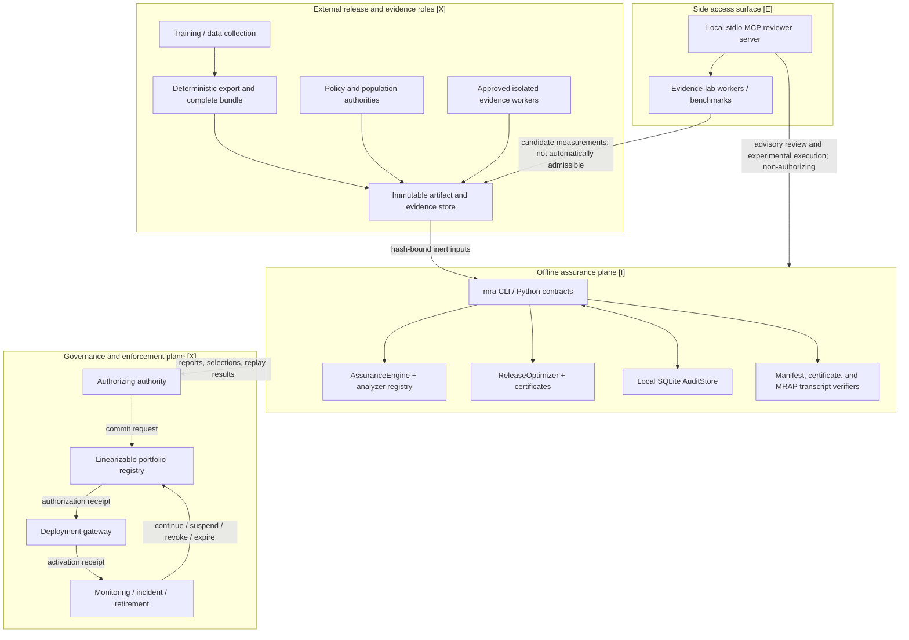
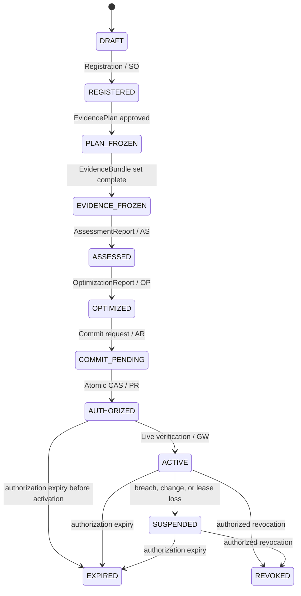

# Integrated system architecture and MRAP audit specification

> **Status: Reference — integrated audit view.** This document consolidates the full software architecture,
> the candidate normative Model Release Assurance Protocol (MRAP/1.0), current machine contracts,
> implemented controls, formal-assurance boundary, production obligations, and an audit procedure.
> It does not issue or evidence a model-release authorization.

## 0. Document control and interpretation

| Item | Value |
|---|---|
| Document identifier | `MRA-SAS/1.0-draft` |
| Approval/effective status | Unapproved repository reference; an adopter MUST assign an owner, approver, effective date, and review date before governed use |
| Version binding | The exact repository commit/tree hash and dirty/untracked inventory; this draft has no independent release identity |
| Supersedes | None |
| Framework | Model Release Assurance (MRA) `0.7.0` |
| Lifecycle protocol | MRAP/1.0, candidate normative specification |
| Implemented reference capability, not full conformance | MRAP-L0 through MRAP-L2 offline capabilities; any applicable failed or unevidenced gate, including an unresolved clearance-critical binary64 boundary under G7, precludes an MRAP-conformance conclusion |
| Not implemented | Authoritative MRAP-L3 authorization and MRAP-L4 enforcement services |
| Contract baseline | Pre-governed draft; the first governed baseline begins only when a protected release process signs or externally attests the exact current-schema manifest bytes |
| Intended reader | Technical, security, statistical, governance, legal, and operational auditor |
| Audit unit | One repository revision plus one adopter deployment and its retained evidence |

The framework value above is the package version string, not proof that the inspected checkout is a
published release. An auditor MUST also record the commit or tree hash, annotated release tag where
claimed, and the complete dirty/untracked-file inventory. An uncommitted working tree cannot be
accepted as a released artifact merely because its package version is `0.7.0`.

The contracts in this draft were iterated before the first governed schema baseline. Earlier draft
bytes are not a released compatibility promise and artifacts produced from them MUST NOT be
restamped as current or presented as governed replay. At first governed use, the adopter MUST retain
the exact schemas, released runtime, dependency lock, fixtures, trust metadata, and a protected
signature or external attestation over the exact current-schema manifest bytes. After that baseline,
every incompatible contract change MUST increment the affected top-level and nested versions, retain
the superseded bytes, and provide migration or vintage-runtime replay evidence.

This is the single entry point for an end-to-end audit. It integrates the requirements and boundaries
that are otherwise separated across the architecture, protocol, governance, mathematical, formal,
security, and deployment documents. When an auditor needs byte-level evidence, this document points
to the corresponding code, schema, test, or retained artifact.

The following labels are used throughout:

- **[N] Normative:** a requirement of MRAP/1.0. Capitalized **MUST**, **MUST NOT**, **REQUIRED**,
  **SHOULD**, and **MAY** carry their RFC 2119/8174 meanings.
- **[I] Implemented:** present in the supported offline Python reference core.
- **[E] Experimental:** present in the evidence lab or MCP integration but non-authorizing.
- **[X] External:** required from an adopter-owned production deployment and not implemented here.

### 0.1 Domain authorities and discrepancy rule

There is no single cross-domain file whose prose can override every other layer. Apply the authority
for the claim being audited and record every disagreement as a finding:

| Claim domain | Authoritative source |
|---|---|
| Candidate normative roles, messages, lifecycle, gates, authority and conformance | [`docs/model-release-assurance-protocol.md`](model-release-assurance-protocol.md), with [`docs/governance-core.md`](governance-core.md) for the governance rationale and required decision record |
| Objects and commands accepted by the current Python runtime | Pydantic models and executable paths under [`src/model_release_assurance/`](../src/model_release_assurance/) |
| Public machine-readable contract exports | Current files under [`schemas/`](../schemas/); any drift from the runtime models is a release-blocking defect |
| Exact machine-checked theorem statements | Lean sources under [`formal/lean/`](../formal/lean/); [`docs/formal-verification.md`](formal-verification.md) and the correspondence manifest delimit their runtime interpretation |
| Definitions, finite theorems, statistical guarantees and empirical-screen interpretation | [`docs/mathematical-foundations.md`](mathematical-foundations.md) |
| Supported product and nonclaim boundary | [`docs/project-scope.md`](project-scope.md) |
| External threat assumptions and production controls | [`docs/reference/threat-model.md`](reference/threat-model.md) and [`docs/reference/production-roadmap.md`](reference/production-roadmap.md) |
| Integrated audit navigation | This document; it summarizes but does not silently enlarge any source's authority |

Retained historical schemas preserve old structure but do not override current runtime models.
Examples demonstrate behavior but are not normative evidence. Scripts and reproduction inputs are
research tooling and do not become production evidence merely because they are committed.

### 0.2 Audit conclusion categories

An auditor MUST keep these conclusions separate:

| Conclusion | What it means | What it does not mean |
|---|---|---|
| Repository control conforms | The inspected revision implements its stated offline controls | A model is safe or deployable |
| Assessment evidence clears | A mandatory threat has valid exact/ceiling evidence within tolerance for one declared release interface | Portfolio clearance, authorization, or live-interface verification |
| Selection gate passes | A configuration is feasible under bound utility, policy, portfolio, and selection inputs | Registry commit or permission to serve |
| Transcript verifies | A supplied lifecycle record is structurally or cryptographically self-consistent under the named profile | The events occurred, the registry is authoritative, or evidence is true |
| MRAP authorization exists | The authoritative registry atomically committed the authorization and portfolio transition | The endpoint is active |
| MRAP activation exists | The gateway independently verified the live deployment and issued a valid activation receipt | Universal safety, future safety, or reversal of prior disclosures |

No report, manifest, signature, certificate, local audit event, optimization result, or transcript
replay may be relabelled as an authorization.

## 1. System purpose and scope

MRA is an offline, fail-closed reference toolkit for:

- validating versioned release, policy, evidence, portfolio, and protocol contracts;
- binding evidence to a proposed release, policy, artifact, interface, population, decision game,
  observation time, analyzer implementation, analyzer version, and analyzer configuration;
- classifying evidence without reversing its direction;
- validating versioned attack catalogs, frozen battery configurations, positive controls, worker
  outputs, runtime identity and isolation declarations, and enforcing a policy-mandated attack
  battery before an otherwise clearing ceiling may clear;
- producing per-threat `clear`, `block`, or `inconclusive` assessment recommendations;
- evaluating submitted release configurations against utility, privacy, transfer, search, control,
  and complete-portfolio conditions;
- producing and replaying finite portfolio and protocol-feasibility certificates;
- signing and verifying non-authorizing assessment and optimization manifests;
- recording CLI assessment and optimization intent and terminal events in a local audit chain; and
- structurally or cryptographically replaying supplied MRAP lifecycle transcripts.

The repository does not train, export, deploy, serve, authorize, suspend, revoke, or continuously
monitor production models. It does not operate a durable workflow engine, identity provider,
attestation service, immutable evidence store, authoritative portfolio registry, deployment gateway,
telemetry platform, KMS/HSM, or incident-management system.

The supported core validates and replays submitted attack-battery content; it does not deserialize
or execute the submitted release model. The local SACRO-ML-inspired red-team utilities can execute
trusted local model objects as experimental tooling, but their exploratory reports do not satisfy a
decision-bearing battery and carry no clearance, blocking, authorization, or isolation authority.

The current assessment threat taxonomy is privacy-focused: linkage, membership, attribute inference,
and reconstruction. Population analysis is a screen, not a fifth deciding threat. Fairness,
robustness, training dynamics, model quality beyond bound utility certificates, and sector/legal
eligibility require separately governed, versioned decision contracts before they can become gates.

## 2. Operational model: contracts, pipelines, and workflows

| Layer | Purpose | Repository implementation | Authority boundary |
|---|---|---|---|
| Contracts | Define valid objects, scope, bindings, and guarantees | Pydantic models, JSON Schemas, MRAP/1.0, Lean model | Definition only |
| Pipelines | Execute validation, analysis, selection, signing, solving, and replay | `mra` CLI, Python package, optional scripts | Produces evidence and recommendations only |
| Workflows | Coordinate registration, planning, approval, commit, activation, monitoring, and recovery | MRAP state machine plus offline transcript replay | Durable production orchestration is external |

### 2.1 Full trust-plane architecture



Only an external registry compare-and-swap may create `AUTHORIZED`. Only an external gateway that
remeasures the exact live artifact, interface, controls, registry status, and expiry may create
`ACTIVE`.

### 2.2 Runtime component inventory

| Component | Status | Process/storage | Responsibility | Explicit non-claim |
|---|---|---|---|---|
| `mra` CLI and Python package | [I] | One local Python process | Validate, assess, optimize, solve, sign, and replay | Not a daemon, scheduler, registry, gateway, or authority |
| `AssuranceEngine` | [I] | In-process | Verify bindings, dispatch analyzers, aggregate evidence, decide threats | Does not inspect or execute the release model |
| Analyzer service registry | [I] | In-process by default | Route each typed input to exactly one service and enforce capabilities | Default services are not authenticated remote microservices |
| Attack-battery contract and analyzer | [I] | In-process validation/replay of externally produced content | Bind policy-approved catalog/configuration/worker output; replay positive controls and simultaneous attack floors; gate ceiling eligibility | Does not execute a model, authenticate a worker, or prove declared isolation/attestation true |
| `ReleaseOptimizer` | [I] | In-process | Evaluate feasibility and deterministic selection | Does not commit or activate a release |
| Certificate solvers/verifiers | [I] | In-process; some generation paths require the `portfolio` SciPy extra | Finite portfolio, statistical, and protocol-design solving/replay | Certificates are premise-bound and non-authorizing |
| Strategic-assurance module | [I] | In-process Python API; experimental script wrapper | Solve and replay supplemental exact-rational strategic stress-test certificates | No public schema or `mra` command; no governance, authorization, or hard-gate effect |
| `AuditStore` | [I] | Local SQLite | Intent/terminal hash chain and anchorable checkpoint | Not immutable, authoritative, or a lifecycle registry |
| Integrity helpers | [I] | Local PEM files | Ed25519 manifests and protocol-signature replay | No managed identity, KMS, HSM, or key enrollment |
| MRAP transcript verifier | [I] | Offline process | Replay supplied structural/authenticated lifecycle records | Does not contact or implement registry/gateway services |
| Lean package | [I], build-time | Separate pinned toolchain | Prove scoped abstract transition/statistical properties | No Python or infrastructure refinement proof |
| MCP reviewer server | [E] | Separate local stdio process | Advisory retrieval, validation, read-only audit verification, experiment calls | No lifecycle authority or process isolation by tool omission |
| Evidence-lab and exploratory red-team workers | [E] | Local process/subprocess | Generate bounded measurements, candidate floors, screens, and non-authorizing red-team reports | Output is not automatically an admissible attack-battery submission or evidence |
| Identity, immutable stores, registry, gateway, monitoring | [X] | Adopter services | Perform production trust, authorization, enforcement, and operations | Specified but absent from this repository |

## 3. External training-to-serving integration

The release gate belongs after deterministic export and packaging:

```text
TRAIN / COLLECT [X]
  -> freeze checkpoint-selection plan and provenance
EXPORT / PACKAGE [X]
  -> bind checkpoint, weights/shards, tokenizer, preprocessing, wrappers,
     dependencies, runtime, precision/calibration, configuration and entry points
  -> create deterministic content manifest and final bundle digest
ASSESS [I]
  -> AssessmentRequest 5.0 -> AssessmentReport 5.0
SELECT [I]
  -> OptimizationRequest 4.0 -> OptimizationReport 4.0
AUTHORIZE [X]
  -> authority request -> atomic registry commit -> AuthorizationReceipt
ACTIVATE [X]
  -> live bundle/interface/control verification -> ActivationReceipt
OPERATE [X]
  -> monitor -> continue / suspend / revoke / expire / reassess / retire
```

The current core verifies one opaque regular file and its SHA-256. It does not enumerate archive
contents or prove export completeness. A production assembler MUST create a deterministic content
manifest for the complete deployable bundle, and the gateway MUST verify the same outer bundle
digest and content manifest. A checkpoint digest, model card, unpacked weight file, or filename is
not a substitute for that obligation.

Every recipient-observable channel MUST be declared and checked as applicable. The current
`InterfaceContract 3.0` mapping is:

| Recipient-observable channel | Contract field(s) | Current interpretation |
|---|---|---|
| Aggregates, labels, scores, probabilities, logits, explanations and text | `output_channels.aggregates`, `.labels`, `.scores`, `.probabilities`, `.logits`, `.explanations`, `.text` | Required booleans declare presence or absence |
| Embeddings, gradients and parameters/weights | `output_channels.embeddings`, `.gradients`, `.parameters` | Required booleans declare presence or absence |
| Downloadable files, shipped summaries and custom outputs | `output_channels.downloadable_files`, `.shipped_summary_metadata`, `.custom_channels` | Empty tuples declare absence; names are unique across the three sets |
| Human-readable output names and primary access class | `outputs`, `access` | `access` must agree with the structured output inventory; these fields do not replace it |
| Precision | `precision_bits` | `null` means no numeric precision is asserted by this declaration |
| Serialization | `serialization.formats`, `.media_types`, `.encodings`, `.compression`, `.schema_sha256`, `.endianness` | Formats, media types and encodings are mandatory; a schema digest is optional |
| Errors, transport status and retry signals | `errors.transport_status`, `.documented_status_codes`, `.error_content`, `.error_schema_sha256`, `.retry_metadata` | Cross-field validation prevents status/error combinations that contradict the declared transport |
| Timing | `timing.*` and `access_paths.side_channels` containing `timing` when observable | Observable timing requires resolution and a declared mitigation state |
| Batching, concurrency and cross-request state | `execution.batching`, `.maximum_batch_size`, `.maximum_concurrent_requests`, `.cross_request_state`, `.cross_request_state_ttl_seconds` | Cross-field validation checks batch and state/TTL coherence |
| Query lifetime and adaptive use | `query_budget`, `adaptive_queries`; for interactive LLMs, `llm_protocol.maximum_lifetime_queries` | Interactive values must agree; this is not a portfolio-wide query ledger |
| Authentication and rate controls | `authenticated`, `rate_limited`, `rate_limit.enabled`, `.scope`, `.requests_per_window`, `.window_seconds`, `.burst_capacity`, `.retry_after_exposed`, `.enforcement`, `.custom_parameters` | The compatibility flag must match the structured declaration; enabled limits require a scope, window, count, burst and enforcement model; exposed retry-after requires error retry metadata plus HTTP `429` or gRPC `RESOURCE_EXHAUSTED` (custom transports declare their own code); live enforcement is not verified |
| Retrieval | `llm_protocol.retrieval_corpus_sha256`, `.retriever_config_sha256` | Both hashes are present together or both absent |
| Tools | `llm_protocol.tool_names`, `.tool_policy_sha256` | A non-empty tool set requires a tool-policy digest |
| Memory and reset behavior | `llm_protocol.memory_mode`, `.memory_ttl_seconds`, `.reset_semantics`, mirrored by `execution.cross_request_state*` | Interactive state and TTL declarations must agree |
| Model/service updates | `llm_protocol.update_policy`, model/version/adapter fields; predictive artifact changes require a new release contract | No transparent in-place update is authorized by this field |
| Logs, telemetry, cache/resource and custom side channels | `access_paths.side_channels`, `.custom_side_channels`; LLM logging/retention in `llm_protocol.logging_mode` and `.provider_retention_days` | Declared exposure only; no live observation is performed |
| Local and administrative access | `access_paths.local_access`, `.local_capabilities`, `.admin_access`, `.admin_capabilities` | Capability lists must be empty exactly when their access class is `none` |

Nullable interface, channel, rate-limit, and `LlmProtocolContract 1.0` fields are required-explicit:
the submitted JSON must contain either the declared value or `null`, and omission fails validation.
That declaration is still not evidence that the live service matches it. In particular, the
structured rate-limit contract records intended value/window/burst/scope/retry/enforcement behavior
but does not measure distributed counters, reset behavior under failure, or bypass paths. An auditor
MUST independently verify the live gateway, and `live_interface_verified` remains false.

## 4. Normative governance and participant model

### 4.1 Governance functions [N]

A conforming institution MUST:

1. define legitimate purpose, prohibited uses, recipients, affected populations, jurisdictions,
   protected units, complete interface, model family, and authorization lifetime;
2. assign decision rights, accountable ownership, independent challenge, operation, monitoring,
   incident, and retirement responsibility;
3. control conflicts of interest and document any policy-permitted role concentration;
4. freeze policy, threats, candidate set, evidence plan, error budgets, utility floor, and approvals
   before outcome-dependent selection;
5. make privacy, safety, security, fairness, legal, utility, population, transfer, and portfolio
   requirements non-compensable and conjunctive;
6. preserve adverse findings, dissent, objections, reasons, conditions, appeals, and reassessment;
7. bind authorization to the exact deployed bytes, components, interface, controls, recipients,
   population, purpose, registry state, and lifetime; and
8. monitor the full lifecycle and suspend, revoke, reassess, or retire when predicates cease to hold.

### 4.2 Protocol roles [N]

| Symbol | Role | Required responsibility |
|---|---|---|
| `PA` | Policy authority | Publish policies, mandatory threats, tolerances, budgets, trust roots, accepted analyzers/certificates, and expiry rules |
| `SO` | Model owner/submitter | Register purpose, prohibited uses, artifact, complete interface, recipients, utility, and candidates |
| `PS` | Population steward | Approve population frame, protected unit, prior, neighboring relation, and scope snapshots |
| `CG` | Configuration generator | Produce the frozen candidate set and completeness evidence when `reject` is possible |
| `EW` | Evidence authority/worker | Collect evidence under the frozen plan in an isolated, attested environment and sign source-observed bindings |
| `AS` | Assessor | Replay evidence, inspect scope and assumptions, retain adverse evidence, and sign typed reports |
| `OP` | Optimizer | Apply frozen policy to every candidate and sign deterministic selection output |
| `AR` | Authorizing authority | Complete governance review and submit the immutable commit request without altering assessment values |
| `PR` | Portfolio registry | Maintain linearizable authoritative state, perform atomic CAS, and issue inclusion-verifiable authorization receipts |
| `GW` | Release gateway | Serve only a currently authorized exact release and emit activation/suspension receipts |
| `MO` | Monitor/auditor | Inspect drift, incidents, expiry, ledger history, registry state, and gateway conformance; request suspension or revocation |
| `IA` | Incident authority | Coordinate containment, evidence preservation, exposure review, revocation, and recovery |

A production deployment MUST bind approved identities and keys to message types. `AS`, `AR`, and
`GW` SHOULD be separately controlled. Any permitted combination of roles MUST be explicit in the
active trust profile and recorded as trust concentration.

The repository can provide part of `AS` and `OP`. It does not implement authoritative `PA`, `PS`,
`EW` attestation, `AR`, `PR`, `GW`, continuous `MO`, or `IA` services.

## 5. Normative object, state, and message model

### 5.1 Cryptographic object requirements [N]

Every MRAP protocol object MUST have a versioned type, immutable release-instance identifier,
stable `message_id`, issuer, role, issue time, optional expiry, payload, predecessor references, and
signature block. Within a protocol/registry scope, one `message_id` MUST identify only one canonical
content digest; an identical retransmission may be treated idempotently, but divergent reuse MUST be
rejected. Production systems MUST use one approved canonical encoding.
Clearance-critical numbers MUST use integers, exact rationals, or approved decimal strings rather
than unconstrained binary floating point.

The normative domain-separated object digest is:

```text
Digest_T(x) = H("MRAP/1.0" || 0x00 || T || 0x00 || Canonical(x))
```

The signed envelope is:

```text
M = ("MRAP/1.0", T, instance, message_id, issuer, role, issued_at,
     expires_at, predecessors, payload)
signature = Sign_sk(Digest_T(M))
```

The signature MUST cover the entire canonical envelope `M`, not only its payload. The local SQLite
`AuditStore` rows described in section 9.6 are implementation audit records, not MRAP cryptographic
objects, signed protocol envelopes, authorization receipts, or substitutes for registry history.

A verifier MUST reject:

- unknown object types or versions;
- noncanonical or unknown-field payloads;
- invalid role/key bindings or signatures;
- duplicate message identifiers with different content;
- missing or inconsistent predecessor references;
- expired objects or disallowed future timestamps;
- artifact, interface, policy, population, decision-game, portfolio-head, or candidate substitution;
- stale state, replayed nonce, or changed content under an existing identifier.

Mutable aliases such as `latest`, endpoint names, model display names, or filenames MUST NOT replace
content digests.

### 5.2 Immutable release instance [N]

One release instance binds at least:

- release identifier and expected authoritative registry head;
- active policy and threat-catalogue snapshot;
- dated population frame, protected unit, prior, and neighboring relation;
- complete deployable artifact commitment and complete-interface commitment;
- mandatory threat and decision-game set;
- frozen candidate configurations and utility requirements;
- evidence plan, worker identities, statistical allocations, and stopping rules;
- trust profile; and
- maximum authorization expiry.

Changing any bound item creates a new instance. A stale-head retry MUST rebase and rerun all affected
portfolio, budget, selection, evidence-freshness, and governance checks; it MUST NOT restamp the old
result with a new head.

### 5.3 Long-lived authoritative state [N]

The registry state includes the monotonic sequence and head, active policies and threats, dated
population snapshots, committed releases and statuses, cumulative statistical/privacy/query/other
budgets, role/key/attestation trust state, and revocation/suspension/incident/reassessment events.
Auditors MUST be able to obtain signed transitions and independently replayable history or equivalent
inclusion and consistency proofs.

Let `commit_n = H(Canonical(complete_delta_n))`. The normative portable
release-commit recurrence is:

```text
head_n = H(Canonical({
  "domain": "MRAP-STATE-1",
  "committed_sequence": n,
  "previous_head_sha256": head_(n-1),
  "release_id": release_id,
  "release_instance_sha256": release_instance_sha256,
  "portfolio_commit_sha256": commit_n
}))
```

The offline verifier requires a one-step sequence advance and replays this commitment-level
recurrence. It does not prove that the declared commit artifact is the complete semantic delta or
that it was included by the authoritative registry; production custody and independent history
proofs remain required.

### 5.4 Protocol messages [N]

| Message | Issuer | Mandatory semantic content |
|---|---|---|
| `PolicySnapshot` | `PA` | Policy/threat versions, tolerances, accepted evidence classes, error-budget ledger, decision rights, conflict controls, contestation and consultation requirements, trust profile, role keys, expiry/reassessment rules |
| `Registration` | `SO` | Legitimate purpose and prohibited uses, accountable owner, affected-party groups, artifact/interface commitments, recipients, populations, protected units, candidate-set commitment, expected registry head |
| `EvidencePlan` | `AS` plus required approvers | Mandatory Bayesian decision problems and, when used, supplemental strategic stress-test records; sources, affected-party/impact evidence and consultation plan, sampling design, multiplicity family, allocated errors, worker/image identities, positive controls, stopping and exclusion rules |
| `EvidenceBundle` | `EW` | Source digests, observed context, worker attestation, measurements, failures, and plan digest |
| `AssessmentReport` | `AS` | Per-candidate, per-threat interval and direction, scope, affected-party impacts, adverse findings, dissent, assumptions, replay result, transfer/portfolio result, optional strategic stress-test status with no decision effect, and `clear/block/inconclusive` status |
| `OptimizationReport` | `OP` | All candidate evaluations, feasibility, selection/refusal, deterministic tie-break, report/certificate digests, expected head, and expiry |
| `AuthorizationCommitRequest` | `AR` | Selected candidate, all predecessor digests, reasoned governance decision, authority and separation checks, conflict disclosures, affected-party evidence, objections and their disposition, non-overridden mandatory gates, operating/retirement conditions, expected head, budget delta, expiry, nonce, and requested gateway constraints |
| `AuthorizationReceipt` | `PR` | Durable entry, old/new heads, artifact/interface/control digests, budget delta, expiry, sequence, and registry proof |
| `ActivationReceipt` | `GW` | Authorization digest, verified registry state, remeasured served bundle/interface/controls, endpoint, and lease expiry |
| `LifecycleEvent` | Authorized `MO`, `GW`, `PR`, or actor | Monitoring, complaint, drift, incident, suspension, revocation, expiry, reassessment, replacement, decommission, or abort record |

Every message MUST retain the immediate predecessors required to replay its decision. Negative,
failed, blocked, and inconclusive evidence MUST remain in the trace.

The implemented `AssessmentReport 5.0` is always `single_release_no_portfolio`,
`declared_interface_only`, `live_interface_verified=false`, and `authorization_eligible=false`.
Declared `previous_release_ids` record lineage only. A portfolio-capable downstream stage MUST use a
current authoritative registry snapshot and exact active-release inventory instead.

## 6. Normative lifecycle state machine

The registry, not a report or local database, is authoritative for `AUTHORIZED`, `ACTIVE`,
`SUSPENDED`, `EXPIRED`, and `REVOKED`. The diagram shows the principal successful and operational
path only. The transition table that follows is authoritative and additionally covers
`REDESIGN_REQUIRED`, `REJECTED`, `ABORTED`, and revocation from every nonterminal, non-revoked
state.



| From | Event/actor | To | Mandatory conditions |
|---|---|---|---|
| `DRAFT` | valid `Registration` by `SO` | `REGISTERED` | Identity, purpose, prohibited uses, owner, affected parties, immutable artifact/interface/candidate hashes, policy and head captured |
| `REGISTERED` | approved `EvidencePlan` | `PLAN_FROZEN` | Threat/population/governance completeness; consultation and impact plan; error allocated before observation; workers/stopping frozen |
| `PLAN_FROZEN` | complete `EvidenceBundle` set | `EVIDENCE_FROZEN` | Source, context, worker, positive-control, raw-data, and plan bindings verified; collection closed |
| `EVIDENCE_FROZEN` | signed `AssessmentReport` by `AS` | `ASSESSED` | Every mandatory candidate/threat cell decided; arithmetic/certificates replay; report remains non-authorizing |
| `ASSESSED` | signed `OptimizationReport` by `OP` | `OPTIMIZED` | Deterministic feasible-set evaluation; utility before minimization; current policy/head/portfolio bound; exhaustive proof for `reject` |
| `OPTIMIZED` | valid commit request by `AR` | `COMMIT_PENDING` | Governance reasons, authority, challenge, conflicts, objections, conditions, retirement, unchanged selection, and live evidence complete |
| `COMMIT_PENDING` | successful CAS by `PR` | `AUTHORIZED` | Expected head matches; complete portfolio and budgets pass; authorization and state delta commit atomically |
| `AUTHORIZED` | gateway activation by `GW` | `ACTIVE` | Current registry membership/status; exact live bundle/interface/controls; bounded activation lease |
| `ACTIVE` | material change, breach, or lease loss | `SUSPENDED` | New service stops before or atomically with event recording |
| `AUTHORIZED`, `ACTIVE`, or `SUSPENDED` | expiry | `EXPIRED` | Authorization becomes unusable and service stops; retained outputs follow records policy |
| Any nonterminal, non-revoked state | authorized revocation | `REVOKED` | Registry records revocation and gateways deny new access |
| Any pre-authorization state | incomplete/remediable outcome | `REDESIGN_REQUIRED` | No authorization; changed proposal becomes a new immutable instance |
| `ASSESSED` or `OPTIMIZED` | certified infeasibility | `REJECTED` | Candidate-space completeness is replayable; otherwise redesign |
| Any state before `AUTHORIZED` | stale head, conflict, replay, timeout | `ABORTED` | No release; rebase and repeat every affected stage |

No transition may skip a state. Repeated messages are idempotent only when their canonical digest is
identical. `REVOKED`, `EXPIRED`, `REJECTED`, and `ABORTED` are terminal for that instance.

## 7. Normative admissibility gates

All gates are conjunctive. A pass at one gate cannot compensate for failure at another.

| Gate | Pass requirement | Failure behavior |
|---|---|---|
| `G0 Identity` | Actor authenticated; key live and authorized for the message role | `ABORTED` |
| `G1 Encoding/integrity` | Version, schema, canonicalization, hashes, signatures, time, nonce, and predecessors valid | `ABORTED` |
| `G2 Policy` | Applicable policy/threat catalogue frozen independently of results; no unauthorized override | `REDESIGN_REQUIRED` or `ABORTED` |
| `G3 Scope` | Legitimate purpose, prohibited uses, accountable owner, affected parties, artifact, complete interface, recipients, population, protected unit, prior and Bayesian decision problems complete; every supplemental strategic stress test has governance context and complete players/timing/information/actions/payoffs | `REDESIGN_REQUIRED` |
| `G4 Candidate/search` | Candidate set frozen; `reject` has an approved completeness certificate | Downgrade `reject` to redesign |
| `G5 Evidence plan` | Evidence class can answer the claim; sampling, multiplicity, stopping, controls, and budgets preregistered | `REDESIGN_REQUIRED` |
| `G6 Evidence execution` | Source-observed bindings, worker identity/attestation, raw data, positive controls, exclusions, and replay valid | `INCONCLUSIVE` or redesign |
| `G7 Statistical/formal` | Simultaneous coverage allocated; only exact values or valid ceilings clear; critical arithmetic exact or outward-rounded | `INCONCLUSIVE` |
| `G8 Transfer` | Direct evidence or verified safe-direction information reduction from assessed to released experiment | `INCONCLUSIVE` |
| `G9 Portfolio` | Complete joint observable portfolio directly assessed, validly composed, or robustly upper-bounded at the current authoritative head | `INCONCLUSIVE` or `ABORTED` |
| `G10 Utility/choice` | Every mandatory privacy and utility constraint passes before deterministic least-information tie-breaking | Redesign or certified reject |
| `G11 Governance` | Decision authority and accountable owner identified; required independent challenge completed; conflicts disclosed and controlled; affected-party/impact evidence and recorded objections considered; reasons, conditions, contestation route, incident owner, expiry and retirement rule present; no mandatory gate compensated or overridden; any strategic claim has strict robust margins, credible consequences and no decision effect | `REDESIGN_REQUIRED` |
| `G12 Atomic commit` | CAS against exact expected head; budget delta and authorization are one durable transition | `ABORTED` |
| `G13 Activation` | Gateway verifies current registry status and rehashes exact served bytes/interface/controls | No activation or suspension |
| `G14 Monitoring` | Lease, drift, incident, query/budget, expiry, and revocation checks remain live | Suspend, expire, or revoke |

A successful attack may create a blocking floor. Attack failure supplies no clearance ceiling.
Unknown model families and unsupported interactive protocols cannot pass `G5` through `G9` by being
listed in a catalog.

## 8. Normative protocol invariants

Every conforming implementation MUST preserve:

1. **Binding:** one immutable instance, artifact, interface, population, policy, game, predecessor,
   and selected configuration across decision and deployment.
2. **No report-as-authorization:** `ASSESSED` and `OPTIMIZED` cannot cause service.
3. **Mandatory conjunction:** no average score or discretionary override can mask a failed gate.
4. **Evidence direction:** floors may block; only exact values and valid ceilings may clear.
5. **Portfolio induction:** every commit checks the complete new portfolio against the current head.
6. **Freshness:** expiry, revocation, policy change, drift, or changed bytes/interface prevents
   continued service without required reassessment.
7. **Single-head commit:** authorization can commit only against its signed expected predecessor.
8. **Gateway fidelity:** served bytes and interfaces are equivalent to the live authorization.
9. **Trace completeness:** failures, refusals, supersessions, and revocations remain auditable.
10. **Fail-closed uncertainty:** missing validation or authoritative-state loss stops progression or
    causes lease-bounded suspension.

### 8.1 Normative control algorithms [N]

The following condensed algorithms define the auditable control order; implementations may differ in
topology but MUST preserve the dependencies and fail-closed effects.

```text
FreezeInstance(current_state, registration, candidate_set, evidence_plan):
  authenticate authorized roles and validate canonical objects
  capture current policy, population, trust and registry head
  bind exact artifact, complete interface, purpose, recipients and expiry
  freeze threats, decision games, candidates, utility and governance requirements
  allocate simultaneous statistical budgets before observing evidence
  verify G0-G5 and persist immutable predecessors
  return instance_id or REDESIGN_REQUIRED / ABORTED

CollectAndAssess(instance, evidence_bundles):
  require the frozen plan and complete expected bundle set
  verify sources, worker identity/attestation, positive controls and raw bindings
  replay exact/outward statistical and mathematical claims
  classify every result as exact, ceiling, floor or screen
  retain all clear, block, contradictory, inconclusive and failed results
  verify G0-G8 for every mandatory candidate/threat cell
  return signed scoped AssessmentReport or INCONCLUSIVE / REDESIGN_REQUIRED

Optimize(instance, assessment_reports):
  verify reports, policy, freshness, utility, controls and transfer direction
  require the supplied snapshot/head to equal the instance's frozen expected head
  on mismatch ABORT; a new rebased instance must rerun every affected stage
  assess/compose/bound the complete active portfolio plus each candidate
  evaluate every mandatory conjunctive gate before selection
  find the feasible Blackwell-minimal frontier
  apply the frozen versioned deterministic tie-break
  require exhaustive-search proof before REJECTED
  return signed OptimizationReport or REDESIGN_REQUIRED / ABORTED

AuthorizeCAS(commit_request):
  authenticate AR and verify every predecessor, reason and governance condition
  lock/linearize authoritative registry state
  require expected head/sequence, fresh nonce, live evidence and unchanged selection
  recheck complete portfolio and every cumulative budget
  atomically persist authorization, budget/portfolio delta and strictly advanced head
  emit AuthorizationReceipt only after durable success

ActivateAndMonitor(authorization_receipt, deployment):
  authenticate GW and verify current registry inclusion/status, expiry and gateway identity
  remeasure complete bundle, interface and controls actually served
  require exact equality with authorization and issue a bounded lease/ActivationReceipt
  on every request enforce current head/status, lease, expiry, revocation and controls
  record monitoring/incidents; stop service before or atomically with suspension/revocation
```

## 9. Implemented contract and pipeline behavior

### 9.1 Assessment workflow [I]

The supported CLI requires `--audit-db` for `assess` and performs:

```text
AssessmentRequest 5.0
  1. reparse the complete request from its JSON-compatible representation at the trusted boundary,
     then append a content-bearing intent with the full canonical request before analyzer execution
  2. load and SHA-256-check PolicyBundle 3.0
  3. verify policy identity, version, validity, mandatory threats, tolerances and analyzers
  4. reject producer versions below policy and unaccepted implementation/configuration digests;
     bind any required attack catalog, complete battery, policy-allowlisted battery-orchestrator
     service/version/implementation and image identity, per-attack executor identities, and controls
  5. resolve regular-file artifact, evidence and configuration references; verify their SHA-256
  6. rebuild release, policy, artifact, interface, population and decision-game bindings
  7. dispatch each typed analyzer input to exactly one registered service
  8. revalidate returned producer, input kind, context, evidence direction and capability
  9. replay attack-battery completeness, catalog validity at configuration freeze and execution,
     every run/control executor's catalog-bound service/version/implementation identity,
     simultaneous bounds, positive controls and declared isolation; an unsatisfied mandatory
     battery makes an otherwise clearing ceiling ineligible
 10. aggregate applicable floors and complete-declared-interface exact/ceiling evidence
 11. produce per-threat and overall decisions
 12. append exactly one content-bearing completion or failure event referencing the intent
 13. emit AssessmentReport 5.0 only after the completion event commits
```

Direct Python engine calls remain pure and may lack an audit record; their reports are still
structurally non-authorizing. Production governance SHOULD accept only outputs linked to the required
orchestration audit and retained evidence package.

### 9.2 Evidence decision semantics [I]

| Evidence class | Meaning | May clear | May block |
|---|---|---:|---:|
| `exact` | Exact value for the bound decision problem | Yes, only with complete-interface coverage | Yes |
| `ceiling` | Valid upper bound on adversary success/risk | Yes, only with complete-interface coverage | No |
| `floor` | Valid lower bound established by a successful attack or inference | No | Yes |
| `screen` | Diagnostic or scope/quality signal | No | No |

For each threat, applicable evidence must match the release, release-contract hash, policy hash,
artifact hash, interface hash, population-scope identifier/hash, decision-game hash, metric, and
observation time. A mismatched analyzer input or returned source context/capability aborts the
assessment. Among otherwise accepted records, the decision function excludes nonapplicable records
for the threat but retains their identifiers in `excluded_evidence_ids`; report validation requires
the applicable and excluded sets together to disposition every retained evidence record exactly once
for that threat.

Decision rules:

- a validated lower bound over tolerance produces `block`;
- otherwise, contradictory lower and upper bounds produce `inconclusive` with
  `evidence_consistency=contradictory` and the conflicting evidence identifiers;
- otherwise, a valid complete-interface exact value within tolerance produces `clear`;
- otherwise, a complete-interface ceiling within tolerance produces `clear` only when the policy
  requires a battery and its complete required attacks and positive controls pass, or the policy
  explicitly records a battery waiver and reason;
- an otherwise clearing ceiling is `inconclusive` when the policy prohibits ceiling clearance or a
  required attack battery, positive control, operating point, worker binding, or isolation declaration
  does not pass;
- otherwise the result is `inconclusive` with `evidence_consistency=insufficient`;
- a contradiction never demotes an independently established over-tolerance blocking floor; and
- any mandatory `block`, `inconclusive`, or unassessed threat prevents overall clearance.

### 9.3 Analyzer roster and maximum authority [I]

| Input kind | Emitted evidence | Maximum authority | Key limitation |
|---|---|---|---|
| `tree_linkage` | Recipient-realizable exact linkage value | Clear or block | Tree linkage only; clearance requires complete declared-interface coverage |
| `dp` | End-to-end mechanism ceiling | Clear only | All deployed processing, selection, stopping, summaries, and releases must be inside the proved mechanism |
| `attack` | Empirical attack floor | Block only | Failure never clears; strength is relative to bound attack configuration |
| `attack_battery` | Positive-control-guarded simultaneous attack floor or screen from a complete typed battery | Block only; separately gates ceiling eligibility | Core replays submitted content but does not execute the model, authenticate the worker, or prove declared isolation |
| `controlled_inference` | Attribute/reconstruction floor | Block only | Requires paired comparator and registered metric; no interactive-LLM clearance |
| `llm_canary` | Bound membership/reconstruction floor or screen | Block only | Never clears; collection/protocol defects downgrade to screen |
| `llm_watermark` | Watermark screen | No decision | Detection is not authorship or privacy proof |
| `population` | Population-model screen | No decision | Population size or fitted coverage is not anonymity |

Default service descriptors equal, rather than exceed, these capabilities. Adapter construction and
the engine reject capability widening. Every `EvidenceRecord` carries producer service ID, semantic
version, implementation digest, and configuration digest. `PolicyBundle 3.0` sets minimum service
versions and accepted digests per threat, so a policy update can invalidate an outdated analyzer. It
also gives every ceiling-relevant threat one of three explicit modes: required battery, ceiling
prohibited, or reason-bearing waiver. A required-battery rule names accepted catalog/configuration,
worker service/version/implementation/image, isolation assurance, required attacks and minimum
positive-control detection lower bound. These bindings do not authenticate a remote workload or
prove its output or isolation declaration true.

`AttackCatalog 1.0`, `AttackBatteryConfiguration 1.0`, `AttackPositiveControlResult 1.0`,
`AttackBatteryWorkerOutput 1.0`, and `AttackBatteryInput 1.0` bind applicability, metric and evidence
role; the complete preregistered run family; seeds, repetitions, stopping, multiplicity and resource
limits; known-leak or expected-flag positive controls; every planned run/result; raw-bundle digests;
the battery orchestrator/runtime identity; each run and positive control's catalogued executor
service, attack version and implementation digest; the catalog validity window over configuration
freeze and execution; and declared or externally attested isolation fields. Attack entries and
worker outputs carry `can_clear=false`. Successful eligible runs may become blocking floors; failed,
timed-out, control-failing, operating-point-missing or screen-only runs remain screens.

The current configuration contract accepts only equal-Bonferroni multiplicity; unsupported `holm`
or `preallocated` labels fail validation because no bound allocation parameters or replay exist for
them. The evidence observation must fall within the worker start/completion interval, and the engine
checks the complete interval against policy effectiveness/expiry, release expiry, and its bounded
future-skew rule. The core mechanically checks elapsed timeout, aggregate reported statistical trials,
and canonical governed-output bytes against the frozen limits. CPU and memory values remain declared
budgets: the submission contains no independently observed CPU/memory telemetry or attestation, so
production isolation must enforce and attest those limits externally.

For a policy-required attack identifier, every frozen plan for that attack must declare
`evidence_role=blocking_floor`; a required screen-only plan cannot satisfy the battery. For
`membership_tpr_at_fpr`, the core independently recomputes a one-sided Clopper-Pearson false-positive
upper bound using the complete-family simultaneous allocation (two bounds per comparison) and
requires that upper bound to be no greater than the threat-bound target FPR. Merely reporting a
successful run at the requested operating point is insufficient.

The reference core checks non-root, no-new-privileges, read-only-root, no-network and no writable
audit/key/governance-path declarations. It does not create that isolation. If policy requires
`externally_attested` assurance, the current core deliberately leaves the battery unsatisfied because
external isolation-signature verification is unavailable. Production must execute hostile artifacts
under a separately authenticated and attested worker principal with enforced resource and path
controls.

For the older standalone `attack`, `controlled_inference`, and `llm_canary` floor/screen paths, weak
configuration still means loss of blocking power. That loss becomes clearance-relevant when a
ceiling is offered for the same threat. PolicyBundle 3.0 closes the silent-composition path for
`required` mode: no complete passing battery means the ceiling remains `inconclusive`. A recorded
waiver is visible implemented behavior, not evidence that normative G6 or an adopter's governance
rules permit the waiver.

### 9.4 Model-family support boundary [I/E]

The governed catalog routes 20 families but never supplies evidence. The command always emits
`can_clear: false` and no coverage percentage or safety score.

| Family group | Examples | Current default route or gap |
|---|---|---|
| Linear/probabilistic | Logistic regression, GLM, naïve Bayes | Generic floors plus exact finite channel or complete DP mechanism |
| Trees/ensembles | Decision tree, random forest, XGBoost | Tree linkage, generic floors, exact channel, or complete DP mechanism |
| Kernel/exemplar | SVM, Gaussian process, k-NN | Dedicated or bound-channel evidence required; exemplar systems need a dedicated worker |
| Tabular neural | MLP, TabNet, tabular transformer | No ordinary non-DP default clearing path; dedicated worker or complete DP-SGD required |
| Vision/audio/time series | CNN, ViT, ASR, forecasting | Modality/sequence-specific workers required |
| Ranking/unsupervised/anomaly | Recommenders, clustering, isolation forest | User/task/tail-specific workers required |
| Representation/graph | Embeddings, encoders, GNNs | Retrieval, inversion, and graph-specific workers required |
| Generative text/multimodal | LLM, VLM | Interactive clearance deliberately unsupported without transcript-level mechanism |
| Generative media | Diffusion, GAN, audio/video generation | Modality-specific extraction/membership workers required |
| RL/agents | Policies and tool-using agents | Trajectory/transcript and tool-authority mechanism required |
| Composite/custom | Pipelines, mixture-of-experts, unknown future model | Complete component/joint-interface assessment or approved custom profile required |

In the shipped roster, only a valid end-to-end DP ceiling and recipient-realizable tree-linkage exact
evidence can clear, and even those apply only to one declared interface until portfolio and gateway
stages complete. Floor/screen analyzers can still block or diagnose other families.

### 9.5 Selection and portfolio workflow [I]

`OptimizationRequest 4.0` binds:

- active policy identity, version, path, and digest;
- caller-declared portfolio-registry identity, head, sequence, composition domain, exact active
  release identifiers, observation/expiry, and source digest;
- all candidate assessment reports and, where required, signed assessment manifests;
- candidate artifact/interface bindings, utility certificates, controls, and implementation cost;
- assessed and released finite experiments plus safe-direction garbling certificates;
- complete joint-portfolio evidence for the active releases plus candidate;
- candidate-space status and a caller-supplied enumeration certificate where rejection is possible;
- a versioned `SelectionPolicy` with ordered deterministic criteria and final configuration-ID tie.

The optimizer computes the canonical selection-policy digest and requires it to appear in the active
`PolicyBundle 3.0` `accepted_selection_policy_sha256s` allowlist before evaluating candidates. This closes
the in-band preference-order authorization defect; it does not authenticate the registry, utility,
control, search-space, experiment, transfer, or portfolio inputs.

The optimizer aborts the request on invalid structure, source/hash/provenance mismatch, an expired
or future-dated registry snapshot, expired requested authorization or active policy, unsupported trust-profile value,
an invalid transfer certificate, or a portfolio release set different from the snapshot's declared
active set plus the candidate. An expired assessment release/policy/population scope, unassessed
portfolio, failed privacy decision or utility floor, or expired control makes the affected candidate
infeasible; another feasible candidate can still be selected. With no feasible candidate, the result
is `redesign_required` or, under the declared exhaustive-search status, `reject`.

The current `PortfolioRegistrySnapshot` check verifies its source-file hash, field binding, and
observation/expiry interval, and rejects `observed_at` values later than the evaluation clock. Its
active-set comparison establishes only internal consistency between caller-supplied selection inputs:
it does not authenticate an issuer, compare the head to a live registry, prove registry inclusion, or
establish that the declared active set is complete. Those properties are external deployment
obligations. Consequently, the offline optimizer scopes composition correctly but cannot by itself
enforce authoritative composition completeness.

Utility is checked before disclosure minimization. Feasible candidates are reduced to their
Blackwell-minimal frontier. The declared selection policy then applies deterministic tie-breaks. The
runtime permits `reject` only when `search_space_status=certified_exhaustive` and a hash-bound
certificate lists exactly the submitted configuration identifiers. It does not replay a configuration
generator or prove that the real candidate space is complete, so production use of `reject` requires
external approval and independent completeness replay. Otherwise infeasibility yields
`redesign_required`.

Every `OptimizationReport 4.0` echoes the policy and registry identity/head/sequence/domain, the
selection policy and hash, all candidate evaluations, and `authorization_eligible=false`. Only
`release_as_proposed` or `release_with_controls` outcomes populate selected
artifact/interface/assessment/control bindings, portfolio status, and covered release identifiers;
`reject` and `redesign_required` reports must leave those selected fields empty.

The optimizer itself does **not** call SciPy to construct the Blackwell frontier. It replays the
submitted transfer certificates, constructs a directed reachability relation, and applies the
declared deterministic ordering to the resulting frontier. The garbling replay and the edge predicate
`maximum_row_total_variation <= numerical_tolerance` use Python binary64. That predicate determines
whether an edge exists, so a boundary case can change graph topology, frontier membership and final
selection rather than merely perturbing a reported scalar. Utility, cost, evidence tolerance and
uncertified portfolio fields also use binary64. Separate certificate-generation and statistical
helper paths may use the optional SciPy dependency; neither fact makes ordinary comparisons exact or
outward rounded. The runtime still computes a report, but any result that turns on an unresolved
garbling/transfer edge or other clearance-critical binary64 boundary fails G7 and cannot support an
MRAP-conformance conclusion.

Supported trust profiles are:

- `cooperative`: hash-bound accountable assertions where submitter honesty is an explicit premise;
- `separated_assessor`: requires an allowlisted Ed25519-signed assessment, proving bytes/key binding
  but not truth.

There is no `adversarial_supply_chain` profile. Such a profile would require independent artifact
replay, authenticated and attested workers, managed identities and keys, immutable custody,
isolation, and independently collected evidence.

### 9.6 Local audit workflow [I]

For supported CLI assessment and optimization whose request bytes have already been read, parsed, and
validated:

```text
append intent(full canonical request, operation, UUID run ID, release ID/instance digest)
  -> execute
     -> append completed(intent reference, full canonical report, report hash and bindings)
     or append failed(intent reference, stable error code and redacted diagnostic fingerprint)
  -> emit output only after completed append
```

The v2 intent stores both the full canonical request and its hash. A v2 completion stores both the
full canonical assessment/optimization report and its hash. `audit-verify` therefore revalidates the
embedded request at its intent time, validates the embedded report, checks request-to-report and
operation-specific bindings, and replays the canonical payload, versioned event-hash format,
predecessor chain, contiguous sequence, ledger identity, release/release-instance identity, and
exactly-one-terminal rule without reopening the request, report, policy, evidence, configuration, or
artifact source paths. This is self-contained structural and content-hash replay of the ledger rows;
it does not re-establish the truth, availability, immutability, or original digest of the external
source files named inside those objects.

For time, verification parses a timezone-aware event value and asks whether an assessment request was
valid at its intent event. It does not authenticate the clock, enforce monotonic event time, or apply
a future-skew policy. It reports orphaned intents and can compare an expected ledger ID, event count,
and head. Read-only verification does not mutate the database.

The current CLI reads JSON and completes Pydantic validation before appending its intent. Missing
files, malformed JSON, and schema/expiry validation failures therefore leave no intent or failed
terminal, and direct library calls are outside this chain. An adopter that must audit rejected or
malformed attempts needs an authenticated ingress record over the raw request digest before parsing,
plus a bound rejection terminal; the present v2 ledger does not provide that coverage.

New failure events first bound the raw error code and diagnostic, then retain a stable error category
and a domain-separated diagnostic fingerprint rather than the diagnostic text itself. The compatible
v2 failure field can contain non-fingerprint text; `AuditVerification 3.0` counts such rows separately
and reports `plaintext_failure_diagnostics_present` degradation. That narrow failure-field improvement
does not make this ledger suitable for sensitive production content: every
successful intent and completion deliberately duplicates the full canonical request and report.
Those objects can contain personal data, prompts, source paths, proprietary configuration, attack
details or other sensitive values. A production design MUST apply an approved minimization,
encryption, access, retention, legal-hold and deletion model, or keep content in a protected immutable
store and place only authenticated content references in the ledger while preserving self-contained
authorized replay by another governed mechanism.

New events use `mra-audit-event-v2`: a domain-separated canonical preimage binds the hash-format
identifier, ledger ID, payload schema version, operation, event type, subject, release ID,
release-instance digest, decoded canonical payload, predecessor and timestamp. This prevents copying
a valid v2 event into a different ledger without invalidating its hash. Rows carrying the old
`legacy-v1` hash remain replayable only with explicit legacy opt-in, are counted separately, and
cannot establish v2 governance coverage. The v2 format is still a local unsigned event chain; a
production format additionally needs authenticated writers and externally protected custody.

The v2 envelope is not a historical document dispatcher. The current verifier accepts embedded
Assessment 5.0 and Optimization 4.0 requests/reports; it does not promise replay of prior-draft
Assessment 4.0 or Optimization 3.0 intent/completion rows. Preserve the corresponding vintage runtime
for any governed baseline instead of treating envelope-version equality as document compatibility.

The audit counters classify independent axes and can overlap. `legacy_event_count` counts legacy
completion-only `assessment_report` and `optimization_report` event types regardless of hash format.
`legacy_hash_event_count` counts rows whose hash format is missing or `legacy-v1` regardless of event
type. `domain_separated_hash_event_count` counts rows using `mra-audit-event-v2`.
`redacted_failure_diagnostic_count` and `plaintext_failure_diagnostic_count` partition failed
terminals; `diagnostic_degradations` must report plaintext presence exactly when the latter is nonzero.
The event-type partition reconciles against intent plus terminal counts, while the hash-format and
failure-diagnostic partitions reconcile separately.

`audit-checkpoint` exports a portable ledger ID, count/sequence, head digest, and creation time for
external anchoring. The local database is not append-only against a principal that can modify or
replace it. An adopter MUST retain checkpoints in a separately protected immutable system on a
governed schedule.

The operation state machine is:

```text
ABSENT -> INTENT_RECORDED -> COMPLETED
                          -> FAILED
```

`COMPLETED` and `FAILED` are absorbing. An intent without a terminal at the verification cutoff is
`ORPHANED`; a changed request requires a new run ID and intent. Retained legacy completion-only rows
remain structurally replayable but do not establish paired intent/terminal completeness and MUST NOT
be represented as governance-grade coverage.

For audit reporting, distinguish these profiles. They are audit-review categories, not current
`AuditVerification` enum values and not MRAP lifecycle states:

| Audit profile | Requirements | Current status |
|---|---|---|
| `local_v2` | SQLite v2 current-document intent/terminal chain with both legacy counters and `plaintext_failure_diagnostic_count` equal to zero, canonical replay, ledger/release identity, sequence and orphan checks | Implemented for current Assessment 5.0/Optimization 4.0 documents in v2 envelopes |
| `anchored_v1` | `local_v2` plus independently retained expected identity/count/head and anchor receipt on a governed schedule | External integration required |
| `production_v1` | Authenticated actors, append-only replicated custody, signed/transparency-logged checkpoints, managed keys, retention/legal hold, independent read-only verification and incident handling | External production profile |

A locally valid unanchored chain proves only internal consistency of the available ledger. It cannot
prove that no direct-library or otherwise uninstrumented execution occurred, or that a privileged
operator did not replace the entire ledger. The audit status should therefore say
`locally_valid_unanchored`, not `immutable` or `complete_history`.

The runtime `complete` field means only that the observed v2 intents have no orphaned terminal at the
verification cutoff. A result may still report `complete=true` while containing legacy completion-
only rows. Governance-grade `local_v2` coverage therefore additionally requires
`legacy_event_count == 0`, `legacy_hash_event_count == 0`,
`plaintext_failure_diagnostic_count == 0`, no diagnostic degradation, and externally recorded
verification counts and orphan identifiers. A release-bound event hash does not identify which ledger is the
institution's canonical ledger and cannot prove that a caller did not select a fresh ledger. That
namespace and completeness claim requires an externally governed ledger registry and ingress route.

Production separation should identify a request authority, audited executor, ledger writer,
independent verifier, anchor custodian, records custodian, security administrator and incident
authority. The writer, verifier, anchor custodian and MRAP authorization authority SHOULD be
separately controlled.

### 9.7 Signing and lifecycle replay [I]

Assessment and optimization manifests are domain-specific, non-authorizing Ed25519 integrity
objects. They are not interchangeable with MRAP event/artifact signatures.

`release-protocol-verify` accepts `ReleaseProtocolRun 1.1` and emits
`ReleaseProtocolVerification 2.0` containing `verification_profile`,
`artifact_files_verified`, `authenticated_signatures_verified`, `verification_time`, `run_sha256`,
`runtime_identity`,
`skipped_checks`, `degradations`, `valid`, `final_state`, `authorization_issued`,
`deployment_active`, `event_sha256s`, and `reasons`. There is no separate performed-check list.

The current transcript event vocabulary is `register_scope`, `approve_evidence_plan`,
`close_evidence`, `record_assessment`, `record_selection`, `submit_authorization`,
`commit_portfolio`, `activate_deployment`, `review_monitoring`, `suspend_release`,
`revoke_release`, `expire_release`, and `abort_release`.

The current artifact-kind vocabulary is `registration`, `policy_snapshot`, `release_instance`,
`population_register`, `threat_register`, `portfolio_snapshot`, `evidence_plan`,
`assurance_error_budget`, `monitoring_plan`, `evidence_bundle`, `assessment_report`,
`optimization_report`, `authorization_commit_request`, `authorization_receipt`,
`portfolio_commit`, `activation_receipt`, `monitoring_report`, `incident_record`,
`decommission_record`, and `abort_record`.

This vocabulary and replay state machine implement a narrower transition relation than the
normative lifecycle.
Complaint/contestation, drift, incident, reassessment, replacement, and decommission have no
dedicated event type; incident and decommission can appear only as opaque artifacts attached to
suspension/revocation or expiry.
`record_selection` can reach redesign or rejection only from `ASSESSED`; revocation is accepted only
from `AUTHORIZED`, `ACTIVE`, or `SUSPENDED`; and abort is accepted from `REGISTERED` through
`COMMIT_PENDING`. Duplicate event identifiers are rejected even when content is identical. That is a
deliberately stricter offline replay rule, not a safety violation, but it imposes a liveness and
transport-deduplication cost relative to the protocol's permission to accept identical retransmits.
`suspend_release` accepts only monitoring- or incident-authority actors, not the deployment gateway.

The run model assigns exactly one role to each actor, has no trust-profile field, and the authenticated
profile requires a distinct key per actor; it therefore cannot represent policy-approved role
concentration. Its CAS replay requires an exact sequence increment of one and recomputes the
release-bound `MRAP-STATE-1` head from the predecessor, committed sequence, release and instance
identities, and the unique portfolio-commit artifact digest. This proves recurrence consistency for
the supplied commitment; it does not prove that the artifact semantically contains the complete
registry delta or that an authoritative registry included it. Activation checks the
artifact/interface digests, a committed head, and authorization expiry, but has no live-registry
lookup, deployed-control digest, endpoint binding, or activation-lease field. Event times must be
ordered and timezone-aware, but are not rejected merely for occurring after the verification time.
These limitations prevent transcript replay from standing in for L3/L4 services.

- `structural_v1` checks declared roles, messages, state transitions, hashes, sequences, CAS
  assertions, expiry, and deployment bindings but does not authenticate actors.
- `authenticated_v1` additionally verifies release-bound Ed25519 event and artifact signatures
  against an external trust store and rejects declared compromised keys.

Neither profile contacts an authoritative registry, performs live identity enrollment, verifies
remote attestation, enforces a gateway, or proves the scientific truth of artifact content.

Many MRAP lifecycle artifact kinds do not yet have standalone semantic content schemas. The verifier
checks their declared kind, relative path, digest, producer role, signature when required, and
state-machine placement, but does not semantically validate every field inside registration,
evidence-plan/bundle, authorization, activation, monitoring, incident, retirement, or abort content.

### 9.8 Experimental MCP and evidence lab [E]

The reviewer MCP server is a source-checkout-only local stdio server. At startup it creates an
in-memory lexical index from repository documentation and schemas. Its tools list analyzer and
red-team descriptors, validate the structure of an `AttackBatteryInput 1.0` submission without
executing it, search advisory text, return a named schema, validate an assessment request, review
non-clearing model coverage, verify a confined audit database read-only, and invoke selected
experimental workflows. It exposes no MCP resources or prompts, HTTP/SSE endpoint, signing,
authorization, registry, activation, failover, or training-control operation.

The server as a whole is not read-only: experimental tools may train local models, execute caller-
selected local model code, launch subprocesses, download public data, and write output or cache files.
Those side effects remain non-authorizing but require a separately isolated execution principal in a
production integration.

`McpAnalyzerService` is a different component: a caller-supplied adapter for a prospective analyzer
request/response envelope. The default analyzer registry remains local, and the reviewer MCP server
does not host the prospective analyzer RPC tools. Discovery metadata is not proof of remote
deployment, worker authentication, or decision authority.

Evidence-lab and exploratory red-team workers may execute trusted local model code, launch
subprocesses, use optional dependencies, or download public data. The exploratory red-team registry
publishes versioned non-clearing catalog descriptors and a runtime-identified report, but it does not
emit the complete decision-bearing worker output or prove isolation. Results remain screens or
candidate floors until an approved external worker produces every policy-bound attack-battery object
and an evidence authority binds the complete submission into a current assessment request.

## 10. Current machine-contract inventory

Schema suffixes version individual contracts, not the framework as a whole.

| Domain | Current contract | Critical audit purpose |
|---|---|---|
| Assessment input | `assessment-request-v5.json` (`5.0`) | Release, policy, population, threat, analyzer, source, producer, context and complete attack-battery bindings |
| Policy | `policy-bundle-v3.json` (`3.0`) | Mandatory rules; analyzer and selection-policy allowlists; per-threat ceiling/battery mode; accepted catalog/configuration/worker/image/isolation and positive-control thresholds |
| Assessment output | `assessment-report-v5.json` (`5.0`) | Per-threat results, attack-battery status, complete evidence disposition, runtime identity and explicit single-release/declared-interface/non-authorizing scope |
| Assessment integrity | `signed-manifest-v3.json` (`3.0`) | Direct artifact/interface plus request/report/policy hashes, scope and interface-assurance echo for Assessment 5.0 |
| Attack catalog | `attack-catalog-v1.json` (`1.0`) | Versioned attack applicability, implementation, evidence role, control kind and no-clearance authority |
| Attack-battery configuration | `attack-battery-configuration-v1.json` (`1.0`) | Complete frozen runs, controls, seeds, supported Bonferroni multiplicity, stopping rule and declared resource limits |
| Attack positive-control result | `attack-positive-control-result-v1.json` (`1.0`) | Catalog-bound executor service/version/implementation identity, typed known-leak binomial or expected-flag result and raw-result digest |
| Attack worker output | `attack-battery-worker-output-v1.json` (`1.0`) | Release/context/catalog/configuration bindings, battery-orchestrator producer/runtime identity, isolation declaration, all per-result executor triples, controls/results and retained raw-bundle digest |
| Attack-battery submission | `attack-battery-submission-v1.json` (`1.0`) | Content hashes and exact catalog/configuration/output/run/control disposition supplied to the core |
| Optimization input | `optimization-request-v4.json` (`4.0`) | Active PolicyBundle 3.0, AssessmentReport 5.0 references, caller-declared source-bound portfolio snapshot, candidates, controls, utility, transfer, search, and selection policy |
| Optimization output | `optimization-report-v4.json` (`4.0`) | Complete candidate evaluation, selected bindings and runtime identity |
| Optimization integrity | `signed-optimization-manifest-v4.json` (`4.0`) | Signed final selection and scope bindings |
| Portfolio specification | `incomplete-portfolio-specification-v1.json` | Approved finite portfolio semantics |
| Portfolio problem/certificate | `incomplete-portfolio-problem-v1.json`; `incomplete-portfolio-certificate-v1.1.json` | Conservative or exact composition result and replay |
| Portfolio statistics | `portfolio-multinomial-counts-v1.json`, `portfolio-multinomial-plan-v1.json`, `portfolio-error-budget-v1.json`, `portfolio-multinomial-request-v1.json`, `portfolio-multinomial-evidence-v1.json` | Frozen counts, plan, budget, simultaneous evidence, and compilation |
| Protocol design | `protocol-feasibility-problem-v1.json`; `protocol-feasibility-certificate-v1.json` | Finite design-time soundness/liveness frontier |
| Lifecycle transcript | `release-protocol-run-v1.1.json` | Supplied lifecycle artifacts, events, roles, hashes, signatures, and states |
| Lifecycle replay result | `release-protocol-verification-v2.json` (`2.0`) | Verification profile, checks, skips, degradation, run digest and runtime identity |
| Local audit result | `audit-verification-v3.json` (`3.0`) | Chain/release identity, independently defined event/hash-format counts, head, terminals, orphans, completeness and runtime identity |
| Current schema inventory | `current-schema-manifest-v1.json` | Deterministic inventory of all 26 registered contract schemas; excludes its own digest by design and requires exact-byte regeneration plus detached protected attestation |
| Local audit anchor | `audit-checkpoint-v1.json` | Portable expected ledger identity/count/head |
| Analyzer service envelope | Python-only request/response contract `2.0` | Prospective transport-neutral evidence exchange; no standalone public JSON Schema |
| Supplemental strategic stress test | Python-only `StrategicAssuranceProblem 1.0`, `StrategicAssuranceCertificate 1.0`, and unversioned verification result | Exact-rational supplemental replay through the Python API or experimental script; no public schema or `mra` command and no governance-decision effect |

Older schema files are retained for structural provenance. The current CLI intentionally rejects
superseded top-level versions. The current containing Pydantic models also reject unsupported nested
versions: `InterfaceContract 3.0`, `LlmProtocolContract 1.0`, `SelectionPolicy 1.0`, `PortfolioRegistrySnapshot 1.0`, the attack
catalog/configuration/control/output/submission `1.0` contracts, and the prospective analyzer
request/response envelope `2.0` are exact accepted versions, with no implicit fallback or migration.
Historical legal-hold or retention use MUST preserve the matching released wheel, dependency lock,
trust metadata, artifact hashes, and vintage replay fixtures until a version-dispatched verifier
exists. Missing modern evidence fields must be recollected or migrated by an authorized process;
they must not be invented or restamped.

This inventory is the pre-governed candidate for the first baseline described in Section 0. Its 26 entries cover
registered contract-schema bytes, not the manifest file itself: embedding the digest of the final
manifest bytes inside those same bytes would be recursive. Maintenance MUST separately compare the
manifest byte-for-byte with deterministic regeneration. A released claim MUST additionally verify a
detached signature or external attestation over those exact manifest bytes, protected signer custody,
and the retained release tuple. Source control or the unsigned digest list alone is not attestation.

`ReleaseContract`, `InterfaceContract`, `EvidenceRecord`, `AttackBatteryRequirement`,
`AttackIsolationEvidence`, `SelectionPolicy 1.0`,
`PortfolioRegistrySnapshot 1.0`, strategic-assurance contracts, audit event payloads, and many
lifecycle artifact contents are nested or Python-only contracts rather than independent top-level
schemas. An auditor must inspect their containing schema and executable model, not assume every
logical object has its own file.

### 10.1 Critical nested bindings

| Object | Required audit bindings |
|---|---|
| `ReleaseContract` | Release ID, owner, recipient, purpose, family/profile, protected unit, opaque artifact path/hash, interface, unique declared lineage, timezone-aware expiry |
| `ModelProfile` | Task, input/output modalities, training paradigm, component families, generative/stateful flags and defined custom task where applicable |
| `InterfaceContract` | Version 3 predictive/interactive protocol with required-explicit nullable fields and a structured rate value/window/burst/scope/retry/enforcement declaration; Section 3 maps every named channel to its field. No declaration proves live-interface equality or distributed counter/reset/bypass behavior |
| `PopulationScope` | Scope ID, unit, frame/reference date, inclusion and size evidence, and source-bound assumptions required by the selected population contract |
| `ThreatContract` | Threat ID/kind, population scope, decision metric/parameters, tolerance/basis, candidate/secret/side-information/realizability semantics |
| `EvidenceContext` | Release and contract hashes, policy, artifact, interface, population, decision game and timezone-aware observation time |
| `EvidenceProducer` | Service ID, semantic version, implementation digest and configuration digest |
| `EvidenceRecord` | Producer/context, evidence direction/coverage/capabilities, metric, interval/value, assumptions and source bindings; every record is retained in the report and named as used or excluded by its threat decision |
| `PolicyRule` / `AttackBatteryRequirement` | Per-threat required/prohibited/waived ceiling mode and waiver reason; accepted catalog/configuration/worker/image/attester identities; required attacks, isolation level and minimum positive-control detection lower bound |
| `AttackCatalog` / `AttackBatteryConfiguration` | Versioned attack applicability/authority and validity window plus complete frozen run/control family, declared resource limits, stopping and the currently supported Bonferroni method |
| `AttackBatteryWorkerOutput` / `AttackBatteryInput` | Exact release/context/content hashes, execution interval containing `observed_at`, battery-orchestrator and runtime identity, catalog-bound service/version/implementation identity for every run and control, declared/attested isolation fields, raw digests and complete dispositions; the core checks timeout/trial/output-byte limits, but CPU/memory compliance and content truth are not attested |
| `AssessmentScope` | Declared lineage, single-release/no-portfolio, declared-interface-only, live-unverified, gateway-required and non-authorizing literals |
| `SelectionPolicy` | Version, policy ID, rationale, unique ordered criteria, final deterministic configuration-ID tie, canonical digest and active-policy allowlist membership |
| `PortfolioRegistrySnapshot` | Registry ID/head/sequence/domain, exact active IDs, observed/expiry times and source path/hash; source binding does not authenticate the registry or prove the head is live |
| `ReleaseConfiguration` | Candidate ID/proposed status, assessment reference, released artifact/interface, utility, cost, controls, threat-experiment bindings and portfolio certificate |
| `FiniteExperiment` | Threat/population/game, secret states, observations, channel/prior, interface description and optional artifact/interface hashes |
| `GarblingCertificate` | Dominant/dominated experiment IDs, stochastic kernel, total-variation allowance, numerical tolerance and construction; its binary64 tolerance comparison controls reachability-edge existence and therefore frontier topology |
| `ThreatExperimentBinding` | Threat plus assessed/released experiment IDs and required substitution-certificate reference when they differ |
| `SearchSpaceCertificate` | Declared method, submitted configuration IDs and source path/hash; runtime does not prove generator or real-space completeness |
| `UtilityCertificate` | Configuration/artifact/interface/population/split hashes, metric, lower bound/estimate/floor, population, uncertainty, disjointness and retained source |
| `ReleaseControl` | Control ID/type, declared information-structure effect and privacy-credit eligibility, artifact/interface hashes, expiry and evidence source; runtime binds the declaration but does not prove effectiveness or enforcement |
| `PortfolioCertificate` | Status, composition domain, population-secret pairs, registry head/sequence, complete registered IDs, method, bounds/experiments and evidence digest |

## 11. Data and storage architecture

| Data/store | Current owner/writer | Integrity behavior | Production requirement |
|---|---|---|---|
| Schemas, protocol, formal sources | Repository maintainers through Git review | Committed and replayed in CI | Protected source control and review |
| Request, policy, evidence, config, artifact files | Caller/external roles | Assessment/optimization helpers accept absolute paths or resolve from the input base; protocol artifacts require confined relative paths; regular-file checks where required and SHA-256 | Canonical intake, immutable custody, malware/format controls |
| Attack catalog, battery, positive-control, worker-output and raw-result objects | External attack/evidence worker and caller | Typed content/digest/context binding and in-process replay; core does not execute the target | Isolated attested execution, protected raw custody, issuer identity and independent control artifacts |
| Reports, certificates, manifests | CLI or caller | Typed JSON and optional signature | Transactional immutable retention with legal hold and access control |
| SQLite `AuditStore` | CLI | Content-bearing intent/completion chain containing full canonical requests/reports, WAL/FULL sync, ledger identity and checkpoint | Sensitive-content minimization/encryption/access/retention design, separate immutable checkpoint anchor, backup/restore and custody |
| PEM keys/trust stores | Local tools or caller | Ed25519 operations | HSM/KMS, identity binding, rotation, revocation, dual control |
| MCP knowledge index | Local source checkout | In-memory deterministic chunks and hashes | Tenant/auth controls if deployed; no truth authority |
| Experimental output/cache | Evidence lab | Ignored local files | Freeze and bind through approved evidence process before use |
| Artifact/evidence store, registry, monitoring store | Not implemented | None in this repository | Authenticated, durable, immutable/linearizable adopter services |

The standard CLI does not sandbox caller-selected paths. MCP path confinement and omitted tools do
not constrain the permissions of the server process. A production reviewer MCP service MUST run as a
dedicated non-root principal with no signing-key, writable audit/registry, or deployment-credential
access, and any execution worker MUST be isolated separately.

### 11.1 Runtime and dependency tiers

| Tier | Dependencies | Scope |
|---|---|---|
| Supported core | Python 3.11+, Pydantic, `cryptography` | Contracts, assessment, signing, replay, and dependency-free mathematical paths |
| Portfolio | `portfolio` extra with SciPy | Linear programming and statistical interval helpers |
| Experiments | NumPy, Pandas, PyArrow, SciPy, scikit-learn, XGBoost, joblib | Empirical, OpenML, XGBoost, stochastic and red-team research |
| MCP | `mcp>=2,<3`, source checkout | Local stdio reviewer server |
| Privacy experiments | Experiment stack plus PyTorch in a dedicated `.privacy-venv` subprocess; dependency separation only, not a security sandbox | Public-data CNN/LSTM/XGBoost/Transformer worker |
| Formal | Lean toolchain pinned under `formal/lean/` | Separate kernel proof build and axiom audit |

The `ReleaseOptimizer` does not invoke SciPy: it verifies supplied transfer relations, computes graph
reachability, and applies Python ordering. SciPy is confined to optional solver/statistical generation
paths. Regardless of dependency, ordinary float-valued clearance comparisons remain binary64 unless
an exact or approved outward-rounded certificate path is explicitly selected and replayed.

The repository provides no Dockerfile, Kubernetes/Helm/Terraform deployment, Kafka/ZeroMQ/Redis
broker, ClickHouse/Prometheus/MinIO telemetry stack, or production HTTP service. Those technologies
may be used by an adopter, but are not current components or controls.

### 11.2 Build and release automation

Pull requests and main-branch pushes run the Lean proof build/axiom audit and Python 3.11, 3.12 and
3.13 compile/test/schema/link matrix before building and smoke-testing wheel/sdist artifacts. A tagged
release requires an annotated `vX.Y.Z` tag reachable from `main`, exact tag/package-version equality,
the release checks, package validation, a clean-environment wheel smoke test, and creation of a draft
GitHub release. Schema maintenance verifies the deterministic current-schema manifest against all 26
registered current contract-schema bytes and separately compares the manifest itself with
deterministic regeneration; the manifest does not recursively inventory its own final bytes. The
repository does not hold the protected key needed for the detached signature or attestation required
to make those exact manifest bytes release provenance. Automation does not publish to PyPI or deploy
a service.

## 12. Security and adversary model

### 12.1 Protected assets

- private training data and protected-unit membership/attributes;
- submitted model and complete preprocessing/serving package;
- raw evidence, attack data, accountant inputs, plans, and source observations;
- policy, population, release, report, approval, registry, and audit history;
- signing keys, trust roots, role bindings, and attestation records; and
- integrity of `clear`, `block`, `inconclusive`, selection, authorization, and lifecycle decisions.

### 12.2 Adversaries and assumptions [N]

Recipients and submitters may be curious, malicious, or colluding. Artifacts and evidence may be
hostile. Messages may be replayed, reordered, delayed, modified, or raced against concurrent
submissions. Workers or administrators may be compromised according to the active trust profile.

MRAP depends on collision-resistant hashing/canonicalization, unforgeable approved signatures,
correct role/key binding, a linearizable and key-protected registry, a faithful gateway, valid
simultaneous statistical procedures, sound certificate replay, and a sufficiently complete policy,
world model, population, threat set, interface, and evidence model. These are assumptions to audit,
not properties created by a signature.

### 12.3 Default recipient-knowledge baseline [I]

The conservative empirical assessment profile assumes the recipient knows the complete database and
feature schema: column names/order/types/semantics, target definition, row/class counts, missingness,
feature cardinalities, complete categorical/target domains and counts, and exact numeric minimum,
maximum, range, mean, median, standard deviation, variance, quartiles, interquartile range and median
absolute deviation. In membership games the recipient also knows the candidate record and its
non-secret fields. Full-source and target-training summaries are supplied to both the model attack and
the no-model baseline.

This auxiliary-knowledge baseline is not row-level microdata, an identity roster, or an independently
observed target signal. The schema does not permit a submitter to select a weaker profile. Any future
weaker profile needs a separately named policy/schema revision, external justification and
reassessment. If summary metadata ships with the model, it is also part of the release bundle and
interface threat analysis.

### 12.4 Primary control matrix

| Threat | Implemented control | Required external control / residual risk |
|---|---|---|
| Unknown/malformed input | Strict models, unknown fields forbidden, cross-field validation | Input truth and issuer identity remain external |
| Artifact substitution | SHA-256 and signed manifest bindings | Canonical upload, immutable store, scan, complete bundle verification |
| Evidence rebinding | Source-observed release/policy/artifact/interface/population/game hashes | Attested workers, immutable logs, approved images and custody |
| Weak/stale analyzer | Typed producer/version/config digests and policy floors/allowlists | Workload identity, attestation, reassessment queue on policy change |
| Missing or weak empirical challenge before ceiling clearance | PolicyBundle 3.0 requires, prohibits, or explicitly waives a per-threat battery; typed complete battery and positive controls gate ceiling eligibility | Independent catalog/configuration approval, known-leak reference artifacts/data, isolated attested execution, raw-result custody and waiver governance |
| Evidence-direction reversal | Central decision engine and exact capability descriptors | Independent method review and negative conformance fixtures |
| Missing evidence treated as safe | Fail-closed inconclusive decision | UI/workflow must prohibit discretionary silent override |
| Contradictory evidence gaming | Distinct contradiction class, producer evidence IDs, blocking-floor preservation | Independent adjudication and incident handling |
| Partial DP scope | Complete-pipeline/accountant/protected-unit checks | Validate every preprocessing, selection, output and related-release path |
| Evaluated/released substitution | Exact experiment ID or safe-direction garbling | Gateway binds live artifact, interface, precision, budget and controls |
| Portfolio omission/race | Source-bound snapshot/head/sequence/active-set declaration and joint evidence | Authenticate the snapshot, compare with a linearizable live CAS registry, and completely reassess on a stale head |
| Search theatre | `reject` requires a source-bound certificate listing the submitted configuration IDs | Approved configuration generator, authenticated completeness claim and independent enumeration replay |
| Control theatre | Privacy credit only for source-bound controls declared as information reduction | Independently verify semantic effectiveness plus gateway enforcement, monitoring, expiry and failure action |
| Audit omission/tamper | Mandatory CLI intent/terminal chain and anchorable checkpoint | Immutable external anchor, custody, backup and restore verification |
| Signing-key theft | Signature verification and compromise-list input | KMS/HSM, dual control, rotation/revocation and enrollment |
| Malicious deserialization | Core treats the model as opaque bytes and validates submitted battery output; the external attack worker must execute the target | No-network/non-root/no-new-privileges worker, read-only root, no writable audit/key/governance paths, image allowlist/attestation, scanning and enforced resource limits |
| Audit-ledger confidentiality | New failure events retain a diagnostic fingerprint rather than free-form text | Full requests and reports are still duplicated in v2 rows; use protected content custody, minimization/encryption/access/retention controls or a separately governed reference design |
| MCP privilege escalation | Non-authorizing tool contract; the audit verifier is read-only, but experiment tools execute and may write local state | Separate reviewer and execution principals with sandboxing; omission or path confinement is not process isolation |
| Stale approval | Contract/manifest/protocol expiry | Gateway lease, live revocation and clock/registry fidelity |
| Interactive LLM under-modeling | Complete protocol contract; no one-shot clearance | Transcript-level analysis covering RAG, tools, memory, updates and concurrency |
| Unsupported-family coercion | Governed routing to dedicated/custom review | Approved modality/family worker and threat profile |

## 13. Statistical, mathematical, and formal assurance

### 13.1 Statistical and information-ordering rules

Every assurance claim MUST be classified on this non-conflatable axis:

| Claim class | Permitted interpretation |
|---|---|
| Definition | Fixes the decision object or game; it is not evidence that the defined object matches reality |
| Finite theorem | Follows from explicitly encoded mathematical premises; it applies at a gate only when every premise is release-bound and replayed |
| Statistical guarantee | Holds with the declared coverage under its stated sampling/selection model and preallocated error budget |
| Empirical screen | Reports only what the particular attack or test observed; it does not establish a population or universal bound |

This claim class is separate from evidence direction (`exact`, `ceiling`, `floor`, or `screen`). An
auditor MUST record both axes, the premises and coverage model, and the resulting decision authority.
Any unsupported or unbound premise yields `inconclusive`, not a presumption of safety.

- Clearance-critical evidence selected from a family MUST have simultaneous coverage over every
  selectable candidate, threshold, subgroup, threat, portfolio, checkpoint, or repeated release.
- Statistical error allocations MUST be frozen before observing their data and must sum within the
  lifetime ledger. Repeated per-report confidence intervals are not a lifetime guarantee.
- Privacy-loss, query, operational, and statistical-error budgets are separate ledgers.
- Dependence does not invalidate a union bound but may make it conservative.
- Exact transfer from assessed to released behavior is valid only when the released experiment is a
  verified garbling/information reduction of the assessed experiment for the same states and prior.
- Approximate transfer MUST add the verified error penalty conservatively.
- Garbling residual, allowance and numerical-tolerance comparisons that decide whether a reachability
  edge exists MUST be exact or conservatively outward rounded. An unresolved binary64 boundary can
  change the graph, Blackwell frontier and selection and therefore fails G7.
- Where policy permits a ceiling to clear only after empirical challenge, the complete frozen attack
  family and its multiplicity allocation MUST run, every required known-leak/expected-flag positive
  control MUST pass its policy threshold, and any non-attainment, failed control, incomplete run or
  missing required floor MUST keep the ceiling ineligible rather than count as evidence of safety.
- Marginally safe releases may be unsafe jointly; portfolio dependence must be directly assessed,
  validly composed, or conservatively maximized over the registered feasible set.
- Floating-point solvers may propose results, but exact-rational or outward-rounded replay must verify
  clearance-critical certificates.

For all statistical families capable of influencing the first `N` committed releases, allocations
must satisfy:

```text
sum(alpha_j for j in J_N) <= alpha_ledger_N
```

Evidence reuse consumes no new allocation only when the original simultaneous event already covers
the reuse. New evidence or uncovered adaptive selection requires new allocation or an approved
sequential spending rule.

### 13.2 Supplemental strategic stress tests [N/E]

Strategic or game-theoretic analysis is defense in depth, not governance or authorization. It MUST
NOT remove or override a technical, scientific, legal, fairness, affected-party, or governance gate.
Any strategic problem must bind players/types, timing, information, actions/collusion, payoff units
and sources, uncertainty intervals, positive-control-backed detection probabilities, enforceable
consequences, solution concept, pessimistic tie rule, strict margin and sensitivity analysis.

The implemented exact-rational strategic certificates explicitly carry no governance-decision,
authorization, or hard-gate effect. Unsupported, behaviorally unvalidated, non-credible, or
uncertainty-sensitive premises remain inconclusive.

### 13.3 Machine-checked core

The pinned Lean development proves properties of an abstract MRAP model:

| Theorem group | Machine-checked statement | External implementation obligation |
|---|---|---|
| Authorization integrity | Reachable `ACTIVE` states have required abstract gates, commit, bindings, and lifetime | Prove real services refine transitions and gate predicates are scientifically sound |
| Authenticated execution | Accepted symbolic messages carry permitted role/action, bindings, live time, and unused nonce; selected replays/substitutions are rejected | Verify real crypto, canonicalization, key custody and compromise discovery |
| RBAC | Every constructible abstract transition is role-authorized | Operate identity enrollment, federation, separation, and compromise controls |
| CAS | A second commit against a stale predecessor fails in the specified strict-advancement operation | Implement and validate a linearizable durable registry without ABA |
| Ideal deployment | Commit, activation and serving preserve current exact bindings, leases, suspension and revocation | Implement a per-request enforcing gateway with authentic time/state observations |
| Finite error budget | False authorization is bounded by registered component failures under exact finite accounting | Establish coverage, sound outcome-to-failure mapping and empirical assumptions |

The proofs do not certify Python, Ed25519, JSON parsing, network services, databases, clocks,
containers, workers, policies, evidence truth, or deployment adequacy. The Python correspondence
manifest maps theorem obligations to runtime violations and tests, but no refinement theorem exists.
Portfolio preservation and distributed liveness remain open proof obligations.

Lean's inductive `Reachable` relation covers arbitrary finite abstract traces; it is not bounded-state
testing. The checked witness reaching abstract `ACTIVE` establishes only that the model is
non-vacuous. It does not establish real-service liveness, schedulability, availability, or that a
production deployment can complete the protocol.

The local audit ledger is not presently part of the Lean correspondence claim. Its guarantees have
runtime-regression status only; SQLite durability, event canonicalization, checkpoint custody and
ledger completeness are not machine checked.

### 13.4 Conditional assurance claim

An active release is substantively acceptable only conditionally on all scientific coverage events,
policy/threat/population/interface adequacy, cryptographic binding, and faithful registry/gateway
implementation. The formal union-bound result does not manufacture validity for arbitrary tests.

## 14. Failure, recovery, and change behavior

| Failure/change | Required or implemented response |
|---|---|
| Schema, hash, signature, canonicalization, role, nonce, or predecessor failure | Abort; never repair the received object in place |
| Missing/non-regular/hash-mismatched referenced file | Stop before output; restore the frozen file and expected digest |
| Expired policy/release/evidence/control | Fail closed; create a new or explicitly versioned reassessment |
| Missing, screen-only, weak, or unmatched evidence | Mandatory threat remains inconclusive unless another valid floor blocks |
| Contradictory floor and ceiling | Record contradiction and evidence IDs; preserve an over-tolerance block pending adjudication |
| Analyzer routing/capability/context violation | Abort without a report; repair registry or worker contract |
| No feasible candidate | `reject` only with exhaustive certificate; otherwise redesign |
| Stale registry head or concurrent portfolio change | Abort, rebase, and rerun portfolio, budgets, selection, and approvals |
| Gateway bundle/interface mismatch | Do not activate; quarantine package and open incident |
| Monitor uncertainty or registry-freshness loss | Stop when lease expires; availability failure does not justify indefinite service |
| Material artifact/interface/purpose/population/policy change | New immutable instance and all affected reassessment |
| Suspension/revocation/expiry | Stop new service and retain the complete event/evidence record; prior disclosure cannot be recalled |
| Rollback request | Treat the old model as a new authorization request against current state |
| Emergency path | May accelerate service levels but may not skip bindings, gates, CAS, gateway checks, or expiry |
| Orphaned local audit intent | Verification is incomplete; investigate the run ID and retained external records |
| Audit tail replacement/truncation | Compare against externally retained ledger ID/count/head and restore/reconcile |

## 15. Conformance levels and production obligations

| Level | Required capability | Repository status |
|---|---|---|
| `MRAP-L0 Mathematical` | Replay finite decision, transfer, evidence-gate and portfolio certificates | Implemented for documented finite cases; scoped Lean core present |
| `MRAP-L1 Assessment` | Validate immutable request/evidence context and emit typed per-threat reports | Implemented offline with stated analyzer limits |
| `MRAP-L2 Selection` | Deterministically evaluate candidates and sign a bound selection result | Implemented; signatures prove integrity, not truth |
| `MRAP-L3 Authorization` | Authenticated roles, exact replay, linearizable registry, atomic budget/portfolio commit, durable receipt | Not implemented; only offline authenticated transcript replay exists |
| `MRAP-L4 Enforcement` | Gateway byte/interface checks, leases, revocation, monitoring, incident/transparency operation | Not implemented |

Only a deployment conforming through L4 may claim an MRAP-authorized active release.
The L1/L2 status means the named offline capabilities exist; it is not a claim that every result
passes every normative gate. In particular, any result that turns on an unresolved binary64
clearance boundary fails G7 and cannot support an MRAP-conformance conclusion.

### 15.1 Non-negotiable external production controls [X]

Before production accreditation, the adopter MUST provide and test:

1. named owners, authorities, independent assessors, affected-party process, appeals, incident and
   retirement responsibilities;
2. deterministic policy-profile resolution and frozen threat/tolerance/utility requirements;
3. immutable artifact/evidence/governance storage and a complete deterministic bundle manifest;
4. approved analyzer and attack catalogs, complete frozen battery configurations, known-leak or
   expected-flag positive controls, isolated attested workers, version/digest policy, raw-result
   custody, and reassessment queues;
5. OIDC or equivalent identity, RBAC/ABAC, four-eyes controls, and separation of duties;
6. KMS/HSM signing keys, rotation, revocation, compromise response, and trust-store governance;
7. encrypted storage, retention, legal hold, deletion, backup, restore, and access controls;
8. idempotent durable jobs, retry/cancellation/concurrency limits, metrics, logs, traces and alerts;
9. a linearizable registry that atomically commits authorization with portfolio and budget changes,
   rejects stale heads/nonces, exposes replayable history, and supports revocation;
10. externally anchored ledger/registry identity, sequence, count, and head;
11. an enforcing gateway that checks every live channel, registry status and lease on every request;
12. authoritative population frames, protected-unit/contribution definitions, subgroup and drift
    checks, and complete mechanism accounting;
13. transcript-level mechanisms for interactive LLM, agentic, RAG, tool, memory and update paths;
14. independent penetration, restore, concurrency, load, incident, statistical, legal, operational,
    and accreditation reviews; and
15. retained released wheels, dependency locks, trust metadata and vintage replay fixtures for the
    full records-retention period.

## 16. Explicit non-claims

Neither MRA nor MRAP/1.0 proves:

- completeness or correctness of the policy, population, prior, world set, threat catalogue,
  causal model, protected unit, interface declaration, or acceptability predicate;
- evidence truth merely because bytes are hashed, signed, attested, or logged;
- safety outside the bound artifact, interface, recipient, population, purpose, time, or portfolio;
- infrastructure, worker, key, registry, or gateway security without operational controls;
- that fixed per-release confidence yields safe infinite-horizon operation;
- that monitoring, suspension, revocation, or deletion reverses information already disclosed;
- that one score represents privacy, security, utility, fairness, legality, and governance;
- interactive LLM or agent safety from one-shot analyzers, canaries, or watermarks;
- universal composability, zero knowledge, whole-lifecycle differential privacy, or noninterference
  unless separately specified and proved;
- equivalence between Lean, Python, transcript replay, and a production deployment;
- institutional legitimacy, legal compliance, accreditation, or fitness for a particular use; or
- authorization from any current CLI output.

## 17. Auditor procedure and evidence checklist

Record `Pass`, `Fail`, `Not applicable`, or `Not evidenced` for every item. `Not evidenced` is not a
pass. Findings MUST name the inspected revision, contract version, release ID, registry head, and
evidence location wherever each field applies; otherwise record `Not applicable` and the reason
rather than inventing an identifier.

### 17.1 Repository and build audit

- [ ] Record repository commit, framework version, dirty-tree status, platform, Python versions, and
  dependency locks.
- [ ] Verify every one of the 26 registered current contract schemas byte-for-byte against
  `current-schema-manifest-v1.json`, confirm its model/version inventory matches Section 10, and
  ensure no retained historical schema is presented as current executable support. The manifest
  excludes its own digest by design; separately compare its exact bytes with deterministic
  regeneration. For a released claim, verify the detached signature or external attestation over
  those exact manifest bytes and its protected signer/key custody; a Git-tracked digest list alone is
  insufficient.
- [ ] Identify the first governed schema baseline and its signed/attested manifest. Reject an
  incompatible same-version change after that baseline; retain superseded schema/runtime/fixtures and
  never restamp missing modern fields into vintage artifacts.
- [ ] For each evidence direction, inspect schema/validation, positive, boundary, malformed/binding,
  and authority-negative tests; in particular, prove a floor- or screen-declaring analyzer cannot
  produce a clearing record under any accepted input.
- [ ] Run `make check` with core and experiment test dependencies installed.
- [ ] Run `make verify` with the pinned Lean toolchain for formal/protocol changes.
- [ ] Confirm schema replay produces no differences and Markdown links resolve.
- [ ] Build wheel and sdist, validate metadata, and smoke-test the wheel outside the checkout.
- [ ] Inspect CI and release workflows for Python matrix, Lean build/axiom audit, tag/version match,
  package smoke test, least privilege, and draft-only GitHub release creation.
- [ ] Review `CHANGELOG.md` for every breaking contract or security-semantic change.

### 17.2 Release-instance and contract audit

- [ ] Verify every MRAP message has a stable `message_id`, no identifier is reused for divergent
  content, and the signature covers the full canonical envelope, including type, instance, issuer,
  role, times, predecessors and payload.
- [ ] Verify the exact release artifact and complete deterministic bundle manifest and digest.
- [ ] Verify owner, purpose, prohibited uses, recipient, model family/profile, modalities, training
  paradigm, protected unit, population scopes, and expiry.
- [ ] Verify the complete recipient-observable interface, including side/admin channels.
- [ ] Verify the Section 3 channel-to-field mapping, required-explicit nulls, and structured
  rate value/window/burst/scope/retry/enforcement declaration; treat it as a claim, not proof of
  live distributed-counter, reset, failure, or bypass behavior.
- [ ] Verify policy path/hash, identity/version, effective time, expiry, rules, mandatory threats and
  each ceiling's required/prohibited/waived attack-battery disposition and waiver reason.
- [ ] Verify analyzer minimum versions and accepted implementation/configuration digests.
- [ ] Mutate every supported nested version and confirm fail-closed rejection, including
  `InterfaceContract 3.0`, `LlmProtocolContract 1.0`, `SelectionPolicy 1.0`, `PortfolioRegistrySnapshot 1.0`, all attack-battery
  `1.0` objects, and analyzer envelope `2.0`; no fallback may be inferred.
- [ ] Verify every referenced source/configuration is immutable, retained, regular where required,
  and matches its expected digest.
- [ ] Verify the release instance changes when any material bound field changes.

### 17.3 Evidence and assessment audit

- [ ] Confirm evidence collection plan, candidate/threshold/checkpoint selection, multiplicity,
  stopping, exclusions, positive controls, and statistical allocation were frozen before results.
- [ ] Confirm every evidence record matches release, policy, artifact, interface, population, game,
  metric, observation time and producer identity.
- [ ] Confirm every analyzer input is routed once and its descriptor does not exceed emitted authority.
- [ ] Confirm floor, ceiling, exact and screen evidence cannot cross their allowed decision direction.
- [ ] Confirm attack non-attainment never clears and population/watermark screens never decide.
- [ ] For every threat whose ceiling mode is `required`, verify the policy-approved catalog was valid
  at both configuration freeze and execution; verify the complete frozen configuration, exact
  required-attack set, policy-allowlisted battery-orchestrator service/version/implementation and
  image, runtime identity, resource limits, raw bundle, and every planned run/result disposition.
- [ ] Confirm the evidence observation lies inside the worker execution interval; replay policy,
  release, catalog and bounded-current-time checks over that full interval. Recompute elapsed timeout,
  aggregate reported trials and canonical worker-output bytes against the frozen limits. Treat CPU and
  memory as unverified declarations unless separate isolation telemetry/attestation proves enforcement.
- [ ] Require the supported `bonferroni` multiplicity value and independently replay its complete
  family size/allocation; reject unparameterized `holm`, `preallocated`, or unknown labels.
- [ ] Distinguish the battery orchestrator from attack executors. For every run and positive-control
  result, verify its service/version/implementation triple exactly matches the corresponding frozen
  catalog entry; reject missing, substituted, expired, or merely orchestrator-inherited identities.
- [ ] For every floor-producing configuration, replay each bound positive control, its reference
  artifact/dataset and policy minimum detection lower bound. Confirm every required attack plan is
  `blocking_floor`; for low-FPR membership runs, independently recompute the complete-family
  simultaneous one-sided FPR upper bound and confirm it attains the threat-bound target. A failure,
  timeout, missed operating point, screen-only result, missing floor or incomplete required run keeps
  a ceiling ineligible.
- [ ] Treat `waived` as an explicit governance exception requiring its recorded reason and independent
  authority review; do not relabel it as positive-control or G6 evidence.
- [ ] Confirm DP evidence covers the entire deployed pipeline and all related releases.
- [ ] Confirm exact/ceiling clearance has complete declared-interface coverage.
- [ ] Confirm contradiction is distinct from absence, names both conflicting records, and does not
  weaken an independently blocking floor.
- [ ] Confirm all mandatory threats have a decision and every retained evidence identifier appears
  in exactly one applicable or excluded set for that threat; inspect every exclusion reason.
- [ ] Confirm the report and signed manifest expose single-release, declared-interface-only,
  live-unverified, non-authorizing scope.

### 17.4 Selection, transfer, and portfolio audit

- [ ] Verify the active policy reference is current and matches every assessment.
- [ ] Verify the authoritative registry snapshot identity, head, sequence, active release set,
  observation, expiry, source and signature/attestation under deployment policy.
- [ ] Verify each configuration binds assessment, artifact, interface, utility, controls, threat
  experiments and portfolio evidence.
- [ ] Verify any changed assessed-to-released experiment has a safe-direction exact or conservatively
  approximate transfer certificate.
- [ ] Replay the garbling residual/allowance and edge-existence comparison conservatively. If
  `maximum_row_total_variation <= numerical_tolerance` is unresolved at binary64 precision, treat the
  reachability graph, frontier and selection as G7-inconclusive.
- [ ] Verify each population-secret pair covers the exact active portfolio plus candidate.
- [ ] Verify utility passes before Blackwell/disclosure minimization.
- [ ] Verify selection policy version, rationale, ordered criteria, final deterministic tie, hash,
  and active-policy allowlist membership where the current contract requires it.
- [ ] Authenticate the issuer and authority of the registry snapshot, utility, controls, search-space
  certificate, finite experiments and transfer/portfolio evidence; path/hash self-consistency alone
  does not establish selection-stage authority.
- [ ] Verify every candidate is evaluated and `reject` has a replayable complete-search certificate.
- [ ] Confirm the optimization report/manifests echo all selected bindings and remain non-authorizing.

### 17.5 Local audit and retention audit

- [ ] Confirm intent precedes analyzer/optimizer computation for every successfully parsed and
  validated supported CLI assessment/optimization run; separately inventory missing, malformed,
  rejected and direct-library attempts that the current ledger cannot observe.
- [ ] Confirm each intent has exactly one completed or failed terminal event.
- [ ] Confirm output is not released before completion append.
- [ ] Confirm each v2 intent contains the full canonical request plus its hash and each completion
  contains the full canonical report plus its hash; verify self-contained structural replay succeeds
  without reopening named source paths, while separately revalidating those external source bytes and
  custody where the audit claim requires truth rather than ledger consistency.
- [ ] Run `audit-verify` with externally expected ledger ID, event count and head; record `complete`,
  `event_count`, `intent_count`, `completed_count`, `failed_count`, `legacy_event_count`,
  `legacy_hash_event_count`, `domain_separated_hash_event_count`, both failure-diagnostic counts,
  `diagnostic_degradations`, release/instance identifiers, and the full `orphaned_run_ids` set.
- [ ] Retain the exact verification invocation, result, independently protected prior
  checkpoint/anchor receipt and its digest together. Do not claim anchored verification from the
  result JSON alone because it does not echo the supplied expectations or an `anchor_checked` flag.
- [ ] Require both `legacy_event_count == 0` and `legacy_hash_event_count == 0` before claiming
  `local_v2` or governance-grade operation; also require
  `plaintext_failure_diagnostic_count == 0` and an empty `diagnostic_degradations` list;
  do not treat runtime `complete=true` as proof that legacy-only rows are absent.
- [ ] Interpret the counters independently: `legacy_event_count` is completion-only legacy event
  types regardless of hash format; `legacy_hash_event_count` is missing/`legacy-v1` hash rows
  regardless of event type; the diagnostic counters partition failed terminals. Investigate any
  plaintext failure diagnostic or nonzero legacy count and do not sum independent axes together.
- [ ] Confirm the embedded document versions match the verifier's current Assessment 5.0 and
  Optimization 4.0 profile. Use a preserved vintage runtime for any prior governed document baseline;
  a v2 envelope alone is not evidence that prior-draft documents are replay-compatible.
- [ ] Verify that the externally governed ledger namespace identifies this database as the canonical
  ledger for the release; an internally valid fresh ledger does not establish complete run history.
- [ ] Investigate every orphan, gap, duplicate terminal, tail replacement or identity mismatch.
- [ ] Export `audit-checkpoint` and verify its separate immutable custody and schedule.
- [ ] Verify request, evidence, config, report, manifest/receipt, checkpoint, trust metadata, released
  software/dependency lock, and vintage fixtures meet retention/legal-hold/backup/restore policy.

### 17.6 Governance and lifecycle audit

- [ ] Verify every MRAP role, identity, key, message permission and prohibited role combination.
- [ ] Verify legitimate purpose, affected-party consideration, independent challenge, conflicts,
  objections/disposition, reasons, conditions, appeals, incident and retirement ownership.
- [ ] Verify all G0-G14 gates are separately evidenced and conjunctive.
- [ ] Verify the state trace contains no skipped/illegal transition and retains failure history.
- [ ] Verify the authorization request cannot modify selected assessment/optimization values.
- [ ] Replay the exact `+1` registry sequence and `MRAP-STATE-1` commitment, then independently
  establish semantic completeness of the committed delta, authoritative registry inclusion, nonce
  freshness, atomic budget/portfolio update and a durable authorization receipt.
- [ ] Confirm complaint/contestation, drift, incident, reassessment, replacement and decommission
  events have typed governed records even though the current transcript model lacks dedicated event
  types for them.
- [ ] Confirm any policy-permitted role concentration is represented and enforced outside the current
  one-role-per-actor transcript model.
- [ ] Independently verify live bundle/interface/control equality before activation.
- [ ] Verify lease, expiry, revocation, drift, incident and registry-freshness checks operate on every
  served request as required by policy.
- [ ] Exercise suspension, revocation, stale head, bundle mismatch, expired lease, key compromise,
  registry loss and emergency refusal paths.
- [ ] If a strategic stress test is used, verify its accountable owner, authority, independent
  reviewer, affected groups, conflicts, contestation and incident owner; complete players, timing,
  information, actions, payoff provenance and sensitivity; credible consequences and strict robust
  margin; and certificate markers `governance_decision_effect=none`,
  `authorization_effect=none`, and `hard_gate_effect=cannot_override_or_remove`.

### 17.7 Security and operational audit

- [ ] Verify evidence workers are no-network/non-root where required, isolated, resource-limited,
  scanned, allowlisted, observable and attested.
- [ ] Verify reviewer/MCP principal has no signing key; no writable audit database, checkpoint or
  anchor/snapshot store; and no writable governance state, registry, or deployment credential
  access. Execution workers are separate.
- [ ] Verify the independent auditor/verifier has read-only audit-database and snapshot access and
  has no ledger-writer, anchor-writer, authorization, registry-mutation, signing, or deployment
  credential.
- [ ] Verify the attack-execution principal is separate from assessment and review principals,
  no-network/non-root/no-new-privileges, read-only-root and resource-limited; it has no writable audit,
  key or governance path, and its image and attestation are policy accepted. Core validation of an
  isolation declaration is not proof that these controls operated.
- [ ] Verify ledger confidentiality for the full canonical request/report content, including secrets,
  personal data, prompts, sensitive paths, source excerpts, attack details, encryption, access,
  retention, legal hold and deletion. A diagnostic fingerprint for new failures does not sanitize the
  content-bearing intent/completion rows.
- [ ] Verify KMS/HSM key custody, enrollment, dual control, rotation, compromise and revocation.
- [ ] Verify identity, RBAC/ABAC, four-eyes approvals and tenant separation.
- [ ] Verify immutable storage, encryption, backup/restore, deletion, retention and legal hold.
- [ ] Verify durable idempotency, replay protection, deadlines, retries, cancellation, concurrency
  limits, load behavior and failure queues.
- [ ] If timestamps affect evidence or lifecycle decisions, verify authenticated trusted-clock,
  clock-skew, future-time, monotonic-ordering and rollback controls; timezone parsing alone is
  insufficient.
- [ ] Verify structured logs, metrics, traces, health, alerting, on-call and incident runbooks.
- [ ] Verify independent penetration, statistical, privacy, fairness, legal and operational review.

### 17.8 Formal and scientific assurance audit

- [ ] Rebuild Lean with the pinned toolchain and approved axiom boundary; reject proof placeholders.
- [ ] Match documented theorem names to kernel output and the correspondence manifest.
- [ ] Inspect runtime negative/mutation tests corresponding to each theorem group.
- [ ] Confirm no document or decision claims Python/deployment refinement or unconditional
  `ACTIVE implies acceptable`.
- [ ] Verify statistical family allocations, simultaneous coverage, exact/outward replay and
  lifetime budget reconciliation.
- [ ] Classify every assurance claim as definition, finite theorem, statistical guarantee, or
  empirical screen, independently record its exact/ceiling/floor/screen direction, and trace every
  premise, coverage model, release binding and permitted decision effect.
- [ ] Reject or mark `inconclusive` any clearance-critical comparison at an unresolved binary64
  boundary until exact, approved-decimal, or conservative outward-rounded replay establishes it.
- [ ] Specifically test garbling/transfer residual and tolerance boundaries because an edge flip
  changes reachability, frontier membership and final selection rather than only a displayed scalar.
- [ ] Independently review scientific assumptions, population validity, side information, recipient
  realizability, threat completeness, and interface completeness.

## 18. Pass/fail rules for an MRAP deployment audit

A deployment audit may conclude **MRAP-conformant active release** only if:

1. every applicable checklist item is `Pass`; `Not applicable` is allowed only for a genuinely
   scope-conditional or non-normative item and has a policy-authorized, scope-specific reason;
2. every mandatory gate G0-G14 passes without compensation or override;
3. the exact current policy, population, evidence, selected configuration and complete portfolio are
   live and bound to the expected authoritative registry predecessor;
4. the registry atomically commits the authorization and budget/portfolio state and produces a
   verifiable receipt;
5. the gateway independently verifies the exact live bundle/interface/controls and produces a valid
   activation receipt and lease; and
6. monitoring, expiry, suspension, revocation, incident, retention and audit-anchor operations are
   tested and live.

Any missing evidence for a mandatory condition is a fail-closed result, not residual-risk acceptance.
Every applicable MRAP `MUST`, invariant, or G0-G14 condition is non-waivable: it is `Pass`, `Fail`,
or `Not evidenced`, with the last two preventing conformance.
An institution may accept residual risk only outside a mandatory MRAP claim and must not describe
that result as MRAP-conformant authorization.

## 19. Known implementation-gap register

| Gap | Current treatment | Required closure evidence |
|---|---|---|
| Authoritative identity and separation | Not implemented | Production identity/RBAC design, tests and role/key inventory |
| Attested remote evidence and attack workers | Typed attack worker output/runtime/isolation contracts and local adapters exist; the core validates submitted declarations and deliberately cannot satisfy a policy requiring externally verified isolation attestation | Isolated service, workload identity, real image/statement signature verification, attestation trust policy, hostile-artifact fixtures and operations |
| Decision-bearing attack execution | Versioned catalog/configuration/control/output/submission contracts and the `attack_battery` analyzer replay complete submitted content; the supported core never deserializes or executes the release model, and exploratory red-team reports are not decision-bearing submissions | Separately authenticated no-network/non-root/no-new-privileges execution service with read-only root, enforced resource limits, no writable audit/key/governance paths, approved images and immutable raw-result custody |
| Positive-control and battery source truth | PolicyBundle 3.0 requires approved complete batteries and control thresholds before ceiling clearance; required runs must be blocking-floor attacks, attain any low-FPR operating point and pass their bound controls | Independently produced known-leak reference models/datasets, approved catalog strength, attested execution, retained raw observations and periodic sensitivity/reassessment evidence |
| Attack-battery coverage breadth and waivers | Required/prohibited/reason-bearing-waived ceiling modes are explicit; the bundled catalog/example covers only a narrow predictive membership case and a waiver can make a ceiling eligible | Threat/family/protocol-specific approved batteries, independent waiver authority and expiry, negative fixtures and evidence that every mandatory G6 obligation remains non-waived for any conformance claim |
| Trusted build and runtime identity attestation | Four principal verification/report outputs carry a deterministic `RuntimeIdentity` with package/component/Python/dependency/source and algorithm-profile digests; these fields are produced by the same local runtime and are not a trusted-build attestation | Released wheel/container digest, dependency lock/SBOM, reproducible-build or SLSA-style provenance, signer identity, independent verification and retained vintage environment |
| Complete bundle inspection | One opaque regular-file digest | Deterministic manifest/assembler and exact gateway verification |
| Live-interface verification | Report explicitly says false | Adversarial gateway conformance suite and activation receipt |
| Registry-snapshot authenticity and composition completeness | The optimizer verifies source digest, field consistency, time interval, future time, and candidate-plus-declared-active-set equality; the snapshot and active inventory remain caller supplied | Registry-authenticated snapshot/receipt, live-head lookup, complete active-inventory proof and inclusion/consistency evidence |
| Selection-stage input authority | The selection-policy digest is active-policy allowlisted; snapshot, search-space, utility, controls, experiments, transfer and portfolio objects remain caller-supplied/hash-bound. `separated_assessor` authenticates only the assessment | A separated-selection trust profile with policy/registry/configuration/utility/control authority signatures or attestations, immutable custody and negative substitution tests |
| Atomic portfolio registry | Snapshot and transcript replay contracts only | Linearizable CAS service, signed durable history, atomic budget/portfolio mutation and concurrency tests |
| State-head replay versus semantic completeness | Transcript replay enforces exact `+1` sequence and recomputes a release/instance-bound `MRAP-STATE-1` head from the supplied portfolio-commit digest | A canonical state-delta schema and semantic validator, authoritative signature and registry inclusion/consistency proof establishing the committed artifact contains the complete transition |
| Dedicated lifecycle-event coverage | No dedicated complaint/contestation, drift, incident, reassessment, replacement, or decommission event types; incident/decommission artifacts may be attached opaquely to other events | Versioned event/content schemas, actor permissions, transition semantics and positive/negative fixtures for every normative lifecycle action |
| Policy-approved role concentration | The run assigns one role per actor and authenticated replay requires distinct actor keys; there is no transcript trust-profile field | Explicit trust profile, actor role sets, prohibited/allowed concentration rules, conflict approval evidence and replay tests |
| Complete activation binding and lease replay | Activation replays artifact/interface, committed-head existence and authorization expiry; it omits deployed-control digest, endpoint identity, live registry observation and lease identity/expiry | Typed activation receipt binding all controls, endpoint, observed registry head/status, issued lease and expiry, plus gateway conformance tests |
| Gateway-originated suspension | `suspend_release` excludes the deployment-gateway role even though the normative gateway may emit a suspension receipt | Gateway-authorized typed suspension event/receipt, stop-before-record ordering tests and corresponding formal/correspondence update |
| Cross-release cumulative assurance budgets | Per-run exact-decimal allocation/spend and per-request portfolio evidence are replayed; no authoritative ledger accumulates statistical, privacy, query or operational spend across releases | Atomic domain-separated lifetime ledgers, preregistered allocation/spending rule, concurrent-release tests and independently replayable history |
| Immutable audit custody | Local chain and portable checkpoint | External scheduled anchoring, restore and truncation exercises |
| Canonical audit-ledger namespace and run completeness | New event hashes bind ledger/release/instance identity and verification can filter an expected release; a caller can still choose a fresh internally valid ledger | Authenticated ingress that routes every governed operation to one authoritative ledger namespace, ledger discovery/inventory and externally anchored completeness evidence |
| Pre-validation audit ingress | CLI intent begins only after file read, JSON parse and Pydantic validation; direct-library runs are not chained | Authenticated raw-request digest before parsing, bound rejection terminals and coverage tests |
| Audit content confidentiality | New writers bound diagnostics before retaining a redacted fingerprint; AuditVerification counts plaintext-compatible failure fields as explicit degradation, but v2 intents/completions still store full canonical request/report content | Approved minimization or protected content-reference design, encryption, least-privilege access, retention/legal hold/deletion, separately governed content availability and privacy review |
| Anchored-verification receipt | Verification output does not bind supplied expectations or an anchor receipt | Versioned result containing expected tuple, anchor/checkpoint digest, source, time and `anchor_checked` status |
| Public production audit-event model | New rows use a versioned domain-separated ledger/release-bound hash and reject legacy hashes by default; payload/envelope models remain Python-private and events are unsigned | Public versioned event/envelope/anchor schemas, authenticated writer signatures, protected actor identity and legacy migration/retirement evidence |
| Schema-manifest signing custody | A deterministic manifest inventories all 26 registered contract schemas, explicitly excludes its own recursive digest, and is compared with exact-byte regeneration; source control alone is not a release signature | Detached protected release signature or transparency-backed attestation over the exact manifest bytes, signer/threshold policy, consumer verification, rotation/revocation and retained signed manifests |
| Durable workflow orchestration | Not implemented | Idempotent scheduler, retries, cancellation, human approvals and recovery |
| Managed key infrastructure | Local PEM reference | KMS/HSM lifecycle and identity enrollment evidence |
| Historical version-dispatched verifier | Not implemented; this document declares the pre-governed draft cutoff and requires the first protected manifest attestation to establish the version floor | Preserve each governed schema/runtime/lock/trust/fixture baseline; add prior-manifest compatibility checks, future dispatch and authorized migration tests |
| Broad model-family clearance | Only DP and tree exact default paths | Approved family/protocol-specific ceiling or exact-evidence workers |
| Interactive LLM/agent clearance | Deliberately unsupported | Complete transcript-level mechanism and portfolio accounting |
| Fairness decision contracts | Adopter-policy gap | Versioned population/group, metric, authority, evidence and remedy contracts |
| Normative/runtime lifecycle parity | Transcript replay implements a narrower transition relation than MRAP/1.0; rejecting all duplicate event IDs is a deliberate stricter replay rule and liveness/transport-deduplication cost, not a safety violation | Align the remaining actions/fields with the protocol and add transition-conformance fixtures for every origin/event pair; document retry handling |
| Binary64 decision boundaries — current G7 blocker | Ordinary tolerance/evidence/utility/portfolio fields and comparisons use Python floats. Garbling residual/allowance/tolerance comparisons are especially consequential because `maximum_row_total_variation <= numerical_tolerance` decides reachability-edge existence and can change the Blackwell frontier. `ReleaseOptimizer` itself does not invoke SciPy; optional upstream solver/statistical paths may. Any unresolved clearance-critical boundary prevents G7 and therefore MRAP conformance | Exact or approved-decimal contracts, solver-independent exact/outward replay and scalar plus graph-topology boundary fixtures; keep the affected result inconclusive until closure |
| Python-to-Lean refinement | Not proved | Verified/independently validated refinement and expanded property testing |
| Production observability/accreditation | Not implemented | Telemetry, SLOs, incident exercises and independent accreditation |

### 19.1 Disposition of the supplied critique

The supplied findings were valid architecture or assurance concerns in the reviewed earlier design.
This table makes their present treatment auditable; “resolved” means the narrow repository behavior
was corrected, never that the external production obligation disappeared.

| Finding | Disposition in the current repository | Residual audit obligation |
|---|---|---|
| `C1` single-release assessment could imply composition clearance | Assessment scope is corrected and future-dated registry snapshots are rejected. The optimizer enforces candidate-plus-snapshot consistency, not snapshot authenticity or active-inventory completeness | An authenticated live registry and complete active-set proof remain mandatory; offline G9 is conditional on the caller-supplied snapshot |
| `C2` declared interface was treated as verified or was narrower than the normative channel list | Section 3 now maps every normative channel to `InterfaceContract 3.0`; fields are required-explicit, rate behavior has a structured declaration, and output/download/summary, precision/serialization, timing, error/status, batching/concurrency/state, side/local/admin and versioned LLM channels are declarable; reports remain `live_interface_verified=false` | An external adversarial gateway must prove the declaration is complete and equals the endpoint, including distributed rate-counter, reset, failure and bypass behavior |
| `C3` optional/post-output audit enabled verdict shopping | Resolved for successfully validated CLI requests by mandatory intent-before-computation and terminal-before-output | Pre-validation failures, direct-library calls, external immutable custody and anchoring remain gaps |
| `C4` evidence omitted analyzer identity/strength | Resolved for general analyzers by service/version and implementation/configuration digests; the attack-battery path additionally binds catalog, complete configuration, worker/image/runtime, positive controls and raw-result digests | Authenticate/attest the real worker, independently approve battery strength and retain its image/configuration/raw observations externally |
| `C5` stronger analyzers did not stale old clearance | Resolved at assessment time through per-threat minimum versions and digest allowlists | Policy change must trigger an external reassessment queue and gateway/registry expiry action |
| `S1` contradictory evidence weakened a block | Resolved: contradiction and absence are distinct, both evidence IDs are retained, and an independently blocking floor remains blocking | Open an integrity/adjudication event in the production workflow |
| `S2` most families had no ordinary clearing path | Accepted and made explicit: only complete DP ceilings and recipient-realizable tree exact evidence clear by default | Add approved exact/ceiling workers or remain inconclusive; out-of-band bypass is not MRAP conformance |
| `S3` descriptors advertised broader authority than behavior | Resolved: default capabilities derive from emitted behavior and widening is rejected | Keep authority-negative conformance tests for every new analyzer |
| `S4` MCP tool omission was presented as a sandbox | Corrected: the process can execute subprocesses/write files and is only non-authorizing, not read-only or isolated | Run review and execution as separate principals without writable audit/key/governance paths |
| `S5` optimizer tie-break policy was not contracted or policy-authorized | Resolved in-band: the policy is versioned, rationale-bearing, hash-bound and echoed, and its digest must be allowlisted by the active `PolicyBundle` | The remaining selection inputs still need authenticated issuers and a separated-selection trust profile; allowlisting does not prove preference legitimacy by itself |
| `S6` rejected adversarial trust profile implied support | Resolved: the enum was removed; only cooperative and separated-assessor profiles remain | Supply independent replay, attestation, custody, isolation and managed identity before adding a stronger profile |
| `S7` audit tail truncation was undetectable | Partially resolved by ledger identity, sequence, expected count/head checks, release-bound v2 hashes and checkpoint export | A prior checkpoint must be independently anchored; local SQLite and its canonical-ledger designation remain replaceable |
| `S8` degraded transcript verification was hidden | Resolved in result fields for profile, signature/artifact booleans, skips, degradations and runtime identity | Consumers must enforce their minimum profile; runtime replay differs from MRAP and vintage dispatch is absent |
| `F1` principal outputs lacked runtime implementation provenance | Assessment, optimization, lifecycle replay and audit verification outputs carry deterministic `RuntimeIdentity` records | Self-reported checkout identity is not trusted-build provenance; verify released bytes, dependencies, build attestation and signer custody externally |
| `F2` an unused authorization could not expire normatively | Corrected: both normative and runtime transitions allow `AUTHORIZED -> EXPIRED` | Exercise expiry-before-activation in registry and gateway conformance tests |
| `F3` audit events were spliceable and lacked release-instance identity | New v2 events bind ledger, operation, release, instance, full canonical request/report content, predecessor and time under a versioned domain separator; legacy hashes require explicit opt-in | Operate one authenticated canonical ledger namespace, protected ingress, sensitive-content controls and external anchoring; local self-consistency cannot prove every run was routed there |
| `F4` excluded evidence lacked identifiers | Corrected: each decision names excluded IDs and report validation requires applicable plus excluded IDs to cover every retained record | Review exclusion applicability and reasons; authenticated evidence custody remains external |
| `F5` ordinary binary64 paths conflict with G7 | Valid and explicitly a current conformance blocker at unresolved clearance boundaries; the optimizer does not itself call SciPy, but its binary64 garbling tolerance predicate can add/remove a reachability edge and change the frontier | Move decision-critical fields/comparisons to exact or outward-rounded replay and retain scalar and topology-edge boundary tests plus producer/runtime provenance |
| `F6` registry state head was accepted without recomputation | Corrected narrowly: replay enforces `+1` and recomputes the release-bound state-head commitment | Prove portfolio-commit semantic completeness, authoritative registry execution and inclusion/consistency externally |
| `F7` the gap register omitted disclosed lifecycle and enforcement limitations | Corrected by the explicit state-head, lifecycle-event, role-concentration, activation/lease, gateway-suspension and cumulative-budget rows above | Keep this register synchronized with executable contracts and transition-conformance tests on every release |
| `N1` draft contracts changed without a governed version boundary | Current breaking changes use new top-level versions: PolicyBundle 3.0, Assessment 5.0, signed assessment manifest 3.0, Optimization 4.0, lifecycle verification 2.0 and audit verification 3.0; Section 0 defines the first-governed-baseline rule | Establish and retain the first detached signed/attested manifest; compare every later release with the last governed baseline and preserve vintage replay artifacts |
| `N2` the schema manifest appeared required to digest itself | Corrected: the manifest declares 26 registered contract entries, explicit self-exclusion, deterministic exact-byte regeneration and detached-attestation semantics | Verify the detached protected signature/attestation over the exact manifest bytes; never substitute a recursive self-hash or Git tracking for release provenance |
| `N3` audit prose disagreed on request content versus hash | Corrected: v2 intents contain full canonical request plus hash and completions contain full canonical report plus hash; replay is structurally self-contained and does not reopen external sources | The content-bearing SQLite design is unsuitable for sensitive production without minimization/encryption/access/retention controls or a separately governed protected reference design |
| Red-team execution and mandatory empirical challenge were uncontracted | PolicyBundle 3.0 plus five public attack contracts, central positive-control/statistical replay, floor-only analyzer authority and ceiling-battery gating close the in-band composition path; actual target execution remains external | Deploy and attest the isolated worker, approve threat/family-specific catalogs and reference controls, retain raw evidence, govern waivers and keep authority-negative fixtures current |
| Additional migration, opaque-bundle, score, retention and formal-runtime concerns | Preserved as explicit nonclaims, controls and gap-register entries; coverage percentage was removed | Preserve vintage verifiers, inspect complete bundles, retain outputs outside ignored `output/`, and establish Python/deployment refinement separately |

## 20. Verification commands and repository map

### 20.1 Primary commands

| Command family | Commands |
|---|---|
| Contracts and assessment | `validate`, `model-coverage`, `assess` |
| Selection | `optimize` |
| Portfolio statistics | `portfolio-multinomial-generate`, `portfolio-multinomial-verify`, `portfolio-multinomial-compile` |
| Portfolio certificates | `portfolio-solve`, `portfolio-verify` |
| Protocol design | `protocol-solve`, `protocol-verify` |
| Lifecycle replay | `release-protocol-verify` |
| Integrity | `keygen`, `sign`, `verify`, `optimize-sign`, `optimize-verify`, `audit-verify`, `audit-checkpoint` |
| Schema export | `schema` |

There are 20 supported CLI commands. A successfully completed assessment or optimization returns
exit code `0` even when its domain outcome is `block`, `inconclusive`, `redesign_required`, or
`reject`; automation MUST read the typed JSON verdict/outcome rather than treating process success as
release success. Malformed input, failed validation, integrity/replay failure, and other expected
operational errors return exit code `2`.

```bash
# Core validation and audited assessment
mra validate examples/request.json
mra assess examples/request.json \
  --output output/assessments/report.json \
  --audit-db output/audit/mra.sqlite3

# Portfolio-bound selection
mra optimize examples/optimization-request.json \
  --output output/assessments/optimization.json \
  --audit-db output/audit/mra.sqlite3

# Anchored verification: the expected tuple must come from a previously retained,
# independently protected checkpoint or anchor receipt—not from this database now.
mra audit-verify output/audit/mra.sqlite3 \
  --expected-ledger-id 00000000-0000-0000-0000-000000000000 \
  --expected-count 42 \
  --expected-head aaaaaaaaaaaaaaaaaaaaaaaaaaaaaaaaaaaaaaaaaaaaaaaaaaaaaaaaaaaaaaaa

# After verification, export the new checkpoint and retain it independently.
mra audit-checkpoint output/audit/mra.sqlite3 \
  --output output/audit/checkpoint.json

# Offline lifecycle replay
mra release-protocol-verify path/to/release-protocol-run.json \
  --artifact-base path/to/protocol-artifacts \
  --output output/protocol-verification.json

# Repository verification
make check
make verify
```

Use `mra --help` and the relevant subcommand help for all required parameters. Authenticated lifecycle
replay additionally requires an external trust store and `--require-authenticated`.

### 20.2 Repository responsibility map

| Path | Audit responsibility |
|---|---|
| `src/model_release_assurance/` | Executable contracts, assessment, selection, integrity and replay semantics |
| `schemas/` | Current and retained historical public contract shapes |
| `formal/lean/` | Abstract formal semantics and proof terms |
| `formal/protocol-correspondence-v1.json` | Theorem-to-runtime obligation and test mapping |
| `examples/` | Small current contract demonstrations, not authoritative evidence |
| `tests/` | Unit, negative, mutation, integration, replay and bounded empirical checks |
| `docs/` | Normative, reference, guide and experimental interpretation |
| `scripts/` | Developer, evidence-generation and benchmark entry points |
| `reproduction/` | Retained research study configurations, manifests and empirical artifacts; none is a control-validation score or release authorization |
| `.github/` | CI, release automation, review and issue controls |
| `output/` | Ignored local runtime data; not a production evidence store |

## 21. Auditor conclusion record

Complete this record outside the repository or in the adopter's controlled audit system:

| Field | Auditor entry |
|---|---|
| Repository commit and framework version | |
| Deployment/release instance ID | |
| Artifact and complete-bundle digest | |
| Active policy ID/version/digest | |
| Population snapshot identifiers | |
| Registry ID, sequence and predecessor head | |
| Assessment report/manifest digests | |
| Optimization report/manifest digests | |
| Authorization receipt digest | |
| Activation receipt and lease | |
| Audit ledger ID/count/head and external anchor | |
| Verification profile and degradation/skip set | |
| Mandatory-gate exceptions | Must be `none` for MRAP conformance |
| Open findings and owners | |
| Audit conclusion | Repository control / assessment / selection / transcript / authorization / activation |
| Auditor identity, signature and time | |

The conclusion MUST use one of the distinct categories in Section 0.2 and MUST NOT infer a stronger
claim from a weaker artifact.
