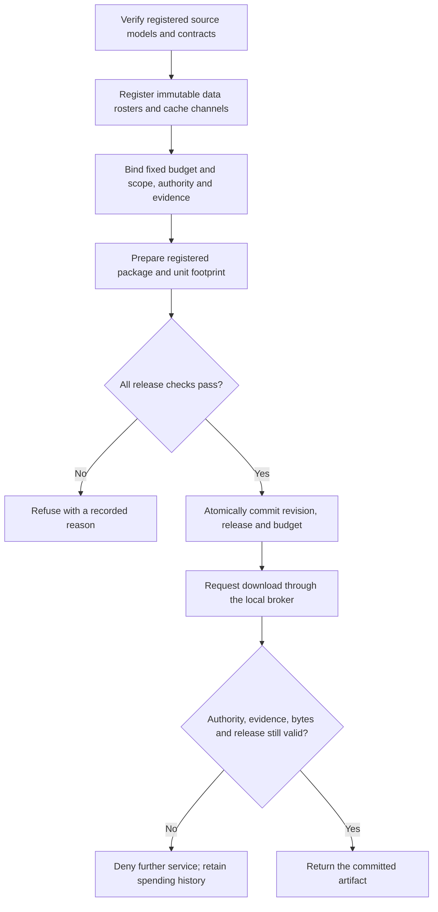

# Temporal model releases: optional registry and assurance workflow

Updated: 22 September 2026.

The local `temporal_assurance` package tracks declared protected data and
randomization channels before allowing an exact registered model package to
be downloaded. It addresses recipients who retain earlier models and linked
predictions. This implementation is separate from the runnable
[public synthetic export exercise](model-export-poc.md).

This government publication includes the broker, web workflow and their tests.
It does **not** include the revised academic manuscript, ACS model packages,
study archives, importer or a ready-made temporal registry. A fresh checkout
can run the synthetic exercise and audit console. The temporal workflow needs
an existing verified research run and initialized operator inventory supplied
separately; it does not accept arbitrary uploaded models or agency data.

For operators who retain the research workspace, the supporting registration,
verification receipt, summary, reports and conditional theoretical argument
are under `reproduction/acs-temporal-assurance-20260921/`, with names
`registration.json`, `verification-v1.json`, `README.md`, `report-v2/REPORT.md`,
`report-v2/index.html` and `THEORY.md`. These are optional external prerequisites,
not bundled GitHub results. Their verifier checks persisted evidence; it does
not rerun model inference, attacker fitting or historical live service operations.
Current operator state must be read from its own ledger, not inferred from a
historical report or this guide.

## 1. Question and scope

The operational question is: **when an agency proposes another model release,
does the complete accumulated release remain within its declared privacy
budget, and are the exact artifacts still supported by current evidence and
authorization?**

The experimental question is narrower: how does measured disability-attribute
inference change as a recipient accumulates heterogeneous models and linked
scores, under cache reuse, fresh randomization and independently renewed model
training caches? The recipient retains earlier releases. Changing a model
name, downloading a newer version, withdrawing an endpoint or changing the
release order does not make an earlier disclosure disappear.

The optional registry adapter targets the fixed public ACS benchmark described
in the separately retained study files
`reproduction/acs-leakage-20260921/README.md` and
`reproduction/acs-attribute-dp-20260921/README.md`.
The protected secret is a benchmark record's binary disability indicator.
The roster, identifiers, ten other covariates, income labels and dataset
memberships are held fixed. This is fixed-roster attribute replacement DP,
not membership DP, whole-record DP, household DP or DP-SGD.

The attacker can combine previously released models and permitted query
results. The linked-score attack additionally receives a score computed for
the target using the provider's sensitive-input path; it knows the remaining
input features and compares candidate sensitive inputs. Report this extra
access explicitly. Recovering a sanitized input from such a score is not the
same result as recovering the original sensitive attribute, and neither is
automatically evidence of memorization in model weights.

ACS record keys support this benchmark's overlap accounting. They do not
establish that different years contain different actual citizens, or provide
a verified mapping of a citizen's changing attributes over time. The temporal
axis here is **release order over a fixed cohort**, not observed calendar-time
changes in people, populations or model utility.

## 2. Release accounting

For a protected unit `u`, let `C(u, t)` contain the distinct registered
randomization channels affecting that unit that are exposed by committed
releases through step `t`. A conservative pure-DP ledger records

```text
spent(u, t) = sum(epsilon(c) for c in C(u, t))
```

A release is eligible under a budget cap only if this cumulative sum, including
its proposed new channels, is within the cap for every affected unit. This is
a mechanism bound under the declared assumptions, not an empirical attack
accuracy estimate. All comparisons and ledger arithmetic must preserve the
budget boundary without floating-point tolerance that can authorize overspend.

| Operation | Accounting effect |
| --- | --- |
| Train another family from the same sanitized table | Reuses the existing channel; no additional RR term |
| Produce another score from the same cached sanitized value | Reuses the existing channel |
| Rerandomize the raw sensitive value | Adds a new channel and its budget |
| Train from an independently sanitized replacement table | Adds a new channel for every affected protected unit |
| Reuse a previously exposed channel under a new model or dataset name | No reset and no artificial duplicate charge |
| Read raw disability when producing a score | Outside the cached-channel guarantee; block the protected release path |
| Revoke, expire or delete a release | Does not refund expenditure already committed |

Within each historical DP arm, every family and training dataset uses one
training cache. Historical fresh scores use one additional randomized response
per dataset and reuse it across families. Thus ten model releases do not imply
ten fresh score draws. A sequence touching all four datasets can expose up to
five channels for a training member: the training cache and four fresh scoring
channels. This gives the conservative bound `5 * epsilon`. A target absent
from every released training dataset has no training-cache term for that
model transcript, but still incurs each fresh linked-score term.

The two epsilon-1 arms and two epsilon-3 arms are independent sanitizations.
Exposing both epsilon-1 training caches can cost 2; both epsilon-3 caches can
cost 6; exposing all four can cost 8 for an affected unit, before any additional
fresh scoring channels. Alternative experimental arms are not a claim that
their combined publication has the privacy guarantee of one arm.

Stable identity and value versions have different jobs. A canonical protected
unit identifies whose cumulative expenditure is tracked. An attribute version
identifies which value a cached response represents. Changing the version may
require a new cache, but it must not create a new budget namespace. If multiple
versions of a person's attribute are protected jointly, sum the accounted
channels across those versions under that person's common unit. The present
benchmark does not validate such a person-level mapping.

Reusing one sanitized value is also different from reusing one noise coin.
If `B_t = S_t XOR N` reuses the same flip coin as the true value changes, then
`B_t XOR B_(t+1) = S_t XOR S_(t+1)` reveals the change exactly. The fixed-value
cache argument does not justify that construction.

## 3. Rules for an optional temporal experiment

This section preserves the evaluation design for the separately retained ACS
research tools. Those tools, trained artifacts and measured results are not
part of this government implementation publication. The design below is not
evidence that a fresh checkout has run the study.

Freeze the ordered schedule and evaluation rules before calculating the new
prefix results. The source models were already trained and inspected, so this
is a newly registered analysis of historical fits, not prospective validation
of newly trained models.

The ten-step heterogeneous schedule starts with the small SLM trained on `D1`
and the medium SLM trained on `D2_50`. It then includes the five tree families,
KNN, logistic regression and MLP, with dataset assignments spanning `D1`,
`D2_0`, `D2_50` and `D2_100`. The executable registration specifies the exact
remaining order and assignments. The SLMs are miniature structured-record
language models trained from scratch; they are not pretrained conversational
models.

Evaluate all prefixes using both replicates at epsilon 1 and epsilon 3. Keep
the following channel policies distinct:

- **Cached:** models and linked scores use the same arm's protected table.
- **Fresh scoring:** models retain their training cache, while scoring uses
  the historical dataset-specific fresh response. Repeated use of that dataset
  across families counts the response once.
- **Renewed training cache:** later models come from another independently
  sanitized arm. The old cache remains in the recipient's accumulated view and
  the new cache spends additional budget. A budget-capped policy may refuse
  subsequent releases instead of pretending this renewal restores privacy.

Raw-input scoring is a diagnostic bypass control and must never pass as a
protected score policy. A fresh-versus-cached comparison at equal epsilon per
draw is not an equal-total-budget comparison. The recorded cumulative budget
must accompany its attack and utility results.

For each prefix, retain at least the source artifact identities, channel IDs,
affected unit sets, budget spent, gate decision, decoded-channel coverage,
original-disability inference and ordinary income utility. Separate member and
nonmember targets, and use the same permitted background-data baseline. Keep
full-score, two-decimal and label-only interfaces distinct. Release order can
change a prefix's disclosure even when the final union is identical.

Attack training and threshold selection use only the registered reference and
calibration data. Evaluation labels score the frozen attack; they do not select
the strongest prefix, attack or threshold. Earlier attacks may remain available
as candidates chosen on calibration data. The optimal recipient can ignore an
extra output, but a finite calibrated attack can fluctuate on evaluation data.
Do not force monotone empirical accuracy by taking an evaluation-label oracle
maximum and presenting it as an executable attack.

Per-prefix uncertainty is conditional on these models and this cohort. Reusing
one evaluation set across many prefixes does not create independent studies.
Pointwise intervals do not justify an adaptive stopping or release rule without
an appropriate simultaneous or sequential analysis. Neither attack failure nor
observed accuracy below a threshold supplies an upper bound on every attacker.

## 4. Operator workflow

### Website

The primary interface is now the [enforced release workflow](enforced-release-workflow.md).
Its additional server gates require persisted automated checks and a recorded
local review before commitment. The check and review bind the exact request,
evidence and ledger revision; the server rechecks them inside the commitment
transaction. Direct commit or download API calls cannot skip these stages.

When configured with valid existing inputs, the local dashboard at
`http://127.0.0.1:8767/` presents the verified historical study separately from
the live operator registry. The explorer selects a
release sequence and step to show cumulative budget, observed attribute
inference and refusal decisions. Full linked scores, restricted views,
query-only attacks and raw-input controls retain their different meanings.

The operator panel reads the models in the supplied initialized inventory.
Preparing a model binds a request to the current revision without spending
budget. Run its checks, record the explicit review and then commit before
downloading the exact registered ZIP. Revocation stops future broker delivery without erasing
earlier disclosure or charges. Loading or refreshing the page never commits a
release, initializes a new budget, retrains a model or reruns the study.

The API prefix is `/api/temporal`; filesystem roots are server configuration,
not request parameters. Evidence links serve only named report artifacts and
documentation. They do not expose private audit databases, raw prediction
archives or sanitized-input caches. Current evidence, authority, expiry and
revocation are checked again by the existing broker on mutations and delivery.
The service remains loopback-only with trusted local operator semantics; the
authority label is not a user authentication system.

The synthetic exercise remains available at `/synthetic`, retaining its own
history. After [installing the console runtime](pipeline-quickstart.md), use its
Python from the repository root and select the existing inputs explicitly:

```console
python -m model_release_assurance.export_poc serve --data .local/model-export-poc --repository . --temporal-run PATH_TO_VERIFIED_RUN --temporal-operator PATH_TO_INITIALIZED_OPERATOR --port 8767
```

Quote paths containing spaces. Without these research/operator inputs, follow
the [synthetic setup](model-export-poc.md) instead; absence does not initialize a
new temporal ledger or supply a new privacy allowance.

The following CLI sections describe the **frozen research broker and trusted
administrative interface**, which predate the web pipeline's recorded-review
gate. Use the website's workflow for governed HTTP delivery. A core-CLI
commitment without the pipeline records is insufficient for web delivery;
filesystem access and direct administrative CLI exports remain outside that
web enforcement boundary.

The published CLI operates an existing local SQLite registry. The optional
research importer is specific to verified ACS artifacts; it is maintained
separately and is not an arbitrary-model DP certification endpoint. The import
and replay examples below require that full research workspace and its matching
runtime. A government-only checkout cannot run those two research commands.



### 4.1 Set up the operator shell

Run from the repository root in PowerShell. Replace the placeholder locations
with approved existing directories. Keep the registry and recipient packages
in protected operator storage. The government-only CLI requires the inventory;
the source run and verification receipt are additional research-import inputs.

```powershell
$mraRoot = (Get-Location).Path
$env:PYTHONPATH = Join-Path $mraRoot 'src'
$mraPython = Join-Path $mraRoot '.venv-pipeline/Scripts/python.exe'
$mraSource = 'PATH_TO_EXISTING_VERIFIED_SOURCE_RUN'
$mraVerification = 'PATH_TO_EXISTING_SOURCE_VERIFICATION_RECEIPT'
$mraWorkflow = 'PATH_TO_INITIALIZED_OPERATOR'
```

The operator directory is separate from the temporal experiment's `run-v1`
directory. Experimental ledgers intentionally undergo revocation and evidence
invalidation controls; they are not the registry for a fresh operator demo.

### 4.2 Import once, without releasing a model

If the operator directory already exists, start with the inventory/status
commands below. Do not rerun an importer into an existing history or assume
that its revision and spending remain zero.

The following optional import requires the separately retained
`scripts/run_acs_temporal_release_study.py`, its research dependencies, verified
source run and receipt. It is **unavailable in a government-only checkout**.
Use the producer-compatible research Python in `$mraPython`. For a genuinely new
demonstration, set `$mraWorkflow` to an unused directory; do not recreate a
ledger to reset spending for a previously disclosed population:

```powershell
if (Test-Path -LiteralPath $mraWorkflow) { throw 'Already initialized; use its inventory and status commands.' }
& $mraPython scripts/run_acs_temporal_release_study.py init-workflow `
    --source-run $mraSource `
    --verification $mraVerification `
    --output $mraWorkflow `
    --arm epsilon-1-seed-20260921
if ($LASTEXITCODE -ne 0) { throw 'Import failed; retain the error and do not release.' }
```

The importer refuses an existing output directory. For an already initialized
workspace, read its inventory instead of deleting or replacing its ledger:

```powershell
$mraInventory = Get-Content -LiteralPath (Join-Path $mraWorkflow 'workflow.json') -Raw | ConvertFrom-Json
$mraDb = $mraInventory.db
$mraAuthority = $mraInventory.authority_id
$mraInventory.models | Format-Table step, model_id, family, dataset
& $mraPython -m model_release_assurance.temporal_assurance --db $mraDb status
```

Initialization checks the historical evidence and selected artifact hashes,
registers ten packages from one epsilon-1 cache, and produces `workflow.json`
and `assurance.sqlite3`. Its initial status is `registered_not_released`:
registration alone neither commits expenditure nor downloads a package. The
registered packages include the model, required preprocessing/artifact
metadata, a reviewed public contract projection and cached linked scores.

The scope is `DIS-v1` under the fixed public roster. The cap is epsilon 1 per
stable record key. The local authority identifier is
`local-research-release-authority`; it is an administrative label, not a
verified agency identity. Authority, registrations and evidence expire 30 days
after import. Consult the inventory's `expires_at`; do not extend expiry or
erase the registry to force a release through. There is no implemented policy
migration or evidence-renewal procedure.

This importer trusts the preserved producer to have used the declared caches.
Byte hashes and a passing import do not establish that an arbitrary training
program avoided raw sensitive inputs. Canonical unit identities also come from
the adapter; the broker cannot discover disguised or incorrectly linked people.

### 4.3 Prepare against the current ledger

Use a new request ID for a new proposal. Read the revision immediately before
preparing; another successful commit can make this revision stale.

```powershell
$mraStatusJson = & $mraPython -m model_release_assurance.temporal_assurance --db $mraDb status
if ($LASTEXITCODE -ne 0) { throw $mraStatusJson }
$mraStatus = $mraStatusJson | ConvertFrom-Json
$mraRequest = 'operator-demo-step-01'
$mraPrepared = & $mraPython -m model_release_assurance.temporal_assurance --db $mraDb prepare `
    --request $mraRequest `
    --model step-01-slm_small-D1 `
    --authority $mraAuthority `
    --expected-revision $mraStatus.revision
if ($LASTEXITCODE -ne 0) { throw $mraPrepared }
$mraPrepared
```

Review the returned model identity, artifact digest, cache footprints, covered
unit count, scoring mode, budget and evidence identities. The scoring contract
and serving footprint were bound at import and cannot be downgraded by a
prepare argument. Preparation does not spend budget or authorize download.

The first model trains on `D1`, but its registered score transcript can cover
additional evaluation/reference units. Accounting uses the union of training
and serving units. Disjoint training sets alone therefore do not imply disjoint
disclosures. Internal manifests contain audit commitments and must not be
appended to the recipient package.

### 4.4 Commit, then download exactly the registered bytes

```powershell
$mraCommitted = & $mraPython -m model_release_assurance.temporal_assurance --db $mraDb commit `
    --request $mraRequest
if ($LASTEXITCODE -ne 0) { throw $mraCommitted }
$mraCommitted

$mraOutput = Join-Path $mraWorkflow 'recipient-step-01.zip'
& $mraPython -m model_release_assurance.temporal_assurance --db $mraDb download `
    --request $mraRequest `
    --authority $mraAuthority `
    --output $mraOutput
if ($LASTEXITCODE -ne 0) { throw 'Download blocked or failed; retain the CLI result.' }
Get-FileHash -LiteralPath $mraOutput -Algorithm SHA256
& $mraPython -m model_release_assurance.temporal_assurance --db $mraDb status
```

Compare the file hash with the committed receipt's `artifact_digest`. A download
before commit fails. Downloads recheck authority, expiry, evidence invalidation,
revocation and integrity. The CLI refuses to overwrite an existing output path;
use a new path for an authorized repeat download. The output directory must
already exist.

The ledger charges at **commit**, even if delivery later fails. SQLite stores
the immutable package and commits the receipt, revision and every new
`(cache, unit)` charge atomically. Copying bytes to the recipient file is a
subsequent operation: interrupted output may leave a partial file, while its
prior expenditure remains. No budget refund is inferred from failed delivery.

The live CLI leaves `now=None`: the broker reads its clock inside the
transaction after acquiring the database lock and rechecks expiry after
accounting/package work. Explicit integer times are reserved for deterministic
replay. This is an authorization check at admission; an admitted copy can
finish after a later expiry, and a delivered file remains with its recipient.

### 4.5 Continue the temporal sequence and handle refusals

Repeat the status, prepare, commit and download steps with a fresh request ID
and the next inventory model, such as `step-02-slm_medium-D2_50`. Keep all prior
receipts. Reusing the same cache does not charge a record twice, although a new
model or score footprint may expose that cache for additional records.

All CLI results are JSON. Success exits with code 0; a blocked operation exits
with code 2 and a `reason`. Stop that release when it is blocked. Common
responses are:

| Reason | Operator action |
| --- | --- |
| `revision_conflict` | Read current status and prepare a new request ID against that revision; retain the old proposal. |
| `idempotency_conflict` | The request ID was reused with different parameters. Use the original parameters for a retry or a new ID for a new proposal. |
| `budget_exceeded` | Do not release through another ledger. Reduce the permitted disclosure/change the mechanism with new evidence, or defer; the current CLI cannot revise the cap. |
| `authority_inactive`, `evidence_expired`, `evidence_invalidated` | Stop delivery and obtain an independently reviewed administrative remedy; renewal is not automated here. |
| `release_revoked`, `integrity_failure`, `lineage_mismatch` | Preserve the record and investigate before any new proposal. |
| `not_committed` | Complete a valid commit before asking for download. |

Retrying an identical committed request returns its original receipt without a
second charge, while still checking current authority and evidence. The CLI
does not provide an authenticated multi-user service or a complete refusal-log
service; retain its JSON refusals in protected operational records. The store's
committed ledger is the authority for expenditure, not terminal output alone.

### 4.6 Revoke a release or invalidate its supporting evidence

These are explicit operator actions on the demonstration registry. They block
future access and are not undone by another prepare or commit. They do not
delete a recipient's existing file or reduce recorded expenditure.

```powershell
& $mraPython -m model_release_assurance.temporal_assurance --db $mraDb revoke `
    --request $mraRequest
& $mraPython -m model_release_assurance.temporal_assurance --db $mraDb status
```

For invalid evidence, use the evidence identity already recorded in the
inventory or manifest:

```powershell
& $mraPython -m model_release_assurance.temporal_assurance --db $mraDb invalidate-evidence `
    --digest $mraInventory.evidence_digest
```

The demo packages share that evidence: invalidating it blocks all affected
packages. To retire the local authority instead:

```powershell
& $mraPython -m model_release_assurance.temporal_assurance --db $mraDb revoke-authority `
    --authority $mraAuthority
```

There is no background monitoring process in this CLI. Expiry and invalidation
are enforced when operations run; evidence investigation, detecting new raw
accesses and initiating retirement remain operator responsibilities.

### 4.7 Optional research replay outside this publication

This requires the separately retained study script and data described in
section 4.2. The historical registration is retained at
`reproduction/acs-temporal-assurance-20260921/registration.json` in that research
workspace. Do not overwrite it or rerun into its historical output directory.
For a genuinely new analysis, choose new registration and output paths:

```powershell
$mraNextRegistration = 'PATH_TO_NEW_REGISTRATION_JSON'
$mraNextRun = 'PATH_TO_NEW_RESEARCH_RUN'
if ((Test-Path -LiteralPath $mraNextRegistration) -or (Test-Path -LiteralPath $mraNextRun)) {
    throw 'Choose unused registration and output paths; preserve earlier evidence.'
}
& $mraPython scripts/run_acs_temporal_release_study.py freeze `
    --source-run $mraSource --verification $mraVerification --output $mraNextRegistration
if ($LASTEXITCODE -ne 0) { throw 'Freeze failed; do not run.' }
& $mraPython scripts/run_acs_temporal_release_study.py run `
    --registration $mraNextRegistration --output $mraNextRun
```

The example names above are for a new follow-up, not the current run.
`freeze` binds source hashes, schedule and analysis rules; `run`
checks those bindings. Research replay uses declared simulated operation times,
retains each prefix and deliberate blocked control, and does not authenticate
an agency deployment. Inspect completion and independent verification before
citing numerical results.

## 5. Evidence and release boundaries

The protected export allowlist consists of the model artifact and necessary
preprocessing and artifact metadata, plus a reviewed public contract projection.
Whole research directories are not export packages. The existing study includes
raw-truth diagnostics, raw-bypass scores, private evaluation state and metrics
that are outside its single-cache claim. Its private contract also commits to
an archive containing more than the one training cache. Do not copy that
archive or its private-state commitment into a release claiming only the
single-cache boundary without a separate analysis.

The local broker provides a reference gate for managed downloads. It is not an
operating-system sandbox, remote attestation system, cryptographic proof of
training, trusted identity provider or distributed consensus service. A process
with direct access to raw data, private caches or staged artifacts can bypass a
Python API unless deployment permissions enforce the boundary. The expected
trust assumptions and exported files must be visible in every assurance record.

Three evidence classes must remain separate:

| Evidence | What it supports | What it does not support |
| --- | --- | --- |
| RR mechanism argument and declared information flow | Conditional attribute-DP bound for the complete accounted transcript | Protection of other fields, membership or unaccounted raw accesses |
| Saved model/attack measurements | Results for the tested channels, attacks, fits and cohort | A universal inference-risk ceiling or longitudinal citizen validation |
| Broker tests and integrity receipts | Behavior of exercised implementation paths | Machine-checked refinement, malicious-host resistance or agency deployment certification |

## 6. Verified checks and remaining deployment work

Current government implementation verification is indexed in the
[retained verification record](../reproduction/government-audit-update-20260922/README.md).
The broker, CLI, web pipeline and adversarial tests are included in this
publication and can be run from the installed console environment:

```console
python -m unittest discover -s tests -p "test_temporal*.py" -v
```

Historical study logs named `pre-run-tests.txt`, `verifier-tests.txt` and
`report-tests-final.txt` are retained separately under
`reproduction/acs-temporal-assurance-20260921/`. The ACS package/attack/verifier/
report tests in that research workspace are also excluded from this government
publication. Their historical results are not a fresh run of the governed web
workflow. Python implementation tests and evidence verification are not
machine-checked proofs. The following maps the included checks to their tests.

| Exercised property | Representative tests and source |
| --- | --- |
| Same cache across families is charged once; overlap accumulates, disjoint units remain separate; renamed datasets do not reset spending | `test_different_architectures_same_cache_postprocess_without_charge`, `test_overlap_union_and_disjoint_parallel_accounting`, `test_new_dataset_name_does_not_reset_spending` in [broker tests](../tests/test_temporal_assurance_store.py) |
| Training and serving footprints are combined; two fresh channels on the same unit are summed before authorizing one request | `test_cached_serving_charges_union_including_nonmembers`, `test_one_request_cross_cache_sum_over_cap_is_denied_atomically`, `test_fresh_scores_reused_are_counted_once_and_renewed_scores_add` in broker tests |
| A new attribute version preserves the stable unit's cost; mismatched cache/data versions fail | `test_new_attribute_version_same_unit_adds_epsilon`, `test_version_mismatch_rejected` in broker tests |
| Equality at the cap is permitted; one extra epsilon micro-unit is rejected | `test_threshold_equality_allowed_one_micro_over_blocked`, `test_integer_budget_rejects_float_bool_and_negative` in broker tests |
| Missing lineage, invalid scope, raw or unknown score modes, and attempts to downgrade the registered scoring contract fail | `test_missing_provenance_and_scope_fail_closed`, `test_raw_unknown_and_underspecified_scoring_denied`, `test_registered_serving_contract_cannot_be_downgraded` in broker tests |
| Authority/evidence expiry and invalidation block future operations; revocation retains spending | `test_evidence_invalidation_blocks_commit_and_download_without_refund`, `test_serving_cache_invalidation_is_checked`, `test_revocation_blocks_future_access_not_budget_refund` in broker tests |
| Live time is sampled after database-lock waiting and rechecked after expensive work | `test_live_clock_is_read_after_waiting_for_database_lock`, `test_live_prepare_rechecks_expiry_after_budget_work`, `test_live_commit_expiry_after_ledger_write_rolls_back_publication`, `test_live_download_rechecks_expiry_after_manifest_hash` in broker tests |
| Stale proposals fail; same-request retries do not charge twice; concurrent distinct commits have one revision winner | `test_retry_parameter_binding_and_exactly_once_charge`, `test_stale_preparation_fails_and_new_request_can_retry`, `test_concurrent_distinct_commits_one_revision_winner`, `test_concurrent_same_request_returns_same_receipt` in broker tests |
| Exceptions and a killed process after ledger writes leave no partially committed release | `test_exception_during_commit_rolls_back_charge_and_publication`, `test_process_crash_recovery_has_no_partial_release` in broker tests |
| Existing budget/scope cannot be changed by reopening; ordinary operations do not silently recreate a missing ledger | `test_restart_configuration_cannot_increase_cap_or_change_scope`, `test_removed_database_not_silently_recreated_by_release` in broker tests |
| Exact bytes require commitment; CLI avoids overwrite; revoked downloads fail | `test_exact_bytes_only_after_commit`, `test_corrupted_artifact_and_manifest_fail_integrity` in broker tests; `test_prepare_commit_download_and_revocation` in [CLI tests](../tests/test_temporal_assurance_cli.py) |

The optional research test files are `tests/test_acs_temporal_assets.py`
(package allowlists and frozen source hashes), `tests/test_acs_temporal_attack.py`
(channel deduplication and calibrated attack selection),
`tests/test_verify_acs_temporal_release_study.py` (independent accounting and
metric reconstruction) and `tests/test_build_acs_temporal_report.py` (report
binding and tamper checks). Use those files only from the matching retained
research workspace; their absence here does not disable the included broker
and web workflow tests.

The following remain **unverified or unimplemented** and must not be described
as completed lifecycle safeguards:

- Dynamic policy revisions, policy migration, cap changes, authority renewal
  and reviewed evidence renewal. The existing scope and cap are immutable.
- Agency authentication, role permissions, approval delegation, a remote
  service authorization boundary or operating-system isolation of raw data.
- Protection against an administrator replacing, rolling back, deleting or
  copying the database; secure distributed accounting and anti-rollback backup
  recovery. An ordinary missing-ledger check is not such protection.
- Resolving the same real person across agencies, years or changing identifiers,
  or validating longitudinal sensitive-value histories. Stable keys are a
  trusted input to this prototype, not an identity-discovery algorithm.
- Whole-record DP, membership protection, actual DP-SGD model training, or a
  proof that an arbitrary external producer obeyed its declared information
  flow. This experiment uses attribute-DP preprocessing and ordinary optimizers.
- Continuously monitored services, authenticated incident handling, secure
  deletion of prior recipient copies, utility certification, and governmental
  field validation. A budget pass does not establish an absolute inference-risk
  ceiling, legality or operational effectiveness.

For real use, every release must be included in one durable cumulative history.
Creating a fresh demonstration registry is not a permitted method for resetting
an existing deployment's expenditure. An authenticated integration and a
reviewed migration/backup procedure are prerequisites for claiming that broader
boundary.

## 7. Positioning against established work

[Sage (SOSP 2019)](https://systems.cs.columbia.edu/PrivateKube/papers/sosp2019sage.pdf)
already addresses cumulative privacy accounting for model pipelines over
growing databases, including reuse of old data, block composition and adaptive
training with quality checks. This workflow must not claim the general idea of
tracking privacy across repeated model releases as new.

[PrivateKube (OSDI 2021)](https://www.usenix.org/system/files/osdi21-luo.pdf)
treats privacy budgets as non-replenishable resources for workloads of models
trained and released over time. It supports richer protection units and studies
budget scheduling. Its trusted training-process and infrastructure assumptions
are explicit. A local gate with an expenditure ledger does not by itself improve
on its scheduling algorithms or remove those trust assumptions.

[RAPPOR (CCS 2014)](https://arxiv.org/abs/1407.6981) establishes the use of
memoized randomized response for repeated collection and discusses the limits
posed by correlated, changing values. The present cached binary response is
simpler than the full RAPPOR construction and does not establish report
unlinkability. A rotating seed, Merkle commitment or new release identifier
does not replenish privacy budget.

The present work's defensible contribution is therefore an experimental and
systems integration: connect model packages, linked serving disclosures,
canonical data/channel provenance, cumulative unit budgets and time-dependent
release gates, and test where that connection fails. Any claim of a new
accounting theorem, superior scheduler, longitudinal guarantee or production
deployment requires additional evidence beyond this companion.
