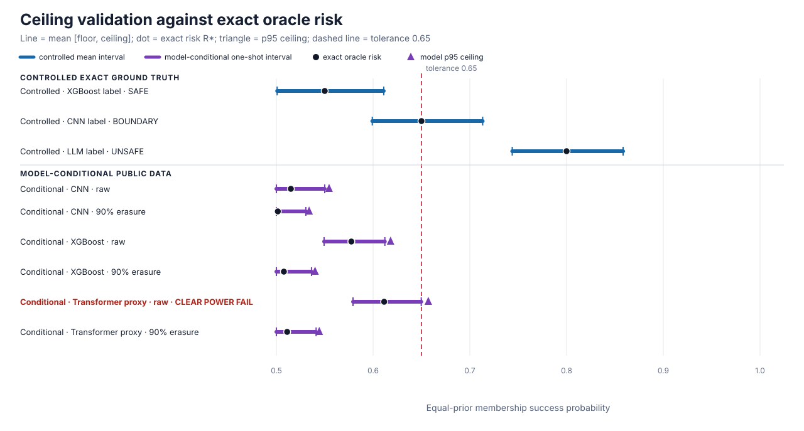

# Ceiling experiment results

The controlled experiment passed, while the complete model-backed experiment did not meet its registered acceptance criteria (all_six_simultaneous_clear_rate_lowers_meet_minimum). The negative result is retained: ceiling coverage and decision usefulness must be interpreted separately. No result grants release authorization.

## Claim boundary

| Evidence level | Result | Valid scope |
| --- | --- | --- |
| Mathematical or universal proof | Not established by these experiments | Requires separate formal assumptions and proof audit |
| Controlled exact-ground-truth evidence | Accepted | Complete preregistered synthetic finite-channel family |
| Model-conditional public-data evidence | Registered acceptance not met | Frozen trained artifacts, finite target pools, and closed one-query wrappers |

## Headline metrics

| Experiment | Soundness metric | Decision-usefulness metric | Execution |
| --- | --- | --- | --- |
| Controlled exact-ground-truth | Minimum observed ceiling coverage 100.00%; 0/1200 observed primary undercoverage; maximum simultaneous undercoverage upper 1.56% | Registered safe/boundary/unsafe decisions all passed; maximum unsafe false-CLEAR upper 1.56% | 1200 analyzer + 3 full Engine replays |
| Model-conditional public data | 0/1200 observed repeat undercoverage; 6/6 one-shot intervals covered oracle risk; 6/6 repeat families met the undercoverage target; maximum simultaneous repeat undercoverage upper 2.70% | 5/6 repeat families met the CLEAR-rate target; minimum simultaneous repeat CLEAR-rate lower 44.94% | 1200 analyzer + 6 full Engine replays |

> Full Engine replays are integration evidence under experimental attack-battery waivers. The waivers are not deployment-valid; statistical coverage evidence comes from the registered analyzer repetitions.

## Controlled exact-ground-truth primary cells

| Scenario | Role | Exact risk R* | Mean floor L | Mean ceiling U | Mean width | Coverage | Correct decision (simultaneous lower) |
| --- | --- | ---: | ---: | ---: | ---: | ---: | --- |
| XGBoost label | SAFE | 0.5500 | 0.5008 | 0.6110 | 0.1102 | 100.00% | 400/400 CLEAR (98.44%) |
| CNN label | BOUNDARY | 0.6500 | 0.5992 | 0.7133 | 0.1141 | 100.00% | 400/400 HOLD (98.44%) |
| LLM label | UNSAFE | 0.8000 | 0.7438 | 0.8584 | 0.1146 | 100.00% | 400/400 BLOCK (98.44%) |

## Width calibration

| Scenario | Mean width at n=100 | Mean width at n=500 | Relative reduction |
| --- | ---: | ---: | ---: |
| XGBoost label | 0.5025 | 0.2225 | 55.73% |
| CNN label | 0.5181 | 0.2301 | 55.59% |
| LLM label | 0.4442 | 0.2306 | 48.09% |

## Model-conditional public-data cells

| Model / wrapper | Oracle R* | One-shot [L, U] | Width | Repeat undercoverage (simultaneous upper) | Repeat CLEAR (simultaneous lower) | Registered targets |
| --- | ---: | ---: | ---: | --- | --- | --- |
| CNN / MNIST — raw categorical NLL bins | 0.5150 | [0.4875, 0.5505] | 0.0630 | 0/200 (2.70%) | 200/200 (97.30%) | coverage PASS; CLEAR power PASS |
| CNN / MNIST — 90% state-independent erasure | 0.5015 | [0.4839, 0.5299] | 0.0460 | 0/200 (2.70%) | 200/200 (97.30%) | coverage PASS; CLEAR power PASS |
| XGBoost / Adult — raw categorical NLL bins | 0.5775 | [0.5519, 0.6157] | 0.0638 | 0/200 (2.70%) | 200/200 (97.30%) | coverage PASS; CLEAR power PASS |
| XGBoost / Adult — 90% state-independent erasure | 0.5078 | [0.4896, 0.5372] | 0.0476 | 0/200 (2.70%) | 200/200 (97.30%) | coverage PASS; CLEAR power PASS |
| Compact Transformer / 20 Newsgroups (LLM proxy) — raw categorical NLL bins | 0.6114 | [0.5769, 0.6475] | 0.0706 | 0/200 (2.70%) | 109/200 (44.94%) | coverage PASS; CLEAR power FAIL |
| Compact Transformer / 20 Newsgroups (LLM proxy) — 90% state-independent erasure | 0.5111 | [0.4900, 0.5409] | 0.0508 | 0/200 (2.70%) | 200/200 (97.30%) | coverage PASS; CLEAR power PASS |

The registered model-backed acceptance failure is decision-usefulness, not observed undercoverage: Compact Transformer / 20 Newsgroups (LLM proxy) / raw categorical NLL bins did not meet the simultaneous CLEAR-rate lower target.

## How the metrics map to MRA

- Soundness is tested by undercoverage: `U < R*`. The simultaneous upper bound quantifies residual uncertainty across the registered family.
- Tightness is measured by interval width `U - L` and ceiling excess `U - R*`.
- Decision usefulness follows the protocol rule: CLEAR when `U <= 0.65`, BLOCK when `L > 0.65`, and HOLD otherwise.
- The model-backed results remain conditional on the frozen finite populations and closed wrappers; the compact Transformer is an LLM proxy, not a generative LLM endpoint.

No raw scores, count rows, seeds, model artifacts, local paths, or software-environment details are included in this publication projection.
