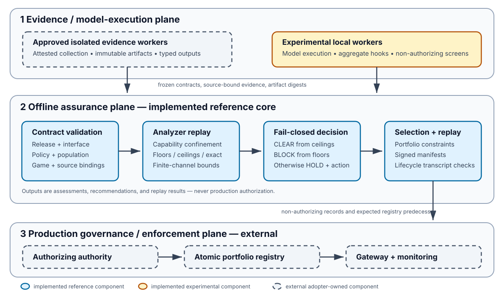

# Model Release Assurance: Contract-Relative Completeness for Release Recommendations and Scoped Risk Ledgers

**Anonymous Authors**

## Abstract

Before a model crosses a controlled boundary, an operator needs two answers:
*may this exact artifact advance toward release to this recipient through this
interface, and which declared risks are bounded, blocking, or unresolved under
the accepted evidence?* A model score cannot answer either question. Evidence
is scoped to a population, game, policy, interface, and time; it is also
directional, because a successful attack can lower-bound risk while an
unsuccessful attack supplies no clearing upper bound.

We present **Model Release Assurance (MRA)**, an offline assurance kernel whose
`AssessmentReport` supplies a fail-closed recommendation and, with its verified
request and policy, defines a scoped risk-ledger view. We prove
**contract-relative release-answer completeness**: every terminating assessment
of finite evidence under a validated closed contract induces exactly one
context-bound disposition per request-declared check, and returns `CLEAR` if
and only if every mandatory obligation is discharged. The totalized semantics
maps invalid or unreplayable inputs to `REJECT`; unresolved mandatory
obligations cannot create clearance. An authority must still justify that the
finite contract covers the real release; the theorem does not discover omitted
harms.

MRA classifies evidence as a floor, ceiling, exact result, or non-decisional
screen. Lower evidence may block; only complete eligible upper evidence may
clear. A new producer preserves the theorem only after a reviewed code/schema
extension normalizes its records and checks its direct and indirect clearance
effects; fixed-prerequisite records with neither effect cannot promote a
non-clearing result. Conditional on an adequate contract and sound bounds, the
false-clear probability is at most the registered failure-budget sum. For a
complete finite channel, MRA compiles simultaneous exact-guess-risk bounds. The
contract model is risk-generic, but the current runtime covers only linkage,
membership, attribute, and reconstruction; other harms require reviewed
extensions.

Across three controlled exact-risk channels, 1,200 analyzer replays had zero
observed undercoverage and made the registered decision in all 400 repeats per
role. A frozen corrective study likewise had zero observed undercoverage and
wrong-direction events in 1,200 replays; a near-threshold proxy held in 169/200
repeats. These experiments evaluate the finite-channel mechanism, not a live
endpoint. Authorization, registry authority, and gateway enforcement remain
external.

## 1. Introduction

The operational question is simple: *Can I export this model, and what are the
risks?* We use **release** for “export” in the remainder of the paper: transfer
of a model artifact or grant of an access capability across a specified trust
boundary to a specified recipient through a specified interface. This does not
mean serialization to a format such as ONNX, and MRA does not determine
statutory export-control or sanctions compliance.

A useful answer has two inseparable parts: a release recommendation and an
auditable account of accepted blocking evidence, clearing bounds, and
unresolved declared risks. A bare
yes/no hides why the model may advance or must stop; one “overall risk” score
hides incomparable populations, games, interfaces, and uncertainty. MRA
therefore treats the answer as a gate paired with an obligation-level risk
ledger, not as a scalar model grade.

ML systems routinely validate data, train models, record metadata, compare
candidates, and deploy selected artifacts. Production platforms such as TFX
and MLflow make much of this lifecycle reproducible and operable
([Baylor et al., 2017](https://doi.org/10.1145/3097983.3098021);
[Zaharia et al., 2018](https://people.eecs.berkeley.edu/~matei/papers/2018/ieee_mlflow.pdf)).
Yet these platforms do not by themselves answer whether this exact model may
cross this exact boundary or which risks justify that result. The answer can
change when an API adds probabilities, an artifact download becomes
available, a retrieval component is attached, a
model is selected after inspecting many candidates, or a previously separate
release joins the same observable portfolio.

This gap is especially visible in privacy and security evaluation. An attack
that succeeds establishes risk under its tested observation model. The same
attack failing establishes only that the tested attack did not succeed; it
does not upper-bound a stronger adversary or an unmeasured interface
([Salem et al., 2023](https://www.microsoft.com/en-us/research/publication/sok-let-the-privacy-games-begin-a-unified-treatment-of-data-inference-privacy-in-machine-learning/)).
Conversely, a differential-privacy accountant or statistical ceiling can
support clearance only when its mechanism, adjacency relation, population,
composition, and deployed interface match the release. Treating these objects
as interchangeable “evaluation scores” creates a direction error: weak or
failed attacks can be misread as evidence of safety, while an upper bound can
be transferred beyond the system it describes.

The resulting systems question is: given a concrete model artifact, recipient,
release channel, and authority-approved finite contract, can one small kernel
produce a complete technical release recommendation and an auditable, obligation-level
account of accepted bounds and unresolved risk while refusing clearance whenever
the contract or evidence is incomplete? We seek three properties. First,
**contract-relative completeness**: for a finite, authority-approved assessment
contract for a release, every declared obligation receives an
explicit `CLEAR`, `BLOCK`, or `INCONCLUSIVE` disposition, and overall clearance
requires every mandatory obligation to clear. Second, **conservative
extensibility**: with validation inputs and auxiliary gates fixed, records with
neither direct nor indirect clearance authority cannot manufacture clearance;
any extension that can supply or unlock a clearing witness is treated as
clearance-enabling. Third, **fail-closed total mediation**: any detected missing, stale, mismatched,
unsupported, or mechanically unresolved obligation remains non-clearing.

The central result (Theorem 1) joins the two answers: every terminating
assessment of finite evidence under a validated contract has a ledger whose
domain is exactly the request-declared check set and a total recommendation,
with `CLEAR` if and only if every mandatory obligation is discharged. Thus
uncertainty becomes `HOLD`, not permission, while the
ledger identifies which risks are bounded, blocking, contradictory, missing,
or awaiting stronger evidence. This is answer completeness relative to the
supplied contract, not proof that its inventory contains every real-world
hazard. `CLEAR` permits advancement to external authorization; it is not itself
permission to export.

MRA addresses this problem as an offline evidence-eligibility kernel at the
release boundary. It does not introduce a new general attack or claim that one
metric captures model safety. Instead, it turns the assumptions around model
evaluation into strict, replayable contracts. The proposed release freezes an
artifact digest, a structured recipient interface, population scopes, decision
games, policy tolerances, candidate controls, and validity times. Evidence
carries a producer identity, direction, source references, and the same release
context. A central checker revalidates these bindings and enforces asymmetric
decisions: floors may block, ceilings may clear only after completeness checks,
exact evidence is scoped to its declared game, and screens never decide.
Missing or insufficient decision evidence produces a hold with a
machine-readable remediation action; malformed, stale, or context-mismatched
input is rejected before a report. A valid blocking floor retains precedence
over a contradictory ceiling.

The key concrete mechanism is a finite-channel evidence path. For a
policy-frozen exact-guess game and a complete enforced finite observation
alphabet, MRA reconstructs a selection-valid simultaneous confidence set from
state-conditioned counts. It emits both a fixed-decoder lower bound and a
conservatively outward-replayed upper bound on the adversary's Bayes success.
This separation allows the same experiment to support a block above tolerance,
a clear below tolerance, or a hold when the interval straddles the boundary.
The system refuses to apply the ceiling when an adaptive, continuous, or
unmodeled interface makes the finite channel incomplete.

This paper makes four contributions:

1. **A closed-contract recommendation and risk calculus.** We formulate
   release assessment over an exact artifact, recipient interface, population,
   finite mandatory obligation set, decision games, policy, and lifecycle. We
   define a paired release recommendation and scoped risk ledger, then prove
   contract-relative answer completeness and a conditional false-clear bound.

2. **A conservative evidence-extension boundary.** With validation and
   auxiliary gates fixed, new records lacking direct or indirect clearance
   authority cannot promote a non-clearing result. A producer that can emit a
   clearing record or satisfy another record's clearance prerequisite requires
   policy acceptance and analyzer-specific validation for that effective role;
   a corollary gives the contract-preserving onboarding conditions for new
   producers over represented risk functionals.

3. **A finite-channel floor/ceiling path.** For a complete finite recipient
   interface, we combine familiar simultaneous confidence machinery with
   exact-rational ambiguity replay, source and selection bindings, one-use
   wrapper evidence, and direction-specific release decisions. The checker
   rejects an incomplete, rebound, or numerically unresolved channel rather
   than emitting a nominal ceiling.

4. **A reference implementation and scoped evaluation.** We implement the
   model as a Python 3.11+ offline core with versioned JSON contracts, analyzer
   capability checks, content-addressed sources, selection and portfolio gates,
   and lifecycle replay. Controlled exact-risk, model-derived corrective, and
   negative-control studies evaluate coverage, tightness, decision resolution,
   and source rejection. A separate, non-decision-bearing audit records the
   portability limits of aggregate instrumentation across five workloads.

Here “closed” and “complete” are relative terms, not claims that software has
discovered every possible harm. An authorized contract owner supplies the
obligation and interface inventories; MRA checks their internal closure and
refuses detected gaps, but cannot prove that an undeclared real-world threat
does not exist. MRA is an offline assessment and replay system. It does not
implement a production identity provider, immutable artifact store, atomic
portfolio registry,
serving gateway, monitoring service, or revocation service. The Lean
development proves properties of an abstract transition system, not refinement
of the Python implementation or a deployment. Experimental results apply only
to their frozen channels, artifacts, populations, and stated sampling
assumptions; they do not validate those assumptions.

## 2. Release assessment as a systems problem

### 2.1 The release object

A learned weight file is only one input to a release decision. We model a
release instance as

\[
I=(A,X,P,G,Q,Z,T),
\]

where \(A\) is the exact artifact and preprocessing bundle, \(X\) is the
recipient-visible interface, \(P\) contains protected-unit and population
snapshots, \(G\) is the set of policy-bound decision games, \(Q\) is the active
policy, \(Z\) is the candidate control configuration and portfolio context,
and \(T\) is the validity interval. \(X\) includes outputs and numeric
precision, errors and status behavior, query budgets, batching and concurrency,
cross-request state, downloads, explanations, retrieval, tools, memory, and
administrative or local access whenever the recipient can observe them.

Changing any element creates a different release question. A label-only API is
not the same experiment as an API returning calibrated scores; an interactive
LLM with retrieval and tools is not represented by one base-model completion;
and a full artifact transfer exposes a different channel from a remote API.
MRA therefore binds the canonical release contract and its nested interface to
content digests. Population scopes, games, evidence, policy, and analyzer
configurations repeat those bindings rather than referring to a mutable model
name.

This formulation follows a practical observation from privacy games: results
with the same headline metric can have different challengers, side
information, observations, budgets, and success criteria. In a finite Bayesian
decision problem, secret state \(\omega\in\Omega\) generates recipient
observation \(y\in\mathcal{Y}\) through channel \(K(y\mid\omega)\). Given prior
\(\pi\), actions \(\mathcal{A}\), and bounded gain \(g\), adversarial risk is

\[
V_g(\pi,K)=\max_D
\sum_{\omega,y,a}\pi(\omega)K(y\mid\omega)D(a\mid y)g(\omega,a),
\]

where \(D\) ranges over decoders. A policy tolerance has meaning only for the
complete tuple \((\Omega,\pi,\mathcal{A},g,K)\) and its bound recipient and
population. MRA does not compare numbers from different games as though they
were one scalar risk.

### 2.2 Problem statement: complete release answers relative to a closed contract

MRA treats the complete assessment input—not the model file alone—as the
contractual unit. Let \(C=(I,Q,\mathcal O,\mathcal S,\mathcal B)\) denote a
candidate **assessment contract for a release**: \(I\) is the release instance
from Section 2.1, \(Q\) is the bound policy, \(\mathcal O(C)\) is the finite set
of risk checks declared in the assessment request, \(\mathcal S\) is the
policy-approved analyzer roster, and \(\mathcal B\) contains the applicable
selection and failure-budget ledgers. Partition

\[
\mathcal O(C)=\mathcal O_m(C)\mathbin{\dot\cup}\mathcal O_a(C),
\]

where \(\mathcal O_m(C)\) is the set of mandatory release obligations
and \(\mathcal O_a(C)\) contains request-declared advisory checks. An optional
policy rule omitted from the request is outside \(\mathcal O(C)\) and therefore
outside the ledger-completeness claim below. Each declared check names a
population, decision game, bounded risk functional \(R_o\in[0,1]\), tolerance
\(\tau_o\), accepted evidence capabilities, applicable auxiliary gates, and
any applicable analyzer-specific budget allocation. The exact context
\(\Gamma_C\) binds these objects to the artifact, interface, policy, portfolio,
and validity interval.

The component \(\mathcal B\) belongs to the mathematical closed-contract model.
The current v5 schema represents selection and failure control only in
applicable analyzer-specific family, confidence, and finite-channel budget
records; `AssessmentReport` does not expose one universal per-obligation budget
field.

For a validated input, let the engine-generated report and its verified retained
request and policy induce the logical answer

\[
\operatorname{Assess}(C,E)=\bigl(G_C(E),\mathcal L_C(E)\bigr),
\]

where \(G_C(E)\in\{\texttt{CLEAR},\texttt{BLOCK},\texttt{HOLD}\}\) is the
offline release recommendation and \(\mathcal L_C(E)\) is a finite scoped risk
ledger. Here \(G_C\) is the workflow projection of the report field
`overall_verdict`: schema value `inconclusive` maps to `HOLD`. Per-check rows
retain `verdict=inconclusive` and `resolution.release_gate=hold`. For each
declared check \(o\in\mathcal O(C)\), the ledger contains exactly one row

\[
\ell_o=\bigl(o,m_o,\Gamma_o,R_o,\langle L_o,U_o\rangle,\tau_o,d_o,
\mathcal E_o,\rho_o\bigr).
\]

Here \(m_o\) records whether the check is mandatory; \(\Gamma_o\) binds the
release contract, artifact, interface, population, game, and policy;
\(\langle L_o,U_o\rangle\) is the aggregate evidence-endpoint pair, which may
be inconsistent when separately valid evidence conflicts; and \(d_o\) is the
local verdict. The component \(\mathcal E_o\) records applicable, excluded,
conflicting, and resolution-cited evidence, while \(\rho_o\) records free-text
reasons and the machine-readable resolution. Every held row has a required
next action; cleared and blocking rows need not. This logical ledger can be
materialized as a verified join of the retained request, policy,
analyzer-returned evidence records, and engine-generated assessment report: a
report decision row does not itself repeat the full threat definition. Bounds
from different games remain separate and are not summed into a generic harm
score.

Operationally, `CLEAR` says that every mandatory declared risk is discharged
by applicable, clearance-capable exact or upper evidence within policy
tolerance and the candidate may advance to external authorization. `BLOCK`
says that at least one mandatory
risk has a decision-valid aggregate lower bound above tolerance. `HOLD` covers
every other validated mandatory decision vector, including an empty mandatory
set or insufficient, contradictory, multiplicity-unresolved, or
auxiliary-gate-blocked evidence. Parsing, contract-validation, routing,
binding, staleness, or replay failures that prevent a valid report produce
`REJECT` and no trustworthy ledger. Optional advisory rows remain visible but
do not affect the overall gate. Only `CLEAR` advances, and it is not itself a
legal or institutional authorization; the current report schema records
`authorization_eligible=false`.

We call \(C\) **closed** when:

1. \(\mathcal O_m(C)\) is nonempty;
2. its release identity and all nested objects are canonical and fully bound;
3. every policy-mandatory rule appears exactly once as a mandatory request
   obligation, every requested check matches a policy rule, and no requested
   check changes the rule's mandatory status or decision fields;
4. every declared recipient-visible surface and active portfolio member is
   assigned to a mandatory obligation or to an explicit, authority-approved
   exclusion;
5. every mandatory obligation fixes its metric or game, tolerance, accepted
   evidence classes and producers, applicable auxiliary gates, and any
   applicable analyzer-specific failure-budget allocation; and
6. selectable models, tests, thresholds, subgroups, and interfaces are frozen
   in a complete family or are evaluated on an independent preregistered split.

Most closure fields have a machine-checkable representation, but closure as a
whole is an assurance premise, not a claim that MRA discovers unknown harms.
The checker validates matching policy-mandatory threats, bound references, and
analyzer-specific interface-completeness fields. A designated authority must
still justify the surface-to-obligation mapping and that the inventory
corresponds to the real system and policy problem. Thus “complete” means
complete relative to \(C\), never universally complete over the world. Optional
policy rules need not be selected into the request; any check intended to
constrain release must therefore be mandatory.

An accepted item carries one capability-typed judgment under \(\Gamma_C\): an
exact item asserts \(R_o=L_e=U_e\); a floor asserts \(R_o\ge L_e\); a ceiling
asserts \(R_o\le U_e\); and a screen carries no decision inequality.
Statistical items additionally carry their registered familywise-confidence
semantics. An item is **applicable** only if its
producer, implementation, configuration, source, release, artifact, interface,
population, game, policy, time, family, and selection bindings replay against
\(\Gamma_C\). It is **decision-supporting** only if the decision resolution
cites it for the resulting verdict. Define
\(\operatorname{Discharged}_C(o,E)\) independently of the reported verdict to
hold exactly when (i) there is applicable, `can_clear=true`, complete-interface
evidence at or below \(\tau_o\) that is either exact or is a ceiling whose
attack-battery gate is satisfied or explicitly waived; (ii) no decision-valid
aggregate floor exceeds \(\tau_o\); (iii) the aggregate endpoints are not
contradictory; and (iv) no cross-family multiplicity condition is unresolved.
The attack-battery condition is ceiling-specific and does not apply to exact
evidence.

The implementation raises an error for some invalid inputs instead of emitting
an `AssessmentReport`. Define the totalized operational assessment
\(\operatorname{Assess}^{\bot}\) to map every parsing, validation, routing, or
replay failure—and the absence of a valid current report—to
\((\texttt{REJECT},\bot)\). The current CLI realizes rejection as a nonzero
exit and, for failures after assessment-intent registration, a failed
assessment event, rather than as a schema-level `REJECT` report.
Let \(G_C^{\bot}(E)\) denote the gate projection of this totalized answer. Both
`REJECT` and `HOLD` deny release progression.

**Theorem 1 (contract-relative release-answer completeness).** Assume finite
contracts and evidence and terminating assessment execution. For every
invocation, \(\operatorname{Assess}^{\bot}\) has exactly one operational answer:
\((\texttt{REJECT},\bot)\), or an engine-generated validated report inducing
the pair \((G_C(E),\mathcal L_C(E))\). In every induced pair,

\[
\operatorname{dom}(\mathcal L_C(E))=\mathcal O(C),
\]

with exactly one context-bound decision row for every request-declared check.
For each row, its applicable and excluded identifiers form a disjoint
partition of the analyzer-returned evidence retained in the report for that
check. Its local verdict satisfies

\[
d_o=\texttt{CLEAR}
\quad\Longleftrightarrow\quad
\operatorname{Discharged}_C(o,E).
\]

Moreover,

\[
G_C(E)=\texttt{BLOCK}
\quad\Longleftrightarrow\quad
\exists o\in\mathcal O_m(C):d_o=\texttt{BLOCK},
\]

\[
G_C(E)=\texttt{CLEAR}
\quad\Longleftrightarrow\quad
\mathcal O_m(C)\ne\varnothing
\ \land\
\forall o\in\mathcal O_m(C),\
\operatorname{Discharged}_C(o,E).
\]

Every remaining case is `HOLD`; optional advisory decisions do not affect
these equations.

*Proof.* Request validation makes declared check identifiers nonempty and
unique. Policy validation requires every mandatory policy rule in the request
and rejects unknown or altered requested checks. The engine maps the local
decision function once over every requested check, giving exactly one row per
element of \(\mathcal O(C)\). Report construction and validation require unique
decision and evidence identifiers, reject retained evidence without a matching
decision, and require every retained record to appear in exactly one of that
decision's applicable or excluded identifier sets. This proves both ledger and
evidence-disposition coverage for an engine-generated report. A failure before
such a report is totalized to \((\texttt{REJECT},\bot)\).

For each requested check, the decision function tests an aggregate blocking
floor first, then contradiction and unresolved multiplicity, then exact
clearance, then eligible ceiling clearance with its ceiling-specific gate, and
otherwise returns `inconclusive`. The overall function gives mandatory `BLOCK`
precedence. By exhaustion of those branches, a local row is `CLEAR` exactly
when the four clauses of \(\operatorname{Discharged}_C\) hold. The overall
function returns `CLEAR` only for a nonempty all-`CLEAR` mandatory vector,
and maps every remaining vector to `HOLD`. It omits optional rows from this
reduction. Therefore no declared request check disappears from a valid report,
and no unresolved mandatory obligation becomes clearance through averaging, a
default value, or an optional-row disposition. \(\square\)

**Corollary 1 (fail-closed mandatory discharge).** If assessment fails before a
valid report, or if any mandatory obligation lacks a local `CLEAR` discharge,
then

\[
G_C^{\bot}(E)\ne\texttt{CLEAR}.
\]

This covers validator-detected pre-report failures and every mandatory check in
the request. An optional advisory row may block or hold while the overall gate
remains `CLEAR`; any check intended to veto release must be mandatory. The
result does not cover an omitted optional rule or turn an undeclared real-world
hazard into a detected one.

**Proposition 2 (conservative non-clearance-enabling record extension).** Fix a
validated contract \(C\), a complete required analyzer-input set, and every
auxiliary-gate outcome. Let \(E\) be the records retained from that assessment,
and let \(E_S\) be additional well-formed records from a policy-accepted
producer. Suppose the new records carry `can_clear=false`, do not alter input
validation or any auxiliary clearance prerequisite, and do not change the
eligibility of pre-existing evidence. Then adding \(E_S\) cannot promote a
non-clearing recommendation to `CLEAR`:

\[
G_C(E)\ne\texttt{CLEAR}
\Longrightarrow
G_C(E\cup E_S)\ne\texttt{CLEAR}.
\]

*Proof.* The engine rejects ambiguous routing, producer or context
substitution, and any returned capability wider than the service descriptor.
The decision rule constructs its clearing set only from records marked
clearance-capable, carrying complete-interface coverage and a usable upper
endpoint. Under the fixed-prerequisite premises, records outside that set
cannot create a clearing witness or make a previous record newly eligible.
They may strengthen a block or force a hold—for example when a new statistical
family exposes unresolved multiplicity—but cannot create clearance. \(\square\)

The fixed-prerequisite qualifier is necessary. A producer has **effective
clearance authority** if it can emit a clearing record *or* satisfy a
prerequisite used by another clearing record. Adding a previously missing
required analyzer, completing a statistical family, or satisfying an attack
battery may therefore enable clearance even when the producer descriptor says
`can_clear=false`. Such an extension lies outside Proposition 2 and requires
explicit policy acceptance and soundness validation for its indirect role.
A new direct clearing producer must additionally return context-equal,
complete-interface exact or ceiling evidence within tolerance, pass its
analyzer-specific replay, compose its applicable failure allocation, and
satisfy the remaining gates.

**Corollary 2 (safe onboarding of an evidence type).** Let \(S\) be a new
producer for an already represented risk functional. Suppose its typed input
validator and uniquely routed service normalize every accepted output into the
existing evidence-record semantics; the engine rechecks its context,
capability, and analyzer-specific certificate; the extension adds explicit
policy declarations for its direct and indirect clearance effects plus
applicable prerequisites and budgets; and malformed or unsupported outputs
reject. Revalidating the finite extended contract preserves Theorem 1. If
\(S\) has no effective clearance
authority and prerequisites remain fixed, Proposition 2 also supplies the
no-promotion result. Otherwise clearance through \(S\) remains conditional on
its role-specific soundness and the premises of Theorem 2.

*Proof.* The coverage and gate reductions in Theorem 1 quantify over declared
checks and normalized evidence fields, not a closed list of producer names.
The stated adapter obligations preserve those premises. The second conclusion
is Proposition 2; the final qualification is exactly the clearing-evidence
soundness premise used below. \(\square\)

Structural conformance alone is insufficient for a new clearing producer: an
allowlisted but unsound service could otherwise emit a false upper endpoint.
Its analyzer-specific proof or replay must justify the following conditional
result.

**Theorem 2 (conditional false-clear bound).** Let \(F_1,\ldots,F_k\) be the
registered component failure events for a closed contract. Assume (i) the
obligation and interface inventory is substantively adequate, so an unsafe
clearance violates at least one mandatory \(R_o\le\tau_o\) claim; (ii) outside
\(\bigcup_iF_i\), every evidence judgment used for clearance is sound in its
bound context; and (iii) \(\Pr(F_i)\le\alpha_i\). Then

\[
\Pr\!\left[
  G_C(E)=\texttt{CLEAR}\ \land\
  \exists o\in\mathcal O_m(C):R_o>\tau_o
\right]
\le \sum_{i=1}^{k}\alpha_i.
\]

*Proof.* On the complement of \(\bigcup_iF_i\), every clearing upper endpoint
covers its registered risk. Theorem 1 permits `CLEAR` only when each
mandatory obligation has such an endpoint at or below tolerance. A false clear
therefore implies at least one \(F_i\); the union bound gives the result without
an independence assumption. \(\square\)

The Lean finite-statistics development checks the exact rational union-bound
consequence once the adequacy and component-failure premises are supplied. It
does not yet encode the Python assessment function or prove that the submitted
closure inventory is substantively complete; those boundaries remain explicit
in Section 5.3.

### 2.3 Directional evidence

For mandatory threat \(t\), let \(\theta_t\) denote recipient risk in the bound
game and let \(\tau_t\) be the policy tolerance. Evidence contributes aggregate
endpoints \(\langle L_t,U_t\rangle\), which need not be ordered when sources
conflict:

- a **floor** supplies decision-valid lower evidence and may support `BLOCK`;
- a **ceiling** supplies decision-valid upper evidence and may support `CLEAR`;
- an **exact** result supplies equal endpoints, \(L=U\), within a fully
  specified game;
- a **screen** may carry numeric diagnostics but contributes no decision-valid
  endpoint.

The per-threat decision is

\[
L_t>\tau_t\Rightarrow\texttt{BLOCK},\qquad
U_t\le\tau_t\ \text{with complete eligible coverage}
\Rightarrow\texttt{CLEAR},
\]

and `INCONCLUSIVE` otherwise. At the workflow level, `INCONCLUSIVE` maps to a
hold, not a release. A contradictory ceiling never weakens an independently
blocking floor above tolerance; other incompatible validated bounds hold the
release for investigation. This asymmetry reflects what the evidence
establishes. A successful membership or extraction attack can establish a
lower bound; a null attack result does not cap an unobserved adversary. A
correctly scoped formal or statistical argument may instead establish an upper
bound, but only inside its mechanism and coverage assumptions
([Dwork et al., 2006](https://doi.org/10.1007/11681878_14);
[Nasr et al., 2023](https://www.usenix.org/conference/usenixsecurity23/presentation/nasr)).

As a concrete counterexample, suppose a membership attack observes no
successful inference and emits a floor \(L=0\). A score-based gate might compare
zero with \(\tau\) and clear. MRA instead has endpoint pair
\(\langle 0,1\rangle\): no eligible
ceiling exists, so the result is `INCONCLUSIVE` with an action to collect
decision-bearing upper evidence. If a separately validated complete-interface
ceiling later gives \(U\le\tau\), the assessment may become `CLEAR`; if a valid
attack floor gives \(L>\tau\), it becomes `BLOCK`. Here `CLEAR` means only that
the offline assessment gate cleared its bound threat. It is never a production
authorization.

### 2.4 Requirements

Five requirements follow from the release object and directional rule.

**R1—Exact context binding.** Evidence must identify the release contract,
policy, artifact, interface, population, decision game, source, producer
implementation, and configuration that it describes. A hash proves byte
identity, not that a scientific assertion is true; source authority remains a
separate obligation.

**R2—Capability confinement.** Producers declare maximum capabilities such as
“block only” or “screen only.” Neither a transport adapter nor an analyzer
response may widen them. The decision engine, not the evidence producer,
assigns the release verdict. This confines direct record authority; a producer
that is required for input validation or can satisfy an auxiliary gate has
indirect clearance authority and must be governed for that effective role.

**R3—Complete and selection-valid evidence.** A favorable result cannot be
selected from an incomplete registered family. Statistical coverage must
include every model, threshold, subgroup, attack, interface, or configuration
that could be chosen after seeing the data, or final inference must use an
independent preregistered split.

**R4—Replayable transitions.** Assessment, selection, and lifecycle records
must preserve source digests, role/action permissions, registry predecessor,
nonces, validity intervals, and immutable release identity. A detached report
or signature is not an authorization.

**R5—External authority.** An offline checker cannot infer institutional
authority or enforce serving. Authorization requires an external atomic
registry transition, and activation requires a gateway that remeasures the
served artifact and interface against the live record.

### 2.5 Threat and trust model

The submitter and recipient may be curious, colluding, or malicious. Evidence
or model artifacts may be malformed or hostile. Network messages may be
replayed, reordered, delayed, or substituted; concurrent submissions may race
on the same portfolio head; and a compromised worker may fabricate results.
MRA's trusted offline core parses inert contracts, resolves regular files under
path restrictions, rehashes source material, replays supported evidence, and
fails closed on mismatch. Experimental workers run in a separate evidence-lab
boundary because they may load model code, launch subprocesses, or access the
network.

The checker does not establish that a declared recipient interface is complete
for a live service, that the population prior is substantively correct, or that
an external collector followed its declared sampling procedure. These require
independent collection, attestation, and governance. Its objective is an
integrity and self-consistency guarantee: reject malformed, substituted,
replayed, context-ineligible, or mechanically unreplayable evidence and expose
the remaining premises. A fabricated but internally consistent assertion, or
an omitted live channel, is outside that guarantee.

## 3. MRA design

**Figure 1.** MRA separates the evidence/model-execution plane, offline
assurance plane, and production authority plane. The current repository
implements the offline checker and experimental workers; the registry and
gateway are refinement targets, not deployed components.

### 3.1 Contract graph

An assessment begins with an `AssessmentRequest` containing a nested
`ReleaseContract`, active policy reference, population scopes, threat
contracts, and typed analyzer inputs. The release contract binds the artifact
path and SHA-256 digest plus a structured interface contract. The enclosing
objects bind policy identity and validity, mandatory threats and tolerances,
accepted analyzer versions and implementation digests, source files, and
observation times.

In the implementation, \(C\) is the validated `AssessmentRequest` together
with its content-addressed `PolicyBundle`; the nested `ReleaseContract` alone
does not contain the obligation roster or analyzer policy needed for closure.
The contracts form a directed graph rather than a bag of metadata. A source
record names the context it supports; an analyzer input names its source; and
each returned evidence record repeats its producer and release context. The
assessment report binds the retained request by hash, dispositions every
returned evidence record, and records any explicitly identified missing
obligations in its resolution. Selection consumes reports while adding
portfolio state, and a lifecycle transcript names the selected artifacts and
expected registry predecessor. Each edge is checked by content, type, version,
and digest. The graph makes substitution explicit: evidence for
artifact \(A_1\), interface \(X_1\), or policy \(Q_1\) cannot silently support
\(A_2\), \(X_2\), or \(Q_2\).

Versioning is part of the trust boundary. Current JSON Schemas are generated
from the runtime models and bound by a deterministic schema manifest. The CLI
accepts current contract versions; retaining an old schema alone is not a
promise that a current binary can replay it. Long-lived deployments must retain
the matching software, dependency lock, schemas, and trust metadata until a
version-dispatched verifier exists.

### 3.2 Fail-closed assessment

The central engine follows four stages:

1. Parse the complete request at the engine boundary and verify the active
   policy, artifact, interface, population, game, source, and producer
   bindings.
2. Dispatch each typed analyzer input to exactly one registered service and
   revalidate the returned producer identity, capability, context, and
   direction.
3. Aggregate evidence under its registered family rules, then compute
   per-threat `CLEAR`, `BLOCK`, or `INCONCLUSIVE` outcomes; portfolio assessment
   remains a separate selection and protocol gate.
4. Emit a non-authorizing assessment report whose overall verdict supplies the
   recommendation gate and whose obligation decisions, joined to the retained
   request, policy, and evidence, supply the scoped risk ledger. Holds include
   a structured reason and action, such as recollecting state-conditioned
   samples, registering a complete finite game, or redesigning an interface.

Each decision row carries the bound artifact, interface, population, game, and
policy hashes; risk metric and tolerance; lower and upper evidence endpoints;
local verdict; applicable, excluded, conflicting, and resolution-cited evidence
identifiers; consistency status; reasons; and a machine-readable resolution,
with a nonempty action for every held row. The full risk
definition—including secret, prior, side information, and harm rationale—is in
the bound request, so a report detached from that request is not the complete
ledger. Request-declared optional checks remain visible but do not
determine the overall gate. An endpoint pair \(\langle 0,1\rangle\) may mean
that no usable decision bound exists; it must not be reported as a measured
confidence interval.

Table 1 summarizes the principal decision paths.

| Analyzer path | Decision-bearing output | Release constraint |
|---|---|---|
| Empirical attack / controlled inference / canary | Floor; may block | Never clears; family, design, and multiplicity must replay |
| Attack battery | Simultaneous floors or screens; never clears | Battery completeness is a prerequisite gate for a separate ceiling |
| Differential privacy | Ceiling | Complete end-to-end mechanism and portfolio scope required |
| Finite channel | Confidence floor and ceiling | Complete enforced finite recipient channel and exact bound game required |
| Watermark / population check | Screen | Neither blocks nor clears |

**Table 1.** Evidence capability is enforced centrally. An analyzer cannot
convert a screen or lower-bound attack into clearing evidence. These entries
describe direct record authority; a required analyzer or auxiliary gate can
still have the indirect clearance effect defined after Proposition 2.

Generic statistical floors are grouped by threat, analyzer, and producer
configuration. A policy-approved family plan freezes a unique roster, metric,
confidence allocation, and minimum familywise coverage before observation;
each member references an outcome-free design registration. MRA takes the
maximum member floor within a simultaneously adjusted family. Across distinct
families it uses a conservative composition rule and holds if another family
would cross a decision boundary without a shared error ledger. This prevents a
caller from reporting only the strongest favorable realization.

### 3.3 Assessment is not selection or authorization

Assessment and candidate selection are separate calls. Assessment reports
state that they cover one release and a declared interface. The optimizer first
filters candidates that fail mandatory utility, evidence, control, and
portfolio constraints; only then may it optimize information exposure or
another policy objective. An optimizer result is a recommendation, not a
registry commit.

Accordingly, a complete operational answer to “may this model be exported?”
has additional conjuncts:

\[
\operatorname{MayExport}=
[G_C^{\bot}(E)=\texttt{CLEAR}]
\land \operatorname{CurrentAtomicAuthorizationCommit}
\land \operatorname{LiveGatewayMatches}.
\]

The reference implementation supplies the first conjunct and the artifacts
from which the risk-ledger view is derived. `CurrentAtomicAuthorizationCommit`
means an unexpired authority decision successfully committed against the
current portfolio head, not a detached approval.
The authority, atomic portfolio registry, and live gateway are deliberately
external; statutory export-control and other legal determinations also remain
with the relevant authority.

The larger Model Release Assurance Protocol (MRAP) defines lifecycle phases
from a registered proposal through a frozen evidence plan, assessment,
selection, commit request, external authorization, activation, suspension,
expiry, revocation, rejection, or abort. State changes are conjunctive: one
strong metric cannot compensate for a missing mandatory gate. A production
portfolio registry must atomically compare and swap the expected predecessor
head, preventing two individually valid releases from overspending a shared
budget. A gateway must then remeasure artifact and interface identities and
check a bounded lease on every abstract serving decision. The repository can
replay supplied transcripts for these properties, but it does not operate the
registry or gateway.

### 3.4 Information transfer and portfolio scope

An upper risk bound transfers only in a proved direction. If released channel
\(K_r\) is a state-independent post-processing of assessed channel \(K_a\), so
that \(K_r=K_aM\) for a stochastic garbling \(M\), Blackwell's comparison of
experiments gives

\[
V_g(\pi,K_r)\le V_g(\pi,K_a)
\]

for every bounded finite decision problem
([Blackwell, 1953](https://doi.org/10.1214/aoms/1177729032)). MRA replays a
supplied garbling witness rather than inferring dominance from a few metrics.
An approximate witness incurs a one-sided total-variation penalty that is
added to a ceiling; it is never subtracted from an attack floor.

Portfolio composition also follows the protected unit. Multiple measurements
over the same population may admit a registered joint or conservative bound.
WildChat records and EuroSAT images are different protected-unit populations,
so their empirical risks remain a vector. MRA does not average mixed-modal
evidence into a scalar “overall model risk.”

## 4. Finite-channel floor and ceiling

### 4.1 Statistical construction

Consider the exact-guess game, with recipient risk

\[
\theta=V_{\mathrm{guess}}(\pi,K).
\]

The finite-channel analyzer receives frozen state-conditioned observation
counts for every registered state and output. The compiler constructs a
simultaneous confidence set \(\mathcal C(E)\) for \(K\) using one-sided
Clopper–Pearson cell bounds and a preregistered Bonferroni allocation
([Clopper and Pearson, 1934](https://doi.org/10.1093/biomet/26.4.404)). Every
model, interface, checkpoint, threshold, or other selectable member must be
inside this family. The retained studies set the per-analysis familywise
error budget to \(\alpha=0.05\) (95% familywise confidence); this
cell-confidence ledger is distinct from the evaluation-level binomial ledger
used to summarize repeated trials.

For each observation \(o\), let \(\ell_{s,o}\) be the simultaneous lower
endpoint for state \(s\). The analyzer fixes the decoder selected by these
lower endpoints and emits the floor

\[
L_{\mathrm{fd}}(E)=\sum_o\max_s \pi_s\ell_{s,o}.
\]

It separately verifies an ambiguity certificate

\[
U(E)\ge\sup_{K'\in\mathcal C(E)}
V_{\mathrm{guess}}(\pi,K').
\]

Every evaluated row used the conservative, decoder-free **envelope**
certificate. If \(\bar k_{s,o}\) is the derived upper bound for channel cell
\((s,o)\), the replayed certificate computes

\[
U_{\mathrm{env}}=\min\!\left\{1,
\sum_o\max_a\sum_s \pi_s\bar k_{s,o}g(s,a)\right\}.
\]

Replacing each feasible cell by its upper envelope before maximizing yields a
universal, potentially loose ceiling. For the evaluated envelope route,
certificate construction and replay are linear in the explicitly enumerated
joint alphabet once cell bounds exist; that alphabet may itself grow
exponentially under portfolio composition. Arbitrary-coupling feasibility may
also require a linear program. The implementation also supports exhaustive
exact-dual certificates for small alphabets, but the retained studies do not
evaluate that route.

On the simultaneous coverage event, the true channel is in
\(\mathcal C(E)\), hence

\[
L_{\mathrm{fd}}(E)\le\theta\le U(E).
\]

The lower endpoint can support `BLOCK` when
\(L_{\mathrm{fd}}>\tau\). The upper endpoint can support `CLEAR` when
\(U\le\tau\) and every other mandatory gate passes. If
\(L_{\mathrm{fd}}\le\tau<U\), the system holds and requests more
state-conditioned samples. The same confidence set therefore exposes two
properties that a single “accuracy” number hides: **soundness**—does the upper
bound cover exact risk?—and **decision usefulness**—is the interval tight
enough to resolve policy?

### 4.2 Exact replay and resource bounds

Threshold behavior is sensitive to numerical representation. The compiler
searches outward over adjacent floating-point candidates until directed
decimal enclosures establish the defining binomial-tail inequality for the
serialized endpoint. The verifier interprets the serialized decimal as an
exact rational, replays the endpoint proof from raw counts, checks the
Bonferroni ledger exactly, and uses an exact-rational ambiguity certificate.
This closes the rounding obligation for the finite-channel path; ordinary
assessment comparisons elsewhere still use binary64 and are not covered by
this claim.

Every statistical source carries the same binding context for release,
policy, artifact, interface, population snapshot, game, and time. The plan,
counts, prior evidence, compiled marginals, and ambiguity certificate are
content-addressed and semantically replayed. The implementation caps a family
at 10,000 state-by-observation cells, a raw state row at 10 million trials,
and directed verification work at two million summation terms per endpoint and
per family. Exceeding a cap fails closed at the stage that detects it:
generation or validation may reject the artifact, while assessment may hold or
require redesign. No path may skip verification.

### 4.3 Applicability boundary

The construction is architecture-neutral because it bounds a channel rather
than inspecting model internals. It is applicable to a tree, CNN, or language
model only if the registered observation is the complete released channel and
the recipient can realize it. Continuous outputs must be constrained by an
enforced, policy-approved finite wrapper. Adaptive conversations, timing,
retrieval, tools, memory, updates, failures, downloads, or side channels that
fall outside the finite transcript invalidate the ceiling. In that case MRA
returns `redesign_interface`, not a nominal upper bound.

## 5. Implementation and formal model

### 5.1 Offline reference core

MRA is implemented as a typed Python 3.11+ package and command-line interface.
Pydantic models define the current runtime contracts; source-controlled JSON
Schemas provide language-neutral interchange. The supported core includes
validation, analyzer dispatch, assessment, candidate selection, portfolio and
protocol certificate replay, hash and signature helpers, and a local
hash-chained SQLite audit store. Optional evidence-lab modules contain model
workers, attack screens, and study coordinators. They are separated from the
inert assessment path because executing a model or accessing a dataset expands
the trust and dependency surface.

The assessment CLI records an intent and one terminal event after the request
passes an explicit pre-intent parsing boundary. Each audit event commits to the
canonical request or result and the preceding event. A checkpoint can be
anchored externally to detect later omission or mutation. The local database is
not immutable or authoritative: without an external anchor, a host with write
access can replace the complete chain.

The lifecycle verifier supports structural replay and an authenticated profile.
The latter checks domain-separated Ed25519 signatures for supplied events and
artifacts against an external trust store, rejects known-compromised keys,
checks nonces and expiry, replays exact registry-sequence advancement, and
rehashes referenced files. It does not issue identities, discover unknown
compromise, contact a registry, or prove that an artifact's scientific content
is true.

### 5.2 Source-bound one-use wrappers

The model-backed finite-channel worker reduces each evaluated model to a
registered categorical observation surface. In the corrective study, every
observation traverses a newly constructed one-use Python wrapper. The worker
retains wrapper-conformance counts, cross-replays them against an aggregate
reference sampler, and binds the wrapper evidence into the full Engine source
path. Negative controls remove or modify evidence and verify rejection.

This is stronger than testing a wrapper on a separate sample, but it remains a
Python-level implementation check. It does not establish endpoint
authentication, process or operating-system isolation, timing behavior, or
the absence of other deployed side channels.

### 5.3 Lean protocol model

A separate Lean 4 package models lifecycle state, role- and action-indexed
transitions, immutable release identity, authenticated message envelopes,
strictly increasing registry heads, ideal commit and activation, bounded
gateway leases, and finite rational error accounting. Its public theorem set
includes:

- `reachable_authorization_integrity` and
  `active_implies_committed_clear_and_bound`, which constrain every reachable
  `ACTIVE` state in the abstract lifecycle;
- identity, terminal-state, role-authorization, and stale-head invariants;
- ideal commit–activate–serve theorems for artifact/interface substitution,
  replay, expiry, suspension, and revocation;
- `authenticated_reachable_projects`, linking authenticated traces to the
  lifecycle transition relation; and
- finite false-authorization union bounds under an explicit adequacy premise
  that registered failure events cover every false authorization.

The proof stack has three distinct layers. Theorem 1, Proposition 2, and
Corollary 2 establish contract-relative answer completeness,
fixed-prerequisite record-extension confinement, and safe producer onboarding
by case analysis of the finite assessment semantics. `Statistics.lean` machine-checks
the rational failure-budget implication used by Theorem 2, conditional on its
adequacy premise. The protocol, security, and deployment modules then prove that a
supplied set of cleared gates remains bound through the ideal lifecycle.

The model ranges over inductively reachable traces rather than a finite test
sample, and a concrete valid trace rules out vacuous safety caused by
unreachable activation. However, the Lean package does not yet encode the
direction-aware assessment branches or their Python execution. Its transition
constructors assume the effects assigned to authenticated roles, the ideal
registry, and the gateway. There is no refinement proof from Python or real
infrastructure to Lean, and the symbolic authentication premise does not
verify Ed25519, key custody, contract semantic closure, or analyzer validity.

## 6. Evaluation

We organize evaluation around four questions:

- **RQ1:** Does the finite-channel ceiling cover exact risk and remain tight
  enough to distinguish safe, boundary, and unsafe decisions?
- **RQ2:** In v3, do analyzer trials avoid wrong-direction decisions and
  preserve holds near tolerance, while one-shot Engine cases bind wrapper and
  source evidence?
- **RQ3:** Do the eight retained finite-channel and source-replay controls
  produce their specified fail-closed outcomes?
- **RQ4:** Which implementation and deployment claims remain unevaluated at
  the paper snapshot?

All ceiling studies are non-authorizing experiments and use an experimental
attack-battery waiver; the waiver is not deployment-valid. Exact risks are
oracle values only inside the frozen finite games. Zero observed failures are
reported with simultaneous confidence bounds rather than as proof of zero
error. The
evaluation-level binomial summaries also use 95% familywise confidence
(\(\alpha=0.05\)): the controlled study allocates it across 27 one-sided
endpoints, and v3 across 18.

| Study | Frozen source commit | Runner SHA-256 prefix | Primary analyzer replays | Full Engine replays | Retained status |
|---|---|---|---:|---:|---|
| Controlled | `dd08baa3eec7` | `29d71d9a0a21` | 1,200 | 3 | Registered criteria met |
| Model-derived v2 | `972eef898634` | `75c46cd7232b` | 1,200 | 6 | 8/9 criteria; negative predecessor |
| Model-derived v3 | `f98baa460bed` | `06adde03a9d6` | 1,200 | 6 | 10/10 scoped criteria |

**Table 2.** Execution and provenance scope. Repeated trials exercise the
finite-channel analyzer; only the listed one-shot cases traverse the complete
source-backed assessment Engine. Each result applies to its frozen source
snapshot and manifest, not automatically to the later manuscript checkout.

Retained process-level measurements record 8 minutes 23.90 seconds of wall
time and 161,828 KiB maximum resident set size for the complete controlled
experiment, and 9 minutes 38.55 seconds and 2,361,000 KiB for v3. These totals
include study generation and analyzer repetitions; without an uninstrumented
baseline they are experiment-cost observations, not checker overhead.

### 6.1 Controlled exact-ground-truth channels

The controlled study freezes three synthetic binary-state channels with exact
Bayes risks 0.55, 0.65, and 0.80 around policy tolerance
\(\tau=0.65\). This is a benchmark mechanism threshold chosen to exercise the
three decisions, not a substantively justified privacy policy. The labels
“XGBoost,” “CNN,” and “LLM” in the retained artifact are scenario labels, not
executed models. Each role uses 400 primary repetitions with 2,000 observations
per state, for 1,200 analyzer replays. Three of those cases are also replayed
through the full source-backed Engine path. The study also contains sample-size
tiers and tamper controls; 1,800 count records completed in total.

| Channel | Role | Exact risk | Mean endpoints \([L,U]\) | Mean width | Coverage | Decisions |
|---|---|---:|---:|---:|---:|---:|
| Safe channel | Safe | 0.5500 | [0.5008, 0.6110] | 0.1102 | 400/400 | 400 `CLEAR` |
| Boundary channel | Boundary | 0.6500 | [0.5992, 0.7133] | 0.1141 | 400/400 | 400 `HOLD` |
| Unsafe channel | Unsafe | 0.8000 | [0.7438, 0.8584] | 0.1146 | 400/400 | 400 `BLOCK` |

**Table 3.** Controlled primary cells. The retained artifact calls these
XGBoost, CNN, and LLM labels, respectively; they are synthetic channel names,
not model executions. Each bracket reports the separate mean lower and mean
upper endpoint across 400 repeats; it is not itself a confidence interval.
Across all 1,200 primary replays, observed undercoverage was 0/1,200. Under the
27-endpoint evaluation ledger, each 400-repeat role's one-sided undercoverage
upper bound was at most 0.015606.
Each role's simultaneous lower bound on correct-decision probability was
0.984394.

The upper endpoint covered exact risk in all primary replays. All 400 safe
instances cleared, all 400 boundary instances held, and all 400 unsafe
instances blocked. Mean interval width decreased between 100 and 500
observations per state for every scenario, with relative reductions of 55.73%,
55.59%, and 48.09%. These results support empirical coverage and decision
resolution within the complete controlled family. They do not validate
model-family behavior, and only three cases exercise full Engine source replay.

### 6.2 From a failed criterion to a locally frozen correction

The v3 acceptance set contains one new artifact for each of three preselected
families: a CNN on MNIST
([LeCun et al., 1998](https://doi.org/10.1109/5.726791)), XGBoost on Adult
([Becker and Kohavi, 1996](https://doi.org/10.24432/C5XW20)), and a compact
Transformer classifier on 20 Newsgroups
([Mitchell, 1997](https://doi.org/10.24432/C5C323)). The Transformer is an LLM
proxy, not an interactive or generative LLM. The assessed interface is
deliberately narrow: an auditor selects a hidden record conditional on sealed
`IN`/`OUT` state. The contract models the recipient as supplying no input, and
the returned transcript has no record, model, loss, identifier, or timing
field; the one-query wrapper returns one categorical symbol. This is a
model-derived finite-channel mechanism test, not a realistic membership API or
deployed endpoint.

Each model supplies raw categorical negative-log-likelihood bins and a
state-independent 90% erasure variant. Exact risks are computed over finite
target pools, then repeated trials sample with replacement. CNN and XGBoost use
400 `IN` and 400 `OUT` records; the proxy uses 350 of each. The upstream
collector log also contains an LSTM, but the frozen finite-channel acceptance
set and publication summary do not; we make no LSTM result or four-model
ceiling claim.

The v2 predecessor was a completed negative result. It observed zero
undercoverage across 1,200 analyzer repeats, but its acceptance rule also
required all six below-tolerance families to clear reliably. The raw
Transformer proxy cleared only 109/200 times, with a simultaneous lower bound
of 0.449431 against a 0.95 target. V2 therefore passed 8 of 9 criteria and
failed overall. Its aggregate samples and wrapper-conformance checks were also
separate paths.

After inspecting v2, we specified a corrective v3 criterion: decision
resolution is required only when exact risk is at least 0.10 from tolerance,
while a hold near the boundary is conservative and does not count as a
wrong-direction error. V3 was then frozen before new outcomes, with fresh
model and sampling seeds, per-observation wrapper execution, exact aggregate
cross-replay, source binding, and five negative controls. It is a locally
frozen corrective follow-up, not an independent confirmatory study, and no v2
outcome is pooled into it. Its freeze is a local unsigned commit/archive anchor
without an external timestamp.

| Model / channel | Oracle risk | Margin to 0.65 | Decisions C/H/B | Mean upper excess | Status |
|---|---:|---:|---:|---:|---|
| CNN / raw bins | 0.512500 | 0.137500 | 200/0/0 | 0.0347 | Resolution pass |
| CNN / 90% erasure | 0.501250 | 0.148750 | 200/0/0 | 0.0287 | Resolution pass |
| XGBoost / raw bins | 0.558750 | 0.091250 | 200/0/0 | 0.0320 | Margin ineligible |
| XGBoost / 90% erasure | 0.505875 | 0.144125 | 200/0/0 | 0.0279 | Resolution pass |
| Transformer proxy / raw bins | 0.612857 | 0.037143 | 31/169/0 | 0.0422 | Margin ineligible; conservative holds |
| Transformer proxy / 90% erasure | 0.511286 | 0.138714 | 200/0/0 | 0.0306 | Resolution pass |

**Table 4.** Corrective v3 results over 200 repeats per model/channel family and
5,000 observations per state. Terminating oracle values and margins are shown
exactly; repeating values are rounded to six decimals. `C/H/B` denotes
`CLEAR`/`HOLD`/`BLOCK`.

V3 passed all 10 registered criteria. Six one-shot full Engine replays and
1,200 repeated analyzer trials produced 0/1,200 undercoverage events and
0/1,200 wrong-direction decisions. The registered meta-family contains six
undercoverage upper bounds, six wrong-direction upper bounds, and six
correct-direction lower bounds. Each of the 12 zero-event error endpoints had
a one-sided upper bound of 0.02900166 for its 200-repeat arm under the full
18-way Bonferroni ledger. All four margin-eligible families made 200/200
correct safe-side decisions, with a simultaneous lower bound of 0.97099834.
Three of those four are the
constructed 90% erasure arms, which deterministically contract exact risk
toward 0.5; only CNN/raw is an unmodified margin-eligible arm. We treat the
erasure arms as
positive controls for mechanism transfer and replay, not independent evidence
of broad practical decision power. The near-threshold raw proxy cleared in 31
trials and held in 169; none blocked below tolerance. This 84.5% hold rate is
fail-closed but would require additional evidence collection in 169/200
repeats. Thus covering the oracle in every repeat did not imply that every
below-tolerance case should clear. The v2 failure and v3 result jointly show
why coverage, direction, and resolution margin should be reported separately.

All six v3 oracle risks were below 0.65. The study therefore evaluates
safe-side `CLEAR` behavior and conservative `HOLD`, not model-backed unsafe-side
or `BLOCK` power. The controlled 0.80 channel is the only repeated unsafe-side
demonstration in the current evidence.

The erasure transform provides a registered mechanism identity:

\[
R_{\mathrm{erase}}=0.5+0.1(R_{\mathrm{raw}}-0.5).
\]

All three model pairs satisfied this identity exactly. Every v3 observation
traversed a fresh one-use Python wrapper; the resulting aggregate counts
exactly matched the reference sampler. Engine replay bound the wrapper
evidence, and all five negative controls, including missing or modified wrapper
evidence, passed their registered fail-closed outcomes. This supports the
implemented Python path; it is not proof that a deployed endpoint exposes no
additional behavior.

### 6.3 Fail-closed negative controls

Eight retained controls exercise failure paths at the finite-channel and
source-replay boundaries. They are deterministic fail-closed checks, not
samples from a fault distribution.

| Control | Expected fail-closed behavior | Retained outcome |
|---|---|---|
| Incomplete recipient interface | Cannot clear | Check passed |
| Evidence bound to the wrong artifact | Cannot clear | Check passed |
| Tampered statistical certificate | Cannot clear | Check passed |
| Candidate or model visible outside the registered wrapper | Ineligible | `HOLD`; passed |
| Counts changed and immediate digest recomputed | Reject semantic replay | `ValueError`; passed |
| Registered prior changed | Reject binding | `ValueError`; passed |
| Observation symbol removed | Reject completeness | `ValueError`; passed |
| Wrapper evidence missing or modified | Reject source path | `FileNotFoundError` / `IntegrityError`; passed |

**Table 5.** Controlled and v3 negative controls. Recomputing a neighboring
digest is insufficient when the checker replays semantic and transitive
bindings. These controls cover only the retained fault cases; a mutation
score over the protocol implementation remains unmeasured.

### 6.4 Five-model aggregate-hook case study

The hook study tests whether the evidence-lab boundary can instrument
heterogeneous real-data workloads and publish bounded aggregates without
publishing examples, tokens, logits, activations, gradients, or per-example
predictions. Governed raw inputs still existed during training. This is
auxiliary integration evidence, not decision-bearing privacy or robustness
evidence.

The language-model matrix uses a pinned 125,527,585-byte WildChat shard
([Zhao et al., 2024](https://arxiv.org/abs/2405.01470)). After
filtering and deduplication, a shared 9,216-row cohort contains 8,192 training
and 1,024 holdout rows. DistilGPT2, OPT-125M, and Pythia-160M each run one FP32
epoch with batch size 16 and sequence length 256 on an NVIDIA L4. Across the
three 512-step runs, the worker recorded and replayed 3,072 forward and 3,072
backward aggregate-hook observations, with complete registered-module and
trainable-parameter coverage and zero non-finite events.

The vision matrix uses all 27,000 EuroSAT RGB images
([Helber et al., 2019](https://doi.org/10.1109/JSTARS.2019.2918242)) in a
deterministic class-stratified 21,600/5,400 train/test split. AlexNet and
DenseNet-121 train
from random initialization for one FP32 epoch, batch size 128, and 169 steps
per model. Inputs are resized from 64 to 96 pixels without augmentation on the
same L4; the retained audit freezes runtime and model revisions. Each telemetry
chain contains 507 forward and 507 backward aggregate observations with
complete registered coverage. An exact deterministic CPU
hook/no-hook control passed; this does not establish CUDA-wide
non-interference.

| Workload | After metric | Throughput | Peak GPU memory |
|---|---:|---:|---:|
| DistilGPT2 / WildChat | NLL 2.4882; PPL 12.04 | 42.49 rows/s | 6.11 GiB |
| OPT-125M / WildChat | NLL 2.1913; PPL 8.95 | 31.16 rows/s | 6.37 GiB |
| Pythia-160M / WildChat | NLL 2.3998; PPL 11.02 | 28.96 rows/s | 7.43 GiB |
| AlexNet / EuroSAT | Accuracy 0.2394 | 937.02 images/s | 1.59 GiB |
| DenseNet-121 / EuroSAT | Accuracy 0.6898 | 369.04 images/s | 3.02 GiB |

**Table 6.** Single-run integration observations. Cross-model differences are
descriptive: model assignment was not randomized, and the study provides no
confidence intervals, hardware-neutral throughput law, or hook-overhead
estimate.

The audit's additional membership and perturbation screens are explicitly
non-decisional (`can_clear=false`, `can_block=false`, and no assessment input).
We omit their point estimates because they do not answer the finite-channel
release question.

### 6.5 What is not yet measured

The repository contains a registered five-model composition-scaling design,
OpenML studies, stochastic portfolio benchmarks, strategic stress tests, and a
public-privacy workflow, but does not retain completed outputs for these
studies. We therefore report no results from them. In particular, we make no
claim about horizontal scaling, multi-node reliability, cost, failure recovery,
or an all-five-model scalar risk.

At this draft snapshot, a fresh full dependency-complete Python regression log,
protocol-mutation report, Lean build transcript, and repeated baseline-versus-
instrumented overhead study are not retained. Consequently, we make no claim
about current-checkout regression completeness, mutation coverage, a replayed
proof build, or instrumentation overhead.

## 7. Discussion and limitations

### 7.1 What the experiments establish

The controlled experiment shows that the finite-channel path can cover known
risks and distinguish clear, hold, and block roles in its frozen synthetic
family. V3 extends this to fresh model artifacts, source-bound categorical
wrappers, repeated sampling, and role-aware decision criteria. Its strongest
lesson is not “all models cleared”: near the boundary, holding is the intended
fail-closed behavior. The five-model audit shows that the separated evidence-lab
boundary can execute and replay aggregate training instrumentation across two
modalities without publishing per-example telemetry.

These are mechanism and integration results. They do not establish that any
evaluated model is broadly private, secure, robust, fair, or suitable for
deployment.

### 7.2 Deployment gap

The exact recipient interface is declared, not observed live. A production
system must independently verify model bytes, preprocessing, outputs, errors,
timing, rate and batch behavior, state, retrieval, tools, memory, downloads,
and administrative paths. It must also supply authenticated identities,
separation of duties, immutable evidence storage, an atomic portfolio registry,
gateway leases, monitoring, incident response, expiry, and revocation. Hashes
and signatures bind assertions to bytes and identities; they do not establish
the truth or completeness of those assertions.

The current lifecycle model provides a refinement target for those services,
not evidence that they exist. A real deployment must show that concrete message
parsing, canonicalization, cryptography, storage, clocks, registry operations,
and gateway checks refine the abstract semantics.

### 7.3 Statistical and empirical limits

Finite-channel validity depends on IID state-conditioned sampling, a complete
registered family, a justified prior, and a faithful finite recipient channel.
The model-backed pools are small and resampled, and each family contains one
artifact. Results do not establish population transfer to new data, model
seeds, architectures, or interfaces. The compact Transformer is a classifier
proxy, not a conversational LLM. Every v3 risk lies below tolerance, leaving
model-backed `BLOCK` power untested.

The hook audit uses one seed, one epoch, one GPU stack, and no confidence
intervals. WildChat processing uses one pinned shard and a 9,216-row cohort,
not the full corpus. The EuroSAT split is not spatially separated. Throughput
and memory are single-run observations; the design does not estimate steady-
state capacity, repeated-seed variability, causal metadata effects, or
production reliability. The retained audit registers a non-commercial
constraint for its OPT-125M route. That is the audit's operational decision,
not legal advice; applicable model and dataset terms must be reconfirmed before
any new use.

### 7.4 Arithmetic and completeness

Exact rational and outward-validated endpoints are implemented for the
finite-channel path. Ordinary assessment thresholds elsewhere use binary64,
so the system does not claim universal exact boundary arithmetic. Likewise,
architecture-neutral contracts mean that families share routing and decision
semantics; they do not mean that one analyzer has been empirically validated
for every model class.

Contract-relative completeness has a mechanical part and a semantic part. MRA
can establish that every listed mandatory obligation is mediated and that any
detected missing or unresolved obligation is non-clearing. No software can, by
itself, establish that the list equals every possible real-world harm or
recipient-visible channel. For example, an omitted timing or administrative
side channel defeats semantic closure even if every declared obligation
clears. MRA therefore exposes catalogue, interface, and evidence adequacy as
explicit premises. The Lean statistical theorem requires every false
authorization to be covered by a registered component failure event; it
verifies the arithmetic consequence of this premise, not the premise itself.

The current runtime vocabulary covers linkage, membership, attribute, and
reconstruction obligations. Proposition 2 applies only to additional retained
records after validation inputs and auxiliary gates are fixed. It is not a
theorem that arbitrary fairness, robustness, safety, legal, or agentic-risk
semantics can be added without extending the policy and contract languages.
Such an extension must define its risk or Boolean gate, eligibility verifier,
direct and indirect clearance authority, composition rule, and applicable
failure budget before it inherits a central non-clearance guarantee.

## 8. Literature review and critical positioning

### 8.1 Scope and comparison criteria

We use a targeted narrative review of primary systems, assurance, privacy, and
formal-methods literature, supplemented by authoritative standards. It is not
a systematic review or meta-analysis: the cited systems expose different
objects and the privacy studies use heterogeneous populations, interfaces,
games, and metrics. We therefore compare claims, not headline numbers. The
comparison asks what object each line binds, what guarantee it actually
supplies, whether evidence has a decision direction, how missing obligations
are treated, and what remains outside the enforcement boundary.

This framing matters because “release gate,” “assurance,” “audit,” and
“provenance” are not synonyms. A system can reliably test one declared
predicate while omitting another mandatory risk; a complete document can
contain unsound evidence; and an authentic digest can bind a false assertion.
MRA's claim must therefore be evaluated at the conjunction of obligation
coverage, evidentiary authority, context, and failure behavior.

### 8.2 Production readiness and statistically reliable release tests

Production-ML work first made clear that a model score does not characterize a
deployed system. Sculley et al. catalogue configuration debt, undeclared
consumers, feedback loops, and eroding system boundaries
([Sculley et al., 2015](https://proceedings.neurips.cc/paper/2015/hash/86df7dcfd896fcaf2674f757a2463eba-Abstract.html)).
TFX responds with integrated data validation, training, evaluation, and
serving, including threshold, baseline, and canary checks
([Baylor et al., 2017](https://doi.org/10.1145/3097983.3098021)). MLflow and
ModelDB record runs, artifacts, and model-building lineage
([Zaharia et al., 2018](https://people.eecs.berkeley.edu/~matei/papers/2018/ieee_mlflow.pdf);
[Vartak et al., 2016](https://doi.org/10.1145/2939502.2939516)). These systems
provide essential lifecycle control, but recorded execution and provenance do
not by themselves establish that an evaluation may authorize a particular
recipient interface.

The ML Test Score turns production experience into 28 tests and monitoring
needs ([Breck et al., 2017](https://doi.org/10.1109/BigData.2017.8258038)),
while Data Validation for Machine Learning detects schema anomalies and
training-serving skew at production scale
([Polyzotis et al., 2019](https://proceedings.mlsys.org/paper_files/paper/2019/hash/928f1160e52192e3e0017fb63ab65391-Abstract.html)).
They show that readiness is multidimensional, but a rubric score or anomaly
alert is not an exhaustive discharge rule.

The closest systems comparator is **ease.ml/ci**, which compiles declarative
model-comparison conditions into pass/fail tests with user-selected
reliability and controls adaptive reuse of a test set
([Renggli et al., 2019](https://proceedings.mlsys.org/paper_files/paper/2019/hash/4284d31e68c0a4a39dcdad167ac4bd72-Abstract.html)).
It demonstrates that an ML gate can be statistically disciplined; MRA does not
claim to invent reliable pass/fail testing. The distinction is the aggregation
boundary. An ease.ml/ci guarantee is local to a declared test condition. MRA
also asks whether that condition is a lower bound, upper bound, exact result,
or screen; whether its artifact, population, game, and interface equal the
release context; and whether every other mandatory obligation has a discharge.

Model assertions offer an extensible complementary mechanism: a domain expert
writes an arbitrary predicate over model inputs and outputs to identify likely
errors ([Kang et al., 2020](https://proceedings.mlsys.org/paper_files/paper/2020/hash/e851ca7b43815718fbbac8afb2246bf8-Abstract.html)).
ReLM similarly turns regular-language queries into efficient LLM validation
tasks ([Kuchnik et al., 2023](https://proceedings.mlsys.org/paper_files/paper/2023/hash/93c7d9da61ccb2a60ac047e92787c3ef-Abstract-mlsys2023.html)).
Both are natural evidence producers, but extensibility of the test language
does not make its predicates exhaustive or make a null result a safety
certificate. MRA could consume such results only through a registered,
context-bound capability; it is not a replacement for their test generation,
label efficiency, training, or monitoring functions. We do not provide an
operational-overhead comparison with these platforms.

### 8.3 Assurance cases, documentation, and governance

Lifecycle-assurance research organizes evidence across data management,
learning, verification, and deployment and identifies open assurance gaps at
each stage ([Ashmore et al., 2021](https://doi.org/10.1145/3453444)). AMLAS
turns this view into a six-stage process and reusable safety-case patterns for
ML components in autonomous systems
([Paterson et al., 2025](https://doi.org/10.1016/j.ress.2025.111311)). Model
cards, datasheets, and AI FactSheets document intended use, evaluation context,
data, provenance, and known limitations
([Mitchell et al., 2019](https://doi.org/10.1145/3287560.3287596);
[Gebru et al., 2021](https://doi.org/10.1145/3458723);
[Arnold et al., 2019](https://doi.org/10.1147/JRD.2019.2942288)). End-to-end
internal auditing connects such artifacts to organizational practice
([Raji et al., 2020](https://doi.org/10.1145/3351095.3372873)), while the NIST
AI RMF organizes risk work under Govern, Map, Measure, and Manage
([NIST, 2023](https://doi.org/10.6028/NIST.AI.100-1)).

These approaches provide breadth, responsibility, and an argument structure
that MRA deliberately lacks. They guide people in deciding what the assurance
case should contain; MRA mechanizes only a narrow release-decision fragment
after an authority supplies that content. Neither a completed template nor a
well-formed contract makes the underlying evidence sound. This distinction is
not pedantic: a critical investigation of quantitative confidence schemes for
general assurance arguments reports little evidence that their calculated
confidence yields trustworthy acceptance decisions and gives counterexamples
with implausible results
([Graydon et al., 2017](https://doi.org/10.1016/j.ssci.2016.09.014)). MRA
therefore does not attach one scalar confidence to an arbitrary assurance case.
Its false-clear statement is narrower: a standard union-bound consequence of
registered component procedures, conditional on substantive contract adequacy
and sound context-bound evidence.

### 8.4 Privacy games, directional evidence, and finite channels

Game-based privacy work shows why evidence cannot be compared by metric name
alone. Membership, attribute, property, and reconstruction games differ in
their challenger, adversary knowledge, observations, populations, and success
conditions ([Salem et al., 2023](https://doi.org/10.1109/SP46215.2023.10179281)).
Membership attacks demonstrate leakage under specified black-box or white-box
observations
([Shokri et al., 2017](https://doi.org/10.1109/SP.2017.41);
[Yeom et al., 2018](https://doi.org/10.1109/CSF.2018.00027);
[Nasr et al., 2019](https://doi.org/10.1109/SP.2019.00065)). Realistic priors,
record heterogeneity, and performance at very low false-positive rates can
materially change their interpretation
([Jayaraman et al., 2021](https://petsymposium.org/popets/2021/popets-2021-0031.php);
[Song and Mittal, 2021](https://www.usenix.org/conference/usenixsecurity21/presentation/song);
[Carlini et al., 2022](https://doi.org/10.1109/SP46214.2022.9833649)). A
stronger attack strengthens lower evidence; its failure still does not produce
an upper bound.

Differential privacy instead supplies a neighboring-dataset upper guarantee
for a fully specified mechanism, adjacency relation, and output, with repeated
releases governed by composition
([Dwork et al., 2006](https://doi.org/10.1007/11681878_14);
[Kairouz et al., 2015](https://proceedings.mlr.press/v37/kairouz15.html)).
Implementation-sensitive audits can expose bugs and obtain empirical privacy
lower bounds, but they do not replace a valid accountant
([Nasr et al., 2023](https://www.usenix.org/conference/usenixsecurity23/presentation/nasr);
[Steinke et al., 2023](https://proceedings.neurips.cc/paper_files/paper/2023/hash/9a6f6e0d6781d1cb8689192408946d73-Abstract-Conference.html)).
MRA contributes neither a new attack nor a new composition theorem. It prevents
these logically different claims from acquiring the same release authority.

Blackwell's comparison of experiments provides the basis for MRA's one-way
interface-transfer rule: a ceiling may transfer through a replayed garbling to
a less informative finite channel
([Blackwell, 1953](https://doi.org/10.1214/aoms/1177729032)). The theorem
compares correctly specified experiments; it cannot prove that either finite
kernel describes a live endpoint. LLM studies make this boundary concrete:
rank exposure in a declared canary space, extraction through a recipient API,
and pretraining membership with uncertain labels answer different questions
([Carlini et al., 2019](https://www.usenix.org/conference/usenixsecurity19/presentation/carlini);
[Carlini et al., 2021](https://www.usenix.org/conference/usenixsecurity21/presentation/carlini-extracting);
[Duan et al., 2024](https://openreview.net/forum?id=av0D19pSkU)). MRA's current
finite-channel ceiling consequently applies only when the complete enforced
recipient-visible observation alphabet is finite; it is not a completeness
theorem for an evolving LLM service.

### 8.5 Provenance, fail-safe kernels, and formal assurance

in-toto authenticates declared supply-chain actors, steps, materials, and
products ([Torres-Arias et al., 2019](https://www.usenix.org/conference/usenixsecurity19/presentation/torres-arias)).
This is stronger origin evidence than MRA's current unsigned local digests, but
even authenticated provenance establishes who attested to which bytes and
process—not that a statistical claim is true or that every required test was
listed.

MRA's intended kernel follows the fail-safe-default and complete-mediation
principles articulated by Saltzer and Schroeder
([Saltzer and Schroeder, 1975](https://doi.org/10.1109/PROC.1975.9939)). The
qualification is essential: the implementation mediates calls through its
offline assessment API, not every real deployment action. Schneider's account
of enforceable security policies similarly shows that a monitor can constrain
observable executions, not arbitrary unobserved properties
([Schneider, 2000](https://doi.org/10.1145/353323.353382)). A production claim
would require a separately enforced gateway that makes bypass impossible.

Proof-carrying code is a close analogy for extension: an untrusted producer
supplies an artifact and a machine-checkable proof against a consumer policy
([Necula, 1997](https://doi.org/10.1145/263699.263712)). MRA currently realizes
only the weaker structural part of this pattern. After prerequisites are
fixed, a record with no clearance authority is confined by the central checker.
A producer that can emit or indirectly unlock clearing evidence still needs an
analyzer-specific soundness argument. Moreover, refinement-
verified systems such as seL4 demonstrate a proof chain from abstract model to
executable implementation
([Klein et al., 2009](https://doi.org/10.1145/1629575.1629596)); MRA has no
corresponding Python-to-Lean refinement proof. Linearizability specifies the
atomic external portfolio transition MRA requires
([Herlihy and Wing, 1990](https://doi.org/10.1145/78969.78972)), but the
repository neither implements nor proves a concurrent external registry.

### 8.6 Critical synthesis

| Literature family | Strongest relevant support | What remains unresolved at the release boundary |
|---|---|---|
| TFX, MLflow, ModelDB | Lifecycle automation, run/artifact lineage, configured gates | Whether the exact evidence is eligible to decide every mandatory obligation |
| ML Test Score, data validation | Breadth rubric and production anomaly detection | A total, authority-bearing discharge semantics rather than a score or alert |
| ease.ml/ci, model assertions, ReLM | Reliable declared tests and extensible validation predicates | Evidence direction, exhaustive mandatory coverage, and context-safe aggregation |
| AMLAS, documentation, AI RMF | Contextual assurance arguments, responsibilities, and governance process | Machine-enforced evidence eligibility; truth of the supplied case |
| Empirical privacy attacks and audits | Game-scoped leakage lower bounds and implementation diagnostics | A null-result ceiling or transfer to a different recipient channel |
| Differential privacy and finite statistics | Mechanism- or sampling-scoped upper guarantees | Omitted releases, invalid premises, and unmodeled interface surfaces |
| in-toto and proof-carrying systems | Authenticated derivation or policy-checked artifacts | Scientific adequacy, obligation discovery, and deployed mediation |
| MRA | Contract-relative total decisions, directional/context gates, and fixed-prerequisite record-extension confinement | Semantic closure, clearance-enabling analyzer soundness, authenticated authority, implementation refinement, and live enforcement |

**Table 7.** Claim-level comparison, not a performance benchmark or exhaustive
census. The cited lines solve complementary parts of assurance; MRA's claim is
their narrow integration at one offline decision boundary.

These representative lines separately automate pipelines, test declared
predicates, structure assurance arguments, or authenticate lineage. The
literature does not support claiming that MRA invented those primitives or the
idea of a release gate. The narrower systems gap is that they do not jointly
require a finite mandatory-obligation inventory, direction-typed evidence,
exact artifact–population–game–interface binding, confinement of
non-clearance-enabling record extensions, and a total non-clearing outcome for
every detected omission or unresolved obligation. MRA's contribution is this
composition rule and its replayable reference implementation.

The critique also bounds that contribution. Theorem 1 is a totality result
largely obtained by construction, not proof that the contract contains every
real-world harm. Theorem 2 uses a standard union bound; its systems value is
making component budgets and clearing premises explicit, not a new
probability inequality. A permissive authority can still submit an inadequate
or vacuous inventory. Hashes establish equality, not scientific truth or
authenticated origin. Proposition 2 fixes validation inputs and auxiliary
gates; it does not cover a producer that can directly emit or indirectly unlock
a clearing witness. Such a producer remains conditional on its own soundness
validation and composed budget. Corollary 2 preserves the decision interface
only for an already represented risk functional; it does not make a new harm
semantics scientifically valid. The current risk vocabulary is privacy-
focused, the Lean model is not a refinement proof of Python, and an offline
checker cannot mediate a bypassing deployment.

Accordingly, “all-encompassing” is not a supportable description. The precise
claim is that MRA is **answer-complete for a validated finite release contract:
its report induces a fail-closed release recommendation plus one scoped risk
disposition for every request-declared check; fixed-prerequisite records with
no direct or indirect clearance authority cannot promote that recommendation;
and no result clears while a mandatory obligation remains undischarged**.
Stronger completeness would require independently justified semantic closure,
proof-carrying clearance analyzers, authenticated evidence provenance, an
implementation refinement, and enforced production mediation.

## 9. Reproducibility, artifacts, and ethics

The repository separates retained completed results, reproducible source and
proofs, executable examples, registered studies, and ignored local outputs.
Paper numbers are drawn from the generated
[ceiling summary](ceiling-experiment-results.md), its
[machine-readable projection](../reproduction/ceiling-experiment-summary.json),
the canonical controlled and model-backed reports, and the curated
[training-hook audit](../docs/real-data-training-hook-audit-2026-09-02.md).
Configured studies and files under the ignored `output/` directory are not
treated as publication evidence.

The controlled and model-backed registrations, reports, and manifests—and
v3's wrapper evidence—retain configuration and source digests. Controlled
collection is anchored to local commit
`dd08baa3eec7ba8767d70e163181a946559031d0`, v2 to
`972eef898634b13ee471adb98a2e92ac03c06c08`, and v3 to
`f98baa460bed95dc44c2a17aceb9f3cb750f8f89`. These local anchors were unsigned
and lacked an external timestamp. The present source snapshot postdates those
experiments. The complete Python and Lean source, schema inventory, test
mapping, and reproduction entry points are available in the artifact, but v3's
raw scores, ephemeral model weights, and per-observation transcripts were not
retained after aggregate compilation. The aggregate result can be audited, but
the original trained bytes cannot be independently replayed.

Any released artifact must distinguish public files, restricted governed data,
data reproducible from public sources, and materials that cannot be
redistributed.

WildChat contains real human/provider dialogue. The public audit excludes
dialogue text, sensitive columns, token IDs, logits, activations, gradients,
exact rosters, weights, and raw telemetry; it retains aggregate outcome metrics
and non-sensitive provenance. This exclusion reduces disclosure but means the
public artifact is not a complete raw-data reproduction bundle. EuroSAT images
and model/dataset licenses require independent rights review. Public availability
of WildChat does not by itself resolve rights in dialogue or provider outputs;
reuse requires a retention/deletion policy and institutional legal review.
Adult is a dated census-income benchmark with demographic attributes, and 20
Newsgroups contains historical user posts; here they are mechanism fixtures,
not evidence of fairness or deployment suitability. Technical metrics do not
override data rights, model licenses, affected-party considerations, or an
institution's release authority.

MRA itself can create a false sense of assurance if contract completeness is
confused with substantive completeness. For this reason the system labels
assumptions, non-decisional screens, and external authority boundaries in its
machine outputs. A valid report is evidence that the checker accepted the
supplied, bound premises—not that every relevant harm has been discovered.

## 10. Conclusion

The totalized MRA semantics assigns one fail-closed operational outcome to
every finite assessment whose analyzer calls terminate. A validated report and
its bound retained inputs induce a pairing of the recommendation with an
obligation-by-obligation scoped risk ledger; invalid or unreplayable input
produces `REJECT` and no trustworthy ledger. `CLEAR` means every mandatory
obligation has eligible exact or upper-bound evidence at or below its policy
tolerance and the candidate may advance to external authorization. `BLOCK`
identifies accepted decision-bearing lower-bound evidence above tolerance for
at least one mandatory obligation, while `HOLD` identifies a mandatory check
that remains unresolved. MRA therefore converts “not sure” into non-permission
rather than false assurance.

Theorem 1 makes this a contract-relative completeness result: every
request-declared check appears exactly once in the derived ledger and the
recommendation is total. Proposition 2 prevents a fixed-prerequisite record
extension with no direct or indirect clearance authority from manufacturing
clearance, while Corollary 2 states the onboarding obligations for a new
producer over an already represented risk. Theorem 2 composes the conditional false-clear
probability from registered component budgets. MRA implements this boundary as
versioned contracts, a direction-aware checker, and exact-context replay.
Controlled and model-derived finite-channel experiments support the scoped
coverage and decision behavior of its primary ceiling mechanism; the preserved
v2 failure shows why a bound that covered the oracle in every retained repeat
can still be too weak to decide near policy tolerance. Aggregate hooks provide
separate integration evidence across five workloads.

For validated inputs, the result is a complete recommendation and scoped risk
account over the request-declared checks relative to an authority-approved
finite contract, not a claim that the model is risk-free or that every
real-world harm has been discovered. The current implementation covers a
privacy-oriented vocabulary; additional harm semantics require reviewed
extensions. MRA answers the technical evidence question; executing the release
still requires substantive contract authority, live interface verification,
authenticated evidence collection, and an enforcing registry and gateway.
