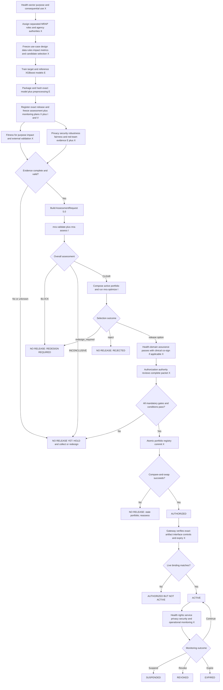
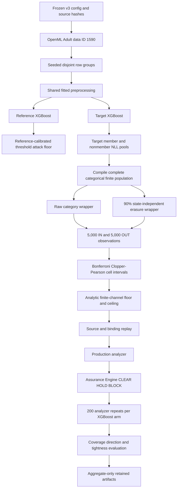

# XGBoost finite-channel ceiling experiment and government health agency release playbook

- **Report date:** 2026-09-03
- **Experiment:** `model-backed-finite-channel-public-data-v3`
- **Model:** XGBoost classifier on the public Adult Census Income benchmark
- **Result:** **PASS for the registered experimental ceiling-validation scope**
- **Intended health-sector status:** **NOT VALIDATED FOR INTENDED HEALTH-SECTOR USE — NOT AUTHORIZED — NOT ACTIVE**
- **Target operating context:** **GOVERNMENT HEALTH AGENCY HANDLING NON-PUBLIC / RESTRICTED HEALTH AND HEALTHCARE DATA**

This report has four reading paths:

1. Start with [the operational spine](#the-operational-spine-contracts-pipeline-and-workflow)
   for the explicit contract, execution-pipeline, and durable-workflow map.
2. [Part I](#part-i--plain-language-government-health-agency-guide) explains
   the result for health-domain, programme, administrative, governance, and
   direct-care readers with no machine-learning or statistics background.
3. [Part II](#part-ii--operational-government-health-agency-release-playbook)
   gives the agency health-domain or programme owner and governance team—and,
   when direct care can be affected, a qualified clinician—a start-to-finish
   training, review, and release/no-release workflow grounded in this
   repository's implemented contracts, pipelines, and protocol verifier.
4. [Part III](#part-iii--technical-test-report) provides the full design,
   calculations, evidence chain, results, reproduction procedure, and threats
   to validity.

This is a post-outcome narrative derived from the retained v3 artifacts. It is
not itself a preregistration. The experiment design was frozen separately in
the [v3 preregistration](../reproduction/model-backed-finite-channel/v3-preregistration.json)
before the new v3 outcomes were collected.

## Executive disposition

| Question | Answer |
|---|---|
| Did the XGBoost ceiling cover the known finite-pool risk? | **Yes.** Both primary intervals covered it, and all 400 repeated XGBoost intervals covered it. |
| Was the ceiling informative rather than trivially equal to 1? | **Yes.** Mean ceiling excess over exact risk was 0.0320 for the raw arm and 0.0279 for the erased arm. |
| Did the experimental MRA threat gate clear? | **Yes.** Both primary ceilings were below the experimental tolerance of 0.65. |
| Did both arms meet the preregistered strong-margin resolution claim? | **No.** The erased arm did; the raw arm's 0.09125 margin was below the required 0.10 despite 200/200 observed `CLEAR` results. |
| Was an unsafe, above-tolerance XGBoost artifact tested? | **No.** This study supplies no model-backed XGBoost `BLOCK`-power result. |
| Was a normal prediction API tested? | **No.** The assessed interface was an artificial, zero-input, one-query categorical wrapper. |
| Was a health-sector model or non-public/restricted health or healthcare dataset tested? | **No.** Adult is a public census-income dataset, not health-sector operational or patient data. |
| Does `CLEAR` authorize deployment? | **No.** The run was explicitly non-authorizing, the live interface was not verified, and the attack battery was waived. |

The narrow, supportable conclusion is:

> For one hash-identified XGBoost pipeline, one public-data snapshot, two
> registered categorical wrapper variants, and one frozen finite target pool,
> the MRA implementation produced upper membership-risk bounds that covered
> the exact benchmark risk in the primary draws and every one of 400 repeated
> draws. This validates the calculation and experimental execution path inside
> that closed benchmark. It does not establish general XGBoost privacy,
> fitness for an intended health-sector use, clinical safety where care may be
> affected, regulatory compliance, authorization, or permission to activate.

## The operational spine: contracts, pipeline, and workflow

This is the central architecture. The three terms are not interchangeable:

| Layer | Operational question | Unit of work | Repository reality |
|---|---|---|---|
| **Contract** | What exact release, evidence, policy, population, interface, actor and state transition are valid? | Versioned, content-addressed JSON object or signed protocol artifact | Implemented schemas/models and normative MRAP definitions |
| **Pipeline** | How are approved inputs executed and transformed into a candidate, evidence, an assessment and a selection report? | Bounded command or worker run with explicit input/output artifacts | Training/evidence, assessment and optimization are separate runnable islands |
| **Workflow** | Who may run each pipeline, when may it run, what state changes, and what happens on failure, expiry, retry or human review? | Long-lived release instance with authenticated events and durable state | MRAP and its offline verifier are implemented; the production orchestrator, registry, gateway and monitors are not |

> **Current implementation status: not end-to-end.** The repository implements
> an experimental XGBoost training/evidence pipeline, the offline assessment
> pipeline, the offline optimization pipeline, and protocol transcript replay.
> It does **not** implement the evidence-admission join, a durable workflow
> engine, authoritative portfolio registry, deployment gateway, agency
> identity/approval integrations, or continuous monitoring and incident
> adapters. A report must not hide those missing joins behind the word
> “workflow.”

### Operational architecture

```mermaid
flowchart LR
    subgraph C[CONTRACTS — definition and guarantees]
        direction TB
        C0[Purpose authority data and classification dossier]
        C1[Release Interface Population Threat Policy and Evidence Plan]
        C2[AssessmentRequest 5.0]
        C3[OptimizationRequest 4.0]
        C4[Authorization Activation and Monitoring artifacts]
        C0 --> C1 --> C2 --> C3 --> C4
    end

    subgraph P[PIPELINE — bounded execution]
        direction TB
        P0[Train and package XGBoost E]
        P1[Independent evidence and red team E plus X]
        P2[Evidence admission adapter X — not implemented]
        P3[mra validate and assess I]
        P4[mra optimize I]
        P5[Registry gateway and monitoring X — not implemented]
        P0 --> P1 --> P2 --> P3 --> P4 --> P5
    end

    subgraph W[WORKFLOW — orchestration and state]
        direction TB
        W0[DRAFT to REGISTERED to PLAN_FROZEN]
        W1[EVIDENCE_FROZEN to ASSESSED to OPTIMIZED]
        W2[COMMIT_PENDING to AUTHORIZED to ACTIVE]
        W3[SUSPENDED REVOKED EXPIRED REDESIGN REJECTED or ABORTED]
        W0 --> W1 --> W2 --> W3
    end

    C0 -. constrains candidate generation .-> P0
    P0 -. exact candidate identity .-> C1
    C1 -. register scope and freeze plan .-> W0
    W0 -. opens confirmatory collection .-> P1
    P1 -. produces raw evidence .-> P2
    P2 -. creates bound request .-> C2
    C2 -. drives .-> P3
    P3 -. signed assessment .-> W1
    C3 -. drives .-> P4
    P4 -. signed selection .-> W2
    C4 -. governs .-> P5
    P5 -. lifecycle events .-> W3
```



`I` means supported offline core, `E` means experimental evidence code, and
`X` means an agency/external production control. These labels are expanded in
Part II.

### The execution pipeline

The pipeline is an artifact transformation chain. Each stage stops on invalid,
missing, stale or mismatched input; no stage gains authorization merely because
the previous command returned zero.

| Stage | Frozen input or contract | Executor | Output handed forward | Status and hard stop |
|---|---|---|---|---|
| 0. Case and data intake | Public-service purpose, prohibited uses, data authority, protected unit, classification, recipient and evaluation protocol | Agency case/data workflow | Approved restricted-data workspace and preregistered design | **External.** No authority or unclear purpose means do not train for release. |
| 1. Generate and package a candidate | XGBoost config `1.1`, exact dataset digest, seeds, split/model settings and preregistered candidate-selection rule | `scripts/run_xgboost_audit.py` | Exact `release-bundle.zip`, artifact/run manifests and exploratory utility/attack diagnostics | **Experimental.** Error or incomplete seed set aborts; `can_clear=false`. No training-time XGBoost hook exists. Its diagnostic outcomes are candidate-generation evidence, not confirmatory release evidence. |
| 1.5 Register candidate and freeze evidence plan | Exact candidate/interface plus Release, Population, Threat, Policy, EvidencePlan, error-budget and MonitoringPlan artifacts | Agency lifecycle writer; optionally replayed by `mra release-protocol-verify` | `REGISTERED`, then `PLAN_FROZEN`, for one immutable release instance | **Workflow gate, external/verifier-only.** Confirmatory collection cannot start earlier. |
| 2. Collect independent confirmatory evidence | Frozen EvidencePlan, threat/policy/interface/population bindings, attack catalog and positive controls | Isolated evidence workers; experimental repo red-team helpers where applicable | Complete raw evidence plus typed worker/control results for the locked candidate | **Mixed experimental/external.** Recollect after `PLAN_FROZEN`; do not reuse Phase-1 exploratory diagnostics as confirmatory evidence. Failed controls, missing attacks or incomplete interface remain hold/block. |
| 3. Admit and bind evidence | Worker outputs plus exact release, policy, population, interface, decision-game and source digests | Approved evidence-admission adapter and independent evidence authority | Complete `AssessmentRequest 5.0` and closed `EvidenceBundle` | **Missing join.** There is no supported command that converts XGBoost worker output into admissible assessment input. Manual renaming is prohibited. |
| 4. Assess | `AssessmentRequest 5.0` | `mra validate`; `mra model-coverage`; `mra assess` | `AssessmentReport 5.0`, threat resolutions and local audit events | **Implemented offline.** Result is `CLEAR`, `INCONCLUSIVE` or `BLOCK`; all are non-authorizing. |
| 5. Compose and select | `OptimizationRequest 4.0`, eligible signed assessments, utility/control certificates, candidate set and authoritative active-portfolio snapshot | `mra optimize` | `OptimizationReport 4.0` and local audit events | **Implemented offline.** Output is a selection recommendation, not registry state. |
| 6. Bind protocol history | Signed MRAP artifacts/events, trust store and artifact base | `mra release-protocol-verify` | Structural/authenticated replay report | **Verifier only.** It does not schedule work, authenticate public authority or perform the recorded acts. |
| 7. Authorize, activate and operate | Commit request, live registry head, exact selected bytes/interface/controls, monitoring and incident plans | Agency registry, gateway, monitoring and incident services | Authorization and activation receipts; continue/suspend/revoke/expire records | **External and not implemented.** No receipt means not authorized or not active. |

The runnable local spine is therefore:

```bash
# Experimental training/evidence island
python scripts/run_xgboost_audit.py \
  --config path/to/frozen-government-health-xgboost-config.json \
  --output-dir output/xgboost-government-health

# WORKFLOW GATE: register the exact candidate and approve the EvidencePlan.
# The repository can verify a supplied transcript but does not execute this gate.

# Recollect independent confirmatory evidence for the locked candidate.
# MISSING: evidence admission must create this exact request.
# Worker output cannot be renamed to assessment-request.json.

# Supported assessment island
mra validate path/to/assessment-request.json
mra model-coverage path/to/assessment-request.json --json
mra assess path/to/assessment-request.json \
  --output output/assessments/report.json \
  --audit-db output/audit/mra.sqlite3

# Supported portfolio-selection island
mra optimize path/to/optimization-request.json \
  --output output/assessments/optimization.json \
  --audit-db output/audit/mra.sqlite3

# Supported replay of a workflow transcript; not workflow execution
mra release-protocol-verify path/to/release-protocol-run.json \
  --artifact-base path/to/protocol-artifacts \
  --trust-store path/to/trust-store.json \
  --require-authenticated \
  --output output/protocol-verification.json
```

### The durable release workflow

The workflow owns state, authority, human decisions, deadlines, retries,
branches and incident response around the pipelines. The exact MRAP event and
artifact handoff is:

| State transition | Event and permitted actor | Required artifact handoff | Repository execution | Failure branch |
|---|---|---|---|---|
| `DRAFT -> REGISTERED` | `register_scope` — `MODEL_OWNER` | `Registration`, `PolicySnapshot`, `ReleaseInstance`, `PopulationRegister`, `ThreatRegister`, `PortfolioSnapshot` | Transcript verification only | Stay `DRAFT` or abort when purpose, authority, recipient, identity or binding is incomplete. |
| `REGISTERED -> PLAN_FROZEN` | `approve_evidence_plan` — `INDEPENDENT_ASSESSOR` | `EvidencePlan`, `AssuranceErrorBudget`, `MonitoringPlan` | Transcript verification only | A material post-freeze change creates a new release instance. |
| `PLAN_FROZEN -> EVIDENCE_FROZEN` | `close_evidence` — `EVIDENCE_AUTHORITY` | Complete `EvidenceBundle` | Evidence workers are separate; transition is verifier-only | Missing evidence, failed positive control or overspent error budget means no clear assessment. |
| `EVIDENCE_FROZEN -> ASSESSED` | `record_assessment` — `INDEPENDENT_ASSESSOR` | Signed `AssessmentReport` | `mra assess` creates the report; verifier checks the supplied event | `INCONCLUSIVE` maps to hold; `BLOCK` cannot be optimized into release. |
| `ASSESSED -> OPTIMIZED` | `record_selection` — `OPTIMIZATION_AUTHORITY` | Signed `OptimizationReport` for candidate plus complete active portfolio | `mra optimize` creates the report; verifier checks the supplied event | `redesign_required` or non-exhaustive infeasibility does not authorize; proved exhaustive infeasibility becomes `REJECTED`. |
| `OPTIMIZED -> COMMIT_PENDING` | `submit_authorization` — `AUTHORIZATION_AUTHORITY` | `AuthorizationCommitRequest` with reasons, objections, conditions, expiry, nonce and expected head | Transcript verification only | Any open mandatory agency or MRAP gate prevents submission. |
| `COMMIT_PENDING -> AUTHORIZED` | `commit_portfolio` — `PORTFOLIO_REGISTRY` | `AuthorizationReceipt` and complete `PortfolioCommit` | Transcript verification only; no registry service | Failed/stale compare-and-swap means no authorization; rebase and repeat affected stages. |
| `AUTHORIZED -> ACTIVE` | `activate_deployment` — `DEPLOYMENT_GATEWAY` | `ActivationReceipt` for remeasured exact bytes, interface, controls and lease | Transcript verification only; no gateway service | Mismatch leaves the candidate authorized but not active. |
| `ACTIVE -> ACTIVE` or `SUSPENDED` | `review_monitoring` — `MONITORING_AUTHORITY` | `MonitoringReport` | Transcript verification only; no continuous monitor | A valid continue decision retains `ACTIVE`; a suspend outcome stops use. Silence is not evidence of health. |
| `ACTIVE -> SUSPENDED` | `suspend_release` — monitor or incident authority | `IncidentRecord` | Transcript verification only | Gateway stops new access before or atomically with the event. |
| Authorized/live states to `REVOKED` or `EXPIRED` | `revoke_release` or `expire_release` — permitted authority | `IncidentRecord` or `DecommissionRecord` | Transcript verification only | Stop all recipient and downstream access; propagate and confirm containment. |

This table states the required workflow handoffs, but the current Python replay
is narrower than their full semantics. Most referenced artifact files are
opaque to `release-protocol-verify`: it verifies their kind, path, digest,
producer role and optional signature, plus selected event fields, but does not
schema-validate a generic government dossier, inspect the semantic portfolio
delta, or prove live gateway controls and leases. The runtime also lacks
dedicated complaint, contestation, drift, reassessment and replacement events.
A production workflow must implement those institutional actions rather than
treating transcript acceptance as full MRAP conformance.

Production orchestration must durably persist the release instance and event
idempotency keys, wait for named human tasks, enforce role separation, expire
stale evidence, retry bounded technical work without duplicating decisions,
and resume after crashes. It must never skip a state. A registry-head conflict
is not a normal pipeline retry: it invalidates the portfolio premise and
requires rebase plus reassessment or re-optimization as applicable.

### Contract-to-pipeline-to-workflow handoffs

| Contract or governed artifact | Pipeline consumer/producer | Workflow consequence |
|---|---|---|
| Purpose/data/classification/recipient dossier | Constrains data intake, training workspace, evidence workers and permitted outputs | The case cannot leave `DRAFT` without competent authority and named recipients. |
| `ReleaseContract`, `InterfaceContract`, `PopulationScope`, `ThreatContract`, `PolicyBundle` | Bound into `AssessmentRequest`; checked by `mra assess` | Changing any scoped identity creates a new release instance rather than editing history. |
| `EvidencePlan`, error budget and `MonitoringPlan` | Control collection, positive controls, stopping, multiplicity and later operational signals | Approval creates `PLAN_FROZEN`; deviations block evidence closure unless handled by frozen policy. |
| `EvidenceBundle` and `AssessmentRequest 5.0` | `mra assess` produces `AssessmentReport 5.0` | Only a complete signed report records `ASSESSED`; `CLEAR` remains non-authorizing. |
| `OptimizationRequest 4.0` plus authoritative portfolio snapshot | `mra optimize` produces `OptimizationReport 4.0` | A releasable selection may record `OPTIMIZED`; redesign/reject branches stop progress. |
| `AuthorizationCommitRequest` | Authoritative registry validates and atomically commits the semantic portfolio delta | Successful compare-and-swap alone creates `AUTHORIZED`. |
| `AuthorizationReceipt` plus exact live artifact/interface/control identity | Deployment gateway remeasures the served release | Matching activation receipt alone creates `ACTIVE`. |
| `MonitoringPlan`, reports and incident records | Monitoring/incident pipelines evaluate thresholds and containment | Continue, suspend, revoke, expire or start a new release instance. |

---

## Part I — Plain-language government health agency guide

### 1. What was tested?

Imagine a model was trained from a list of records. Someone wants to learn the
answer to this question:

> “Was the hidden record used to train the model?”

That is a **membership-inference** question. In a government health agency,
membership can matter even if no diagnosis is displayed. Learning that a
person, household, provider, facility, claim, encounter, specimen, or other
protected unit was included in a restricted programme or dataset could reveal
sensitive health, service-use, regulatory, operational, or commercial
information. If the use affects direct care, training membership could also
reveal that a patient received a sensitive service.

The experiment did **not** expose a normal model interface. The outsider:

- could not choose or see a record;
- could not enter a person, patient, provider, facility, claim, programme, or
  census record;
- could not see the model, its trees, or its weights;
- could not receive a prediction probability, explanation, or exact loss;
- received only one coarse category;
- was allowed one query; and
- was not supposed to observe timing, identifiers, metadata, or another access
  path.

The test question was therefore:

> Can MRA calculate a trustworthy upper limit for membership-guessing risk
> when the complete released interface is this closed and finite?

It was **not**:

> Is a real government health agency XGBoost service private, accurate, fair,
> fit for its intended public-health or operational purpose, clinically safe
> where it can affect care, secure, authorized, or ready to activate?

### 2. A sealed government health-data enclave analogy

Picture a sealed government health-data enclave. An authorized auditor
secretly selects a record:

- half the time from records used to train a model (`IN`); and
- half the time from records not used to train it (`OUT`).

The person outside the room cannot see or select the record. Inside the room,
the model calculates how surprised it was by the record's correct answer. The
room does not reveal the exact number. It returns one card from this fixed set:

- negative loss;
- loss from 0 to 0.5;
- loss from 0.5 to 1;
- loss from 1 to 2;
- loss from 2 to 4;
- loss of 4 or more;
- non-finite result;
- wrapper error;
- timeout; or
- erased result.

The observer sees one card and guesses `IN` or `OUT`.

If the cards look the same in both groups, the observer can do no better than
a coin flip: 50%. If some cards appear more often for training records, the
card provides a clue. The experiment's privacy-risk metric is the best possible
success rate for that one balanced guessing game.

The cards do not measure public-health or programme benefit, operational
effectiveness, rights impacts, resource-allocation effects, clinical
performance, or harm to a person or patient. This is a privacy experiment, not
a validation of a health-sector use.

### 3. What are the floor, ceiling, and threshold?

The exact benchmark risk is written as `R*`. It means:

> The best possible probability of correctly guessing `IN` or `OUT` using
> only the registered one-card interface and a 50/50 starting chance.

The finite audit population was completely known, so the researchers could
calculate `R*` exactly. The MRA calculation did not use that answer to make its
decision; the answer was retained as an oracle for checking the calculation.

MRA produced an interval `[L, U]`:

- `L`, the **floor**, is a supported lower limit on risk;
- `U`, the **ceiling**, is a supported upper limit on risk, subject to the
  registered assumptions; and
- `tau = 0.65`, or 65%, was the experiment's policy threshold.

The rule was:

| Condition | MRA threat verdict | Plain meaning |
|---|---|---|
| `U <= 0.65` | `CLEAR` | This particular risk bound is inside this particular policy limit. Continue to every other release gate. |
| `L <= 0.65 < U` | `INCONCLUSIVE` | Operational action: `HOLD`. The evidence is too uncertain or incomplete. Do not activate; collect or repair evidence. |
| `L > 0.65` | `BLOCK` | Even the supported lower limit is too high. Stop and redesign. |

The 65% value was an experimental choice. It is **not** a published
health-sector privacy tolerance and should not be copied into an agency policy
without a purpose-specific, harm-based, independently approved rationale.

### 4. What data and model were used?

The model used the public **Adult Census Income** dataset, delivered through
OpenML data ID 1590. The [UCI source record](https://archive.ics.uci.edu/dataset/2/adult)
describes 48,842 census records, 14 features, and a binary task predicting
whether income exceeds USD 50,000. The experiment records the source as version
2 and CC BY 4.0.

“Adult” is only the dataset's name. It does not mean adult-patient data. There
were no non-public health or healthcare operational records, clinical records,
diagnoses, treatments, or healthcare outcomes.

The experiment selected 3,700 disjoint rows from the larger dataset:

| Group | Rows | Purpose |
|---|---:|---|
| Target-model training | 1,200 | Train the XGBoost pipeline being audited. |
| Target nonmember pool | 400 | Records excluded from target training. |
| Reference-model training | 1,200 | Train a separate model used by the conventional attack collector. |
| Reference nonmember pool | 400 | Calibrate the conventional loss-threshold attack. |
| Utility evaluation | 500 | Measure census-income classification accuracy. |

A seeded sample of 400 target-training rows became the finite `IN` audit pool.
Together with the 400 target nonmembers, the exact target audit population was
800 records.

The model achieved **86.2% accuracy**, or 431 correct classifications out of
500 utility rows. That number is census-income accuracy. It says nothing about
fitness for an agency health use, public-health or operational effectiveness,
fairness, rights impacts, clinical sensitivity or specificity where direct
care is affected, calibration, benefit, or safety.

### 5. Why were members distinguishable?

The model produced lower loss more often on training members than on
nonmembers. The retained category totals were:

| Loss category | Members (`IN`) | Nonmembers (`OUT`) | Best guess after seeing this category |
|---|---:|---:|---|
| Negative | 0 | 0 | Tie; irrelevant in this finite pool |
| 0 to 0.5 | 368 | 321 | `IN` |
| 0.5 to 1 | 19 | 30 | `OUT` |
| 1 to 2 | 13 | 28 | `OUT` |
| 2 to 4 | 0 | 20 | `OUT` |
| 4 or more | 0 | 1 | `OUT` |
| Non-finite, error, timeout, or erasure | 0 | 0 | Tie; absent in the raw pool |
| **Total** | **400** | **400** | |

The best category-based observer gets 368 low-loss members right and 79
higher-loss nonmembers right:

```text
368 + 79 = 447 correct guesses
R* = 447 / 800 = 0.55875 = 55.875%
```

Random guessing is 50%, so the raw category provided a 5.875 percentage-point
membership advantage in this balanced finite game.

This does **not** mean 55.875% of records were disclosed. It is a guessing
success probability under a specially constructed experiment.

### 6. What did “90% erasure” mean?

The experiment tested two interfaces:

1. **Raw categorical:** return the loss category.
2. **90% state-independent erasure:** independently replace the category with
   the same generic erased symbol with probability 0.9.

Erasure does not mean deleting 90% of the training records, redacting 90% of
restricted health or healthcare fields, or returning exactly 90 erased answers
in every block of 100. It means each experimental answer independently had a
90% chance of becoming the same uninformative symbol.

The registered mechanism has the exact identity:

```text
erased risk = 0.5 + 0.1 x (raw risk - 0.5)
            = 0.5 + 0.1 x (0.55875 - 0.5)
            = 0.505875
```

The membership advantage fell from 5.875 to 0.5875 percentage points, an exact
90% contraction of the advantage by construction.

That identity is **not** evidence that hiding 90% of arbitrary metadata,
health-sector context, clinical context, or explanation text reduces real
privacy risk by 90%.

### 7. The result in ordinary language

| Interface | Exact benchmark risk | MRA interval `[floor, ceiling]` | Distance from ceiling to 65% threshold | Experimental result |
|---|---:|---:|---:|---|
| Raw category | 55.875% | [53.106%, 58.962%] | 6.038 percentage points | `CLEAR` |
| 90% erasure | 50.588% | [49.062%, 53.670%] | 11.330 percentage points | `CLEAR` |

The erased floor is slightly below the 50% coin-flip baseline because it is a
conservative statistical lower bound. It does not claim that an optimal person
must perform worse than random guessing.

Both ceilings:

- were above the known exact risk, which is the required sound direction;
- were far below the useless bound of 100%; and
- were below the experimental 65% threshold.

### 8. What happened when the audit was repeated?

Each interface was independently re-sampled and analyzed 200 times. Every
repeat used 5,000 `IN` and 5,000 `OUT` observations drawn with replacement from
the same 400/400 finite pools.

| Repeated result | Raw category | 90% erasure |
|---|---:|---:|
| Repeats | 200 | 200 |
| `CLEAR` | 200 | 200 |
| `INCONCLUSIVE` / operational `HOLD` | 0 | 0 |
| `BLOCK` | 0 | 0 |
| Ceiling below known truth | 0 | 0 |
| Wrong-direction decision | 0 | 0 |
| Mean ceiling | 59.075% | 53.375% |
| 95th-percentile ceiling | 59.671% | 53.757% |
| Maximum ceiling | 60.003% | 53.938% |
| Mean interval width | 5.760 points | 4.632 points |
| Mean ceiling excess over truth | 3.200 points | 2.788 points |

Across both arms, that is 400 repeat audits and four million wrapper
observations. Including the two primary draws gives 4,020,000 XGBoost wrapper
observations. These were repeated draws from 800 records, **not** observations
from four million distinct people, patients, providers, facilities, claims, or
other protected units. This measures audit execution and repeated statistical
behavior, not population or training scalability.

Observing zero failures does not prove the real failure probability is zero.
After the preregistered simultaneous correction, each zero-event family had an
upper confidence bound of about **2.90%** on its repeat-level undercoverage or
wrong-direction probability.

### 9. The important margin rule

Before seeing v3 outcomes, the study required a model/interface risk to be at
least 0.10 away from the 0.65 threshold before making a strong decision-power
claim.

```text
Raw margin:    0.65 - 0.55875  = 0.09125  (not eligible)
Erased margin: 0.65 - 0.505875 = 0.144125 (eligible)
```

Therefore:

- raw XGBoost did produce 200/200 `CLEAR` observations, but it was **not**
  counted as a preregistered strong-margin resolution success;
- erased XGBoost was eligible and produced 200/200 correct-direction
  decisions; and
- its simultaneous lower confidence bound on correct-direction probability was
  97.10%, above the registered 95% requirement.

This protects the report from declaring statistical power after seeing a
convenient near-threshold result.

### 10. What `CLEAR` means in a government health agency

The safest translation is:

> “This one privacy question passed this one laboratory gate. Continue to all
> other required gates.”

It does not mean:

- the model is fit or effective for the agency's intended health-sector use;
- the model is clinically safe or effective if its output can affect direct
  care;
- the model is fair across affected people, communities, programme
  participants, providers, facilities, or patient subgroups;
- an agency API, dashboard, batch export, or vendor path is private;
- HIPAA, GDPR, PDPA, or another law has been satisfied;
- the agency has the required statutory, regulatory, ethics, data-governance,
  or institutional approval;
- the model can be activated;
- every privacy or security threat is acceptable; or
- the conclusion survives a new model, dataset, interface, recipient, purpose,
  or query limit.

The experiment itself recorded `no_release_authorization`. The declared
interface's authentication and rate-limit fields were not verified against a
live service, and the policy waived the usual attack battery with the explicit
statement that the waiver could not authorize deployment.

### 11. Do not confuse these numbers

| Number | What it means | What it does not mean |
|---:|---|---|
| 86.2% | Accuracy on 500 held-out census-income rows | Health-sector effectiveness, clinical accuracy, or privacy |
| 55.875% | Exact raw one-card membership-guessing success | Percentage of records leaked |
| 58.962% | Primary upper ceiling for raw membership risk | Model accuracy, programme failure, or person/patient-harm probability |
| 65% | Experimental policy tolerance | Accepted government health-sector standard |
| 50.588% | Exact risk after artificial state-independent erasure | Probability of harm to a person, patient, provider, facility, or programme |
| 97.10% | Lower bound on correct-direction frequency for a 200/200 eligible family | Health-domain effectiveness, sensitivity, survival, or model accuracy |
| 2.90% | Upper bound on repeat-level undercoverage or wrong-direction frequency after multiplicity correction | Probability of a health-data breach |
| 90% | Probability of replacing one category with a common erased symbol | Validated benefit from arbitrary metadata removal |

### 12. Example government agency decision table

| Situation | MRA interpretation | Agency action |
|---|---|---|
| This report's raw result `[53.11%, 58.96%]` | Experimental membership gate is under 65% | Record protocol success; do not use it with restricted health/healthcare data or in agency operations |
| This report's erased result `[49.06%, 53.67%]` | Eligible safe-margin result under 65% | Record the stronger experimental result; do not call it validation for an intended health-sector use |
| Hypothetical interval `[58%, 68%]` | MRA verdict is `INCONCLUSIVE`; operational gate is `HOLD` | Pause; collect stronger evidence or redesign |
| Hypothetical interval `[68%, 76%]` | Floor exceeds threshold: `BLOCK` | Stop release and mitigate |
| Ceiling clears, but the real API exposes probabilities or repeated queries | Evidence does not match the interface | `HOLD`; audit the actual API |
| Ceiling clears, but intended-use effectiveness or, where applicable, clinical sensitivity is unknown | Privacy is only one gate | No operational or clinical authorization |
| Ceiling clears, but an affected population, community, provider/facility, or patient subgroup performs unsafely | Another mandatory gate fails | `HOLD` or `BLOCK` |
| Several model versions can be combined | Composition is unresolved | `HOLD` until combined leakage is assessed |
| A log directly exposes the training roster | Direct disclosure dominates | `BLOCK`; a statistical ceiling cannot repair it |

### 13. Questions the agency must ask

The agency handles non-public or restricted health and healthcare data, but
not every agency model directly treats a patient. The health-domain questions
below apply to every intended agency use. The separate clinician questions are
mandatory when an output can influence individual care or access to care.

#### 13.1 Health-domain or programme owner questions — always required

- What exact job will the model perform: public-health surveillance, programme
  planning, resource allocation, provider oversight, claims or benefits review,
  research, administration, or direct-care support?
- Who or what is the protected unit: a person, patient, household, programme
  participant, provider, facility, encounter, claim, specimen, device, event,
  or another explicitly defined unit?
- What action will an officer, analyst, provider, system, or contractor take
  after seeing the output?
- Can an error affect health, access to services, eligibility, payment,
  inspection, reputation, resource allocation, rights, or public trust?
- Are the outcome label, observation window, source systems, and base rate
  valid for the intended agency decision?
- Was the model evaluated on the agency's intended population, jurisdictions,
  periods, providers/facilities, and operational environment?
- Are performance and uncertainty reported for affected populations,
  communities, programmes, providers, facilities, and other important groups?
- Is there accountable human review, a fallback process, and an appeal or
  contestation route for a consequential decision?
- Are the statutory or legal authority, data purpose, recipients, processors,
  retention, and prohibited secondary uses documented?
- Would the same evidence remain valid if the data, recipient, interface,
  decision rule, or operational purpose changed?

#### 13.2 Direct-care clinician questions — required when care can be affected

- What clinical decision will this model influence?
- Is it advisory, or can it delay, deny, prioritize, or redirect diagnosis,
  referral, monitoring, or treatment?
- What happens to the patient when it is wrong or unavailable?
- Is it validated for the intended patients and every provider/site where it
  will affect care?
- Are sensitivity, specificity, predictive values, calibration, and clinically
  meaningful error costs reported with uncertainty?
- Is performance reported for clinically important patient subgroups?
- Does it create alert fatigue, automation bias, deskilling, or unsafe delay?
- Is there a clinically safe fallback and a named human override authority?

#### 13.3 Privacy meaning for restricted health and healthcare data

- Does membership mean a person, patient, encounter, episode, claim, provider,
  facility, programme, specimen, or individual event?
- Why would revealing membership harm that protected person or unit?
- Can the real attacker select a target and submit the target's information?
- Can an internal user, another agency, a contractor, or a vendor query
  repeatedly or combine the result with other restricted or public records?
- Are probabilities, explanations, dashboards, batch exports, logs, errors,
  timing, support tools, and administrator paths visible?
- Can an agency officer, administrator, processor, or vendor download the
  model or derived records?
- Are rare diseases, small communities, uncommon providers/facilities, and
  other vulnerable or easily identifiable groups separately considered?

#### 13.4 Understanding the report

- Is a percentage model accuracy, attacker success, or a confidence bound?
- What is the random-guessing baseline?
- Who selected the tolerance, and was it chosen before seeing results?
- Does the evidence cover the real agency interface or only a test wrapper?
- Did the ceiling cover known truth in validation?
- Was the risk far enough from the threshold for the registered power claim?
- Was an unsafe case tested for this model family?
- Were production-valid attacks and positive controls run?

#### 13.5 Release governance

- Is this an assessment, an authorization, or proof of live activation?
- Which named authority owns the final decision, and is it separate from the
  developer and assessor?
- Which requirements were waived, and can the applicable policy lawfully
  permit that waiver for the intended use?
- Were previous, simultaneous, cross-agency, vendor, dashboard, export, and
  derived releases assessed together?
- What artifact, data, interface, recipient, purpose, population, policy, or
  threshold change invalidates the assessment?
- When do the evidence and authorization expire?
- What are the suspension, rollback, incident-response, notification,
  contestation, revocation, and retirement procedures?

### Plain-language glossary

| Term | Meaning here |
|---|---|
| Adult Census Income | A public census-income classification benchmark; not an adult-patient dataset. |
| Artifact | One particular trained model together with its preprocessing. |
| Artifact hash | A digital fingerprint that detects substitution when the artifact is available; it cannot recreate the artifact. |
| Attack battery | A policy-required group of attacks plus vulnerable positive controls. It was waived in this experiment. |
| Baseline | Success without useful released information: 50% in this balanced game. |
| Bayes risk `R*` | Best possible membership-guessing success from the registered output under the fixed prior. It is not patient-harm probability. |
| `BLOCK` | Supported lower risk is above tolerance, or another mandatory rule prohibits release. |
| Ceiling `U` | A statistically supported upper risk limit under the registered assumptions. |
| `CLEAR` | One governed threat gate is within its limit; it is not validation for an intended health-sector use, authorization, or activation. |
| Confidence interval | A range made by a procedure whose guarantee depends on its sampling and multiplicity assumptions. |
| Erasure | Replacing an informative category with one common generic symbol. |
| Floor `L` | A statistically supported lower risk limit; a floor above tolerance can block. |
| `INCONCLUSIVE` | The threat evidence cannot justify either `CLEAR` or `BLOCK`. |
| `HOLD` | The operational action for an `INCONCLUSIVE` threat verdict, an unmet gate, or unresolved evidence; activation pauses. |
| Member | A record used to train the target model. |
| Membership inference | Guessing whether a record participated in training. |
| Negative log likelihood | How surprised the model is by the correct label; lower usually means more confident. |
| Nonmember | A record not used to train the target model. |
| Population scope | The exact records, people, patients, households, providers, facilities, encounters, claims, programmes, or other units to which evidence applies. |
| Preregistration | Freezing the design, thresholds, and pass/fail rules before collecting evaluated outcomes. |
| Prior | Starting probability assigned to each hidden state; 50/50 in this experiment. |
| Release contract | Bound description of the artifact, interface, population, threat, policy, and expiry. |
| Repeat | A new audit sample and interval calculation; here it did not mean retraining the model. |
| Tolerance `tau` | Maximum risk allowed by the selected policy for this threat; 65% here. |
| Undercoverage | A failure where the ceiling falls below the exact risk it should cover. |
| Utility accuracy | Ordinary prediction accuracy, separate from health-domain effectiveness, clinical benefit where applicable, and privacy risk. |
| Wrong direction | `CLEAR` above tolerance or `BLOCK` below tolerance; an `INCONCLUSIVE` verdict and operational `HOLD` are conservative. |
| XGBoost | A prediction method that combines many decision trees. |

### 14. Government health agency readiness gap for this experiment

| Review area | Current status |
|---|---|
| Ceiling implementation under the frozen finite-channel experiment | **PASS** |
| XGBoost raw and erased primary risk coverage | **PASS** |
| XGBoost repeated coverage and wrong-direction observations | **PASS** |
| Intended government health-sector purpose and fitness | **NOT TESTED** |
| Non-public/restricted health and healthcare data representativeness | **NOT TESTED** |
| Public-health, programme, regulatory, research, or operational effectiveness | **NOT TESTED** |
| Direct-care clinical performance and benefit, if care could be affected | **NOT TESTED** |
| Fairness across affected people, communities, programmes, providers/facilities, or patient subgroups | **NOT TESTED** |
| Statutory/legal authority, data governance, restricted-data handling, and ethics requirements | **NOT TESTED** |
| Real agency interface, internal-user, vendor, and cross-agency privacy | **NOT TESTED** |
| Deployment security and side channels | **NOT TESTED** |
| Production attack battery and positive controls | **WAIVED / NOT TESTED** |
| Multi-release composition | **NOT RESOLVED** |
| Accountable authorization | **NOT GRANTED** |
| Live activation | **NOT PERFORMED** |

Final plain-language label:

> **Experimental ceiling-validation PASS; intended health-sector use NOT
> VALIDATED; NOT AUTHORIZED; NOT ACTIVE.**

---

## Part II — Operational government health agency release playbook

### A. Purpose and implementation boundary

This section turns the report into a start-to-finish operating guide. It answers
three separate questions:

1. What do the programme/service owner and qualified health-domain authority
   do from the first proposed public-service use through final assurance?
2. What do the agency's governance authorities do before any recipient may
   receive the model, an output, or a derived result—and before the agency may
   hold, reject, suspend, or revoke that release?
3. Which steps are executed by this repository, and which must be supplied by
   the government agency?

The labels below prevent a paper design from being mistaken for running
infrastructure.

| Label | Meaning |
|---|---|
| **[I] Implemented core** | Executable in the supported offline `model_release_assurance` package or `mra` CLI. |
| **[E] Implemented experiment** | Executable evidence-lab code, but its output is non-authorizing and is not automatically assessment-admissible. |
| **[V] Implemented verifier** | The repository can replay a supplied lifecycle transcript; it does not operate the real authority or system whose act is recorded. |
| **[X] External agency control** | The government agency must implement, authenticate, and operate this control outside this repository. |

The governing sources for this playbook are the
[MRA contracts](../src/model_release_assurance/models.py), the
[Assurance Engine](../src/model_release_assurance/engine.py), the
[release-protocol state verifier](../src/model_release_assurance/release_protocol.py),
the [local XGBoost worker](../scripts/run_xgboost_audit.py), the
[public-data ceiling runner](../scripts/run_model_backed_finite_channel.py),
the [software architecture](../docs/architecture.md), and
[MRAP/1.0](../docs/model-release-assurance-protocol.md).

The supported repository core covers offline reference functions aligned with
MRAP levels L0–L2. Its `ThreatContract` kinds are linkage, membership,
attribute, and reconstruction. Clinical safety, effectiveness, fairness,
human-factors, legal, and general cybersecurity decisions are therefore
external agency gates; they may be bound into the release dossier and
lifecycle artifacts, but the current `AssuranceEngine` does not adjudicate
them.

Here, **non-public/restricted health and healthcare data** means confidential
personal, clinical, claims, programme, provider, facility, public-health, or
linked administrative data held or received by the government agency. It does
not mean only data owned by a private-sector healthcare company. The
**health-domain authority** is the qualified clinical, public-health,
programme, regulatory, research, or operational authority for the proposed
use. A clinical authority and clinical co-signature are mandatory whenever an
output can affect care or access to care.

If the records originate from private healthcare providers, the source
register must name each provider and the agency/provider controller,
custodian, processor, transfer, purpose, retention, onward-use, and incident
responsibilities. Government possession does not make the records public or
erase applicable source agreements, confidentiality duties, or use limits.

This is a technical operating profile, not a jurisdiction-specific legal
opinion. The agency's competent authorities must identify the applicable
statutory mandate, data-use authority, duties to affected people, records
rules, procurement conditions, and regulatory or ethics approvals.

#### A.1 The two implemented XGBoost paths

They solve different parts of the problem and must not be collapsed into one
claim.

| Path | What it actually executes | Useful output | What it cannot do |
|---|---|---|---|
| **Local XGBoost worker [E]** | Validates a hash-bound CSV/Parquet configuration, creates deterministic disjoint splits, independently fits target/reference preprocessing and XGBoost models, calculates utility and a reference-loss membership attack, and packages the target pipeline. | `release-bundle.zip`, model/preprocessor hashes, split manifest, raw scores, utility result, attack floor or screen, `audit-evidence.json`, run manifest, and summary. | It cannot clear a threat, create a complete `AssessmentRequest`, establish a ceiling, validate fitness for an intended health-sector use, or authorize release. |
| **Model-backed finite-channel study [E + I assessment replay]** | Trains XGBoost on Adult, compiles a complete artificial categorical channel, constructs simultaneous intervals and an exact-rational ceiling, then submits the two primary arms through the implemented analyzer and Assurance Engine. | The empirical results reported in Part III, including two experimental Engine `CLEAR` decisions. | It does not assess a normal prediction API, healthcare data, a live gateway, a complete production attack battery, or portfolio composition. Its policy is experimental and non-authorizing. |

For an actual government health-sector candidate, the first path is the
reusable training and packaging starting point. The second path validates the ceiling machinery but
is not a drop-in health-data ceiling collector. The agency must collect new
evidence for its exact artifact, protected population or unit,
attacker, prior, recipient, output surface, and release portfolio.

#### A.2 The actual end state of this report

The Adult experiment reaches an **experimental `AssessmentReport` for one
privacy threat and artificial interface**. It does not reach MRAP
`OPTIMIZED`, `COMMIT_PENDING`, `AUTHORIZED`, or `ACTIVE`. Therefore,
when the complete government health agency workflow below is applied to the
evidence in this report, the final operational decision is:

> **NO RELEASE.** The ceiling implementation passed its registered experiment,
> but an authorized health-sector purpose, protected-population evidence,
> fitness-for-purpose and rights-impact evidence, live-interface
> verification, required red teaming, portfolio composition, accountable
> authorization, gateway activation, and monitoring are absent.

#### A.3 Eight-step plain-language summary

For a programme owner, health-domain reviewer, or agency administrator who
does not work with software contracts:

1. **Agree on the public-service job first.** State the proposed lawful
   purpose, protected population or unit, consequential decision, authorized
   user, action, errors, prohibited secondary uses, and fallback process. Add
   the direct-care question and a clinician when care can be affected.
2. **Obtain authority and separate the work.** Competent agency functions
   determine data-use and programme authority; named, separated parties build,
   test, authorize, deploy, monitor, and handle incidents.
3. **Lock the test before seeing the answer.** The team fixes the data split,
   metrics, pass limits, model candidates, privacy tests, and stop rules.
4. **Train one traceable candidate.** Engineering runs the implemented
   XGBoost worker and locks the complete model plus preprocessing. A retrained
   model is a different candidate.
5. **Test the real health-sector use.** Independent domain experts test
   fitness for purpose, affected-group impacts, workflow, rights, and benefit;
   clinicians test patient-care effects where applicable. Technical teams test
   the exact interface, privacy, security, robustness, and positive controls.
6. **Let MRA judge only its registered risks.** `CLEAR` means one bound risk
   may move to the next gate. `INCONCLUSIVE` triggers an operational hold;
   `BLOCK` stops the release.
7. **Authorize and activate the exact bytes.** Only a separate agency
   authority, atomic registry commit, and matching gateway receipt can move the
   candidate from reviewed to `AUTHORIZED` and then `ACTIVE`.
8. **Keep checking and be ready to stop everywhere.** Purpose drift,
   health/rights/service harm, interface change, an unregistered recipient,
   expired authority, or a broken control leads to suspension, propagated
   revocation, expiry, or a new assessment.

#### A.4 Implemented contract–pipeline–workflow crosswalk

| Operational layer | Concrete repository contract/input | Executable pipeline | Concrete output | Authority of that output |
|---|---|---|---|---|
| Training experiment [E] | XGBoost config schema `1.1`: dataset digest, split fractions, model settings, attack settings, priors, and decision game | `scripts/run_xgboost_audit.py` | Bundle, manifests, utility, structural metrics, membership floor/screen, hashes | Development evidence only; `can_clear=false` |
| Ceiling validation [E + I] | V3 experiment config/preregistration plus generated release, policy, population, game, wrapper, sampling, and finite-channel evidence | `scripts/run_model_backed_finite_channel.py` followed by finite-channel analyzer and `AssuranceEngine` | Exact oracle, intervals, repeat summaries, experimental `AssessmentReport` | Clears only the registered experimental threat/interface; never deployment |
| Release assessment [I] | `AssessmentRequest 5.0`, `ReleaseContract`, `InterfaceContract`, `PopulationScope`, `ThreatContract`, `PolicyBundle 3.0`, typed analyzer inputs | `mra validate`, `mra model-coverage`, `mra assess` | `AssessmentReport 5.0`, optional signed manifest, local audit events | Scoped non-authorizing assessment; `authorization_eligible=false` |
| Candidate and portfolio selection [I] | `OptimizationRequest 4.0`, assessment references, utility certificates, controls, portfolio/search evidence, selection policy | `mra optimize` | `OptimizationReport 4.0`, optional signed manifest, local audit events | Non-authorizing selection recommendation |
| Lifecycle replay [V] | `ReleaseProtocolRun 1.1`: actors, artifacts, hash-chained events, claimed state | `mra release-protocol-verify` | `ReleaseProtocolVerification 2.0` | Verifies a supplied structural/authenticated transcript; does not perform its acts |
| Government agency release workflow [X] | Health-domain and rights-impact dossier, data/classification/recipient records, authoritative identities and approvals, registry state, gateway measurements, monitoring and incident records | Agency workflow/orchestration, registry, gateway, identity/entitlement, records, and monitoring systems | Authorization, activation, monitoring, suspension/revocation/expiry records | Only these external authorities can create operational `AUTHORIZED` and `ACTIVE` states |

There is currently no single repository command that trains a government
health-sector XGBoost model, turns its outputs into admissible evidence,
performs domain or clinical review, authorizes it, deploys it, and monitors it.
The following playbook is
the coherent orchestration across the implemented pipelines and the required
external controls; it does not pretend that the missing production services
already exist.

#### A.5 What “release” means for a government agency

For this report, release does not mean only publishing a model to the public.
It means enabling any new recipient or system to obtain model bytes, outputs,
scores, explanations, logs, reports, or derived information from the protected
healthcare data. It also includes using an output to change an internal
decision even when no bytes leave the agency. An internal dashboard, a
contractor account, a transfer to another agency, a provider-facing clinical
tool, and a public API are different release surfaces.

Each materially different recipient, purpose, consequential action,
population, or interface needs its own immutable release instance and
evidence. Do not use one broad
“government use” contract.

| Intended route | Recipient that must be named | Interface that must be assessed | Typical additional concern |
|---|---|---|---|
| Internal policy or programme analytics | Named agency analyst/service role | Query tool, dashboard, batch result, export, logs and administrator path | Secondary use, small-cell disclosure, linkage to other government holdings |
| Patient-level operational or clinical decision support | Named agency/provider clinicians and operational systems | Exact score/alert/UI, EHR integration, explanations, retries, timing and fallback | Patient safety, provider-site validation, automation bias and contestability |
| Transfer to another public body | Named receiving agency and authorized purpose | Dataset/report/model/API fields and onward-transfer route | Purpose change, data matching, composition and downstream copies |
| Contractor or cloud/vendor processing | Named processor roles and privileged support staff | Model artifact, job interface, telemetry, support, backup and administrative paths | Supply chain, remote support, residency, deletion, insider and credential risk |
| Public/research release | Public or named research recipients | Download/API/report plus metadata and all query limits | Unbounded recipients, composition, model extraction and irreversible disclosure |

The agency-owned recipient and transfer register must name every supplying and
receiving organization, accountable owner, permitted purpose, fields and
artifacts, user/service entitlements, custody boundary, onward recipient and
subcontractor, hosting/backup location, update mechanism, audit/evidence
access, incident contact, retention/deletion rule, and suspension/revocation
route. The free-text `ReleaseContract.recipient` field binds a description; it
is not this identity, RBAC/ABAC, entitlement, or transfer-control service.

Because the source data are non-public/restricted health and healthcare data:

- use a protected agency computing environment with authenticated workload and
  operator identities, least privilege, approved network/egress rules,
  encrypted storage/transport, managed keys, immutable audit retention, backup,
  deletion and incident controls;
- keep raw records, direct identifiers, patient/encounter rosters,
  per-record scores, split manifests, reference models, and sensitive
  preprocessing outside Git, general MCP resources, recipient bundles, and
  ordinary shared `output/` directories;
- treat trained models, leaf signatures, feature dictionaries, calibration
  data, explanations, logs, aggregate tables, and attack evidence as
  potentially sensitive derived artifacts until an authorized review assigns
  their handling;
- record every human, service, vendor, and other agency that can access model
  bytes or outputs—“internal” does not mean outside the threat model;
- use a person/patient, encounter, episode, provider, or other substantively
  justified protected unit; a database row is not automatically the correct
  unit; and
- set priors, tolerances, and harm rationales for the agency's real data
  population and recipients. The experimental 50/50 prior and `tau = 0.65`
  are not government health-data policy.

The current local worker writes sensitive development artifacts, including raw
membership scores and split manifests. It should therefore run only inside the
approved protected environment with an agency-owned output location. The
repository's path confinement and file hashes provide integrity checks; they
are not a security boundary, access-control system, data-loss-prevention
system, or evidence of lawful use.

**Agency security-classification overlay [X]**

The agency applies its own approved classification scheme; the following is a
handling map, not a universal government classification:

| Artifact class | Minimum handling decision before use or disclosure |
|---|---|
| Source records, direct identifiers, labels and linkage keys | Keep in the highest applicable approved health-data zone; tightly restrict access, export, retention and reuse. |
| Raw attack scores, split rosters, rare-group errors and reference data/models | Treat as restricted inference evidence because they can reveal participation, attributes, cohorts or vulnerabilities. |
| Trained model, preprocessing, feature/category dictionaries and release bundle | Classify as a derived sensitive asset after extraction, memorization, supply-chain, operational and intellectual-property review. |
| Assessment, audit, registry and incident records | Protect as integrity-critical records and restrict health, security and operational details. |
| Public model card or transparency record | Publish only a disclosure-reviewed and redacted copy linked to—but separate from—the restricted dossier. |
| Signing keys, service credentials and deployment secrets | Keep in agency key/secret management; never place them in source control, evidence bundles or report attachments. |

For every artifact, the signed classification manifest records its owner,
marking, approved storage/network zone, encryption and key requirements,
authorized roles and organizations, export controls, retention/destruction,
logging, and downgrade/declassification authority. The repository can bind the
manifest digest but does not assign or enforce government classification.

### B. Integrated pipeline-and-workflow flow: training to release or no release



There is no “release unless somebody objects” branch. Unknown, missing, stale,
waived without policy authority, hash-mismatched, or inconclusive mandatory
evidence means **no release yet**.

### C. Who does what

“Clinician” and “admin” are not universal protocol roles and are not
sufficient separation of duties. A production run should assign named
officials, people,
organizations, and services to the protocol roles. In the authenticated
transcript profile, every actor also needs a distinct trust-anchored key.

| Government agency function | Closest MRAP role | Required responsibility | Must not do |
|---|---|---|---|
| Programme/service owner | `MODEL_OWNER` | Propose and document a legitimate public-service purpose, decision/action, users, prohibited secondary uses, and candidate identity; register the approved scope after competent-authority review. | Assert its own legal authority, self-assess, or self-authorize the model. |
| Senior health-domain authority | External health-domain gate; may sponsor `MODEL_OWNER` | Define domain meaning, thresholds, harms, human review, fallback, workflow, and monitoring; add clinical authority for care-affecting use. | Clear privacy, security, or legal authority by domain or clinical opinion. |
| Authoritative health-data custodian | `POPULATION_STEWARD` | Define the protected unit, source systems, sites, dates, population, prior/neighbouring relation, linkage rules, scope snapshots, provenance, permitted use, recipients, and onward-transfer conditions. | Treat a matching hash as proof of authority or accuracy. |
| ML engineering service | External engineering function [E + X] | Execute approved training in the enclave, package the full pipeline, and preserve hashes, environment identity, deviations, and lineage. | Choose the most favorable seed or candidate after viewing outcomes. |
| Configuration generator | `CONFIGURATION_GENERATOR` | Produce the frozen candidate set and completeness certificate required by the selection protocol. | Quietly omit an evaluated configuration or treat training as authority. |
| Independent evidence laboratory | `EVIDENCE_AUTHORITY` | Execute the frozen evidence plan in an isolated environment, retain governed raw evidence, run positive controls, and close the evidence bundle. | Convert a failed attack into proof of safety. |
| Independent technical assessor | `INDEPENDENT_ASSESSOR` | Approve the evidence plan, run or supervise `mra assess`, resolve every mandatory gate, and record the assessment. | Own the model or alter thresholds after outcomes. |
| Agency AI/model-risk authority | `POLICY_AUTHORITY` | Freeze tolerances, mandatory threats, accepted analyzers, attack catalog, error budget, waiver rules, expiry, and selection-policy allowlist before outcomes. | Waive an observed failure simply to release. |
| Privacy/data-protection authority | External governance gate | Review protected units, disclosure harms, linkage, reuse, recipient access, cross-agency sharing, and onward transfer. | Treat an MRA metric as a complete privacy determination. |
| Cybersecurity authority | External security gate | Approve data classification, enclave, identities, network/egress, worker isolation, supply-chain testing, monitoring, and incident readiness. | Treat repository path checks or hashes as security controls. |
| Procurement/vendor authority | External procurement gate | Bind supplier/subcontractor access, updates, audit evidence, incidents, exit, return/deletion, and revocation propagation. | Accept a vendor claim as decision-bearing technical evidence. |
| Records/transparency authority | External governance gate | Set restricted-record retention, archival, disclosure/redaction, contestation, and public-transparency rules. | Publish the raw health-data or vulnerability dossier. |
| Release selection authority/service | `OPTIMIZATION_AUTHORITY` | Compare assessed candidates and controls against utility and complete portfolio evidence using the frozen selection policy. | Treat a single-release assessment as composition clearance. |
| Agency authorizing officer/committee | `AUTHORIZATION_AUTHORITY` | Decide whether to submit the selected configuration for atomic authorization, with explicit purpose, recipients, conditions, accountability, and expiry. | Claim that an assessment report itself is authorization. |
| Authoritative model registry | `PORTFOLIO_REGISTRY` | Perform the linearizable compare-and-swap and issue the authorization receipt for the complete composition domain. | Use disconnected spreadsheets or commit against a stale active-release inventory. |
| Government deployment platform | `DEPLOYMENT_GATEWAY` | Verify the exact authorized artifact, recipient-specific interface, controls, registry head, expiry, and revocation status before traffic. | Deploy a merely “similar” model or broader API. |
| Health-domain/model monitoring authority | `MONITORING_AUTHORITY` | Review registered outcome, rights, service, drift, complaint, privacy/security, use and control signals; continue or suspend under policy. | Ignore purpose drift or an affected-party harm because predictive accuracy is stable. |
| Joint incident command | `INCIDENT_AUTHORITY` | Contain incidents and propagate suspension/revocation to providers, agencies, vendors and every downstream system or retained copy. | Treat stopping the primary API as complete containment. |

At minimum, the programme owner, developer, data custodian, independent
assessor, authorization authority, registry, and deployment gateway should not
be represented as one unchecked “admin” account. The agency's formal policy
must state which additional separations are mandatory. The verifier checks
declared roles, organizations, and keys; it cannot establish that a named actor
genuinely possesses public authority or institutional independence. MRAP
permits one principal to hold multiple roles only when policy permits and
records the concentration; assessment, authorization, and gateway powers
should remain separately controlled.

### D. Phase-by-phase operating procedure

#### Phase 0 — Open the release case: `DRAFT` [X]

**Programme/service owner and health-domain authority**

- Write one intended-use sentence: “For [protected population/unit] in
  [clinical, public-health, regulatory, programme, research, or operational
  setting], the model predicts [outcome and horizon] so [named authorized user]
  may take [specific action].”
- Define what happens when the model is wrong. Record false-negative,
  false-positive, delay, over-reliance, inequity, and privacy harms.
- State whether the output advises care, targets a public-health intervention,
  prioritizes access, changes eligibility/payment, supports investigation or
  enforcement, allocates resources, or autonomously changes another
  consequential process. These purposes are not interchangeable.
- Name contraindications or ineligible uses, exclusions, the fallback
  process/service/care, override authority, and the reference standard used to
  label outcomes. Record prohibited secondary
  uses and the human review, appeal, or contestation route.

**Agency administration/governance**

- Create a unique release ID and release-instance ID.
- Assign all MRAP roles and conflicts-of-interest controls.
- Coordinate and record determinations by the competent clinical, programme,
  privacy, cybersecurity, legal/regulatory, ethics, procurement, records, and
  transparency authorities. An administrator does not create those
  authorities by assertion.
- Name the authoritative data custodian, controller/processor allocation,
  security-classification reference, approved processing zone, other agencies,
  providers, vendors/subcontractors, records schedule, and joint incident
  owner.
- Do not allow training on non-public/restricted health and healthcare data
  until data-use authority, rights, security, and environment approvals are
  recorded.

**Exit evidence**

- Public-service purpose and prohibited-use statement, health/rights/service
  impact hazard analysis, competent-authority determinations, data-use approval,
  classification/handling record, recipient inventory, role roster, and
  accountable owners.

**Failure route**

- If purpose, authority, owner, recipient, affected-party process, or harm
  response is unclear: remain `DRAFT`; **do not train for release**.

#### Phase 1 — Pre-register the use-case and training design: still `DRAFT` [I + X]

Before confirmatory training, the agency freezes its study design and drafts
the later machine-readable contracts. The implemented core can validate
contract structure; competent agency authorities establish substantive truth.

This is deliberately **not yet** the MRAP `register_scope` event. That event
must bind the exact trained artifact and interface digests, which do not exist
until Phase 4. The pre-training freeze is an adopter-owned study protocol that
prevents outcome-driven changes to labels, metrics, seeds, candidate selection,
and policy.

**Health-domain authority and population steward**

- Define whether the protected unit is a person, patient, resident, programme
  participant, household, encounter, episode, admission, claim, specimen,
  provider, facility, image, device, transaction, event, or institution. Do
  not default to “row” when one protected unit contributes multiple rows.
- Freeze agencies, programmes, providers, facilities, sites, jurisdictions,
  calendar periods, operational settings, inclusion/exclusion criteria, base
  rates, subgroup dimensions, and transfer-validation cohorts.
- For patient-care use, predefine sensitivity, specificity, PPV, NPV, AUROC
  and/or AUPRC, calibration, subgroup results, clinical benefit, and workflow
  measures with confidence intervals.
- For public-health or administrative use, also predefine fit-for-purpose
  effectiveness, false inclusion/exclusion costs, equity, service impact,
  resource-allocation effects, appeals, and any downstream effect on care or
  rights. Calling a use “administrative” does not remove clinical review when
  it can delay, deny, prioritize, or otherwise affect healthcare.

**Policy authority and governance secretariat**

- Draft and freeze the intended `PolicyBundle`: every mandatory MRA threat,
  tolerance, decision
  metric, accepted analyzer implementation/configuration hash, battery mode,
  error allocation, validity period, and selection-policy allowlist.
- Draft the future `ReleaseContract`: artifact-selection process, model
  profile, recipient, intended `InterfaceContract`, population scopes,
  lineage, configuration digest, and intended expiry. The final contract will
  receive the exact bundle digest in Phase 4.
- Draft and freeze each `ThreatContract`: secret, prior, side information, attacker
  knowledge, success metric, tolerance, harm rationale, population, and
  realizability.
- Freeze the pre-training study plan, candidate roster/selection rule, complete
  proposed attack roster, positive controls, stopping rules, sample sizes,
  multiplicity, external-site plan, monitoring measures, and portfolio
  inventory procedure before viewing release outcomes.
- For a finite-channel ceiling, freeze the ordered secret states, exact rational
  prior, full observation alphabet, query/reset behavior, all errors/timeouts,
  metadata and side channels, and the state-conditioned sampling plan.

**Implemented checks**

- `AssessmentRequest 5.0`, `ReleaseContract`, `InterfaceContract`,
  `PopulationScope`, `ThreatContract`, `PolicyBundle 3.0`, attack-battery,
  statistical-plan, and evidence-context models reject unknown or malformed
  fields.
- `mra validate REQUEST.json` checks request structure.
- `mra model-coverage REQUEST.json --json` reports whether the submitted
  model/threat path has a recognized clearing route; it never clears.
- The draft can be checked against the current schemas, but a lifecycle
  transcript must not claim `REGISTERED` or `PLAN_FROZEN` until Phase 4
  supplies the exact artifact/interface bindings and required event artifacts.

**Exit evidence**

- Approved intended-use and health-domain evaluation/impact protocol; data/split plan; frozen
  labels, metrics, thresholds, candidate/seed roster and selection rule; draft
  policy/population/threat/interface contracts; proposed evidence/error-budget
  and monitoring plans; and signed chronology evidence.

**Failure route**

- Any post-outcome change to population, threat, interface, tolerance, evidence
  family, model configuration, or selection rule creates a new release instance
  or requires explicit reassessment. Do not edit the old case in place.

#### Phase 2 — Prepare data and splits [E + X]

**Health-domain reviewer and authoritative data custodian**

- Verify label provenance and timing. Features available only after the
  predicted event are leakage.
- Check whether multiple rows from one protected unit—or linked people,
  households, providers, facilities, claims, specimens, or episodes—can cross
  splits. Split at the registered protected-unit level.
- Approve missingness handling, coding-system mapping, censoring, class
  imbalance treatment, and clinically important subgroup coverage.
- Reserve temporal and preferably site-external evaluation cohorts that no
  training, tuning, threshold selection, or attack calibration process sees.

**ML engineer / agency security administrator**

- Place the exact CSV or Parquet input in the approved health-data enclave and
  route outputs to an agency-owned restricted evidence store.
- Compute the dataset SHA-256 and put it in the XGBoost worker config.
- Treat the digest only as an integrity binding. It neither anonymizes the
  dataset nor proves source authority, accuracy, permitted use, or provenance.
- Replace every placeholder in
  [`reproduction/xgboost/config.example.json`](../reproduction/xgboost/config.example.json),
  including the approved threat-contract digest and population-scope ID.
- Freeze all replicate seeds. The implemented worker reports every registered
  seed and Bonferroni-adjusts its attack bounds; it prohibits a best-seed-only
  conclusion.
- Confirm each class has enough records for the worker's five-way stratified
  split. The worker requires at least ten selected rows per class.

**Government health-data custody record**

Before training, maintain a signed source register for the originating agency
and system of record, clinical and technical custodians, exact approved
purpose, protected-unit/linkage rules, source dates and refresh schedule,
quality/reconciliation controls, every receiving agency/provider/supplier,
processing locations, onward-transfer restrictions, retention/backup/deletion
rules, access-review cadence, and incident contacts. Reference-model data from
another organization are a separate governed transfer, not free calibration
data.

Do not place source data, patient/encounter rosters, raw scores, split
manifests, credentials, private keys, sensitive dataset names, or direct
identifiers in Git, GitHub, general CI artifacts, issue trackers, screenshots,
command-line arguments, or the ordinary MRA audit database.

**Protected-unit adaptation**

The worker's built-in split is row-based. The agency must construct and
independently verify partitions at the registered protected-unit level before
relying on the result. Patient-disjointness is required for patient-level
claims; provider-, facility-, household-, programme-, claim-, episode-, or
institution-level claims require the corresponding separation. A row-disjoint
manifest proves none of these.

**Failure route**

- Hash mismatch, target missingness, invalid labels, leakage, inadequate
  subgroup size, non-independent units, or contaminated holdout: **abort this
  run and create a corrected frozen design**.

#### Phase 3 — Generate and package the candidate; inspect exploratory diagnostics [E]

Run the implemented local worker:

```bash
python scripts/run_xgboost_audit.py \
  --config path/to/frozen-healthcare-xgboost-config.json \
  --output-dir output/xgboost-healthcare
```

At this point the exact trained artifact has not yet been registered and the
MRAP evidence plan has not yet been approved. Therefore, every utility,
membership, structural, or split result emitted by this combined worker is an
**exploratory candidate-generation diagnostic**. It may reject a bad candidate
early, but it must not be reused as confirmatory release evidence. Phase 4
registers the exact candidate and freezes its plan; Phase 5 then evaluates that
locked artifact with independent confirmatory workers without retraining or
substituting it.

For each registered seed, the worker:

1. verifies config and dataset hashes;
2. creates the target-training, reference-training, nonmember-calibration,
   nonmember-audit, and utility splits;
3. fits target and reference preprocessing independently on their own training
   splits;
4. fits deterministic CPU histogram `XGBClassifier` models;
5. calculates utility on the disjoint utility split;
6. calculates target/reference per-record losses;
7. calibrates the membership threshold on calibration nonmembers only;
8. computes the target attack floor or screen with simultaneous bounds;
9. creates structural leaf-signature summaries;
10. serializes the target model and preprocessing;
11. creates a byte-stable `release-bundle.zip`; and
12. writes the run manifest and aggregate summary.

**Health-domain reviewer**

- Review cohort counts, outcome prevalence, confusion matrix inputs, and
  whether the reported utility metric matches the preregistered intended-use
  question.
- Do not approve based on accuracy alone. The current worker's ordinary utility
  output is not a complete health-domain validation package.
- Review errors on the protected external holdout through an approved,
  privacy-preserving expert process; a clinician must participate whenever the
  model can affect care or access to care.

**Agency evidence/security authority**

- Treat `raw-membership-scores.parquet`, split manifests, reference model, and
  preprocessing as sensitive internal evidence.
- Retain the exact release bundle and its digest. Never rebuild “the same”
  model after assessment; retraining creates a new artifact.
- Verify the completed seed set and prohibit manual removal of an unfavorable
  run.
- Preserve logs, code/config hashes, environment identity, approvals,
  classification markings, access history, and chain of custody in
  agency-owned immutable storage.

**XGBoost hook limitation**

The current XGBoost worker does **not** install a training-time telemetry
callback. It binds configuration, runtime, serialized model, preprocessing,
splits, and post-training evidence, but it does not observe every boosting
iteration. The LLM and vision workers have aggregate training hooks; those
hooks do not automatically apply to XGBoost. If agency policy requires
iteration-level loss, tree-growth, non-finite, resource, or early-stopping
telemetry, that is a real implementation gap and the release remains on hold
until a hash-bound XGBoost callback and replay contract are implemented and
validated.

**Required output check**

| Output | Operational use |
|---|---|
| `xgboost-audit-summary.json` | Confirms all registered seeds completed and lists exploratory utility/attack summaries. |
| `seed-*/release-bundle.zip` | Exact candidate bytes to bind in the `ReleaseContract`. |
| `seed-*/release-artifact.json` | Inert manifest for the UBJ model and joblib preprocessing inside the bundle. |
| `seed-*/run-manifest.json` | Hashes configuration, dataset, runtime, implementation, evidence, and artifacts. |
| `seed-*/audit-evidence.json` | Exploratory utility, structural, attack, decision-game, and release-binding summary; not an `AssessmentRequest`. |
| `seed-*/raw-membership-scores.parquet` | Sensitive exploratory attack evidence; never recipient-facing or automatically admitted. |
| `seed-*/split-manifest.json.gz` | Deterministic audit row identifiers and allocation evidence; restricted, recomputable when dataset digest/order are known, and not proof of registered protected-unit separation. |

The worker's row identifier is deterministically derived from the dataset
digest and row index. It is **not anonymization or irreversible
de-identification**. Keep it inside the restricted evidence boundary. For a
production design, consider agency-approved, run-scoped keyed tokenization and
a separately controlled linkage service.

The preprocessing Joblib file is also an executable deserialization surface.
Verify its digest and load it only in an isolated trusted worker; never load an
untrusted agency/vendor Joblib object in the MRA decision core.

**Failure route**

- A worker error or incomplete seed set means **no evidence closure**.
- Poor intended-use utility means redesign/retrain, not a privacy waiver.
- An adverse exploratory attack should stop or redesign the candidate. Only a
  policy-admissible, post-`PLAN_FROZEN` assessment can issue the MRAP threat
  decision; a weak or failed attack never clears.

#### Phase 4 — Freeze and register the exact release candidate:
`DRAFT -> REGISTERED -> PLAN_FROZEN` [I + V + X]

**ML engineer**

- Select only through the preregistered rule. Bind the entire
  `release-bundle.zip`, not only a model name or loose manifest.
- Bind the exact inference preprocessing, feature order, label map, missingness
  behavior, XGBoost bytes, dependencies, container/image if used, and intended
  interface.
- Create a new release instance for any change to weights, preprocessing,
  threshold, calibration, feature definition, output field, explanation path,
  rate limit, logging, hardware-visible behavior, or recipient.

**Health-domain owner**

- Confirm that the bound decision threshold and output semantics are the ones
  tested for the authorized purpose. A change from a risk score to an alert,
  eligibility flag, enforcement lead, or resource-priority category can change
  affected-person outcomes and the privacy channel. A clinician must co-sign
  when care or access to care can be affected.

**Agency governance/configuration custodian**

- Verify artifact and interface digests independently.
- Freeze a model card, health-domain evaluation plan/report, software bill
  of materials, data lineage, classification manifest, recipient/entitlement
  register, cross-agency/vendor register, known limitations, operational
  controls, expiry, rollback artifact, and change-control rule.

**Register the final bindings**

- Populate the final `ReleaseContract` with the exact bundle path/hash,
  model profile, recipient, purpose, protected unit, complete
  `InterfaceContract`, configuration digest, lineage, and expiry.
- Treat the built-in `recipient` text as a binding description, not as an
  identity or entitlement service. Bind a separate agency-owned structured
  recipient register covering clinicians, programme officers, administrators,
  services, other agencies, providers, vendors, researchers, and public users
  as applicable.
- Finalize the `PopulationScope`, `ThreatContract`, `PolicyBundle`, and
  current portfolio snapshot against that release instance.
- Treat `previous_release_ids` as lineage only. It cannot replace the
  authoritative inventory of every currently active release needed for
  composition.
- Record `register_scope`. The lifecycle contract requires the
  `Registration`, `PolicySnapshot`, `ReleaseInstance`,
  `PopulationRegister`, `ThreatRegister`, and `PortfolioSnapshot`
  artifacts.
- Have the independent assessor record `approve_evidence_plan` before
  confirmatory evidence is collected. This event requires the final
  `EvidencePlan`, `AssuranceErrorBudget`, and `MonitoringPlan`.
- Use `mra release-protocol-verify` to replay a supplied transcript when one
  exists. This verifies event roles, required artifact kinds, hashes, and
  transitions; it is not a registration service.

The agency's durable lifecycle writer—not `mra assess`, the local SQLite audit
store, or Git—must append and persist these two signed events. The repository
offers no `mra register` or `mra approve-evidence-plan` command. Until both
events are present and valid, the artifact is a packaged candidate, not a
`PLAN_FROZEN` release instance, and confirmatory evidence collection cannot
begin.

**Failure route**

- A candidate whose full deployable bytes cannot be retained and independently
  hashed cannot proceed. A missing required registration/plan artifact,
  post-outcome plan change, or binding mismatch remains `DRAFT` or requires a
  new release instance; confirmatory evidence must not begin.

#### Phase 5 — Complete health-domain effectiveness, impact, clinical safety where applicable, fairness, robustness, privacy, and security evidence [E + X]

The repository's XGBoost privacy evidence is only one part of a conjunctive
release decision.

This phase recollects decision-bearing evidence **after** `PLAN_FROZEN` for
the exact locked bundle. The current combined XGBoost worker cannot perform
this post-registration pass without retraining, so an independent frozen-model
evaluation/red-team worker plus the missing evidence-admission adapter are
required. Until that join exists and produces a complete typed
`AssessmentRequest 5.0`, the release remains on hold.

**Care-affecting use requires a passed external clinical assurance gate**

- intended-use fit and label/reference-standard validity;
- sensitivity and false-negative burden at the deployed threshold;
- specificity and false-positive/alert burden;
- PPV and NPV at expected local prevalence;
- discrimination and calibration with uncertainty;
- temporal and external-site performance;
- prespecified patient subgroup performance and inequity response;
- decision benefit compared with current care;
- human factors, automation bias, overrides, downtime, and fallback;
- a silent prospective trial or stronger study when required by the risk; and
- clinical stop conditions and owner response time.

For a public-health, programme, regulatory, or administrative use, the
accountable domain authority must clear fit-for-purpose
effectiveness, false inclusion/exclusion burdens, intervention or eligibility
delay/denial, provider/facility and population effects, resource allocation,
feedback loops, appeal/human review, selective enforcement risk, and downstream
effects on healthcare or rights. Independent clinical review remains mandatory
where those effects can influence care.

**Agency governance/evidence authorities must clear**

- privacy, access control, extraction, reconstruction, attribute inference,
  membership, linkage, insider, logging, timing, error, and composition risks
  appropriate to the actual recipients;
- data poisoning, evasion/corruption, missingness, distribution shift,
  dependency and supply-chain, model substitution, and rollback tests;
- the complete policy-required attack battery with known-vulnerable positive
  controls, fixed operating points, resource bounds, and multiplicity;
- every alternate surface: batch export, score/probability API, explanation,
  logs, dashboards, model download, administrator path, vendor support,
  backups, telemetry, and downstream derived releases; and
- all previous and simultaneous releases over overlapping people/data.

**Risk-appropriate operational shadow or pilot validation**

Before decision-affecting activation, a risk-appropriate prospective, parallel,
shadow, or controlled agency evaluation should run the locked pipeline in the
intended environment. For patient-care use, prevent the output from changing
care during a silent phase and require clinical adjudication. For
public-health, regulatory, programme, or administrative use, prevent the
output from changing interventions, eligibility, payment, enforcement,
scheduling, or resource allocation during shadow evaluation unless an
independently approved study permits it. Validate protected-unit matching,
data timing, latency, missing-input behavior, operational capacity, appeals,
downtime, downstream routing, and kill-switch behavior.

A research, regulator-review, or data-release case may instead require an
independent secure-enclave evaluation or recipient simulation; a prospective
clinical trial is not universal. The evaluation design must match the actual
recipient, decision consequence, and disclosure path.

- Pass only if the preregistered outcome count and all applicable domain,
  impact, clinical, calibration, subgroup, integration, reliability, and
  workflow bounds pass.
- Hold if outcomes are immature, sample support is inadequate, integration
  differs from the assessed design, or review is incomplete.
- Block if a prespecified safety/rights-impact limit fails, identities are
  mismatched, the shadow output affected a prohibited decision, or high-risk
  errors are unacceptable.

This study platform and its health-domain assurance determination are **[X]
external**; the repository does not implement them. Record that separate
determination as `PASSED`, `DEFERRED`, or `FAILED`, content-address its dossier,
and bind the digest into the governed release packet. Those values are not
MRAP states or `ThreatDecision` verdicts.

**Ceiling-specific rule**

The ceiling can clear only the exact registered decision metric for a complete,
recipient-realizable finite channel. If the agency system serves caller-selected
records, continuous probabilities, explanations, adaptive repeated queries, a
downloadable model, or unmodeled side channels, the Adult wrapper ceiling does
not apply. Redesign the interface into a genuinely enforced finite channel or
use an assurance method appropriate to the broader channel.

**Failure route**

- Any health, rights, clinical-safety, or policy limit failure: external
  assurance `FAILED`, followed by no-release, redesign, or rejection under
  agency policy.
- Missing sample support, failed positive control, interface gap, unknown
  composition, or interval crossing the tolerance: `INCONCLUSIVE` / hold.
- An attack that finds nothing: continue to the ceiling and all other gates; it
  is not a pass.

#### Phase 6 — Close and bind the evidence: `EVIDENCE_FROZEN` [I + V + X]

The evidence authority creates one content-addressed bundle containing the
complete frozen roster and records:

- release, artifact, interface, policy, population, and decision-game digests;
- health-domain, clinical-where-applicable, and external-validation reports
  with raw-evidence custody;
- every statistical family plan, design registration, count source, confidence
  method, error-budget allocation, and stopping rule;
- attack catalog, battery configuration, worker result, per-run results,
  positive controls, executor/runtime identities, and failure/timeout records;
- finite-channel plan, state-conditioned counts, typed prior evidence,
  compiled marginal evidence, and exact certificate when that path applies;
- fairness, robustness, security, human-factors, and operational-control
  evidence;
- complete active-portfolio snapshot and composition evidence;
- deviations, waivers permitted by the frozen policy, dissent, and unresolved
  items; and
- evidence timestamp, expiry, signatures, retention location, and chain of
  custody.

The `close_evidence` transcript event must declare whether mandatory evidence
is complete, selection-valid coverage exists, positive controls passed or were
properly not applicable, and how much assurance alpha was spent. The verifier
can check those typed declarations, digests, roles, and arithmetic relationship
to the registered alpha budget. It cannot prove that an agency's scientific,
clinical, or operational claim or worker attestation is true.

There is no `mra close-evidence` command. The external evidence authority and
lifecycle writer close and append the signed event; the repository only checks
the assessment contracts and replays a supplied protocol transcript.

**Failure route**

- Incomplete roster, alpha overspend, post-hoc selection, missing positive
  control, expired evidence, or binding mismatch: **do not record a clear
  assessment**.

#### Phase 7 — Produce the assessment, then record the workflow event:
`EVIDENCE_FROZEN -> ASSESSED` [I + V + X]

Build a complete `AssessmentRequest 5.0`. The local worker output is not this
request and cannot simply be renamed. An approved evidence process must
translate eligible measurements into the exact typed analyzer inputs and bind
them to the release context.

The execution pipeline and workflow transition are separate acts:

1. `mra assess` produces `AssessmentReport 5.0` and local audit intent plus a
   completion/failure event **[I]**.
2. An authorized external lifecycle writer accepts the exact signed report as
   the protocol artifact and appends `record_assessment` by the
   `INDEPENDENT_ASSESSOR` **[X]**. The repository can replay that supplied
   event **[V]**.

The CLI does not append the MRAP event. Until the second act succeeds, the
workflow has an assessment file but has not reached `ASSESSED`.

```bash
mra validate path/to/assessment-request.json

mra model-coverage path/to/assessment-request.json --json

mra assess path/to/assessment-request.json \
  --output output/assessments/healthcare-xgboost-report.json \
  --audit-db output/audit/healthcare-xgboost.sqlite3
```

Optionally create and independently verify the implemented assessment
signature envelope:

```bash
mra sign path/to/assessment-request.json \
  output/assessments/healthcare-xgboost-report.json \
  --private path/to/protected-assessor-private.pem \
  --output output/assessments/healthcare-xgboost-manifest.json

mra verify output/assessments/healthcare-xgboost-manifest.json \
  output/assessments/healthcare-xgboost-report.json \
  --public path/to/approved-assessor-public.pem
```

The built-in key-file workflow is suitable for local reference use. A
government agency must use institutionally managed keys, identities, access
controls, hardware-backed protection where required, rotation, compromise
response, and revocation. A valid signature binds bytes to a key; it does not
prove that the evidence is true or the signer has public authority.

The implemented assessment pipeline:

1. validates the complete request before opening audit intent;
2. appends the canonical request and digest to the local audit chain;
3. loads and hash-checks the policy;
4. verifies release artifact, configuration, evidence, analyzer, population,
   interface, policy, and decision-game bindings;
5. replays statistical floor-family, attack-battery, positive-control, and
   finite-channel requirements as applicable;
6. routes each input to its allowed analyzer service;
7. aggregates eligible floors, exact evidence, and ceilings conservatively;
8. emits a `ThreatDecision` and resolution for every mandatory threat;
9. emits an `AssessmentReport 5.0`; and
10. appends completion or failure to the local SQLite audit chain.

**Machine decision rule for each mandatory risk threshold**

| Evidence relationship to tolerance `tau` | Threat result | Required action |
|---|---|---|
| Valid lower bound `L > tau` | `BLOCK` | No release; mitigate, redesign, or reject. |
| Valid complete-channel ceiling `U <= tau` **and every other mandatory policy gate passes** | `CLEAR` | May proceed to portfolio selection; not authorization. |
| `L <= tau < U` | `INCONCLUSIVE` | Hold and collect more preregistered evidence. |
| Ceiling is numerically low but interface/battery/coverage/binding is invalid | `INCONCLUSIVE` | Redesign or repair the named obligation; do not release. |
| Attack is unsuccessful or screen-only | No clearance | Continue required evidence; absence of a found attack is not a ceiling. |

Overall aggregation is also fail-closed: any mandatory `BLOCK` makes the
assessment `BLOCK`; only all mandatory `CLEAR` results make it `CLEAR`;
every other combination is `INCONCLUSIVE`. The report's
`resolution.release_gate` translates the last case into an operational
`hold`.

**Health-domain owner**

- Confirm that every applicable health-domain and, where required, clinical
  gate has an independently reviewed result and
  that the `release_id`, artifact, population, threshold, and interface in the
  report match the proposed agency deployment.
- Record the external status `Health-domain assurance: PASSED | DEFERRED |
  FAILED`, with reasons and evidence IDs. Add `Clinical co-signature: PASSED |
  DEFERRED | FAILED | NOT_APPLICABLE`. Neither status is an implemented MRAP
  field, role, state, or `ThreatDecision`, and neither owner can waive privacy,
  security, or binding failures.

**Agency independent assessor / records administrator**

- Inspect every threat resolution, missing obligation, waiver, timestamp, and
  action—not just `overall_verdict`.
- Verify the audit chain and export a checkpoint for external anchoring:

```bash
mra audit-verify output/audit/healthcare-xgboost.sqlite3 --json

mra audit-checkpoint output/audit/healthcare-xgboost.sqlite3 \
  --output output/audit/healthcare-xgboost-checkpoint.json
```

The local SQLite store is not an authoritative immutable government model
registry. Copy governed records into an approved agency records system and
anchor the checkpoint independently.

**Failure route**

- `BLOCK`: no release; normally redesign or reject.
- `INCONCLUSIVE`: no release yet; follow the machine-readable action.
- CLI exception, orphaned audit intent, or failed replay: abort and investigate.
- `CLEAR`: after the signed `record_assessment` event, proceed only to
  selection. Every current assessment report states
  `authorization_eligible=false`, `declared_interface_only`, and
  `single_release_no_portfolio`.

#### Phase 8 — Compose/select, then record the workflow event:
`ASSESSED -> OPTIMIZED` or a no-release branch [I + V + X]

Assessment and optimization are separate. Build an
`OptimizationRequest 4.0` containing:

- candidate assessment reports and, for separated-assessor mode, valid signed
  manifests and trusted signer IDs;
- utility certificates for the exact artifacts, interfaces, populations, and
  evaluation splits;
- all required controls and their evidence;
- a caller-supplied current registry snapshot;
- the complete active release set plus the candidate;
- joint or conservative portfolio privacy evidence;
- candidate/search-space evidence; and
- the versioned, policy-allowlisted selection rule.

Run:

```bash
mra optimize path/to/optimization-request.json \
  --output output/assessments/healthcare-xgboost-optimization.json \
  --audit-db output/audit/healthcare-xgboost.sqlite3
```

The implemented report envelope may then be signed and verified:

```bash
mra optimize-sign \
  output/assessments/healthcare-xgboost-optimization.json \
  --private path/to/protected-optimizer-private.pem \
  --output output/assessments/healthcare-xgboost-optimization-manifest.json

mra optimize-verify \
  output/assessments/healthcare-xgboost-optimization-manifest.json \
  output/assessments/healthcare-xgboost-optimization.json \
  --public path/to/approved-optimizer-public.pem
```

Again, pipeline output is not workflow state:

1. `mra optimize` produces `OptimizationReport 4.0` and local audit intent plus
   completion/failure **[I]**.
2. An authorized external lifecycle writer accepts the signed report and
   appends `record_selection` by the `OPTIMIZATION_AUTHORITY` **[X]**; the
   repository can replay the supplied event **[V]**.

A releasable report outcome records `OPTIMIZED`; `redesign_required` records
`REDESIGN_REQUIRED`; `reject` records `REJECTED` only with replayed exhaustive
search. Until this event is durably appended, the workflow remains `ASSESSED`.

**Health-domain owner**

- Verify that a lower-information control or alternate candidate still meets
  the applicable health-domain or clinical utility minimum and preserves the
  tested workflow, public-service purpose, and affected-person protections.
- Review the selected candidate, not merely the initially proposed one.

**Agency optimization authority**

- Verify active-inventory completeness against the real registry. The offline
  optimizer can only check the snapshot it receives.
- Accept only `release_as_proposed` or `release_with_controls` as a path
  forward.
- Treat `redesign_required` as no release. Treat `reject` as final for this
  search only when exhaustive search was actually replayed.
- Preserve the optimization report, optional signature, policy, snapshot, and
  all source digests.

Even a passing `OptimizationReport` has
`authorization_eligible=false`. It is a selection recommendation.

#### Phase 9 — Health-domain assurance and agency authorization review [X]

The agency now performs two human-accountable reviews over the **same exact
selected configuration**.

##### Health-domain assurance record; clinical co-signature for care-affecting use

The accountable domain owner, and a clinician when required, sign only if all
entries are true:

- [ ] authorized public-service purpose, prohibited secondary uses, protected
  unit, population, organization/site, time window, exclusions, affected
  parties, and authorized users match the evidence;
- [ ] output, threshold, action, fallback, and override match the evaluated
  workflow;
- [ ] fit-for-purpose effectiveness and, where care can be affected,
  discrimination, calibration, error burden, subgroup, external-site,
  prospective/human-factors, and clinical-benefit requirements pass;
- [ ] limitations and residual risks are understandable to the intended user;
- [ ] monitoring metrics, stop thresholds, response time, and accountable
  domain owner are operational;
- [ ] human review, appeal/contestation, and affected-party communication are
  operational;
- [ ] the selected artifact and interface digests match the use-case and
  clinical reports;
  and
- [ ] health-domain assurance is `PASSED`, and clinical co-signature is
  `PASSED` or `NOT_APPLICABLE` under the recorded rationale.

The signed record contains: release ID, release-instance digest, artifact
digest, interface digest, population digests, recipient-register digest,
use-case/clinical report digests, decision, conditions, dissent, signer
identity, organization, delegated authority, timestamp, and expiry.

Maintain two linked outputs: a **restricted assurance dossier** containing raw
health evidence, per-record results, red-team detail, vulnerabilities, full
interface and recipient inventories, signatures, and incidents; and a
**disclosure-reviewed transparency record** describing purpose, owner,
affected population, high-level evidence and limitations, human oversight,
contestation route, monitoring, and current lifecycle state without exposing
protected data or exploitable details.

##### Institutional authorization review

The authorization authority signs only if all entries are true:

- [ ] policy and evidence were frozen before outcomes;
- [ ] required roles, independence, identities, keys, and conflicts controls
  are valid;
- [ ] data governance, legal/regulatory, security, vendor, records, and
  institutional approvals are current;
- [ ] competent authorities approved the public-service purpose, health-data
  use, classification/handling, recipients, cross-agency transfers, processors,
  subcontractors, retention, and deletion;
- [ ] every mandatory MRAP threat is resolved as required and every applicable
  external domain, clinical, privacy, legal, records, procurement, ethics, and
  cybersecurity gate has passed;
- [ ] attack battery and positive controls passed; no prohibited waiver was
  used;
- [ ] composition covers the complete current active portfolio;
- [ ] optimizer selected the exact proposed artifact/interface and required
  controls;
- [ ] deployment gateway, monitoring, rollback, help desk, incident response,
  affected-party/provider/programme communication, contestation, downstream
  revocation propagation, and downtime procedures are live;
- [ ] a disclosure-reviewed transparency record and restricted technical annex
  have the correct classification and owners;
- [ ] authorization conditions and expiry are explicit; and
- [ ] all dissent and residual risks are recorded for the accountable decision
  maker.

The authorization authority cannot turn `INCONCLUSIVE` into `CLEAR`, change
`tau`, rewrite a metric, discard a failed seed, substitute an artifact, or
expand the purpose/recipient. A changed rule or use must start a new governed
release instance.

**Failure route**

- Any unchecked mandatory item: no authorization submission. Record hold,
  redesign, reject, or abort with owner and due date.

#### Phase 10 — Atomic authorization: `COMMIT_PENDING -> AUTHORIZED` [V + X]

The authorization authority submits a hash-bound commit request with an
expiry. The **external authoritative portfolio registry** must then perform one
linearizable compare-and-swap against the registered head and sequence.

The governed commit packet must bind, directly or through content-addressed
signed agency artifacts:

- the public-service purpose and prohibited secondary uses;
- authorizing organization, delegated authority, accountable programme and
  health-domain owners, and required clinical co-signature;
- protected population/unit, data authority, classification and handling
  manifest;
- recipient organizations and user classes, identity/entitlement register,
  cross-agency agreements, vendors/subcontractors, and onward-transfer terms;
- affected-party evidence, objections and disposition, human review,
  contestation, and the linked transparency record/restricted annex;
- operational conditions, monitoring and incident service levels, downstream
  revocation contacts, retirement owner, and expiry; and
- the exact selected candidate, expected registry head/sequence, complete
  semantic portfolio delta, and budget delta.

Do not add unrecognized fields to the repository's strict JSON contracts.
Government-only metadata belongs in separately versioned, signed agency
documents contained in an allowed protocol artifact—most plausibly the
`Registration` or `AuthorizationCommitRequest`—or referenced by digest from
that artifact. There is no generic protocol `dossier` artifact kind. The
current verifier checks the allowed artifact kind, placement, digest, producer
and optional signature, not the semantics of an arbitrary agency document;
the agency must separately schema-validate those contents.

Authorization exists only if:

- the expected registry head and sequence equal the live values;
- the complete portfolio delta is committed;
- the sequence advances by exactly one;
- the release-bound new state head is correct;
- the authorization has not expired; and
- the registry issues an authorization receipt.

The registry must also authenticate the organization and authorizing power,
enforce required separation, reject duplicate nonces and revoked keys, retain
the semantic active-release inventory and historical failed/superseded states,
expose current status to every gateway, and propagate suspension, revocation,
expiry, and mandatory reassessment to every agency, provider, vendor, export,
dashboard, and downstream decision system. Independent local spreadsheets do
not implement this authority.

If another release changed the portfolio first, compare-and-swap fails. The
candidate is **not authorized**; refresh composition evidence and reassess or
re-optimize as required.

The repository's lifecycle verifier can replay these claims and the
`COMMIT_PENDING -> AUTHORIZED` transition. It does not provide the
linearizable registry, and there is no `mra authorize` command:

```bash
mra release-protocol-verify path/to/release-protocol-run.json \
  --artifact-base path/to/protocol-artifacts \
  --trust-store path/to/trust-store.json \
  --require-authenticated \
  --output output/protocol-verification.json
```

A valid replay proves that the submitted transcript is internally consistent,
hash-bound, and correctly signed under the supplied trust store. It does not
prove the registry was authoritative, the evidence was scientifically true, or
the agency possessed the required legal and institutional authority.

#### Phase 11 — Gateway activation: `AUTHORIZED -> ACTIVE` [V + X]

Authorization is not deployment. Before routing production requests or using
outputs in an operational decision, the external gateway independently
verifies:

- authorization receipt, live registry head, status, conditions, and expiry;
- exact release ID and release-instance digest;
- exact artifact and full pipeline digest;
- exact interface digest, inputs, outputs, query/rate/reset rules, errors,
  timing and metadata controls;
- container/dependency/configuration identities;
- authentication, access, logging, downstream routes, and emergency stop;
- recipient-specific identities, entitlements, query/export budgets, approved
  network zone, destinations, and data-loss-prevention controls;
- required monitoring and rollback readiness; and
- absence of revocation or suspension.

It emits an activation receipt only on exact match. A mismatch leaves the model
**AUTHORIZED BUT NOT ACTIVE**. The implemented verifier can replay the receipt
and hash match; the repository does not implement the live gateway.

#### Phase 12 — Monitor, suspend, revoke, expire, and reassess [V + X]

**Health-domain monitoring authority**

- Monitor registered fitness and impact measures, programme reach,
  allocation/eligibility errors, provider/facility effects, base-rate and
  covariate shift, subgroup harm, workflow burden, override/appeal rate,
  missed or delayed interventions, care-access effects, user workarounds,
  complaints, purpose drift, and safety or rights-impact incidents. Add
  sensitivity/specificity and clinical-safety monitoring whenever care can be
  affected.

**Agency security, privacy, operations, and incident teams**

- Monitor interface conformance, access anomalies, extraction/privacy signals,
  rate-limit failures, model/config drift, dependency vulnerabilities, audit
  chain health, registry/gateway consistency, evidence/control expiry,
  re-identification events, downstream disclosure, onward-transfer breaches,
  and vendor/subcontractor changes.
- Test rollback and fail-safe behavior on schedule.

**Mandatory lifecycle actions**

| Condition | Action |
|---|---|
| Within limits and authorization current | Record `review_monitoring: continue`; remain `ACTIVE`. |
| Investigable drift, control failure, or safety/rights concern | `SUSPEND_RELEASE`; stop or isolate production use and every decision pathway consuming its output. |
| Confirmed unacceptable harm, compromise, forbidden substitution, or authority withdrawal | `REVOKE_RELEASE`; propagate and confirm containment across all recipients, copies, exports, and decision pathways. |
| Authorization deadline reached | `EXPIRE_RELEASE`; gateway must stop serving. |
| Any material artifact, data, interface, recipient, policy, threat, or portfolio change | Create a new release instance and reassess before activation. |

### E. Release/no-release decision table

This table is the short operational answer for a release meeting.

| Observed state | Agency disposition | Why |
|---|---|---|
| Training failed, candidate not reproducibly bound, or evidence bundle incomplete | **NO RELEASE — ABORT/HOLD** | There is no auditable candidate/evidence closure. |
| Any external health-domain, clinical, privacy, security, fairness, legal, records, procurement, or operational gate fails | **NO RELEASE — REDESIGN OR REJECT** | Gates are conjunctive; another strong result cannot compensate. |
| Any mandatory result is unknown, stale, underpowered, interface-incomplete, or `INCONCLUSIVE` | **NO RELEASE YET — HOLD** | The protocol has not justified either direction. |
| XGBoost attack did not find leakage, but no valid ceiling exists | **NO RELEASE YET — HOLD** | A failed floor attack is not a safety bound. |
| Engine says `CLEAR`, but health-domain assurance, required clinical co-signature, or complete composition is absent | **NO RELEASE YET** | Assessment clearance is scoped and non-authorizing. |
| Assessment is clear; optimizer says `redesign_required` | **NO RELEASE — REDESIGN** | No verified releasable candidate was selected. |
| Assessment is clear; optimizer says `reject` with exhaustive search | **NO RELEASE — REJECTED** | No feasible candidate exists in the certified search. |
| Assessment and selection pass, but authorization authority has not submitted | **NOT AUTHORIZED** | A recommendation is not an authorization act. |
| Commit request submitted, but registry compare-and-swap fails | **NOT AUTHORIZED — REASSESS COMPOSITION** | The portfolio snapshot is stale. |
| Registry commit succeeds | **AUTHORIZED, NOT YET ACTIVE** | Gateway verification remains mandatory. |
| Gateway detects artifact/interface/control mismatch | **AUTHORIZED, NOT ACTIVE** | Only exact live binding may activate. |
| Gateway match succeeds and receipt is recorded | **ACTIVE** | Monitoring and expiry obligations now apply. |
| Active model crosses a stop threshold or loses a required control | **SUSPEND OR REVOKE** | Continued operation is no longer justified. |

### F. Concrete walkthrough using the evidence in this report

This is the actual path of the reported Adult/XGBoost experiment, not a
hypothetical successful healthcare release.

| Lifecycle checkpoint | Evidence in this report | Disposition |
|---|---|---|
| Intended government health-sector purpose and protected population/unit | Adult Census Income; no health-sector intended use, governed health data, or protected healthcare population | **NOT A HEALTHCARE CANDIDATE. If proposed for an agency health decision: BLOCK/REJECT for purpose and population mismatch.** |
| Frozen experimental design | V3 preregistration, source/config hashes, seeds, wrapper, tolerance, and acceptance rules | Pass for the experiment only |
| Training | Target/reference XGBoost models trained from public Adult rows | Pass for the experiment only |
| Candidate identity | The assessed file is a nondeployable ephemeral identity envelope; the pipeline hash is recorded, but the exact model and preprocessing were deliberately not retained in the v3 result tree | Insufficient for deployment transfer |
| Utility | Accuracy 0.862 on 500 Adult utility rows | Not a health-domain effectiveness or clinical-utility result |
| Attack floor | Equal-prior success 0.555; lower bound 0.5253584553 | Does not block, but cannot clear |
| Ceiling | Raw and erased primary upper bounds below 0.65; all 400 repeats covered exact risk | Pass for the artificial finite channel |
| Strong-margin criterion | Erased arm passes; raw arm is inside the excluded margin | Raw strong-resolution claim is inconclusive/not eligible |
| Production attack battery | Waived under experimental policy | **HOLD for production** |
| Real interface and gateway | Declared-only zero-input one-query wrapper; no live verification | **HOLD for production** |
| Health-domain impact, clinical-where-applicable, fairness and human factors | Not tested | **No health-sector release** |
| Active portfolio composition | Not resolved | **HOLD** |
| Exact assessment-request retention and release expiry | Request digest retained, but the exact request bytes are not in the family directory; the experimental release has no expiry | Insufficient lifecycle record |
| Optimization | Not run for this release | Not `OPTIMIZED` |
| Authorization registry commit | Not performed | Not `AUTHORIZED` |
| Activation and monitoring | Not performed | Not `ACTIVE` |

The correct end-to-end conclusion is therefore:

> The experiment proves that the implemented finite-channel ceiling procedure
> worked on its registered XGBoost benchmark. When the repository's own full
> workflow and contracts are applied, the same candidate is not eligible as a
> government healthcare candidate and ends in **NO RELEASE**, not in a
> health-sector assurance or authorization.

### G. Minimum release packet for a future government health-sector XGBoost study

An auditor should be able to resolve every row without oral explanation.

| Packet item | Required contents | Principal owner |
|---|---|---|
| Registration | Release ID, public-service purpose, prohibited uses, protected unit, affected parties, authorized users, action, setting, exclusions, hazards, and role roster | Programme/model owner |
| Policy snapshot | Mandatory gates/threats, metrics, tolerances, analyzer allowlists, battery mode, error budget, waivers, expiry | Policy authority |
| Release instance | Bundle/artifact/interface/configuration/container/SBOM digests and change rule | Model owner / configuration generator |
| Population and data-authority register | Protected unit, source systems, custodians/controllers/processors, sites/dates, inclusion/exclusion, subgroups, snapshot, permitted use, recipients, transfers, retention, and deletion | Authoritative data custodian / population steward |
| Classification and recipient registers | Artifact markings, storage/egress rules, identities/entitlements, agencies/providers/vendors/subcontractors, downstream systems, onward-use and revocation contacts | Security, privacy, procurement and records authorities |
| Evidence plan | Health-domain/clinical-where-applicable, rights impact, privacy, red-team, fairness, robustness, human-factors, external-site, composition, and monitoring designs | Independent assessor |
| Training record | Frozen config, all seeds, dataset/config/code/runtime hashes, complete outputs, deviations, XGBoost telemetry status | ML engineering |
| Health-domain evaluation | All preregistered effectiveness/impact metrics and intervals, affected-group, external/shadow/pilot and workflow evidence; clinical metrics where applicable | Health-domain lead plus clinical lead where required |
| Evidence bundle | Typed and hash-bound inputs, raw-evidence custody, attack battery and positive controls, ceiling/floor sources, failures | Evidence authority |
| Assessment report | Every threat decision/resolution, missing obligations, actions, scope, and audit checkpoint | Independent assessor |
| Optimization report | Candidate set, utility certificates, controls, full portfolio, search proof, selected configuration | Optimization authority |
| Health-domain assurance record | `PASSED`, `DEFERRED`, or `FAILED`; exact candidate hashes, conditions, limitations, stop thresholds, signature and expiry; separate clinical co-signature | Health-domain lead plus clinical lead where required |
| Authorization request and agency dossier index | All gate attestations, authority/delegation, purpose, recipients, agreement and register digests, affected-party evidence, objections, residual risk, dissent, conditions, transparency record, revocation route, expiry, and expected registry head/sequence | Authorization authority |
| Authorization receipt | Atomic compare-and-swap result, new sequence/head, complete portfolio delta | Portfolio registry |
| Activation receipt | Live artifact/interface/control verification and deployment identity | Deployment gateway |
| Monitoring/incident records | Outcome/drift/security reviews, actions, suspension/revocation/expiry and rollback proof | Monitoring / incident authority |

### H. Audit form: final meeting record

Use one of the following exact outcomes; do not write only “approved.”

```text
Release ID:
Release-instance SHA-256:
Artifact SHA-256:
Interface SHA-256:
Policy SHA-256:
Population-scope SHA-256 values:
Current portfolio head / sequence:

Authorizing organization and delegated authority:
Public-service purpose:
Prohibited secondary uses:
Protected population/unit:
Data custodian/controller and processor(s):
Recipient organizations and user classes:
Vendor/subcontractor organizations:
Classification/handling manifest reference:
Cross-agency/vendor agreement digests:
Recipient/entitlement register digest:
Downstream system/copy inventory digest:
Human-review and contestation owner:
Transparency record / restricted-annex references:
Revocation propagation contacts:
Records-retention authority:

Health-domain assurance: PASSED | DEFERRED | FAILED
Clinical co-signature:   PASSED | DEFERRED | FAILED | NOT_APPLICABLE
MRA assessment verdict:  CLEAR | INCONCLUSIVE | BLOCK
Optimization outcome:    RELEASE_AS_PROPOSED | RELEASE_WITH_CONTROLS |
                         REDESIGN_REQUIRED | REJECT | NOT_RUN
Authorization state:     NOT_SUBMITTED | COMMIT_PENDING | AUTHORIZED
Activation state:        NOT_ACTIVE | ACTIVE | SUSPENDED | REVOKED | EXPIRED

Mandatory unresolved items:
Required controls and owners:
Monitoring stop conditions:
Authorization expiry:
Health-domain signer / time:
Clinical co-signer / time (if applicable):
Independent assessor / time:
Authorization authority / time:
Registry receipt ID:
Gateway activation receipt ID:
Final disposition:       RELEASE | NO_RELEASE_YET | NO_RELEASE | SUSPEND | REVOKE
Reason:
```

For the experiment in this report, the completed final line is:

```text
Final disposition: NO_RELEASE
Reason: Experimental finite-channel ceiling validation passed, but the
intended-use/domain, private-health-data, live-interface, red-team,
composition, recipient/transfer, authorization, activation, and monitoring
gates required by the full government agency workflow were not completed.
```

---

## Part III — Technical test report

### 15. Test objective and claim boundary

#### 15.1 Primary technical question

For the fixed XGBoost artifact identity, finite target pools, equal-prior
membership game, categorical wrapper, and IID with-replacement audit sampler,
does the MRA finite-channel analyzer produce a simultaneous upper confidence
bound `U` that:

1. covers the exact finite-pool Bayes risk `R*`;
2. is tight enough to inform the registered `tau = 0.65` decision;
3. avoids a wrong-direction decision under repeated sampling; and
4. travels through the registered wrapper, statistical, source-replay,
   analyzer, and Engine path?

#### 15.2 Evidence levels

| Evidence level | Available for XGBoost? | Scope |
|---|---|---|
| Exact finite-pool oracle | Yes | Full 400-member and 400-nonmember categorical count rows |
| Primary statistical interval | Yes, two interfaces | 5,000 observations per state, one full Engine replay per interface |
| Repeated statistical behavior | Yes, 200 repeats per interface | Same finite pools; analyzer-level replay rather than full Engine replay |
| Executable wrapper conformance | Yes, per interface | Python one-use object and aggregate schedule equivalence |
| Normal prediction API assessment | No | Caller-selected records, probabilities, repeated queries, timing, and side channels excluded |
| Model-backed unsafe-side behavior | No | Both XGBoost oracle risks were below tolerance |
| Population generalization | No | One artifact, one dataset snapshot, one seed, one 800-record finite audit population |
| Deployment authorization | No | Experimental-only policy and attack-battery waiver |

#### 15.3 Supported and unsupported claims

Supported:

- conditional ceiling coverage for the two registered XGBoost wrapper arms;
- repeated-sample tightness and direction observations on their frozen finite
  pools;
- one-use wrapper execution and exact reference-sampler agreement;
- full primary source and Engine replay for both arms; and
- architecture neutrality of the analyzer in this finite-channel abstraction.

Unsupported:

- “XGBoost is private” or “all XGBoost models are covered”;
- privacy of an ordinary score, probability, explanation, downloadable model,
  or adaptive API;
- privacy for another training seed, snapshot, artifact, or population;
- healthcare validity, fairness, safety, or legal compliance;
- model-backed XGBoost `BLOCK` power;
- training or population scalability; and
- release authorization.

### 16. Registration, chronology, and frozen identity

V3 is a prospective corrective replication. V2 had already failed its global
criterion requiring every family to achieve a high `CLEAR` rate. V3 changed
the decision criterion to be direction-aware, required strong resolution only
at a preregistered 0.10 margin, routed every observation through a one-use
wrapper, bound wrapper evidence into Engine source replay, and used fresh model
and sampling seeds. No v2 outcome was reused as a v3 outcome.

| Item | Frozen value |
|---|---|
| Registration ID | `model-backed-finite-channel-public-data-v3-2026-09-03` |
| Registered at | `2026-09-03T06:21:46Z` |
| Study role | Prospective corrective replication with fresh model and sampling seeds |
| Frozen source commit | `f98baa460bed95dc44c2a17aceb9f3cb750f8f89` |
| Frozen Git tree | `c41de1732419ddf0b592d7e8f71f4cdea91d577e` |
| Source archive SHA-256 | `51ccfad22801c4ab3f0ddfa1fe51f90e606c80eb8e2897fa850ca9039e1886b1` |
| Config SHA-256 | `074a138ace5d676ad302faecbfaeef58c3430c9a2a2bbba036fb463b6b388f9f` |
| Collector seed | `2026090302` |
| Outcome collected before registration? | No |
| External timestamp or signed commit | No |
| Pre-outcome focused tests | 91 passed, 0 failed, 0 errors |

The lack of an external timestamp/signature weakens third-party proof of when
the local freeze occurred. The source commit and deterministic archive still
provide an internally checkable snapshot.

### 17. End-to-end dataflow



Operationally, the steps were:

1. validate the frozen config and source digests;
2. fetch and fingerprint public datasets;
3. train fresh target and reference models;
4. calculate temporary per-record negative log losses;
5. compile those losses into complete finite categorical count rows;
6. delete the temporary raw-score/model directory after aggregation;
7. calculate a held-out exact oracle for evaluation;
8. issue a fresh one-use wrapper capability for every sampled observation;
9. cross-replay every count schedule against a separate aggregate sampler;
10. construct simultaneous per-cell binomial intervals;
11. solve and exact-replay the analytic Bayes-risk envelope;
12. verify evidence files, hashes, prior, contract, interface, and policy;
13. run the production finite-channel analyzer and Assurance Engine;
14. repeat analyzer sampling 200 times per interface; and
15. evaluate preregistered coverage, decision, conformance, erasure, retention,
    and negative-control criteria.

### 18. Dataset provenance and split

#### 18.1 Source

| Field | Value |
|---|---|
| Name | Adult Census Income |
| Delivery source | OpenML data ID 1590 |
| Recorded version | 2 |
| Original source | UCI Adult / Census Income |
| Original task | Binary income classification |
| Full source size | 48,842 rows, 14 features |
| Recorded license | CC BY 4.0 |
| Processed snapshot SHA-256 | `2da111df0ef87812d28e76f4351ccf681387b5784c524b45da8aa741c5a3c2d9` |

The snapshot digest covers the encoded labels and the string representation of
the raw feature frame. It detects a changed processed input but does not retain
the records or row identifiers.

#### 18.2 Row allocation

`split_indices` applies a seeded NumPy permutation and takes the first 3,700
indices. The five slices are disjoint.

| Slice | Rows | Used to fit target booster? | Used to fit preprocessing? | Used in exact target oracle? |
|---|---:|---|---|---|
| Target training | 1,200 | Yes | Yes | 400 sampled members |
| Target nonmember | 400 | No | No | Yes, all 400 |
| Reference training | 1,200 | No | Yes | No |
| Reference nonmember | 400 | No | No | No |
| Utility | 500 | No | No | No |

The XGBoost worker receives `collector_seed + 20 = 2026090322` for the split
and target model. The reference model uses `2026090323`; selection of the 400
member examples for each attack pool uses `2026090324`.

The shared preprocessing is fitted on the combined target-training and
reference-training rows. This avoids fitting on target nonmembers or utility
rows, but it means the target pipeline is not trained in complete isolation
from the reference-training features. That coupling is a limitation when
translating the design to an independently trained production artifact.

### 19. Preprocessing and XGBoost training

#### 19.1 Preprocessing

- Labels are converted to strings and encoded with `LabelEncoder`.
- Numeric columns are transformed with `StandardScaler`.
- Categorical columns are transformed with sparse `OneHotEncoder` output.
- Unknown categories are ignored at transformation time.
- There is no explicit imputation step in this worker.
- The fitted feature names, numeric mean/scale/variance, and categorical
  category lists are included in the pipeline hash.

#### 19.2 Booster configuration

| Parameter | Value |
|---|---:|
| Estimators | 120 |
| Maximum depth | 6 |
| Learning rate | 0.08 |
| Row subsampling | 1.0 |
| Column subsampling by tree | 1.0 |
| Jobs | 1 |
| Evaluation metric | `logloss` |
| Tree method | `hist` |
| Target random state | `2026090322` |
| Reference random state | `2026090323` |

The config's `epochs = 5` applies to the collector's neural models. XGBoost
does not train for five epochs; its effective iteration count is 120 trees.

There was no hyperparameter search, early stopping, probability calibration,
or XGBoost training-time telemetry hook. The model used the CPU histogram
configuration with one worker; the recorded CUDA availability applied to the
overall experiment environment, not this XGBoost fit.

#### 19.3 Model identity and utility

| Field | Value |
|---|---|
| Training rows | 1,200 |
| Utility rows | 500 |
| Utility accuracy | 0.862 = 431/500 |
| Target booster + preprocessing SHA-256 | `f39009d6f58a44a0f0de080e03acac34db1a6dbd9548ef88e21d6e2f564750d7` |
| Published weights | No |
| Published raw predictions/losses | No |

The hash binds the serialized target booster and fitted preprocessing
parameters. Because the actual pipeline was intentionally not retained, the
hash can verify an artifact presented later but cannot reconstruct the exact
artifact on its own.

### 20. Conventional attack floor versus channel ceiling

The collector first ran a conventional, disjoint-reference-calibrated
per-example loss-threshold attack:

1. train a separate reference XGBoost model;
2. choose the loss threshold maximizing balanced membership success on 400
   reference members and 400 reference nonmembers;
3. apply that fixed threshold to 400 target members and 400 target nonmembers;
4. report its target success and a one-sided 95% Clopper-Pearson lower bound.

The retained execution summary records:

| Collector statistic | Result |
|---|---:|
| Target attack success | 0.555 = 444/800 |
| Advantage over 0.5 | 0.055 |
| One-sided 95% lower bound | 0.5253584553 |
| Evidence role | Floor; can block, cannot clear |

A weak floor cannot establish privacy. Its failure to exceed 0.65 only says
this particular known attack did not block.

The finite-channel ceiling answers a different question. It bounds the best
possible exact-guess success available from the complete registered
categorical wrapper. The oracle can be slightly higher than the fixed threshold
attack because it chooses the optimal `IN`/`OUT` action separately for every
category.

### 21. Registered release contract and interface

The XGBoost release model profile is supervised, non-generative, stateless,
tabular classification. For each variant, the release contract binds:

- model-family identity;
- non-deployable model identity envelope;
- population scope and snapshot;
- one-query predictive interface;
- fixed output alphabet;
- equal-prior membership threat;
- tolerance and policy;
- sampling and statistical evidence; and
- analyzer configuration and implementation hashes.

#### 21.1 Recipient-visible surface

| Property | Registered value |
|---|---|
| Caller input fields | None |
| Candidate record visible | No |
| Model/weights visible | No |
| Raw loss visible | No |
| Output | One categorical symbol |
| Query budget | 1 |
| Adaptive queries | No |
| Probabilities/logits/scores | No |
| Explanations/embeddings/gradients | No |
| Timing visible | No |
| Errors/timeouts | Totalized into registered categories |
| Alternative local/admin paths | Declared none |

The serialized contract declares authentication and a one-request long-window
rate limit, but the assessment also records `live_interface_verified = false`
and `interface_assurance = declared_interface_only`. Those fields describe the
experimental contract; they are not observations of a deployed gateway.

The erasure probability is bound through the experiment, wrapper, mechanism,
and evidence artifacts. It is not a first-class field in the generic
`InterfaceContract` serialization. A production design should make this
mechanism parameter directly explicit in the deployed interface contract and
verify it at the gateway.

#### 21.2 Binding digests

| Bound object | Raw category | 90% erasure |
|---|---|---|
| Artifact identity envelope | `f48cd2b0afce8ef742d06d3eb66ed57f4981e84c2be8695457a346038061ad1f` | Same |
| Interface | `d3d33aa1353ad63cf13be7dba8f9a34216c9950ba9d50dcb9d980a38305ffcaf` | Same |
| Release contract | `d23bf5f2e18f2e103b6ac32536e1d7656a0cdbe5f7864c5d2b883a1b5929d2ff` | `75fa66360c592b860341594438dc00e413cf1acb357ad62e1fcd528274031071` |
| Policy | `0476e2c4a2d134241d90c5faa43589cc359ad1e7b98ea94707f2e258d4b846ad` | `9cf3199e741f1a2020f2d24c834cdb14b4ff1f53a0d59aea373eae12c7a703e5` |
| Decision game | `ef68a95d1732c043400680f11111ced8dea19787ec3633e41654a7968e1710d1` | `6865850fa62501501a37b43b7d75c286ccae772022a87825bebe710f1d3824fb` |
| Population scope | `f6a9322bc94ed60b8d77147378742e8dab5fe3a07c46a3a07dbadbe4e517d6a8` | `b2f6e36e1c720e9b85efe9e9afe9ab3fe0f8c87d123267cf2509f883a71762cc` |

The shared interface digest is expected because erasure is represented outside
the generic interface object in this experiment. The differing release,
policy, game, and scope digests prevent the two variants from being silently
substituted at those binding layers, but the interface-schema gap remains a
production-design issue.

### 22. Exact finite-channel oracle

Let:

- `S` be the hidden state, `IN` or `OUT`;
- `O` be one of the ten categorical observations;
- `pi(IN) = pi(OUT) = 1/2`; and
- `P(o | s)` be the finite-pool frequency of category `o` under state `s`.

The optimal equal-prior membership success is:

```text
R* = sum over observations o of max_s [ pi(s) x P(o | s) ]
```

For equal-size 400/400 pools, this becomes half the sum of the larger
state-conditional probability in every category, or equivalently the sum of
the larger count in every column divided by 800.

#### 22.1 Raw categorical population

| Observation | `OUT` count | `OUT` probability | `IN` count | `IN` probability | Oracle action |
|---|---:|---:|---:|---:|---|
| `nll_negative` | 0 | 0 | 0 | 0 | Tie |
| `nll_0_to_0p5` | 321 | 0.8025 | 368 | 0.9200 | `IN` |
| `nll_0p5_to_1` | 30 | 0.0750 | 19 | 0.0475 | `OUT` |
| `nll_1_to_2` | 28 | 0.0700 | 13 | 0.0325 | `OUT` |
| `nll_2_to_4` | 20 | 0.0500 | 0 | 0 | `OUT` |
| `nll_4_or_more` | 1 | 0.0025 | 0 | 0 | `OUT` |
| Non-finite/error/timeout/erasure | 0 | 0 | 0 | 0 | Tie |

```text
R*_raw = (368 + 30 + 28 + 20 + 1) / 800
       = 447 / 800
       = 0.55875
```

The total-variation distance between the two categorical rows is 0.1175, and
the equal-prior Bayes success is `0.5 x (1 + TV) = 0.55875`.

#### 22.2 Erasure oracle

With state-independent erasure probability `e = 0.9`, every informative
category probability is multiplied by `1-e = 0.1`, and both states receive the
same 0.9 mass on the erasure symbol. Thus:

```text
R*_erased = 0.5 + (1-e) x (R*_raw - 0.5)
          = 4047 / 8000
          = 0.505875
```

The exact contraction identity passed. It is an internal mechanism-consistency
check, not a causal experiment on arbitrary context or metadata.

The finite population is bound by SHA-256
`b220a44757dc367f1427b6e834665a8d5dfe0a28405ee36f7686c6c1b9f354d2`.

### 23. Wrapper execution and conformance

Every primary and repeated observation was generated by a fresh
`ClosedHiddenRecordCategoricalWrapper` instance and one `query()` call. A
separate deterministic aggregate sampler replayed the same seed schedule; an
exact mismatch failed the run.

Both XGBoost variants passed these seven checks:

1. exactly one categorical symbol returned;
2. no timing or transcript metadata returned;
3. second query refused;
4. every caller-supplied field refused with one constant error form;
5. complete registered alphabet totalized;
6. exact state-independent erasure schedule replayed; and
7. no public metadata accessors exposed.

The 100-query conformance probes observed 0 erasures for the raw arm and 87
erasures for the 0.9 arm, exactly matching their deterministic probe schedules.
This probe is a schedule replay, not a test that a random sample must contain
exactly 90 erasures.

All XGBoost primary and repeat wrapper count rows matched the independent
reference sampler. Across the repeats, all 800 XGBoost-specific derived state
seeds were unique.

This is Python-object conformance, not a security boundary. Reflection, process
memory, scheduling, networking, operating-system isolation, hardware, timing,
authentication, and real endpoint enforcement remain outside the evidence.

### 24. Primary sampling and simultaneous intervals

#### 24.1 Sampling plan

For each variant, the wrapper drew with replacement from each frozen finite
state pool.

| Variant | `OUT` seed | `IN` seed | Trials per state | Total primary observations |
|---|---:|---:|---:|---:|
| Raw | 609040201 | 609040202 | 5,000 | 10,000 |
| 90% erasure | 609040203 | 609040204 | 5,000 | 10,000 |

#### 24.2 Raw primary counts

| Observation | `OUT` | `IN` |
|---|---:|---:|
| Negative | 0 | 0 |
| 0 to 0.5 | 3,994 | 4,564 |
| 0.5 to 1 | 377 | 237 |
| 1 to 2 | 368 | 199 |
| 2 to 4 | 247 | 0 |
| 4 or more | 14 | 0 |
| Non-finite | 0 | 0 |
| Wrapper error | 0 | 0 |
| Wrapper timeout | 0 | 0 |
| Erasure | 0 | 0 |
| **Total** | **5,000** | **5,000** |

#### 24.3 Erasure primary counts

| Observation | `OUT` | `IN` |
|---|---:|---:|
| Negative | 0 | 0 |
| 0 to 0.5 | 397 | 499 |
| 0.5 to 1 | 32 | 24 |
| 1 to 2 | 34 | 12 |
| 2 to 4 | 20 | 0 |
| 4 or more | 1 | 0 |
| Non-finite | 0 | 0 |
| Wrapper error | 0 | 0 |
| Wrapper timeout | 0 | 0 |
| Erasure | 4,516 | 4,465 |
| **Total** | **5,000** | **5,000** |

Different erasure totals under `IN` and `OUT` are ordinary sampling variation;
the mechanism probability itself is state-independent.

#### 24.4 Error allocation

The primary evidence used two-sided exact Clopper-Pearson intervals for all 20
cells: two state rows multiplied by ten observations.

| Quantity | Value |
|---|---:|
| Assurance-wide alpha | 0.05 |
| Registered model/variant families | 6 |
| Alpha per family | 1/120 = 0.0083333333 |
| Confidence within one family allocation | 0.9916666667 |
| Cells per family | 20 |
| Per-cell per-tail alpha | 0.0002083333 |
| Multiplicity method | Bonferroni across families and cell tails |

The family of marginal probability intervals was compiled into an analytic
envelope for the finite exact-guess problem. The solver's rational certificate
was replayed, and floating-point display values were rounded only outward so a
display conversion could not create a false `CLEAR` or `BLOCK` at the
threshold.

### 25. Primary MRA and Engine results

| Metric | Raw category | 90% erasure |
|---|---:|---:|
| Exact oracle `R*` | 0.558750 | 0.505875 |
| Exact floor `L` | 0.531057892391029 | 0.490619736017152 |
| Exact ceiling `U` | 0.589623868513909 | 0.536700973084275 |
| Interval width | 0.058565976122880 | 0.046081237067123 |
| Ceiling excess `U-R*` | 0.030873868513909 | 0.030825973084275 |
| Ceiling headroom `tau-U` | 0.060376131486091 | 0.113299026915725 |
| Oracle covered? | Yes | Yes |
| Source/seed replay completed? | Yes | Yes |
| Wrapper/reference equivalence? | Yes | Yes |
| Engine threat verdict | `CLEAR` | `CLEAR` |
| Release authorization | None | None |

The Engine reason was that the validated ceiling was within 0.65. It also
recorded that the ceiling attack battery was **waived** for experimental
finite-population validation and that the waiver could not authorize
deployment.

The release artifact bound into the contract is an identity envelope containing
the dataset, ephemeral model, finite-population, seed, and family hashes; the
weights themselves are not in the evidence directory.

### 26. Repeated validation results

#### 26.1 Design

Each XGBoost variant used 200 independently derived repeat seed pairs. Each
repeat performed 5,000 wrapper calls under each state, exact wrapper/reference
count comparison, confidence evidence generation, analytic solving, exact
verification, production endpoint invocation, and finite-channel analyzer
replay.

Repeats did not traverse the complete Engine/source-replay chain. The full
Engine chain was exercised once per variant; the 400 repeats were intentionally
analyzer-level for affordability.

The meta-family contained 18 one-sided endpoints fixed before outcomes:

- six undercoverage-rate upper bounds;
- six wrong-direction-rate upper bounds; and
- six correct-direction-rate lower bounds.

Bonferroni allocation gave each endpoint confidence
`0.9972222222222223`. For a 0/200 event count, the simultaneous
Clopper-Pearson upper was `0.02900165989049329`; for a 200/200 success count,
the simultaneous lower was `0.9709983401095067`.

#### 26.2 Decisions and calibrated failure bounds

| Metric | Raw category | 90% erasure |
|---|---:|---:|
| Repeats | 200 | 200 |
| Exact risk | 0.558750 | 0.505875 |
| Absolute margin from 0.65 | 0.091250 | 0.144125 |
| Margin eligible at 0.10? | **No** | **Yes** |
| Expected direction | `CLEAR` | `CLEAR` |
| `CLEAR` / `HOLD` / `BLOCK` | 200 / 0 / 0 | 200 / 0 / 0 |
| Undercoverage events | 0 | 0 |
| Simultaneous undercoverage upper | 0.02900166 | 0.02900166 |
| Wrong-direction events | 0 | 0 |
| Simultaneous wrong-direction upper | 0.02900166 | 0.02900166 |
| Correct-direction observations | 200 | 200 |
| Simultaneous correct-direction lower | 0.97099834 | 0.97099834 |
| Counts toward registered resolution claim? | No | Yes |

`HOLD` was treated as conservative and never as a wrong-direction decision.
Below tolerance, `BLOCK` would be wrong direction; above tolerance, `CLEAR`
would be wrong direction.

#### 26.3 Tightness distribution

The registered summaries report mean, 95th percentile, and maximum. Median,
minimum, and sample standard deviation below are transparent post-hoc
descriptions calculated directly from the 200 retained rows; they are not new
acceptance criteria.

The registered 95th percentile uses the nearest-rank order statistic at
`ceil(0.95 x 200)`. The post-hoc standard deviation uses the usual sample
denominator `n-1`.

| Statistic | Raw floor | Raw ceiling | Raw width | Raw excess `U-R*` |
|---|---:|---:|---:|---:|
| Minimum | 0.522567 | 0.580351 | 0.055594 | 0.021601 |
| Median | 0.532999 | 0.590684 | 0.057640 | 0.031934 |
| Mean | 0.533147 | 0.590752 | 0.057604 | 0.032002 |
| Sample standard deviation | 0.003224 | 0.003433 | 0.000647 | 0.003433 |
| 95th percentile | Not registered | 0.596709 | 0.058636 | 0.037959 |
| Maximum | 0.541809 | 0.600034 | 0.059480 | 0.041284 |

| Statistic | Erased floor | Erased ceiling | Erased width | Erased excess `U-R*` |
|---|---:|---:|---:|---:|
| Minimum | 0.484609 | 0.530167 | 0.043557 | 0.024292 |
| Median | 0.487024 | 0.533465 | 0.046307 | 0.027590 |
| Mean | 0.487437 | 0.533754 | 0.046317 | 0.027879 |
| Sample standard deviation | 0.001616 | 0.001872 | 0.000869 | 0.001872 |
| 95th percentile | Not registered | 0.537570 | 0.047587 | 0.031695 |
| Maximum | 0.493147 | 0.539380 | 0.048525 | 0.033505 |

A ceiling of 1 would always cover but would not support a release decision.
These excess and width values show that the observed bounds were non-vacuous.
They do not establish optimality or guarantee equal tightness for a new model.

### 27. Acceptance criteria and XGBoost contribution

The global v3 report passed all ten registered criteria. Their relationship to
XGBoost is:

| Registered criterion | Global result | XGBoost-specific contribution |
|---|---|---|
| All six oracle risks covered | Pass | Both XGBoost primary oracles covered |
| All source, Engine, and repeat replays complete | Pass | Two XGBoost Engine replays and 400 analyzer repeats complete |
| All five negative controls pass | Pass | Suite-level controls executed once on the first experiment context, not separately on XGBoost |
| No raw scores retained | Pass | XGBoost result tree contains aggregates and hashes, not raw losses |
| Exact erasure identity holds | Pass | `0.505875 = 0.5 + 0.1(0.55875-0.5)` |
| All undercoverage uppers meet 0.05 | Pass | Both XGBoost values were 0.029002 |
| All wrong-direction uppers meet 0.05 | Pass | Both XGBoost values were 0.029002 |
| Eligible correct-direction lowers meet 0.95 | Pass | Erased XGBoost was eligible and achieved 0.970998; raw was ineligible |
| At least three eligible families resolve | Pass: four | Erased XGBoost was one of the four |
| All wrapper conformance/equivalence checks pass | Pass | Both XGBoost wrappers and all primary/repeat equivalence checks passed |

It would be inaccurate to say that five tamper controls were independently run
on the XGBoost artifacts. They exercised the common path once using the first
family context. XGBoost-specific evidence consists of its conformance,
equivalence, source replay, Engine replay, and retained statistical results.

### 28. Negative and integrity controls

The suite-level controls required the common pipeline to fail closed when:

| Mutation | Required behavior | Observed behavior |
|---|---|---|
| Candidate/model visibility added | Ceiling becomes ineligible | Non-clearing screen |
| Counts changed while immediate references were repaired | Deeper replay rejects | `ValueError` |
| Prior changed | Binding replay rejects | `ValueError` |
| Observation category removed | Sampling-plan replay rejects | `ValueError` |
| Wrapper evidence tampered | Digest verification rejects | `IntegrityError` |
| Wrapper evidence missing | Source replay rejects | `FileNotFoundError` |

These are useful evidence-chain controls, but they are not a complete
adversarial attack battery against an XGBoost service.

### 29. Evidence retention and integrity

#### 29.1 Key digests

| Artifact | SHA-256 |
|---|---|
| Frozen v3 config | `074a138ace5d676ad302faecbfaeef58c3430c9a2a2bbba036fb463b6b388f9f` |
| Dataset snapshot | `2da111df0ef87812d28e76f4351ccf681387b5784c524b45da8aa741c5a3c2d9` |
| XGBoost target pipeline | `f39009d6f58a44a0f0de080e03acac34db1a6dbd9548ef88e21d6e2f564750d7` |
| XGBoost finite population | `b220a44757dc367f1427b6e834665a8d5dfe0a28405ee36f7686c6c1b9f354d2` |
| Canonical v3 report | `3645f695eaf3bf322e44ff6ea143b11894d3dbe5650b3d318ffd1df9c2f0b050` |
| Finite-population oracle file | `e66e57940dd582c799915c0153dd1c3f2a1fe23b8740fccb3f9cad557e60793b` |
| Raw assessment report | `19da8e8f72801c9f829e42e43ce5699ffc56ce6480278fe06a7574253cfb4a3f` |
| Erasure assessment report | `86ee195b89b95310e582586983b292ee0eb6ad37eff5adcf2819e48a8c4711f3` |
| Raw repeat rows | `18fb83c25c8a3021f9add7a5d121c42992f537bc589bff57f3ab332488d2f248` |
| Erasure repeat rows | `d444e1026ca3bf8abde13cc9bfdff578291dbaf5c6ad8fd69dfce946c550a6c8` |

#### 29.2 Retained

- aggregate population and sample counts;
- exact oracle fractions;
- all repeat count rows, seeds, intervals, and decisions;
- wrapper conformance and execution evidence;
- sampling, prior, statistical, policy, contract, and source bindings;
- experimental assessment reports;
- software versions; and
- publication-sanitized execution/resource logs with original digests recorded.

#### 29.3 Not retained

- Adult records and split row IDs;
- raw per-record losses and predictions;
- target and reference booster files;
- fitted preprocessing object;
- individual wrapper transcripts; and
- the temporary complete collector report.

This reduces publication of record-level evidence but prevents independent
bitwise replay of the exact trained artifact from the result tree alone. A
fresh run can refetch and retrain from source; it cannot reconstruct weights
from a SHA-256 digest.

### 30. Runtime and software environment

| Component | Recorded version |
|---|---|
| Python | 3.13.15 |
| NumPy | 2.5.2 |
| SciPy | 1.18.1 |
| scikit-learn | 1.6.1 |
| PyTorch | 2.13.0+cu130 |
| XGBoost | 2.1.4 |

The full three-model/six-family v3 run—not XGBoost alone—recorded:

- report elapsed time: 560.821 seconds;
- external wall time: 578.55 seconds;
- user CPU time: 583.41 seconds;
- maximum resident set: 2,361,000 KiB; and
- exit status: 0.

There is no XGBoost-only timing or memory breakdown, so the whole-run resource
numbers must not be attributed to XGBoost. The two XGBoost evidence directories
contain 30 retained files and occupy roughly 792 KiB in the current checkout.

### 31. Reproduction guide

#### 31.1 Important reproduction boundary

The registered runner has no XGBoost-only mode. It retrains the complete
collector roster and runs CNN/MNIST, XGBoost/Adult, and compact
Transformer/20-Newsgroups ceiling families. The collector also trains an LSTM
used in its attack-floor summary even though LSTM is not a v3 ceiling family.

Running only a private call to `audit_xgboost()` would be useful for debugging
but would not reproduce the registered end-to-end selection scope.

#### 31.2 Environment setup

Use a clean checkout or worktree. The exact outcome environment is recorded
above; the repository dependency files specify compatibility ranges rather
than a complete lock for the GPU experiment stack.

```bash
python3 -m venv .venv
source .venv/bin/activate
python -m pip install --upgrade pip
python -m pip install -r requirements.lock
python -m pip install -r requirements-experiments.txt
python -m pip install -e '.[privacy-experiments]'
```

Exact numerical reproduction requires the recorded versions and the same
public dataset snapshot. A range-resolved environment is a compatibility run,
not necessarily a byte-identical replay.

#### 31.3 Verify frozen inputs

```bash
git rev-parse HEAD
shasum -a 256 \
  reproduction/model-backed-finite-channel/config.json \
  scripts/run_model_backed_finite_channel.py \
  scripts/run_public_privacy_audit.py \
  src/model_release_assurance/experimental_finite_wrapper.py
```

For the original v3 source, use commit
`f98baa460bed95dc44c2a17aceb9f3cb750f8f89`. The retained result publication is
available at commit `fee840dce444763c4229dbff57ce020f03f00def`.

#### 31.4 Run the registered experiment

The datasets may be downloaded into the cache on first use, or pre-populated
there for an offline run.

```bash
python scripts/run_model_backed_finite_channel.py \
  --config reproduction/model-backed-finite-channel/config.json \
  --cache-dir reproduction/public-privacy/raw \
  --output-dir output/model-backed-finite-channel/fresh-run
```

The runner:

- returns 0 when all registered acceptance criteria pass;
- returns 2 when the experiment completes but acceptance fails; and
- writes the aggregate report in either completed case.

Do not overwrite the retained `results/v3` tree with a fresh run. Compare it in
a separate output directory.

Do not expect a fresh run's complete report SHA-256 to equal the retained
report automatically. Temporary plan paths, assessment timestamps, collector
elapsed time, and runtime duration enter generated artifacts. Compare the
registered stable fields first: source/config digests, dataset snapshot,
trained-pipeline hash, finite-population hash and counts, primary sampled
counts, interval endpoints, and repeated rows. The repository does not yet
provide a dedicated semantic fresh-run comparator.

#### 31.5 Run focused implementation checks

```bash
PYTHONPATH=src python -m unittest discover \
  -s tests -p 'test_model_backed_finite_channel.py' -v
PYTHONPATH=src python -m unittest discover \
  -s tests -p 'test_model_backed_wrapper_conformance.py' -v
PYTHONPATH=src python -m unittest discover \
  -s tests -p 'test_public_privacy_audit_artifact_hash.py' -v
PYTHONPATH=src python -m unittest discover \
  -s tests -p 'test_ceiling_experiment_summary.py' -v
```

For repository-wide software verification:

```bash
make PYTHON=python verify
```

That command also requires the pinned Lean toolchain. Software tests validate
implementation behavior and retained-artifact consistency; they do not create
new model-backed population evidence or prove deployment security.

The standalone result manifest records key top-level digests and the expected
96-file count, but it is not a complete checksum inventory for every retained
file. Git object integrity and the nested source references provide additional
coverage; a paper artifact release should still publish a full external file
inventory.

#### 31.6 Inspect only the XGBoost retained results

```bash
jq '.results[] | select(.collector_model == "xgboost")' \
  reproduction/model-backed-finite-channel/results/v3/model-backed-finite-channel-report.json

jq '.repeated_validation.summaries[] \
  | select(.collector_model == "xgboost")' \
  reproduction/model-backed-finite-channel/results/v3/model-backed-finite-channel-report.json

jq '.models[] | select(.collector_model == "xgboost")' \
  reproduction/model-backed-finite-channel/results/v3/finite-population-oracles.json
```

### 32. Technical threats to validity

#### 32.1 External validity

- One XGBoost artifact and training seed were evaluated.
- The exact population contained 800 selected records.
- Repeats resampled the same categorical pools rather than retraining models or
  drawing new populations.
- No institution, temporal shift, subgroup transfer, or external dataset was
  tested.
- Adult is a dated census-income benchmark with known limitations and is not a
  government health-sector operational or clinical population.

#### 32.2 Construct validity

- The metric is equal-prior one-query membership success, not a complete
  privacy or harm metric.
- A 50/50 prior may not match a real adversary's knowledge.
- The wrapper hides the candidate from the recipient; ordinary membership
  attacks usually allow the attacker to choose or know a candidate.
- Coarse loss bins, one query, and no timing create a much smaller channel than
  most prediction services.
- The 0.65 tolerance is an experimental value, not a harm-justified threshold
  for any intended government health-sector use.
- The exact erasure result follows largely from mechanism algebra.

#### 32.3 Statistical validity

- Primary cell intervals have registered simultaneous coverage under IID
  with-replacement sampling from fixed finite rows.
- Coverage is conditional on the correct complete alphabet, prior, population,
  and sampling model.
- Zero observed repeat failures leave a nonzero 2.90% simultaneous upper bound.
- The raw XGBoost arm falls short of the registered 0.10 decision margin.
- The oracle is exact for the finite categorical population, not the source or
  deployment population.

#### 32.4 Implementation validity

- The Engine hash-checks wrapper evidence, but a deployed endpoint and OS
  boundary were not semantically proved.
- Python reflection and memory inspection are outside wrapper conformance.
- Generic interface fields declare authentication/rate limits without live
  verification.
- Repeat runs bypass full Engine/source replay after the one primary replay per
  variant.
- The production attack battery was waived.
- The suite's five tamper controls were not repeated separately for XGBoost.
- Model weights and raw losses were deleted, limiting exact third-party re-audit.

#### 32.5 Decision validity

- Both XGBoost risks were below tolerance, so unsafe-side `BLOCK` behavior is
  absent.
- The experimental `CLEAR` applies only to the membership threat in one
  single-release contract.
- Composition with model versions, reports, logs, exports, or other endpoints
  was not assessed.
- Overall activation and authorization are external to this experiment.

### 33. Government health agency transfer plan

The current numbers cannot be transferred to a model that handles non-public or
restricted health and healthcare data. The procedure can be adapted only after
the agency freezes the legitimate purpose, prohibited uses, affected parties,
protected population and unit, recipients, exact artifact, complete interface,
policy, and current release portfolio. A direct-care model, a public-health
intervention model, an eligibility or payment model, a regulatory model, a
programme-planning model, and a research or data-release model are different
uses and require different effectiveness, harm, authority, and workflow
evidence.

For a direct-care or medical-device use, the FDA's current
[Good Machine Learning Practice principles](https://www.fda.gov/medical-devices/software-medical-device-samd/good-machine-learning-practice-medical-device-development-guiding-principles)
emphasize the total product lifecycle. FDA/MHRA/Health Canada
[transparency principles](https://www.fda.gov/medical-devices/software-medical-device-samd/transparency-machine-learning-enabled-medical-devices-guiding-principles)
also emphasize intended use, target populations, workflow, clinical studies,
confidence intervals, known gaps, local validation, monitoring, and change
management. Those device-oriented principles are relevant only where the use
falls within the applicable jurisdiction and regulatory route. Public-health,
programme, regulatory, eligibility/payment, research, and data-release uses
must instead or additionally satisfy their applicable statutory authority,
administrative-law, data-protection, research/ethics, records, procurement,
cybersecurity, and sector-governance requirements. This report makes no legal or
regulatory determination, and a privacy ceiling cannot substitute for any of
those use-specific requirements.

#### 33.1 Required health-sector and operational work

| Gate | Minimum agency release evidence | Current report |
|---|---|---|
| Legitimate purpose and authority | Named public-service, care, regulatory, research, or operational purpose; prohibited secondary uses; lawful/statutory basis; authorized users; action; affected parties; benefits; harms; appeal or contestation route | Absent |
| Population and protected unit | Authoritative source and custodian; person, patient, resident, beneficiary, encounter, claim, specimen, provider, facility, programme, institution, device, transaction, or event unit as applicable; agencies/sites, jurisdictions, dates, inclusion/exclusion, base rates, linkage, subgroups, and transfer rules | Absent |
| Data quality and provenance | Source authority, lineage, reconciliation, missingness, coding and label/reference validity where applicable, leakage checks, duplication/linkage controls, freshness, and shift | Absent |
| Fit-for-purpose effectiveness | Preregistered use-specific metrics, error costs, uncertainty intervals, decision or programme benefit, operational capacity, failure modes, and approved minimums | Absent |
| Direct care or medical device, when applicable | Clinical reference standard; sensitivity, specificity, predictive values, discrimination and calibration as applicable; clinical benefit; patient subgroup evidence; human factors; fallback; external validation; and risk-appropriate prospective or silent evaluation | Not applicable to this benchmark; not tested |
| Public health, programme, regulation, eligibility, or payment, when applicable | Intervention or programme effectiveness; false inclusion/exclusion; delay or denial; coverage and allocation effects; provider/facility effects; feedback loops; selective-enforcement risk; procedural fairness; human review; and appeals | Not tested |
| Research or data release, when applicable | Scientific validity, permitted purpose and recipients, data minimization, disclosure and re-identification review, secure-enclave/output checking or other release controls, publication rules, and reproducibility within the approved access boundary | Not tested |
| External and operational validity | Temporal, geographic, agency, provider/facility, jurisdiction, system, and workflow transfer evidence appropriate to the intended use | Absent |
| Equity, rights, and affected-party impact | Prespecified affected and legally protected groups, performance and burden distribution, accessibility, mitigation, consultation where required, and monitoring response | Absent |
| Human and organizational factors | Authorized-user/system performance, workload, automation reliance, escalation, override, appeal, fallback, downtime, training, and accountability | Absent |
| Privacy contract | Registered protected unit, secret and neighboring relation, actual recipient/adversary, prior and side information, decision metric, harm rationale, tolerance, and population binding | Benchmark only |
| Complete interface and recipient inventory | Every score, explanation, batch, export, report, error, retry, timing signal, log, administrator/vendor path, model download, downstream recipient, and query/reset rule | Artificial wrapper only |
| Red team | Membership, reconstruction, attribute inference, extraction, linkage, memorization, insider, direct disclosure, adaptive querying, and composition attacks with fixed operating points and vulnerable positive controls | Absent; battery waived |
| Live technical controls | Workload and recipient identity, authentication, authorization, entitlement, rate/query/export budgets, network and egress controls, encryption and key custody, isolation, logging, monitoring, suspension, revocation, deletion, and incident response | Declared only |
| Composition | Complete current inventory of model versions, endpoints, reports, documents, exports, overlapping datasets, downstream copies, and conservative joint risk at the authoritative registry head | Absent |
| MRAP governance and lifecycle | Separated actors, frozen policy/evidence plan, complete evidence, assessment, deterministic selection, reasoned authorization request, atomic portfolio commit, exact gateway activation, expiry, monitoring, reassessment, suspension, revocation, and retirement | No authorization or activation |

#### 33.2 Recommended government health release sequence

1. Open a `DRAFT` case. Record the legitimate purpose, prohibited uses,
   affected parties, accountable owner, competent authority, decision or output,
   intended recipients, expected benefit, foreseeable harms, and contestation
   route.
2. Establish authority to use the non-public data. Name the source agency or
   organization, controller/custodian and processors, protected unit, population,
   linkage rules, classification, permitted locations, transfers, retention,
   deletion, and incident responsibilities.
3. Assign the MRAP and external health-domain roles, disclose conflicts, and
   apply the policy-required separation of owner, assessor, authorizer, registry,
   gateway, monitor, and incident functions.
4. Before outcome inspection, freeze the training study: data partitions,
   candidate and seed roster, candidate-selection rule, use-specific metrics,
   minimums, threat catalogue, tolerances, attack plan, positive controls,
   multiplicity, stopping rules, and monitoring thresholds.
5. Train and retain an immutable candidate containing preprocessing, model,
   decision thresholds, dependencies, configuration, software bill of materials,
   and data lineage. Retraining or changing any recipient-visible behavior
   creates a different candidate.
6. Bind the exact candidate and complete recipient-observable interface in the
   final release instance. The model owner records `register_scope`, moving
   `DRAFT -> REGISTERED` only when all required registration artifacts exist.
7. The independent assessor approves the exact evidence and monitoring plans
   before confirmatory evidence collection, moving
   `REGISTERED -> PLAN_FROZEN`.
8. Collect fit-for-purpose evidence for the actual use. Apply clinical and
   device evidence only to care-affecting/device uses; apply intervention,
   allocation, rights, procedural-fairness, scientific-validity, or controlled
   data-release evidence to the other uses as applicable. Use protected-unit,
   temporal, geographic, organizational, and external validation appropriate to
   the claim.
9. Inventory the complete production interface and recipients. Define realistic
   adversaries, priors, side information, harms, and policy tolerances, then run
   the complete privacy/security attack battery with vulnerable positive
   controls.
10. Use a finite-channel ceiling only if the gateway can enforce the exact
    finite observation and query/reset semantics and all recipient-visible
    channels are covered. Otherwise use an assurance method appropriate to the
    broader adaptive channel.
11. The evidence authority closes a complete hash-bound bundle under the frozen
    plan, moving `PLAN_FROZEN -> EVIDENCE_FROZEN`. Missing, stale, failed, or
    contradictory mandatory evidence remains a no-release result.
12. The independent assessor replays the evidence and records every mandatory
    decision. Only a complete signed report moves
    `EVIDENCE_FROZEN -> ASSESSED`; `ASSESSED` is not authorization.
13. Evaluate the candidate together with every active release at the current
    authoritative portfolio head. The optimization authority applies the frozen
    deterministic rule and records `ASSESSED -> OPTIMIZED`; `OPTIMIZED` is still
    only a selection result.
14. Resolve every applicable external health-domain, equity, legal,
    data-protection, security, ethics, procurement, records, and operational
    gate for the exact selected candidate. An unresolved or failed mandatory
    gate means hold, redesign, reject, or abort—not authorization.
15. The authorization authority submits the reasoned, hash-bound commit request,
    moving `OPTIMIZED -> COMMIT_PENDING`. It cannot change an assessment value or
    override a mandatory failed gate.
16. The authoritative portfolio registry performs the linearizable
    compare-and-swap against the expected head, commits the portfolio and budget
    delta, and issues the receipt. Only that successful commit moves
    `COMMIT_PENDING -> AUTHORIZED`.
17. The deployment gateway independently checks the live registry status,
    receipt, exact artifact, complete interface, recipient controls, expiry, and
    revocation state. Only an exact match and activation receipt move
    `AUTHORIZED -> ACTIVE`.
18. Monitor use-specific outcomes and harms, equity, drift, privacy/security,
    interface and recipient conformance, budgets, complaints, expiry, and
    downstream copies. Suspend or revoke access on a stop condition, expire it
    at the deadline, and create a new release instance after any material
    change.

### 34. Minimum audit checklist for a government health pilot or release

Every applicable item requires named evidence, an accountable owner, a content
digest, a decision, and a validity period. Marking an item not applicable
requires a recorded rationale and policy authority; silence is not a waiver.

#### Purpose, data authority, and affected parties

- [ ] The legitimate purpose, specific action or release, authorized users,
      prohibited secondary uses, expected benefit, harms, affected parties, and
      contestation or appeal route are fixed.
- [ ] The statutory, legal, contractual, ethical, and institutional bases
      applicable to the purpose and data are recorded; consent is not assumed to
      be the only or sufficient basis.
- [ ] The source organization, authoritative custodian/controller, processors,
      providers, suppliers, other agencies, researchers, and downstream
      recipients are named with permitted purposes and entitlements.
- [ ] The protected population and unit—such as person, patient, resident,
      beneficiary, encounter, claim, specimen, provider, facility, programme,
      institution, device, transaction, or event—are fixed with linkage and
      repeated-unit rules.
- [ ] Agencies/sites, jurisdictions, dates, inclusion/exclusion, base rates,
      subgroups, provenance, classification, transfer, residency, retention,
      backup, deletion, and incident obligations are approved.
- [ ] Data quality, reconciliation, missingness, coding, freshness, leakage,
      duplication, label/reference validity where applicable, and shift have
      been evaluated independently of training.

#### Fit-for-purpose, equity, and operational evidence

- [ ] Use-specific effectiveness, utility, error costs, benefit, harm, and
      capacity metrics were preregistered with minimums and uncertainty
      intervals; ordinary accuracy alone is not sufficient.
- [ ] Temporal and applicable geographic, agency, provider/facility,
      jurisdiction, system, and workflow validation are complete.
- [ ] Affected and legally protected groups meet approved effectiveness, burden,
      accessibility, equity, and rights-impact requirements, with documented
      mitigation and residual risk.
- [ ] Authorized-user/system performance, workload, automation reliance,
      escalation, override, appeal, fallback, downtime, training, and
      accountability have been tested.
- [ ] A risk-appropriate independent shadow, pilot, recipient simulation,
      secure-enclave study, or other approved operational validation has tested
      the locked artifact without permitting an unapproved consequential use.

#### Additional evidence for direct care or a medical device, when applicable

- [ ] The clinical intended use, population, care setting, contraindications,
      exclusions, labels, and reference standards are clinically valid.
- [ ] Sensitivity, specificity, predictive values, discrimination, calibration,
      error burden, and decision benefit are measured with confidence intervals
      where those metrics apply.
- [ ] Clinically important subgroups, patient safety, human factors, alert
      burden, fallback, override, local/external validation, and risk-appropriate
      prospective or silent evaluation meet approved requirements.
- [ ] The applicable device, clinical-governance, and professional-accountability
      route is complete. A clinical co-signature does not replace privacy,
      security, legal, or MRAP authorization gates.

#### Additional evidence for public health, programme, regulation, eligibility, or payment, when applicable

- [ ] Intervention or programme effectiveness, false inclusion and exclusion,
      delay or denial, coverage, allocation, provider/facility and population
      effects, feedback loops, and operational capacity meet approved limits.
- [ ] Selective-enforcement, discrimination, due-process, procedural-fairness,
      explanation, human-review, appeal, and remedy requirements are satisfied.
- [ ] The agency has tested downstream effects on healthcare, benefits, payment,
      inspection, enforcement, resource allocation, rights, and public trust.

#### Additional evidence for research or data release, when applicable

- [ ] Scientific validity, reproducibility, permitted recipients and purpose,
      data minimization, linkage, re-identification and disclosure risk,
      publication/output checking, and onward-transfer controls are approved.
- [ ] The secure enclave, controlled-access process, query system, downloadable
      artifact, aggregate report, or public release was assessed as the exact
      recipient-observable interface; a research label is not a privacy waiver.

#### Privacy and security evidence

- [ ] The protected unit, secret or neighboring relation, membership meaning,
      adversary/recipient, prior knowledge, side information, harm, metric,
      tolerance, and population binding are defined.
- [ ] Every production output, model artifact, privileged path, user role,
      vendor/administrator route, log, export, report, error, retry, timing
      signal, and downstream copy is registered.
- [ ] Repeated/adaptive queries, batching, reset behavior, query/export budgets,
      and composition across every active release are covered at the current
      authoritative registry head.
- [ ] The exact deployed artifact, preprocessing, thresholds, dependencies,
      configuration, and complete interface are retained and hash-bound.
- [ ] A deployment-valid attack battery with fixed operating points and
      vulnerable positive controls covers applicable membership, attribute,
      reconstruction, extraction, linkage, memorization, insider,
      direct-disclosure, adaptive, and composition threats.
- [ ] Live workload and recipient identity, authentication, authorization,
      entitlements, network/egress controls, encryption and key custody,
      isolation, logging, rate limits, monitoring, suspension, revocation,
      deletion, and incident response are verified.

#### MRAP governance, authorization, activation, and operations

- [ ] Policy, threats, tolerances, evidence classes, error budget, candidate
      roster, selection rule, stopping rules, waivers, monitoring plan, and
      expiry were frozen independently before the relevant outcomes.
- [ ] The model owner, population steward, policy authority, configuration
      generator, evidence authority, independent assessor, optimization
      authority, authorization authority, portfolio registry, deployment
      gateway, monitoring authority, and incident authority have authenticated
      identities and the required separation/conflict controls.
- [ ] The pre-authorization sequence reached `OPTIMIZED` without skipped states:
      `DRAFT -> REGISTERED -> PLAN_FROZEN -> EVIDENCE_FROZEN -> ASSESSED -> OPTIMIZED`.
      Every event binds the same release instance, artifact, interface, policy,
      population, evidence, and predecessor digests.
- [ ] No experimental waiver, attack failure, `AssessmentReport`,
      `OptimizationReport`, signature, or audit entry is represented as
      authorization.
- [ ] Every mandatory MRA threat decision is `CLEAR` and every applicable
      external health-domain, equity, legal, privacy, security, ethics,
      procurement, records, and operational gate has passed for the exact
      selected candidate.
- [ ] The authorization authority submitted the complete reasoned request,
      producing `COMMIT_PENDING`; it did not alter assessment values or override
      a mandatory gate.
- [ ] The authoritative portfolio registry successfully performed the
      compare-and-swap, atomically committed the portfolio/budget delta, advanced
      the head and sequence, and issued the authorization receipt. Only then is
      the release `AUTHORIZED`.
- [ ] The deployment gateway independently remeasured the exact artifact,
      complete interface, recipient controls, registry status, expiry, and
      revocation state and issued an activation receipt. Only then is the release
      `ACTIVE`.
- [ ] Use-specific outcomes and harms, equity, drift, privacy/security,
      interface/recipient conformance, complaints, budgets, expiry, suspension,
      revocation, incident response, downstream propagation, rollback, and
      retirement are monitored and tested.
- [ ] Every material change to data, artifact, interface, recipient, purpose,
      policy, threat set, controls, or portfolio creates a new release instance
      and triggers the required reassessment before activation.

### 35. Recommended wording

Use:

> “The XGBoost v3 experiment validates the finite-channel ceiling procedure
> under registered public-data benchmark assumptions. Across 200 repeats for
> each of two XGBoost interface variants, no ceiling undercovered the known
> finite-pool risk and no wrong-direction decision occurred. The erased arm met
> the preregistered safe-margin resolution target. The result is experimental,
> population-conditional, interface-conditional, and non-authorizing.”

For government health use, append:

> “No conclusion is made about non-public or restricted health and healthcare
> data, any clinical, public-health, programme, regulatory,
> eligibility/payment, research, or data-release use, an operational interface,
> portfolio composition, authorization, or activation.”

Avoid:

- “The XGBoost model is private.”
- “XGBoost is safe for clinical care, public health, programme administration,
  regulation, eligibility/payment, research, or health-data release.”
- “The model passed HIPAA, GDPR, or PDPA.”
- “55.9% of records leaked.”
- “Erasing 90% of metadata guarantees 90% privacy improvement.”
- “The ceiling proves privacy.”
- “`CLEAR` means deploy.”
- “The experiment tested patient, provider, programme, or other non-public
  health data.”
- “The model-backed XGBoost experiment proved `BLOCK` power.”
- “Four million observations prove real-world population scalability.”

### 36. Evidence map

| Evidence | Location |
|---|---|
| Frozen design and authority boundary | [V3 config](../reproduction/model-backed-finite-channel/config.json) |
| Pre-outcome source and design freeze | [V3 preregistration](../reproduction/model-backed-finite-channel/v3-preregistration.json) |
| Complete canonical result | [V3 report](../reproduction/model-backed-finite-channel/results/v3/model-backed-finite-channel-report.json) |
| Completion, runtime, source, and result digests | [V3 manifest](../reproduction/model-backed-finite-channel/results/v3/manifest.json) |
| Exact XGBoost population and oracle | [Finite-population oracles](../reproduction/model-backed-finite-channel/results/v3/finite-population-oracles.json) |
| Raw wrapper evidence | [Raw XGBoost evidence directory](../reproduction/model-backed-finite-channel/results/v3/xgboost--raw_bins/) |
| Erasure wrapper evidence | [Erased XGBoost evidence directory](../reproduction/model-backed-finite-channel/results/v3/xgboost--erasure_0p9/) |
| Raw primary Engine decision | [Raw assessment](../reproduction/model-backed-finite-channel/results/v3/xgboost--raw_bins/experimental-assessment-report.json) |
| Erasure primary Engine decision | [Erasure assessment](../reproduction/model-backed-finite-channel/results/v3/xgboost--erasure_0p9/experimental-assessment-report.json) |
| Raw 200-repeat rows | [Raw repeats](../reproduction/model-backed-finite-channel/results/v3/xgboost--raw_bins/repeated-analyzer-replays.json) |
| Erasure 200-repeat rows | [Erasure repeats](../reproduction/model-backed-finite-channel/results/v3/xgboost--erasure_0p9/repeated-analyzer-replays.json) |
| Collector and training implementation | [Public privacy collector](../scripts/run_public_privacy_audit.py) |
| End-to-end experiment implementation | [Model-backed runner](../scripts/run_model_backed_finite_channel.py) |
| One-use wrapper implementation | [Finite wrapper](../src/model_release_assurance/experimental_finite_wrapper.py) |
| Production finite-channel analyzer | [Finite-channel analyzer](../src/model_release_assurance/analyzers/finite_channel.py) |
| Cross-experiment paper summary | [Ceiling experiment results](ceiling-experiment-results.md) |

### 37. Final technical verdict

| Verdict layer | Result |
|---|---|
| Frozen XGBoost finite-channel experiment | **PASS** |
| Raw primary ceiling soundness and experimental gate | **PASS / CLEAR** |
| Erasure primary ceiling soundness and experimental gate | **PASS / CLEAR** |
| Raw preregistered 0.10-margin resolution eligibility | **NOT ELIGIBLE** |
| Erasure preregistered resolution eligibility and target | **PASS** |
| XGBoost model-backed unsafe-side test | **NOT PERFORMED** |
| Ordinary API or deployed-wrapper assurance | **NOT ESTABLISHED** |
| Government health-sector use validation—clinical, public-health, programme, regulatory, eligibility/payment, research, or data release | **NOT ESTABLISHED** |
| Authoritative portfolio-registry authorization | **NONE** |
| Deployment-gateway activation | **NONE** |

The experiment demonstrates that the ceiling can work—not that every ceiling
for every XGBoost or government health release will work. The result is
strongest as an end-to-end validation of a narrowly closed, hash-bound,
finite-channel MRA path with exact ground truth and deliberately conservative
reporting boundaries. It supplies neither the use-specific evidence nor the
authorization-registry and activation-gateway acts required for an operational
release.
